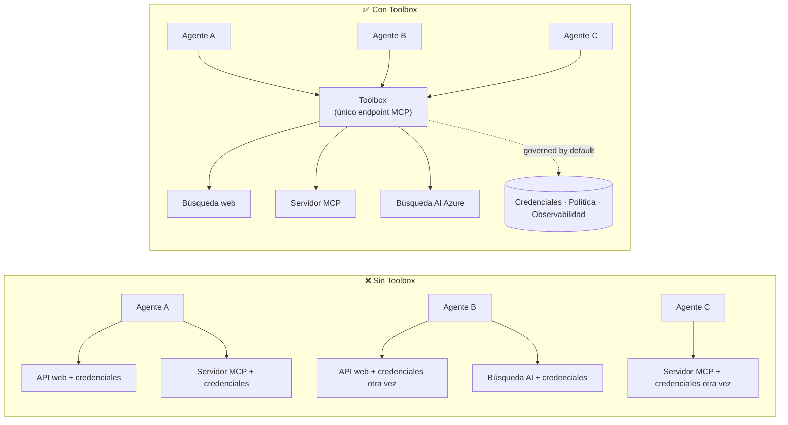

# Lección 6: Microsoft Toolbox — Herramientas Gobernadas para Agentes

Por [Lección 5](../lesson-5-hosted-agents-production/README.md) tu agente alojado se ejecuta en
producción con el almacenamiento y la postura de gobernanza que tu organización necesita. Pero mira atrás al
agente de la Lección 4: cada herramienta estaba **codificada** en `main.py` — la URL de Microsoft Learn MCP,
la tienda vectorial de búsqueda de archivos, y así sucesivamente. Eso funciona para un agente. No
escala a una organización con docenas de agentes y equipos.

Esta lección introduce **Microsoft Toolbox**: la forma en que Foundry te permite definir un conjunto curado de
herramientas **una vez**, gestionarlas **centralmente**, y exponerlas a cualquier agente a través de un **único,
endpoint gobernado**.

## Objetivos de Aprendizaje

Al final de esta lección podrás:

- Explicar el problema de la proliferación de herramientas que Toolbox resuelve.
- Describir los pilares de **Construir** y **Consumir** y los tipos de herramientas que una caja de herramientas puede contener.
- **Construir** una versión de caja de herramientas con el SDK de Foundry.
- **Consumir** una caja de herramientas desde un agente alojado con Microsoft Agent Framework mediante un único endpoint MCP.
- Usar **versionado** para enviar cambios en herramientas sin cambios de código o redeployment en el agente.
- Aplicar **gobernanza**: RBAC, inyección de credenciales, y políticas guardián (RAI).

---

## Prerrequisitos

1. Haber completado [Lección 4](../lesson-4-agentdeployment/README.md) y idealmente
   [Lección 5](../lesson-5-hosted-agents-production/README.md).
2. Un proyecto de **Microsoft Foundry** con permiso para crear y gestionar recursos de cajas de herramientas.
3. **Azure CLI** autenticado: `az login`. Las APIs de toolbox de Foundry requieren el
   alcance de token `https://ai.azure.com/.default` (mostrado en el código abajo).
4. **Python 3.12+** con las dependencias del curso instaladas (`pip install -r ../requirements.txt`).
5. Un despliegue de modelo actual y no retirado (por ejemplo `gpt-5.1`). Evitar GPT-4o / GPT-4.1 retirados.

---

## 1. El problema: proliferación de herramientas

Un solo agente puede depender de muchas herramientas — APIs REST, servidores MCP, conectores y flujos — cada uno
con su propio modelo de autenticación y equipo propietario. Al escalar en toda una organización:

- Los equipos **re-implementan las mismas herramientas** de forma independiente.
- **Las credenciales se duplican** entre agentes y repositorios.
- La **gobernanza se vuelve inconsistente** — cada agente aplica (o olvida) la política por su cuenta.
- Hay **poca visibilidad** sobre qué herramientas existen o quién las usa.

Los desarrolladores se estancan — no porque los modelos no sean capaces, sino porque **la integración de herramientas se convierte en el cuello de botella**.




Las empresas ya tienen la infraestructura — gateways, bóvedas de credenciales, políticas, observabilidad.
Lo que faltaba era una experiencia de desarrollador que lo empaquetara en algo **reutilizable,
descubrible y gobernado por defecto**. Eso es Toolbox.

---

## 2. Qué es una Caja de Herramientas

Una **Caja de Herramientas** es un **recurso gestionado de Foundry**. Defines un conjunto curado de herramientas una vez, las gestionas
centralmente en Foundry, y las expones mediante **un único endpoint compatible con MCP** que cualquier
agente puede consumir. En tiempo de ejecución la plataforma maneja **inyección de credenciales, renovación de tokens y
aplicación de políticas empresariales**.

Debido a que una caja de herramientas es un recurso gestionado, puedes añadir, eliminar o reconfigurar herramientas **sin
cambiar código en tu agente** — el agente siempre se conecta al mismo endpoint.

Toolbox cubre el ciclo de vida de las herramientas a través de cuatro pilares; **Construir** y **Consumir** están disponibles
hoy:

| Pilar | Estado | Qué habilita |
|--------|--------|-----------------|
| **Construir** | Disponible hoy | Seleccionar herramientas, configurar autenticación centralmente, publicar una caja de herramientas reutilizable que cualquier equipo pueda consumir. |
| **Consumir** | Disponible hoy | Conectar cualquier agente a un endpoint compatible con MCP para descubrir e invocar dinámicamente todas las herramientas en la caja. |

La superficie de consumo es **abierta**: cualquier runtime o cliente compatible con MCP puede usar una caja de herramientas —
Microsoft Agent Framework, LangGraph, GitHub Copilot, Claude Code, Microsoft Copilot Studio, o
código personalizado.

### Tipos de herramientas que una caja de herramientas puede contener

Búsqueda Web · MCP · Azure AI Search · Code Interpreter · Búsqueda de Archivos · OpenAPI · **Agente a Agente
(A2A)** · Fabric IQ · Búsqueda de Herramientas · Work IQ · Automatización de Navegador · Referencias de Skills, más una
**política Guardián (RAI)** aplicada en la capa de la caja de herramientas.

> **Consejo:** Añade una `description` a **cada** herramienta para que el modelo pueda elegir la correcta. Una caja de herramientas
> permite a lo sumo **una herramienta sin nombre por tipo** — da a cada instancia adicional del mismo tipo un
> `name` único, o recibirás un error `invalid_payload`.

---

## 3. Construir una caja de herramientas

Las cajas de herramientas se gestionan con los SDKs de Foundry (Python/.NET/JavaScript), la API REST, `azd`, y el
**Microsoft Foundry Toolkit para VS Code**. Aquí está el patrón en Python (`azure-ai-projects`):

```python
from azure.identity import DefaultAzureCredential
from azure.ai.projects import AIProjectClient
from azure.ai.projects.models import MCPTool, ToolboxSearchPreviewTool, WebSearchTool

endpoint = "https://<your-foundry-account>.services.ai.azure.com/api/projects/<your-project>"
project = AIProjectClient(endpoint=endpoint, credential=DefaultAzureCredential())

toolbox_version = project.toolboxes.create_toolbox_version(
    name="agent-tools",
    description="Web search + an MCP server + tool search",
    tools=[
        WebSearchTool(),
        MCPTool(
            server_label="myserver",
            server_url="https://your-mcp-server.example.com",
            require_approval="never",
            project_connection_id="my-key-auth-connection",  # las credenciales viven en Foundry
        ),
        ToolboxSearchPreviewTool(),
    ],
)
print(f"Created toolbox: {toolbox_version.name}, version: {toolbox_version.version}")
```

Observa lo que **no** haces: no hay secretos en el agente. Las credenciales las maneja una
**conexión** de Foundry (`project_connection_id`) y las inyecta la plataforma en tiempo de llamada.

> **Nota de vista previa.** La **gestión** de Toolbox (crear/actualizar versiones) es una capacidad en vista previa.
> Las operaciones `project.toolboxes.*` mostradas arriba se lanzan en compilaciones preview del SDK, la API REST, `azd`,
> y el **Foundry Toolkit para VS Code** — **no** están en el paquete fijo `azure-ai-projects` usado
> en otras partes de este curso. Trata el fragmento anterior como la forma del paso Construir; para un
> camino completo, crea la caja de herramientas en el **portal Foundry** o el **Foundry Toolkit**. El
> paso **Consumir** más abajo funciona con el SDK fijado del curso hoy.

---

## 4. Consumir una caja de herramientas desde tu agente

Una caja de herramientas expone un **endpoint MCP**. Hay dos patrones:

| Rol | Endpoint | Cuándo usar |
|------|----------|-------------|
| **Consumidor de toolbox** | `{project_endpoint}/toolboxes/{name}/mcp?api-version=v1` | Conectar agentes. Siempre sirve la **versión por defecto**. |
| **Desarrollador de toolbox** | `{project_endpoint}/toolboxes/{name}/versions/{version}/mcp?api-version=v1` | Probar una versión específica antes de promoverla. |

> **Conecta los agentes al endpoint *consumidor*.** Porque siempre sirve la versión por defecto, puedes
> promover nuevas versiones **sin cambiar código del agente ni redeplegar**.

### Integrando con un agente alojado de Microsoft Agent Framework

Recuerda que el agente de la Lección 4 añadió una única herramienta MCP codificada con `client.get_mcp_tool(...)`. Con
Toolbox, en cambio, apuntas **una** `MCPStreamableHTTPTool` al endpoint de la caja de herramientas — y el agente obtiene
**todas** las herramientas de la caja, gobernadas centralmente:

```python
import httpx
from azure.identity import DefaultAzureCredential, get_bearer_token_provider
from agent_framework import MCPStreamableHTTPTool

# Auth: La caja de herramientas Foundry requiere el ámbito https://ai.azure.com/.default
credential = DefaultAzureCredential()
token_provider = get_bearer_token_provider(credential, "https://ai.azure.com/.default")
http_client = httpx.AsyncClient(auth=_ToolboxAuth(token_provider), timeout=120.0)

TOOLBOX_ENDPOINT = os.environ["TOOLBOX_ENDPOINT"]  # inyectado por la plataforma en tiempo de ejecución

mcp_tool = MCPStreamableHTTPTool(
    name="toolbox",
    url=TOOLBOX_ENDPOINT,
    http_client=http_client,
    load_prompts=False,
)

agent = chat_client.as_agent(
    name="my-toolbox-agent",
    instructions="You are a helpful assistant with access to Foundry toolbox tools.",
    tools=[mcp_tool],
)
```

`.env` correspondiente (nota: usa un modelo **actual** como `gpt-5.1`, **no** el retirado
`gpt-4o`):

```env
FOUNDRY_PROJECT_ENDPOINT=https://<account>.services.ai.azure.com/api/projects/<project>
TOOLBOX_ENDPOINT=https://<account>.services.ai.azure.com/api/projects/<project>/toolboxes/agent-tools/mcp?api-version=v1
AZURE_AI_MODEL_DEPLOYMENT_NAME=gpt-5.1
```

> **Verifica primero.** Antes de conectar el agente completo, conecta un SDK cliente MCP (`pip install mcp`) al
> endpoint **específico de versión** y lista las herramientas para confirmar que se cargan como esperas.

### Ejecuta el ejemplo de consumo

Esta lección incluye un ejemplo ejecutable de consumo, [`toolbox_agent.py`](../../../lesson-6-toolbox/toolbox_agent.py). Usa el mismo
patrón `FoundryChatClient.get_mcp_tool(...)` que aprendiste en la Lección 2, pero apunta la herramienta MCP única a tu
endpoint de **caja de herramientas** — así el agente obtiene todas las herramientas gobernadas de la caja:

```bash
# En tu .env, configura TOOLBOX_ENDPOINT en el endpoint de consumidor de tu toolbox, luego:
python lesson-6-toolbox/toolbox_agent.py
```

Abre la URL impresa `http://localhost:8096` y haz una pregunta que use una de las herramientas de tu
caja de herramientas. Añade o actualiza una herramienta en la caja y pregunta de nuevo — **sin cambiar este
código** — para ver la gobernanza central y el versionado en acción.

---

## 5. Versionado: enviar cambios en herramientas de forma segura

El versionado en Toolbox te da control explícito sobre cuándo los cambios entran en vigencia:

1. **Crea** una nueva versión de la caja con el conjunto actualizado de herramientas.
2. **Prueba** esa versión en el endpoint específico de versión (desarrollador).
3. **Promuévela** a `default_version` cuando estés listo.

Cada agente apuntado al endpoint **consumidor** adopta la versión promovida automáticamente — **sin
cambios de código, sin redeployment**. (La primera versión que creas se promueve automáticamente a la versión por defecto.)

Esto es el equivalente en gobernanza de herramientas a un despliegue blue/green: validas un cambio de forma aislada,
luego cambias el valor por defecto para todos los consumidores a la vez.

---

## 6. Gobernanza: cómo Toolbox mejora el control

Toolbox está **gobernado por defecto**. Las palancas de gobernanza que debes conocer:

- **RBAC.** Asigna el rol **Foundry User** en el proyecto a cada identidad: el **desarrollador** que
  gestiona versiones de la caja, la **identidad gestionada del agente** (para agentes alojados que llaman a herramientas en
  tiempo de ejecución), y, para flujos OAuth, el **usuario final** cuya identidad se hace proxy.
- **Credenciales centralizadas.** Las credenciales de las herramientas están en **conexiones** de Foundry, no en el código del agente
  ni en archivos `.env`. La plataforma las inyecta y renueva tokens en tiempo de ejecución.
- **Guardias (política RAI).** Adjunta una política responsable de IA con nombre a una versión de la caja mediante
  `policies.rai_config.rai_policy_name`. Se ejecuta en la **capa de la caja de herramientas**, independientemente de cualquier
  filtro de contenido a nivel de modelo, filtrando las entradas y salidas de las herramientas.
- **Aprobación MCP.** La propiedad `require_approval` por herramienta controla si una llamada a una herramienta MCP necesita aprobación —
  igual que el flujo de aprobación que viste en [Lección 5 §7](../lesson-5-hosted-agents-production/README.md#7-hosted-mcp-tools--approval-workflows).
- **Redes privadas.** Toolbox soporta configuraciones de red virtual para empresas que
  mantienen el tráfico dentro de su red.
- **Visibilidad.** Como las herramientas se catalogan centralmente, finalmente obtienes un inventario de qué
  existe y quién lo consume.

---

## Ejercicios prácticos

1. **Refactorizar Lección 4.** El agente de la Lección 4 codifica la herramienta Microsoft Learn MCP. Esboza cómo
   moverías esa herramienta a una caja de herramientas `agent-tools` y redirigirías `main.py` al endpoint consumidor de la caja.
   ¿Qué cambios hay en `main.py`? ¿Qué ya no vive ahí?
2. **Diseñar un aumento de versión.** Necesitas añadir una herramienta de Búsqueda Web a una caja activa usada por cinco
   agentes. Describe la secuencia crear → probar → promover y explica por qué ninguno de los cinco agentes
   necesita redeploy.
3. **Elegir las identidades de autenticación.** Para un agente alojado que llama a una herramienta MCP basada en OAuth a través de una
   caja de herramientas, lista qué identidades necesitan el rol **Foundry User** y por qué.
4. **Colocación de guardias.** Explica la diferencia entre un filtro de contenido a nivel de modelo y un guardia de caja de herramientas,
   y da un escenario donde específicamente necesitas el guardia de caja.

---

## Recursos

- [Crear, probar y desplegar una caja de herramientas en Foundry](https://learn.microsoft.com/azure/foundry/agents/how-to/tools/toolbox)
- [Catálogo de herramientas — Foundry Agent Service](https://learn.microsoft.com/azure/foundry/agents/concepts/tool-catalog)
- [Microsoft Agent Framework — proveedor Microsoft Foundry (herramientas)](https://learn.microsoft.com/agent-framework/agents/providers/microsoft-foundry)
- [Resumen de guardias](https://learn.microsoft.com/azure/foundry/guardrails/guardrails-overview)
- [Comenzar con Foundry en VS Code (Foundry Toolkit)](https://learn.microsoft.com/azure/ai-foundry/how-to/develop/get-started-projects-vs-code)
- [Protocolo de Contexto de Modelo](https://modelcontextprotocol.io/)

---

**Anterior:** [Lección 5 — Agentes alojados en producción](../lesson-5-hosted-agents-production/README.md)
&nbsp;·&nbsp; **Siguiente:** [Lección 7 — Multi-Agente & A2A](../lesson-7-multi-agent-a2a/README.md)

---

<!-- CO-OP TRANSLATOR DISCLAIMER START -->
**Descargo de responsabilidad**:
Este documento ha sido traducido utilizando el servicio de traducción automática [Co-op Translator](https://github.com/Azure/co-op-translator). Aunque nos esforzamos por la precisión, tenga en cuenta que las traducciones automatizadas pueden contener errores o inexactitudes. El documento original en su idioma nativo debe considerarse la fuente autorizada. Para información crítica, se recomienda una traducción profesional humana. No somos responsables de cualquier malentendido o interpretación errónea que surja del uso de esta traducción.
<!-- CO-OP TRANSLATOR DISCLAIMER END -->