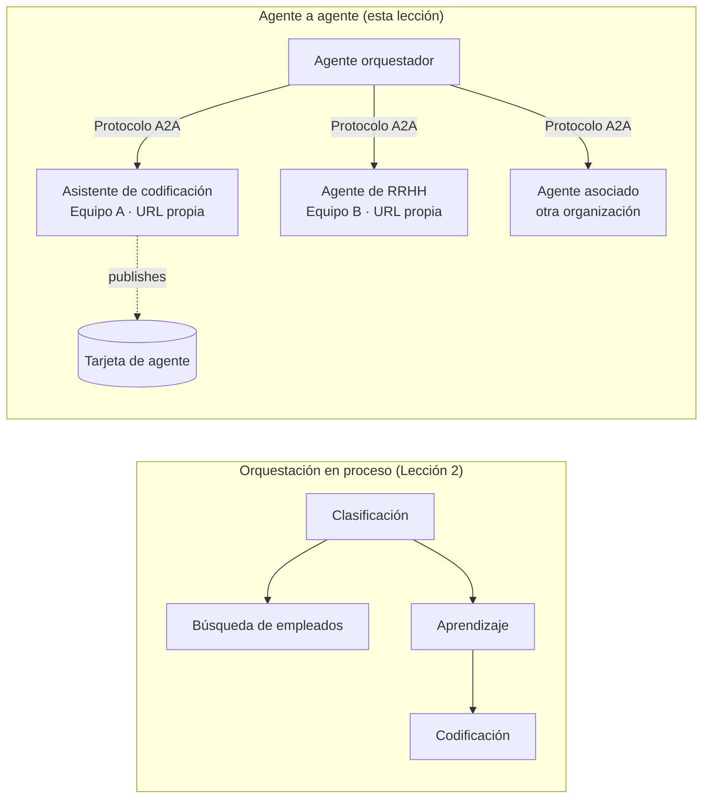

# Lección 7: Orquestación Multagente y Agente a Agente (A2A)

En la [Lección 6](../lesson-6-toolbox/README.md) puedes construir herramientas gobernadas y agentes alojados.
Pero los sistemas reales rara vez usan **un** agente. A medida que escalas, compones **muchos** agentes: algunos que
te pertenecen, otros de equipos diferentes, y otros que funcionan en organizaciones totalmente distintas. Esta lección trata sobre
cómo los agentes trabajan **juntos**.

Ya conociste una forma de diseño multagente en
[el `agent-orchestration.py` de la Lección 2](../lesson-2-agent-development/README.md): el patrón de **transferencia**
donde un agente de triage enruta a especialistas **dentro de un solo proceso**. Esta lección sube
un nivel — al **Agente a Agente (A2A)**, el protocolo abierto para agentes que funcionan como
**servicios en red** independientes y se llaman entre sí a través de procesos, equipos y límites organizacionales.

## Objetivos de Aprendizaje

Al final de esta lección podrás:

- Explicar la diferencia entre la **orquestación en proceso** (transferencias/flujo de trabajo) y la comunicación
  **Agente a Agente (A2A)**, y elegir la correcta.
- Describir los bloques de construcción de A2A: **Tarjeta de Agente**, **habilidades**, **tareas** y **descubrimiento**.
- **Exponer** un agente del Microsoft Agent Framework como un servicio A2A con `A2AExecutor`.
- **Consumir** un agente remoto como par en red con `A2AAgent`.
- Aplicar preocupaciones empresariales a A2A: **seguridad, identidad, gobernanza, observabilidad y costo**.

---

## Requisitos Previos

1. Haber completado la [Lección 2](../lesson-2-agent-development/README.md) (desarrollo y orquestación de agentes).
2. Un proyecto **Microsoft Foundry** con un despliegue de modelo actual (por ejemplo `gpt-5.1`, y
   `gpt-5-codex` para el ejemplo de codificación). Evita GPT-4o / GPT-4.1 obsoletos.
3. **Azure CLI** autenticado: `az login`.
4. **Python 3.12+** con las dependencias del curso instaladas (`pip install -r ../requirements.txt`).
   La Lección 7 añade los paquetes en vista previa `agent-framework-a2a`, `a2a-sdk` y `uvicorn`.
5. `FOUNDRY_PROJECT_ENDPOINT` y `FOUNDRY_MODEL` configurados en tu `.env` (ver el README del curso).

---

## 1. Dos formas en que los agentes trabajan juntos

No existe un único patrón de "multagente". Elige el que coincida con tu **frontera**:

| Patrón | Dónde corren los agentes | Cómo se conectan | Cuándo usarlo |
|---------|------------------|------------------|--------------|
| **Transferencia / Flujo de trabajo** (Lección 2) | Un proceso, una base de código | Grafo en memoria (`HandoffBuilder`, `WorkflowBuilder`) | Cuando controlas todos los agentes y los despliegas juntos. |
| **Agente a Agente (A2A)** (esta lección) | Servicios separados, ciclos de vida separados | Protocolo abierto **A2A** sobre HTTP, descubierto vía **Tarjetas de Agente** | Agentes pertenecen a equipos/organizaciones diferentes, escalan independientemente, o están escritos en frameworks distintos. |

La transferencia trata de **enrutamiento dentro de una aplicación**. A2A trata de **componer agentes como servicios
independientes** — el equivalente al cambio de llamadas a funciones hacia microservicios.



> **Se componen.** Un orquestador que construyas con `HandoffBuilder` puede tener **agentes remotos A2A**
> como participantes — enrutamiento en proceso hacia servicios que corren en cualquier lugar.

---

## 2. Los bloques de construcción de A2A

A2A es un **protocolo abierto** (no específico de Microsoft), por lo que un agente A2A puede ser consumido por Microsoft
Agent Framework, LangGraph, código personalizado, o la pila de otra empresa. Cuatro conceptos son importantes:

- **Tarjeta de Agente** — un pequeño documento JSON, publicado en
  `/.well-known/agent-card.json`, que anuncia el **nombre, descripción, URL, versión,
  habilidades y capacidades** del agente. Así es como un cliente **descubre** qué puede hacer un agente remoto.
- **Habilidades** — las cosas declaradas que el agente puede hacer (`id`, `nombre`, `descripción`, `etiquetas`,
  `ejemplos`). Los clientes (y modelos) usan esto para decidir si llamarlo.
- **Tareas** — una llamada a un agente A2A es una **tarea** con un ciclo de vida (enviada → en progreso →
  completada/fallida). El servidor rastrea tareas en una **tienda de tareas**; se soportan actualizaciones en streaming.
- **Descubrimiento** — un cliente con solo una URL obtiene la Tarjeta de Agente y sabe cómo llamar al agente.

---

## 3. Exponer un agente como servicio A2A — `a2a_server.py`

El lado de **Construir/servir** envuelve cualquier agente del Microsoft Agent Framework con `A2AExecutor` y lo monta
en una aplicación HTTP A2A. Ver [`a2a_server.py`](../../../lesson-7-multi-agent-a2a/a2a_server.py). La conexión clave:

```python
from agent_framework.a2a import A2AExecutor
from a2a.server.apps import A2AStarletteApplication
from a2a.server.request_handlers import DefaultRequestHandler
from a2a.server.tasks import InMemoryTaskStore
from a2a.types import AgentCapabilities, AgentCard, AgentSkill

agent = client.as_agent(name="coding-assistant", instructions="...")

agent_card = AgentCard(
    name="Coding Assistant",
    description="Generates runnable code samples...",
    url="http://localhost:9000/",
    version="1.0.0",
    capabilities=AgentCapabilities(streaming=True),
    default_input_modes=["text"],
    default_output_modes=["text"],
    skills=[AgentSkill(id="generate-code", name="Generate code",
                       description="Write a runnable code snippet.", tags=["code"])],
)

request_handler = DefaultRequestHandler(
    agent_executor=A2AExecutor(agent),
    task_store=InMemoryTaskStore(),
)
app = A2AStarletteApplication(agent_card=agent_card, http_handler=request_handler).build()
# servido con uvicorn en el puerto 9000
```

Nota que el código del agente está **sin cambios** — `A2AExecutor` adapta tu agente existente al protocolo.
La Tarjeta de Agente es lo que lo hace **descubrible** para cualquier cliente A2A.

---

## 4. Consumir un agente remoto — `a2a_client.py`

El lado de **Consumir** se conecta a un agente remoto **por URL**, obtiene su Tarjeta de Agente y lo llama
exactamente como si fuera un agente local. Ver [`a2a_client.py`](../../../lesson-7-multi-agent-a2a/a2a_client.py):

```python
from agent_framework.a2a import A2AAgent

remote_agent = A2AAgent(name="remote-coding-assistant", url="http://localhost:9000")
result = await remote_agent.run("Write a Python function that reverses a string.")
print(result.text)
```

Esa es toda la idea de A2A: desde el lado del llamador, un agente remoto se comporta como cualquier otro
agente de `agent_framework`, por lo que puedes incluirlo en un flujo de trabajo o transferirle tareas — aunque funcione
en un proceso diferente, en una máquina diferente, propiedad de un equipo distinto.

### Ejecútalo de principio a fin

```bash
# Terminal 1 — iniciar el servicio A2A
python a2a_server.py

# Terminal 2 — llamarlo
python a2a_client.py "Write a Python function that reverses a string."
```

Verás la respuesta del asistente de codificación llegar a través del protocolo A2A. Abre
`http://localhost:9000/.well-known/agent-card.json` en el navegador para ver la Tarjeta de Agente publicada.

---

## 5. Preocupaciones empresariales

Convertir agentes en servicios en red introduce las mismas preocupaciones que cualquier sistema distribuido —
además de algunas específicas de IA:

- **Identidad y autenticación.** Nunca expongas un agente A2A sin autenticar. La Tarjeta de Agente lleva
  `security` / `security_schemes`, y `A2AAgent` acepta un `auth_interceptor` para que los llamadores adjunten
  credenciales (tokens portadores OAuth, claves API). Usa Entra ID / identidades administradas para
  autenticación entre servicios en producción; coloca el servicio detrás de una puerta de enlace.
- **Gobernanza.** Combina A2A con la [Caja de Herramientas de la Lección 6](../lesson-6-toolbox/README.md): un agente remoto
  puede ser publicado como una **herramienta A2A** dentro de una caja gobernada para que apliquen RBAC, inyección de credenciales,
  y políticas de protección centralizadas.
- **Observabilidad.** Ahora una solicitud cruza límites de proceso, así que propaga trazas a través de la llamada.
  Habilita [Observabilidad Foundry / OpenTelemetry](../lesson-3-agent-evals/README.md) en **ambos**,
  el orquestador y cada agente remoto para obtener una traza de extremo a extremo.
- **Versionado.** La Tarjeta de Agente tiene una `version`. Trátala como una API: cambios aditivos son seguros;
  romper un contrato de habilidad requiere nueva versión y ventana de migración para consumidores.
- **Confiabilidad.** Los agentes remotos fallan de forma independiente. Configura tiempos de espera (`A2AAgent(timeout=...)`), maneja
  fallas parciales, y no permitas que un par lento bloquee toda la orquestación.
- **Costo.** Cada llamada a agente remoto es su propia invocación de modelo. El despliegue masivo multiplica el gasto de tokens —
  planea para ello y prefiere enrutamiento a **un** mejor agente en vez de difusión a muchos.

---

## Ejercicios prácticos

1. **Añadir un segundo servicio.** Copia `a2a_server.py` para exponer el agente **employee-search** en el puerto
   9001 con su propia Tarjeta de Agente y habilidades. Ejecuta ambos y haz que un cliente llame a cada uno.
2. **Orquestar pares remotos.** Construye un pequeño `HandoffBuilder` (o router simple) cuyos participantes
   incluyan dos `A2AAgent` apuntando a tus dos servicios. Enruta una consulta al correcto.
3. **Segurízalo.** Añade un `auth_interceptor` al cliente y requiere un token portador en el servidor.
   ¿Qué falla si falta el token? ¿Dónde almacenarías el token en producción?
4. **Transferencia vs A2A.** Escribe dos párrafos breves: cuándo conservarías la transferencia en proceso
   de la Lección 2 y cuándo se justifica la complejidad extra de A2A. Da un ejemplo concreto de cada uno.

---

## Recursos

- [Agente a Agente (A2A) — Microsoft Agent Framework](https://learn.microsoft.com/agent-framework/user-guide/agent-orchestration/a2a)
- [Orquestación multiagente — Microsoft Agent Framework](https://learn.microsoft.com/agent-framework/user-guide/agent-orchestration/)
- [Especificación del protocolo A2A](https://a2a-protocol.org/)
- [SDK Python A2A (`a2a-sdk`)](https://github.com/a2aproject/a2a-python)
- [Servicio de Agentes Foundry — patrones multiagente](https://learn.microsoft.com/azure/ai-foundry/agents/concepts/connected-agents)

---

**Anterior:** [Lección 6 — Microsoft Toolbox](../lesson-6-toolbox/README.md)

---

<!-- CO-OP TRANSLATOR DISCLAIMER START -->
**Descargo de responsabilidad**:
Este documento ha sido traducido utilizando el servicio de traducción automática [Co-op Translator](https://github.com/Azure/co-op-translator). Aunque nos esforzamos por la precisión, tenga en cuenta que las traducciones automatizadas pueden contener errores o inexactitudes. El documento original en su idioma nativo debe considerarse la fuente autorizada. Para información crítica, se recomienda una traducción profesional humana. No somos responsables de cualquier malentendido o interpretación errónea que surja del uso de esta traducción.
<!-- CO-OP TRANSLATOR DISCLAIMER END -->