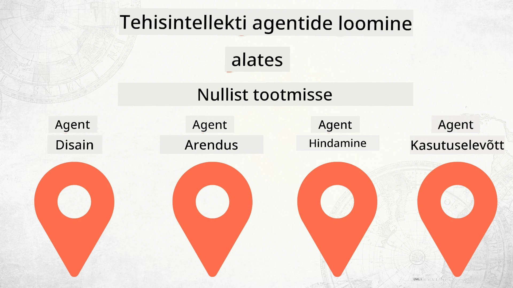

# AI-agentide loomine nullist tootmisse



### 🌐 Mitmekeelne tugi

#### Toetatud GitHub Actioni kaudu (automaatselt ja alati ajakohane)

<!-- CO-OP TRANSLATOR LANGUAGES TABLE START -->
[Araabia](../ar/README.md) | [Bengali](../bn/README.md) | [Bulgaaria](../bg/README.md) | [Birma (Myanmar)](../my/README.md) | [Hiina (lihtsustatud)](../zh-CN/README.md) | [Hiina (traditsiooniline, Hongkong)](../zh-HK/README.md) | [Hiina (traditsiooniline, Macao)](../zh-MO/README.md) | [Hiina (traditsiooniline, Taiwan)](../zh-TW/README.md) | [Horvaadi](../hr/README.md) | [Tšehhi](../cs/README.md) | [Taani](../da/README.md) | [Hollandi](../nl/README.md) | [Eesti](./README.md) | [Soome](../fi/README.md) | [Prantsuse](../fr/README.md) | [Saksa](../de/README.md) | [Kreeka](../el/README.md) | [Heebrea](../he/README.md) | [Hindi](../hi/README.md) | [Ungari](../hu/README.md) | [Indoneesia](../id/README.md) | [Itaalia](../it/README.md) | [Jaapani](../ja/README.md) | [Kannada](../kn/README.md) | [Korea](../ko/README.md) | [Leedu](../lt/README.md) | [Malaisia](../ms/README.md) | [Malajalami](../ml/README.md) | [Marathi](../mr/README.md) | [Nepali](../ne/README.md) | [Nigeeria pidžin](../pcm/README.md) | [Norra](../no/README.md) | [Pärsia (Farsi)](../fa/README.md) | [Poola](../pl/README.md) | [Portugali (Brasiilia)](../pt-BR/README.md) | [Portugali (Portugal)](../pt-PT/README.md) | [Pandžabi (Gurmukhi)](../pa/README.md) | [Rumeenia](../ro/README.md) | [Vene](../ru/README.md) | [Serbia (kirilitsa)](../sr/README.md) | [Slovaki](../sk/README.md) | [Sloveeni](../sl/README.md) | [Hispaania](../es/README.md) | [Suaheli](../sw/README.md) | [Rootsi](../sv/README.md) | [Tagalogi (filipino)](../tl/README.md) | [Tamili](../ta/README.md) | [Telugu](../te/README.md) | [Tai](../th/README.md) | [Türgi](../tr/README.md) | [Ukraina](../uk/README.md) | [Urdu](../ur/README.md) | [Vietnami](../vi/README.md)

> **Eelistad kohalikku kloonimist?**

> See hoidla sisaldab 50+ keele tõlkeid, mis suurendavad oluliselt allalaaditavat mahtu. Tõlgeteta kloonimiseks kasuta sparse checkouti:
> ```bash
> git clone --filter=blob:none --sparse https://github.com/microsoft/Building-AI-Agents-From-Zero-To-Production.git
> cd Building-AI-Agents-From-Zero-To-Production
> git sparse-checkout set --no-cone '/*' '!translations' '!translated_images'
> ```
> See annab sulle kõik vajaliku kursuse lõpetamiseks palju kiiremalt.
<!-- CO-OP TRANSLATOR LANGUAGES TABLE END -->

## Kursus, mis õpetab AI agentide arenduse elutsükli aluseid

[](https://github.com/microsoft/Building-AI-Agents-From-Zero-To-Production/blob/master/LICENSE?WT.mc_id=academic-105485-koreyst)
[](https://GitHub.com/microsoft/Building-AI-Agents-From-Zero-To-Production/graphs/contributors/?WT.mc_id=academic-105485-koreyst)
[](https://GitHub.com/microsoft/Building-AI-Agents-From-Zero-To-Production/issues/?WT.mc_id=academic-105485-koreyst)
[](https://GitHub.com/microsoft/Building-AI-Agents-From-Zero-To-Production/pulls/?WT.mc_id=academic-105485-koreyst)
[](http://makeapullrequest.com?WT.mc_id=academic-105485-koreyst)

[](https://discord.gg/Kuaw3ktsu6)

## 🌱 Alustamine

See kursus sisaldab õppetükke, mis käsitlevad AI agentide loomise ja juurutamise aluseid.

Iga õppetükk tugineb eelmisele, seega soovitame alustada algusest ja liikuda lõpuni.

Kui soovid AI agentide teemadel rohkem teada saada, võid vaadata [AI agentide algajate kursust](https://aka.ms/ai-agents-beginners).

### Kohtu teiste õppijatega, saa vastused oma küsimustele

Kui satud takistustesse või on sul küsimusi AI agentide loomise kohta, liitu meie spetsiaalse Discord kanaliga Microsoft Foundry Discordis [Microsoft Foundry Discord](https://discord.gg/Kuaw3ktsu6).

### Mida vajad

Igal õppetükil on oma koodinäide, mida saad kohalikult käivitada. Sa võid [forkida selle hoidla](https://github.com/microsoft/Building-AI-Agents-From-Zero-To-Production/fork) ja luua oma koopia.

See kursus kasutab praegu järgmist:

- [Microsoft Agent Framework (MAF)](https://aka.ms/ai-agents-beginners/agent-framework)
- [Microsoft Foundry](https://azure.microsoft.com/products/ai-foundry)
- [Azure OpenAI teenus](https://azure.microsoft.com/products/ai-foundry/models/openai)
- [Azure CLI](https://learn.microsoft.com/cli/azure/authenticate-azure-cli?view=azure-cli-latest)

Enne alustamist veendu, et sul on ligipääs nendele teenustele.

Mudelite majutamise ja teenuste ümber on tulemas veel võimalusi.

## 🗃️ Õppetükid

| **Õppetükk**         | **Kirjeldus**                                                                                  |
|--------------------|--------------------------------------------------------------------------------------------------|
| [Agendi disain](./lesson-1-agent-design/README.md)       | Sissejuhatus meie "Arendaja onboarding" agendi kasutusjuhtumisse ja kuidas disainida efektiivseid agente  |
| [Agendi arendus](./lesson-2-agent-development/README.md)  | Kasutades Microsoft Agent Frameworki (MAF), loo 3 agenti, et aidata uutel arendajatel onboardida.       |
| [Agendi hindamine](./lesson-3-agent-evals/README.md)  | Kasutades Microsoft Foundryt, saa teada, kui hästi meie AI agentid toimivad ja kuidas neid parandada. |
| [Agendi juurutamine](./lesson-4-agent-deployment/README.md)   | Kasutades Hosting Agents ja OpenAI Chatkitit, vaata, kuidas AI agenti tootmisse juurutada.       |


## 🎒 Muud kursused

Meie meeskond toodab ka teisi kursuseid! Vaatame:

<!-- CO-OP TRANSLATOR OTHER COURSES START -->
### LangChain
[](https://aka.ms/langchain4j-for-beginners)
[](https://aka.ms/langchainjs-for-beginners?WT.mc_id=m365-94501-dwahlin)

---

### Azure / Edge / MCP / Agendid
[](https://github.com/microsoft/AZD-for-beginners?WT.mc_id=academic-105485-koreyst)
[](https://github.com/microsoft/edgeai-for-beginners?WT.mc_id=academic-105485-koreyst)
[](https://github.com/microsoft/mcp-for-beginners?WT.mc_id=academic-105485-koreyst)
[](https://github.com/microsoft/ai-agents-for-beginners?WT.mc_id=academic-105485-koreyst)

---
 
### Generatiivse tehisintellekti sari
[](https://github.com/microsoft/generative-ai-for-beginners?WT.mc_id=academic-105485-koreyst)
[-9333EA?style=for-the-badge&labelColor=E5E7EB&color=9333EA)](https://github.com/microsoft/Generative-AI-for-beginners-dotnet?WT.mc_id=academic-105485-koreyst)
[-C084FC?style=for-the-badge&labelColor=E5E7EB&color=C084FC)](https://github.com/microsoft/generative-ai-for-beginners-java?WT.mc_id=academic-105485-koreyst)
[-E879F9?style=for-the-badge&labelColor=E5E7EB&color=E879F9)](https://github.com/microsoft/generative-ai-with-javascript?WT.mc_id=academic-105485-koreyst)

---
 
### Põhjalik õppimine
[](https://aka.ms/ml-beginners?WT.mc_id=academic-105485-koreyst)
[](https://aka.ms/datascience-beginners?WT.mc_id=academic-105485-koreyst)
[](https://aka.ms/ai-beginners?WT.mc_id=academic-105485-koreyst)
[](https://github.com/microsoft/Security-101?WT.mc_id=academic-96948-sayoung)
[](https://aka.ms/webdev-beginners?WT.mc_id=academic-105485-koreyst)
[](https://aka.ms/iot-beginners?WT.mc_id=academic-105485-koreyst)
[](https://github.com/microsoft/xr-development-for-beginners?WT.mc_id=academic-105485-koreyst)

---
 
### Copiloti sari
[](https://aka.ms/GitHubCopilotAI?WT.mc_id=academic-105485-koreyst)
[](https://github.com/microsoft/mastering-github-copilot-for-dotnet-csharp-developers?WT.mc_id=academic-105485-koreyst)
[](https://github.com/microsoft/CopilotAdventures?WT.mc_id=academic-105485-koreyst)
<!-- CO-OP TRANSLATOR OTHER COURSES END -->

## Panustamine

See projekt ootab panuseid ja ettepanekuid. Enamik panustamistest nõuab, et nõustuksite
panustajate litsentsilepinguga (CLA), mis kinnitab, et teil on õigus ja te tegelikult annate meile õiguse
teie panust kasutada. Üksikasjade jaoks külastage <https://cla.opensource.microsoft.com>.

Kui esitate pull-taotluse, määrab CLA robot automaatselt, kas peate esitama
CLA ja märgistab PR sobivalt (nt staatuskontroll, kommentaar). Järgige lihtsalt roboti pakutud juhiseid.
See tuleb teha vaid üks kord kõigi CLA-d kasutavate hoidlate kohta.

See projekt on omaks võtnud [Microsofti avatud lähtekoodi käitumisjuhendi](https://opensource.microsoft.com/codeofconduct/).
Lisateabe saamiseks vaadake [käitumisjuhendi KKK](https://opensource.microsoft.com/codeofconduct/faq/) või võtke ühendust aadressil [opencode@microsoft.com](mailto:opencode@microsoft.com) täiendavate küsimuste või kommentaaride korral.

## Kaubamärgid

See projekt võib sisaldada projektide, toodete või teenuste kaubamärke või logosid. Microsofti
kaubamärkide või logode autoriseeritud kasutamine on allutatud ja peab järgima
[Microsofti kaubamärgi ja brändi juhiseid](https://www.microsoft.com/legal/intellectualproperty/trademarks/usage/general).
Microsofti kaubamärkide või logode kasutamine selle projekti muudetud versioonides ei tohi tekitada segadust ega viidata Microsofti sponsorlusele.
Kolmandate osapoolte kaubamärkide või logode kasutamine on allutatud vastavate kolmandate osapoolte poliitikatele.

## Abi saamine

Kui vajate abi või teil on küsimusi tehisintellekti rakenduste ehitamisel, liituge:

[](https://discord.gg/Kuaw3ktsu6)

Kui teil on toote tagasisidet või ehitamisel esineb vigu, külastage:

[](https://aka.ms/foundry/forum)

---

<!-- CO-OP TRANSLATOR DISCLAIMER START -->
**Lahtiütlus**:
See dokument on tõlgitud tehisintellektil põhineva tõlketeenuse [Co-op Translator](https://github.com/Azure/co-op-translator) abil. Kuigi püüdleme täpsuse poole, palun arvestage, et automaatsed tõlked võivad sisaldada vigu või ebatäpsusi. Originaaldokument selle algkeeles on autoriteetne allikas. Tähtsa teabe puhul soovitatakse kasutada professionaalset inimtõlget. Me ei vastuta selle tõlke kasutamisest tekkida võivate arusaamatuste või valesti mõistmiste eest.
<!-- CO-OP TRANSLATOR DISCLAIMER END -->