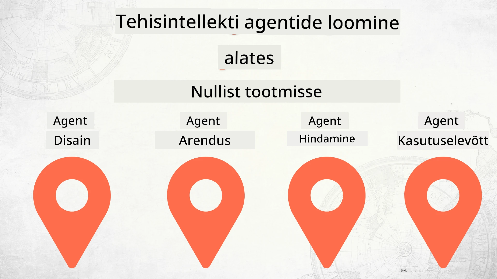

# AI-agentide loomine nullist tootmisse



### 🌐 Mitmekeelse tugi

#### Toetatud GitHub Actioni kaudu (automaatne ja alati värske)

<!-- CO-OP TRANSLATOR LANGUAGES TABLE START -->
[Araabia](../ar/README.md) | [Bengali](../bn/README.md) | [Bulgaaria](../bg/README.md) | [Burma (Myanmar)](../my/README.md) | [Hiina (lihtsustatud)](../zh-CN/README.md) | [Hiina (traditsiooniline, Hongkong)](../zh-HK/README.md) | [Hiina (traditsiooniline, Macao)](../zh-MO/README.md) | [Hiina (traditsiooniline, Taiwan)](../zh-TW/README.md) | [Horvaadi](../hr/README.md) | [Tšehhi](../cs/README.md) | [Taani](../da/README.md) | [Hollandi](../nl/README.md) | [Eesti](./README.md) | [Soome](../fi/README.md) | [Prantsuse](../fr/README.md) | [Saksa](../de/README.md) | [Kreeka](../el/README.md) | [Heebrea](../he/README.md) | [Hindi](../hi/README.md) | [Ungari](../hu/README.md) | [Indoneesia](../id/README.md) | [Itaalia](../it/README.md) | [Jaapani](../ja/README.md) | [Kannada](../kn/README.md) | [Khmeeri](../km/README.md) | [Korea](../ko/README.md) | [Leedu](../lt/README.md) | [Malai](../ms/README.md) | [Malayalam](../ml/README.md) | [Marathi](../mr/README.md) | [Nepali](../ne/README.md) | [Nigeeria pidžin](../pcm/README.md) | [Norra](../no/README.md) | [Pärsia (Farsi)](../fa/README.md) | [Poola](../pl/README.md) | [Portugali (Brasiilia)](../pt-BR/README.md) | [Portugali (Portugal)](../pt-PT/README.md) | [Pandžabi (Gurmukhi)](../pa/README.md) | [Rumeenia](../ro/README.md) | [Vene](../ru/README.md) | [Serbia (kirillitsa)](../sr/README.md) | [Slovaki](../sk/README.md) | [Sloveeni](../sl/README.md) | [Hispaania](../es/README.md) | [Suaheli](../sw/README.md) | [Rootsi](../sv/README.md) | [Tagalogi (Filipiinid)](../tl/README.md) | [Tamili](../ta/README.md) | [Telugu](../te/README.md) | [Tai](../th/README.md) | [Türgi](../tr/README.md) | [Ukraina](../uk/README.md) | [Urdu](../ur/README.md) | [Vietnami](../vi/README.md)

> **Eelistate kloonida lokaalselt?**
>
> See hoidla sisaldab üle 50 keele tõlkeid, mis suurendab allalaadimise mahtu märkimisväärselt. Tõlgeteta kloonimiseks kasutage sparse checkout'i:
>
> **Bash / macOS / Linux:**
> ```bash
> git clone --filter=blob:none --sparse https://github.com/microsoft/Building-AI-Agents-From-Zero-To-Production.git
> cd Building-AI-Agents-From-Zero-To-Production
> git sparse-checkout set --no-cone '/*' '!translations' '!translated_images'
> ```
>
> **CMD (Windows):**
> ```cmd
> git clone --filter=blob:none --sparse https://github.com/microsoft/Building-AI-Agents-From-Zero-To-Production.git
> cd Building-AI-Agents-From-Zero-To-Production
> git sparse-checkout set --no-cone "/*" "!translations" "!translated_images"
> ```
>
> See annab teile kõik vajaliku kursuse lõpuleviimiseks palju kiiremalt.
<!-- CO-OP TRANSLATOR LANGUAGES TABLE END -->

## Kursus AI-agentide arendusprotsessi alustest

[](https://github.com/microsoft/Building-AI-Agents-From-Zero-To-Production/blob/master/LICENSE?WT.mc_id=academic-105485-koreyst)
[](https://GitHub.com/microsoft/Building-AI-Agents-From-Zero-To-Production/graphs/contributors/?WT.mc_id=academic-105485-koreyst)
[](https://GitHub.com/microsoft/Building-AI-Agents-From-Zero-To-Production/issues/?WT.mc_id=academic-105485-koreyst)
[](https://GitHub.com/microsoft/Building-AI-Agents-From-Zero-To-Production/pulls/?WT.mc_id=academic-105485-koreyst)
[](http://makeapullrequest.com?WT.mc_id=academic-105485-koreyst)

[](https://discord.gg/Kuaw3ktsu6)

## 🌱 Alustamine

See kursus sisaldab õppetunde, mis käsitlevad AI-agentide loomise ja juurutamise aluseid.

Iga õppetund tugineb eelnevale, seega soovitame alustada algusest ja liikuda lõpuni.

Kui soovite rohkem uurida AI-agentidega seotud teemasid, võite vaadata [AI-agentide algajate kursust](https://aka.ms/ai-agents-beginners).

### Tutvuge teiste õppijatega, saage vastused oma küsimustele

Kui jääte jänni või teil on küsimusi AI-agentide loomise kohta, liituge meie pühendatud Discordi kanaliga [Microsoft Foundry Discordis](https://discord.gg/Kuaw3ktsu6).

### Mida vajate

Igal õppetunnil on oma koodinäide, mida saate lokaalsetes tingimustes käivitada. Võite [forkida selle hoidla](https://github.com/microsoft/Building-AI-Agents-From-Zero-To-Production/fork), et luua oma koopia.

See kursus kasutab praegu järgnevat:

- [Microsoft Agent Framework (MAF)](https://aka.ms/ai-agents-beginners/agent-framework)
- [Microsoft Foundry](https://azure.microsoft.com/products/ai-foundry) — projekt, kus on juurutatud **GPT-5 seeria** mudel (näiteks `gpt-5.1`). Ärge kasutage pensionile jäänud GPT-4o / GPT-4.1 mudeleid.
- [Azure OpenAI teenus](https://azure.microsoft.com/products/ai-foundry/models/openai)
- [Azure CLI](https://learn.microsoft.com/cli/azure/authenticate-azure-cli?view=azure-cli-latest) — logige enne näidiskoodi käivitamist sisse `az login` käsuga
- **Python 3.12 või uuem versioon**

Palun veenduge, et teil on nendele teenustele ligipääs enne alustamist.

> **💰 Kulud ja puhastamine.** Praktilised õppetunnid loovad reaalseid Azure ressursse — Microsoft Foundry
> projekt, mudeli juurutuse, vektorpoodi ja (õppetundides 4–6) majutatud agendid ning tööriistakastid.
> Need võivad olemas olles kulusid tekitada. Kui õppetund või kursus on läbi, kustutage
> vajalikud ressursid. Kõige lihtsam on panna kõik pühendatud ressursirühma
> ja kustutada kogu rühm pärast lõpetamist:
>
> ```bash
> az group delete --name <your-resource-group> --yes --no-wait
> ```
>
> Samuti võite kustutada üksikuid agente, vektorpoodesid ja tööriistakaste Foundry portaali kaudu.

> **Märkus mudelite kohta.** See kursus kasutab kõigi mudelite jaoks **Microsoft Foundry** teenust. See ei kasuta
> *GitHubi mudeleid*, mis on pensionile suunatud alates **30. juulist 2026** — Microsoft Foundry on
> ametlik migratsioonitee. Kui teil on vanemat koodi, mis kasutab GitHubi mudeleid, suunake see
> Foundry mudeli juurutusele.

Peagi lisanduvad täiendavad võimalused mudelite majutamiseks ja teenustele.

## 🗃️ Õppetunnid

| **Õppetund**         | **Kirjeldus**                                                                                  |
|--------------------|--------------------------------------------------------------------------------------------------|
| [Agendi disain](./lesson-1-agent-design/README.md)       | Sissejuhatus meie "Arendaja sisseelamise" agendi kasutusjuhtumisse ja tõhusate agentide kavandamine  |
| [Agendi arendus](./lesson-2-agent-development/README.md)  | Microsoft Agent Frameworki (MAF) kasutades looge spetsialiseeritud agente uute arendajate toetamiseks.       |
| [Agendi hindamised](./lesson-3-agent-evals/README.md)  | Microsoft Foundryt kasutades uurige, kui hästi meie AI-agendid toimivad ja kuidas neid parandada. |
| [Agendi juurutus](./lesson-4-agentdeployment/README.md)   | Kasutades Microsoft Foundry majutatud agente ja OpenAI ChatKit'i, vaadake, kuidas AI-agent tootmisse viia.       |
| [Tootmises majutatud agendid](./lesson-5-hosted-agents-production/README.md)   | Viige majutatud agent ettevõtte tootmisse: majutatud agendid vs võimekuse hostid, kasutage oma salvestust, mälu ja haldust.       |
| [Microsofti tööriistakast](./lesson-6-toolbox/README.md)   | Määratlege tööriistad korra ja hallake neid tsentraalselt: looge tööriistakast, tarbige seda agendilt ühe MCP lõpp-punkti kaudu ja versioonihaldage tööriistu turvaliselt.       |
| [Mitme agendi ja A2A](./lesson-7-multi-agent-a2a/README.md)   | Koostage agendid võrgu teenustena: eksponeerige agent avatud Agent-to-Agent (A2A) protokolli kaudu ja tarbige kaugel asuvat agenti võrdse partnerina.       |


## 🎒 Muud kursused

Meie meeskond toodab ka teisi kursusi! Vaadake:

<!-- CO-OP TRANSLATOR OTHER COURSES START -->
### LangChain
[](https://aka.ms/langchain4j-for-beginners)
[](https://aka.ms/langchainjs-for-beginners?WT.mc_id=m365-94501-dwahlin)
[](https://github.com/microsoft/langchain-for-beginners?WT.mc_id=m365-94501-dwahlin)
---

### Azure / Edge / MCP / Agendid
[](https://github.com/microsoft/AZD-for-beginners?WT.mc_id=academic-105485-koreyst)
[](https://github.com/microsoft/edgeai-for-beginners?WT.mc_id=academic-105485-koreyst)
[](https://github.com/microsoft/mcp-for-beginners?WT.mc_id=academic-105485-koreyst)
[](https://github.com/microsoft/ai-agents-for-beginners?WT.mc_id=academic-105485-koreyst)

---
 
### Generative AI sari

[](https://github.com/microsoft/generative-ai-for-beginners?WT.mc_id=academic-105485-koreyst)
[-9333EA?style=for-the-badge&labelColor=E5E7EB&color=9333EA)](https://github.com/microsoft/Generative-AI-for-beginners-dotnet?WT.mc_id=academic-105485-koreyst)
[-C084FC?style=for-the-badge&labelColor=E5E7EB&color=C084FC)](https://github.com/microsoft/generative-ai-for-beginners-java?WT.mc_id=academic-105485-koreyst)
[-E879F9?style=for-the-badge&labelColor=E5E7EB&color=E879F9)](https://github.com/microsoft/generative-ai-with-javascript?WT.mc_id=academic-105485-koreyst)

---
 
### Põhituum Õppimiseks
[](https://aka.ms/ml-beginners?WT.mc_id=academic-105485-koreyst)
[](https://aka.ms/datascience-beginners?WT.mc_id=academic-105485-koreyst)
[](https://aka.ms/ai-beginners?WT.mc_id=academic-105485-koreyst)
[](https://github.com/microsoft/Security-101?WT.mc_id=academic-96948-sayoung)
[](https://aka.ms/webdev-beginners?WT.mc_id=academic-105485-koreyst)
[](https://aka.ms/iot-beginners?WT.mc_id=academic-105485-koreyst)
[](https://github.com/microsoft/xr-development-for-beginners?WT.mc_id=academic-105485-koreyst)

---
 
### Copiloti sari
[](https://aka.ms/GitHubCopilotAI?WT.mc_id=academic-105485-koreyst)
[](https://github.com/microsoft/mastering-github-copilot-for-dotnet-csharp-developers?WT.mc_id=academic-105485-koreyst)
[](https://github.com/microsoft/CopilotAdventures?WT.mc_id=academic-105485-koreyst)
<!-- KOOSTÖÖ TÕLKIJA MUUD KOOLITUSED LÕPP -->

## Panustamine

See projekt võtab vastu panuseid ja ettepanekuid. Enamik panustest nõuavad, et nõustuksite
Panustaja Litsentsilepinguga (CLA), mis kinnitab, et teil on õigus ja te tegelikult annate meile
õiguse kasutada teie panust. Lisateabe saamiseks vaadake <https://cla.opensource.microsoft.com>.

Kui esitate tõmbepäringu, määrab CLA bot automaatselt, kas peate esitama
CLA ja annab PR-ile sobiva märgistuse (nt olekutõrge, kommentaar). Lihtsalt järgige
boti juhiseid. Seda peate tegema vaid korra kõigis CLA-d kasutavates hoidlates.

See projekt on vastu võtnud [Microsofti avatud lähtekoodi käitumiskoodeksi](https://opensource.microsoft.com/codeofconduct/).
Lisateabe saamiseks vaadake [Käitumiskoodeksi KKK-d](https://opensource.microsoft.com/codeofconduct/faq/) või
võtke ühendust aadressil [opencode@microsoft.com](mailto:opencode@microsoft.com) juhul, kui teil on täiendavaid küsimusi või kommentaare.

## Kaubamärgid

See projekt võib sisaldada projekte, tooteid või teenuseid esindavaid kaubamärke või logosid. Microsofti
kaubamärkide või logode volitatud kasutamine peab toimuma vastavalt
[Microsofti kaubamärgi- ja brändijuhistele](https://www.microsoft.com/legal/intellectualproperty/trademarks/usage/general).
Microsofti kaubamärkide või logode kasutamine selle projekti muudetud versioonides ei tohi tekitada segadust ega viidata Microsofti sponsorlusele.
Kolmandate osapoolte kaubamärkide või logode kasutamine allub nende kolmandate osapoolte poliitikatele.

## Abi saamine

Kui jääte hätta või teil on küsimusi tehisintellekti rakenduste loomisest, liituge:

[](https://discord.gg/Kuaw3ktsu6)

Kui teil on toote kommentaare või ehitamisel tekkinud vigu, külastage:

[](https://aka.ms/foundry/forum)

---

<!-- CO-OP TRANSLATOR DISCLAIMER START -->
**Lahtiütlus**:
See dokument on tõlgitud kasutades AI tõlketeenust [Co-op Translator](https://github.com/Azure/co-op-translator). Kuigi me püüdleme täpsuse poole, palun pange tähele, et automatiseeritud tõlgetes võib esineda vigu või ebatäpsusi. Originaaldokument selle emakeeles tuleks pidada autoriteetseks allikaks. Olulise teabe puhul soovitatakse kasutada professionaalset inimtõlget. Me ei vastuta selle tõlkega seotud eksimustest või valesti mõistmistest.
<!-- CO-OP TRANSLATOR DISCLAIMER END -->