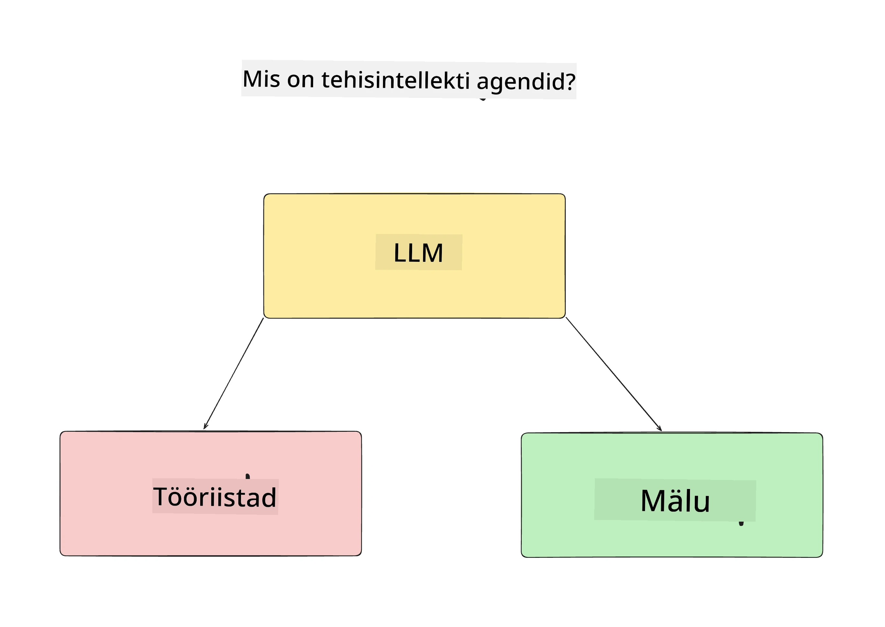
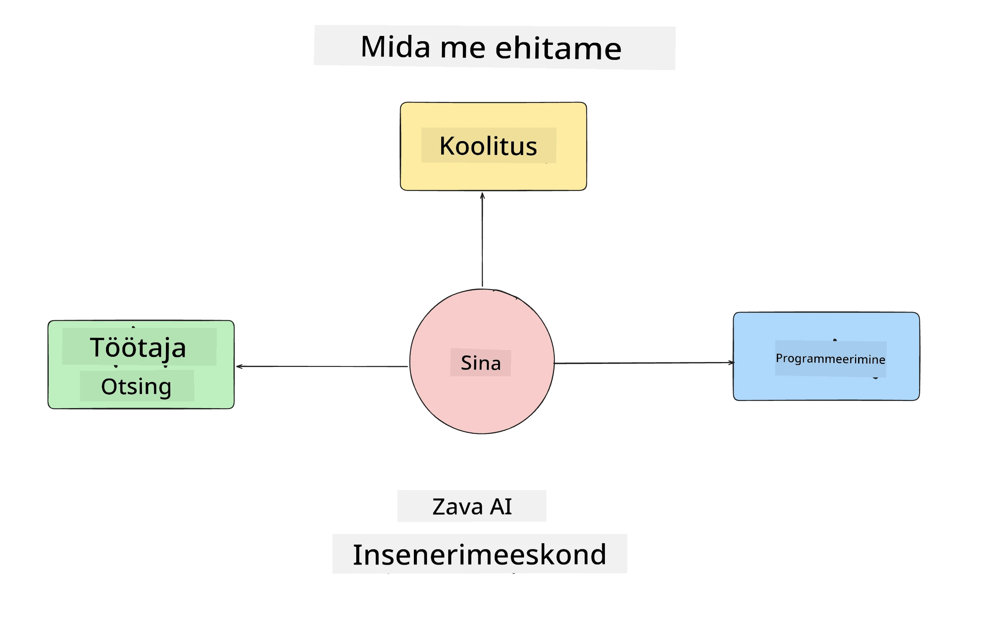
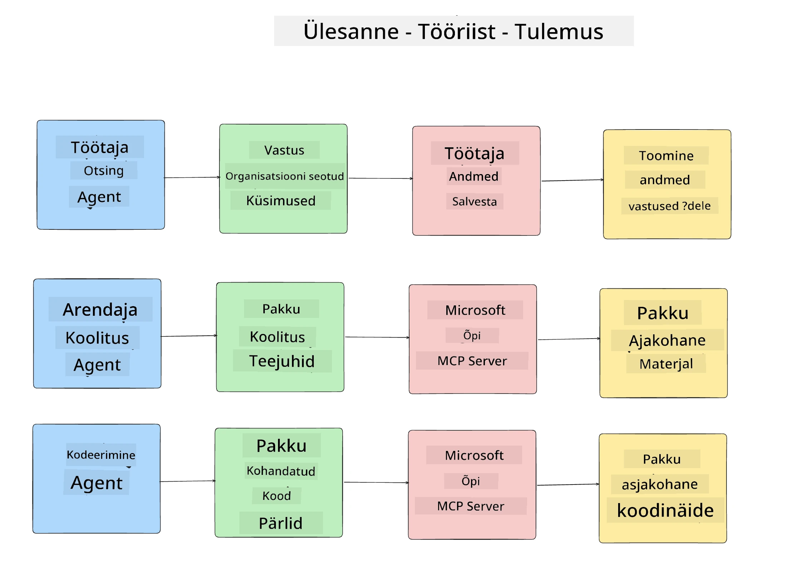
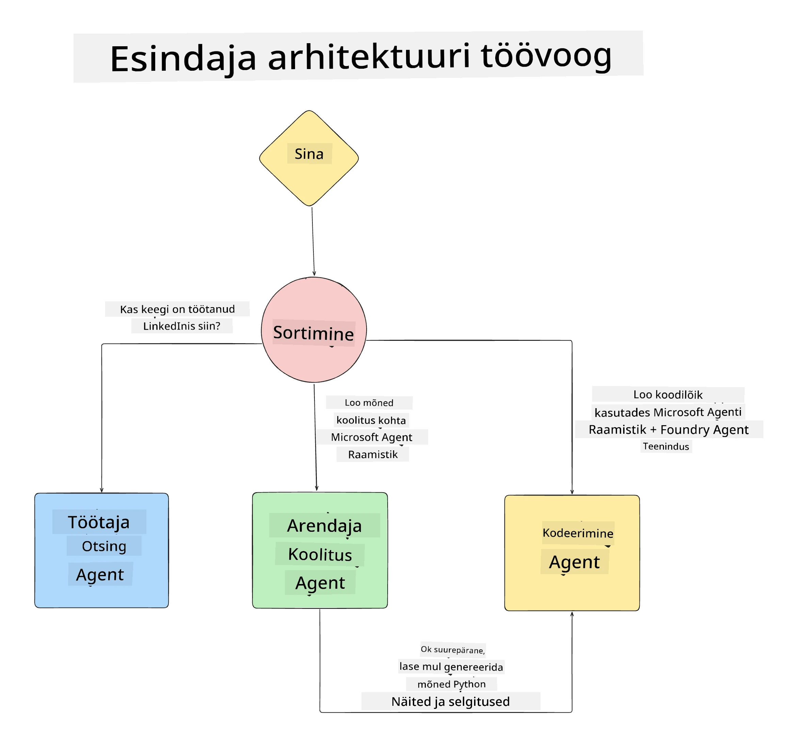

# Õppetund 1: Tehisintellekti agendi disain

Tere tulemast kursuse "Tehisintellekti agendi loomine nullist tootmisse" esimesele õppetunnile!

Selles õppetunnis käsitleme:

- Tehisintellekti agentide määratlemist  
  
- Arutelu agendi rakenduse üle, mida me ehitame  

- Iga agendi vajalike tööriistade ja teenuste identifitseerimist  
  
- Meie agendi rakenduse arhitektuuri  
  
Alustame agendi mõiste määratlemisest ja sellest, miks me neid rakenduses kasutame.

> **Enne kursuse alustamist.** See esimene õppetund on kontseptuaalne — siin ei ole koodi, mida jooksutada.
> Alates [2. õppetunnist](../lesson-2-agent-development/README.md) vajate: **Azure'i tellimust**, millel on juurdepääs **Microsoft Foundry’le**, juurutatud **GPT-5 seeria mudelit** (näiteks `gpt-5.1` — vältige pensionile läinud GPT-4o / GPT-4.1 mudeleid), **Python 3.12+** ja **Azure CLI** (`az login`). Vaadake kursuse README-st [Mida vajate](../README.md#what-you-need) täielikku nimekirja ja linke.

## Mis on tehisintellekti agendid?

Kui see on teie esimene kord uurida, kuidas tehisintellekti agenti ehitada, võite küsida, kuidas täpselt määratleda, mis on tehisintellekti agent.

Lihtsaim viis määratleda, mis on tehisintellekti agent, on vaadata selle mooduleid:

**Suur keelemudel** – LLM annab võimsuse nii kasutaja loomuliku keele töötlemiseks, et mõista soovi täita ülesannet, kui ka tööriistade kirjelduste tõlgendamiseks, mis on saadaval ülesannete täitmiseks.

**Tööriistad** – Need on funktsioonid, API-d, andmehoidlad ja teised teenused, mida LLM saab valida kasutamiseks kasutaja poolt taotletud ülesannete täitmiseks.

**Mälu** – Siin salvestame nii lühiajalised kui ka pikaajalised suhtlused AI agendi ja kasutaja vahel. Selle info salvestamine ja tagasivõtmine on oluline täiustuste tegemiseks ja kasutaja eelistuste säilitamiseks aja jooksul.

## Meie AI agendi kasutusjuhtum

Selle kursuse raames loome AI agendi rakenduse, mis aitab uutel arendajatel liituda meie AI agendi arendusmeeskonnaga!

Enne arendustööde alustamist on esimene samm edukaks AI agendi rakenduseks selgete stsenaariumite määratlemine, kuidas me ootame, et kasutajad meie AI agentidega töötavad.

Selle rakenduse puhul töötame järgmiste stsenaariumitega:

**Stsenaarium 1**: Uus töötaja liitub meie organisatsiooniga ja soovib rohkem teada saada meeskonna kohta, kuhu ta liitus, ning kuidas nendega ühendust võtta.

**Stsenaarium 2:** Uus töötaja tahab teada, milline oleks parim esimene ülesanne, mille kallal alustada töötamist.

**Stsenaarium 3:** Uus töötaja soovib koguda õppematerjale ja koodinäiteid, mis aitavad tal selle ülesande täitmist alustada.

## Tööriistade ja teenuste kindlakstegemine

Nüüd kui meil on need stsenaariumid paigas, on järgmine samm seostada need tööriistade ja teenustega, mida meie AI agendid vajavad nende ülesannete täitmiseks.

See protsess kuulub kontekstitehnika valdkonda, kuna keskendume sellele, et meie AI agentidel oleks õige kontekst õigeaegselt, et ülesanded täita.

Teeme selle stsenaariumipõhiselt ning teostame hea agentide disaini, pannes kirja iga agendi ülesande, tööriistad ja soovitud tulemused.

### Stsenaarium 1 - Töötajate otsinguagent

**Ülesanne** – Vastata küsimustele organisatsiooni töötajate kohta, näiteks liitumiskuupäev, praegune meeskond, asukoht ja viimane ametikoht.

**Tööriistad** – Andmebaas praeguste töötajate nimekirjast ja organisatsiooni struktuuri skeem

**Tulemused** – Võimalus võõrdatabaasist informatsiooni leida ja vastata üldküsimustele organisatsiooni kohta ning konkreetsetele küsimustele töötajate kohta.

### Stsenaarium 2 - Ülesannete soovituste agent

**Ülesanne** – Uue töötaja arenduskogemuse põhjal välja pakkuda 1–3 probleemi, mille kallal uus töötaja saab töötada.

**Tööriistad** – GitHub MCP server, et saada avatud probleemid ja koostada arendajaprofiil

**Tulemused** – Võime lugeda viimaseid 5 commit’i GitHubi profiilist ja avatud probleeme GitHubi projektis ning teha soovitusi vastavalt sobivusele

### Stsenaarium 3 - Koodi abistaja agent

**Ülesanne** – "Ülesannete soovituste" agendi poolt soovitatud avatud probleemide põhjal uurida ja pakkuda ressursse ning genereerida koodinäited töötaja abistamiseks.

**Tööriistad** – Microsoft Learn MCP ressursside leidmiseks ja Koodi Tõlgendaja kohandatud koodilõikude genereerimiseks

**Tulemused** – Kui kasutaja küsib täiendavat abi, peaks töövoog kasutama Learn MCP serverit, et pakkuda linke ja koodilõike ning seejärel üle andma Koodi Tõlgendaja agendile väikeste koodilõikude genereerimiseks koos selgitustega.

## Meie agendi rakenduse arhitektuur

Nüüd kui oleme määratlenud iga agendi, loome arhitektuuri diagrammi, mis aitab meil mõista, kuidas iga agent töötab koos ja eraldi sõltuvalt ülesandest:

## Järgmised sammud

Nüüd kui oleme disaininud iga agendi ja meie agendisüsteemi, liigume järgmisse õppetundi, kus arendame iga neist agentidest!

---

<!-- CO-OP TRANSLATOR DISCLAIMER START -->
**Lahtiütlus**:
See dokument on tõlgitud kasutades AI tõlketeenust [Co-op Translator](https://github.com/Azure/co-op-translator). Kuigi me püüdleme täpsuse poole, palun pange tähele, et automatiseeritud tõlgetes võib esineda vigu või ebatäpsusi. Originaaldokument selle emakeeles tuleks pidada autoriteetseks allikaks. Olulise teabe puhul soovitatakse kasutada professionaalset inimtõlget. Me ei vastuta selle tõlkega seotud eksimustest või valesti mõistmistest.
<!-- CO-OP TRANSLATOR DISCLAIMER END -->