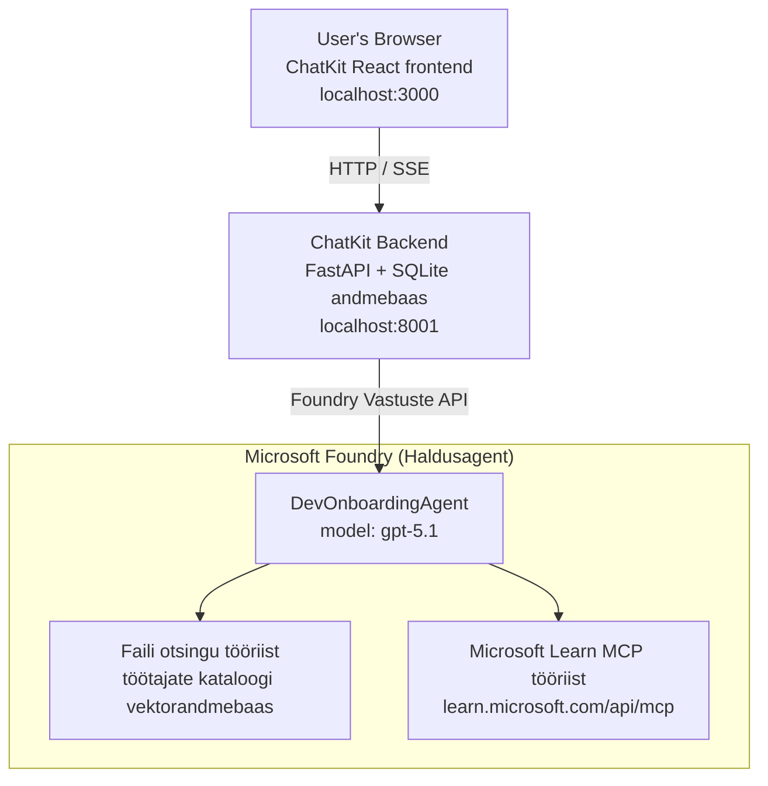

# Õppetund 4: Agendi juurutamine Microsoft Foundry majutatud agentide ja ChatKitiga

See õppetund demonstreerib, kuidas juurutada tööriista kasutav agent Microsoft Foundrys majutatud agendina ja luua ChatKit-põhine esipaneel selle suhtlemiseks.

## Arhitektuur

Majutatud agent on **ainult üks `DevOnboardingAgent`** (jooksmas `gpt-5.1`), mis vastab arendajate juhendamise küsimustele, kasutades kahte majutatud tööriista: **Faili otsingu** tööriista töötajate kataloogivektorite andmebaasis ja **Microsoft Learn MCP** tööriista. ChatKit React esipaneel suhtleb FastAPI taustaga, mis kutsub agenti läbi Foundry **Responses API**.



## Eeltingimused

1. **Microsoft Foundry projekt** Põhja Kesk-USA regioonis
2. **Azure CLI** autentitud (`az login`)
3. **Azure Developer CLI** (`azd`) installitud
4. **Python 3.12+** ja **Node.js 18+**
5. **Vektoriandmebaas** loodud töötajate andmetega

## Kiire algus

### 1. Seadista keskkonnamuutujad

```bash
cd lesson-4-agentdeployment
cp .env.example .env
# Muuda .env oma Microsoft Foundry projekti andmete järgi
```

### 2. Juuruta majutatud agent

**Variant A: Azure Developer CLI kasutamine (soovitatav)**

```bash
cd hosted-agent
azd auth login
azd agent deploy
```

**Variant B: Docker + Azure Container Registry kasutamine**

```bash
cd hosted-agent

# Ehita konteiner
docker build -t developer-onboarding-agent:latest .

# Silt ACR-ile
docker tag developer-onboarding-agent:latest <your-acr>.azurecr.io/developer-onboarding-agent:latest

# Lükka ACR-i
az acr login --name <your-acr>
docker push <your-acr>.azurecr.io/developer-onboarding-agent:latest

# Paigalda Microsoft Foundry portaali või SDK abil
```

### 3. Käivita ChatKiti taustaprogramm

```bash
cd chatkit-server
python -m venv .venv
source .venv/bin/activate  # Windowsil: .venv\Scripts\activate
pip install -r requirements.txt
python app.py
```

Server käivitub aadressil `http://localhost:8001`

### 4. Käivita ChatKiti esipaneel

```bash
cd chatkit-server/frontend
npm install
npm run dev
```

Esipaneel käivitub aadressil `http://localhost:3000`

### 5. Testi rakendust

Ava oma brauseris `http://localhost:3000` ja proovi järgmisi päringuid:

**Töötajate otsing:**
- "Ma olen siin uus! Kas keegi on Microsoftis töötanud?"
- "Kes on kogenud Azure Functionsiga?"

**Õppematerjalid:**
- "Loo õppeplaan Kuberneteseks"
- "Milliseid sertifikaate peaksin pilvearhitektuuri jaoks taotlema?"

**Kodeerimisabi:**
- "Aita mul kirjutada Python kood CosmosDB-ga ühenduse loomiseks"
- "Näita, kuidas luua Azure Function"

**Mitme agendi päringud:**
- "Alustan pilveinsenerina. Kellega peaksin ühendust võtma ja mida õppima?"

## Projekti struktuur

```
lesson-4-agentdeployment/
├── .env.example                 # Environment variables template
├── implementation-plan.md       # Detailed implementation guide
├── README.md                    # This file
├── hosted-agent/               # Microsoft Foundry hosted agent
│   ├── main.py                 # Multi-agent workflow implementation
│   ├── requirements.txt        # Python dependencies
│   ├── Dockerfile              # Container definition
│   └── agent.yaml              # Agent deployment configuration
└── chatkit-server/             # ChatKit server application
    ├── app.py                  # FastAPI backend
    ├── store.py                # SQLite persistence layer
    ├── requirements.txt        # Python dependencies
    └── frontend/               # React frontend
        ├── package.json
        ├── vite.config.ts
        ├── tsconfig.json
        ├── index.html
        └── src/
            ├── main.tsx
            ├── App.tsx
            ├── App.css
            └── index.css
```

## Agent ja selle tööriistad

Majutatud agent on **ainult üks agent** (`DevOnboardingAgent`, defineeritud failis `hosted-agent/main.py`), mis haldab kolme juhendamisdomeeni. Eraldi alaagentide orkestreerimise asemel eksponeerib see iga võimekusena tööriista (või tugineb otse mudelile):

| Võimekus | Kuidas seda käsitletakse | Tööriist |
|-----------|------------------|------|
| **Töötajate otsing ja ühendused** | Foundry majutatud Faili otsing töötajate kataloogi vektorandmebaasis | `client.get_file_search_tool(vector_store_ids=[...])` |
| **Õppimine ja koolitus** | Microsoft Learn MCP server (majutatud MCP tööriist) | `client.get_mcp_tool(url="https://learn.microsoft.com/api/mcp")` |
| **Kodeerimisabi** | Otse `gpt-5.1` mudeli poolt lahendatud – väliseid tööriistu ei kasutata | — |

Agent luuakse käsuga `client.as_agent(name="DevOnboardingAgent", instructions=..., tools=[file_search_tool, learn_mcp_tool])` ja töötab käsuga `from_agent_framework(agent).run()`.

> **Disaini märge.** Varasemad selle õppetunni mustandid kasutasid `HandoffBuilder` mitme-agendi töövoogu (Triage → spetsialistid). Tarnitud agent on ühe tööriista kasutav agent, mis on lihtsam juurutada ja mõista juhendamistaseme küsimuste ja vastuste jaoks. Mitme agendi orkestreerimise ja üleandmise näite leiate õppetunnist 2 ja õppetunnist 3.

## Majutatud agendi suitsutestimine (CI värav)

Majutatud agendi "edukas" juurutamine tõestab ainult seda, et juhtimistasand aktsepteeris
definitsiooni — see ei tõesta, et agent tegelikult vastab. Puuduv sõltuvus,
vale mudelibrauser või aegunud ühendus võivad jätta rohelise, kuid vaikiva agendi.

See õppetund sisaldab kerget **suitsutesti**, mis toimib kiire ja odava post-juurutuse
väravana. See kasutab [AI Smoke Test](https://github.com/marketplace/actions/ai-smoke-test)
GitHub Actionit, et saata agenti Foundry **Responses** lõpp-punktile PROMPTEid POST-päringuga
(`POST {project_endpoint}/agents/{agent_name}/endpoint/protocols/openai/responses`)
ja tõestada vastava teksti põhjal olekut. See tabab vigaseid juurutusi, autentimisprobleeme,
süsteemiprompti kõrvalekaldeid ja lõimimistõrkeid sekunditega.

> Suitsutestid ei asenda täielikke hinnanguid, mis on esitatud
> [Õppetund 3](../lesson-3-agent-evals/README.md) — need on täienduseks. Suitsutestid
> vastavad küsimusele *„kas agent on kättesaadav, reageerib ja järgib põhiprompti ootusi?“*;
> hinnangud vastavad küsimusele *„kui hea on vastus?“*. Käivita odav värav iga juurutuse puhul.

### Mida testitakse

Kataloog asub failis [`hosted-agent/tests/smoke-tests.json`](../../../lesson-4-agentdeployment/hosted-agent/tests/smoke-tests.json)
ja katsetab agendi kolme domeeni, prompti järjepidevust ja vestluse mitme tõlge:

| Test | Mida see tõestab |
|------|------------------|
| `reachability` | Agent vastab mitte-tühja ja teemakohase tekstiga |
| `employee-search` | Failiotsingu domeen tagastab terved `200` (vastus sõltub andmetest) |
| `learning-path` | Õppe domeen kordab teemat ja annab vastuse tee stiilis |
| `coding-assistance` | Kodeerimise domeen tagastab Python-koodi kujul vastuse |
| `prompt-adherence-offtopic` | Teemaväline päring suunatakse ümber, üksikasjalikult ei vastata |
| `threading-turn-1/2` | Vestluse olek säilib mitme tõmbe jooksul `previous_response_id` kaudu |

### Käivita see CI's

Töövoog failis [`.github/workflows/smoke-test-hosted-agent.yml`](../../../.github/workflows/smoke-test-hosted-agent.yml)
sisaldab kahte tööd:

- **`static`** — kiire, Azure'ita värav, mis jookseb iga pull-päringu ja push'i puhul:
  see kompileerib kogu Pythoni lähtekoodi (`py_compile`) ja kontrollib Markdowni linke. Saladusi
  pole vaja, seega töötab ka fork'ide PR-idega.
- **`smoke`** — alljärgnev Azure'iga seotud suitsutest. Jookseb vajadusel
  (Actions → **Agent CI (static + smoke)** → Käivita töövoog) ja võib järgneda sinu
  juurutustöövoolule.

Konfigureeri need hoidla **muutujad** ja **saladused** suitsutesti töö jaoks:

| Tüüp | Nimi | Väärtus |
|------|------|-------|
| Muutuja | `FOUNDRY_PROJECT_ENDPOINT` | `https://<account>.services.ai.azure.com/api/projects/<project>` |
| Muutuja | `HOSTED_AGENT_NAME` | Juurutatud agendi nimi (nt `dev-onboarding` — peab sobima sinu juurutusega) |
| Saladus | `AZURE_CLIENT_ID` / `AZURE_TENANT_ID` / `AZURE_SUBSCRIPTION_ID` | OIDC föderatiivne identiteet `azure/login` jaoks |

Käitaja identiteedil peab olema roll **`Azure AI User`** at Foundry projekti ulatuses, et
ta saaks kutsuda Responses (ja vestluste) andmetasandi lõpp-punkte. Pane see õigused:

```bash
az role assignment create \
  --assignee <object-id-or-appId-of-runner-identity> \
  --role "Azure AI User" \
  --scope "/subscriptions/<sub>/resourceGroups/<rg>/providers/Microsoft.CognitiveServices/accounts/<account>/projects/<project>"
```

### Käivita lokaalselt

Sama kataloogi võid käivitada ka enne pushi. Hangi andmetasandi token ulatusega
`https://ai.azure.com/` ja suuna see oma juurutusele:

```bash
# Sihtmärk PEAB olema https://ai.azure.com/ (cognitiveservices.azure.com tokenid lükatakse tagasi)
export FOUNDRY_TOKEN=$(az account get-access-token --resource https://ai.azure.com/ --query accessToken -o tsv)

git clone https://github.com/JFolberth/ai-smoketest && cd ai-smoketest
python runner.py \
  --project-endpoint "https://<account>.services.ai.azure.com/api/projects/<project>" \
  --agent-name dev-onboarding \
  --tests-file ../lesson-4-agentdeployment/hosted-agent/tests/smoke-tests.json
```

Väljundkoodid: `0` kõik läbisid testi, `1` väidete tõestamine ebaõnnestus, `2` jooksutaja tõrge (halb kataloog/token).

## Probleemide lahendamine

### Agent ei vasta
- Kontrolli, kas majutatud agent on Microsoft Foundrys juurutatud ja töötab
- Veendu, et `HOSTED_AGENT_NAME` ja `HOSTED_AGENT_VERSION` vastavad sinu juurutusele

### Vektoriandmebaasi vead
- Veendu, et `VECTOR_STORE_ID` on õigesti seadistatud
- Kontrolli, kas vektoriandmebaas sisaldab töötajate andmeid

### Autentimisvead
- Käivita `az login`, et värskendada mandaate
- Veendu, et sul on juurdepääs Microsoft Foundry projektile

## Ressursid

- [Microsoft Foundry majutatud agentide dokumentatsioon](https://learn.microsoft.com/en-us/azure/ai-foundry/agents/concepts/hosted-agents)
- [Microsoft Agent Framework](https://github.com/microsoft/agent-framework)
- [ChatKit integreerimise näide](https://github.com/microsoft/agent-framework/tree/main/python/samples/demos/chatkit-integration)
- [Azure Developer CLI](https://learn.microsoft.com/en-us/azure/developer/azure-developer-cli/overview)
- [AI Smoke Test GitHub Action](https://github.com/marketplace/actions/ai-smoke-test)
- [Suitsutest Microsoft Foundry agentidega GitHub Actionsi abil (blogi)](https://techcommunity.microsoft.com/blog/azuredevcommunityblog/smoke-test-microsoft-foundry-agents-with-github-actions/4531912)

---

## Järgmised sammud

Sinu agent jookseb Microsofti hallataval infrastruktuuril. Et võtta see üle ettevõtte tootmisse —
kontrollides, kus andmed asuvad (andmete suveräänsus, privaatvõrk, too omaenda Azure
Cosmos DB / Storage / AI Search) ja valitsedes selle tööriistu — jätka
**[Õppetund 5: Tootmismajutusagentid](../lesson-5-hosted-agents-production/README.md)**, mis
selgitab olulist erinevust **majutusagentide** ja **võimekuse hostide** vahel.

---

<!-- CO-OP TRANSLATOR DISCLAIMER START -->
**Lahtiütlus**:
See dokument on tõlgitud kasutades AI tõlketeenust [Co-op Translator](https://github.com/Azure/co-op-translator). Kuigi me püüdleme täpsuse poole, palun pange tähele, et automatiseeritud tõlgetes võib esineda vigu või ebatäpsusi. Originaaldokument selle emakeeles tuleks pidada autoriteetseks allikaks. Olulise teabe puhul soovitatakse kasutada professionaalset inimtõlget. Me ei vastuta selle tõlkega seotud eksimustest või valesti mõistmistest.
<!-- CO-OP TRANSLATOR DISCLAIMER END -->