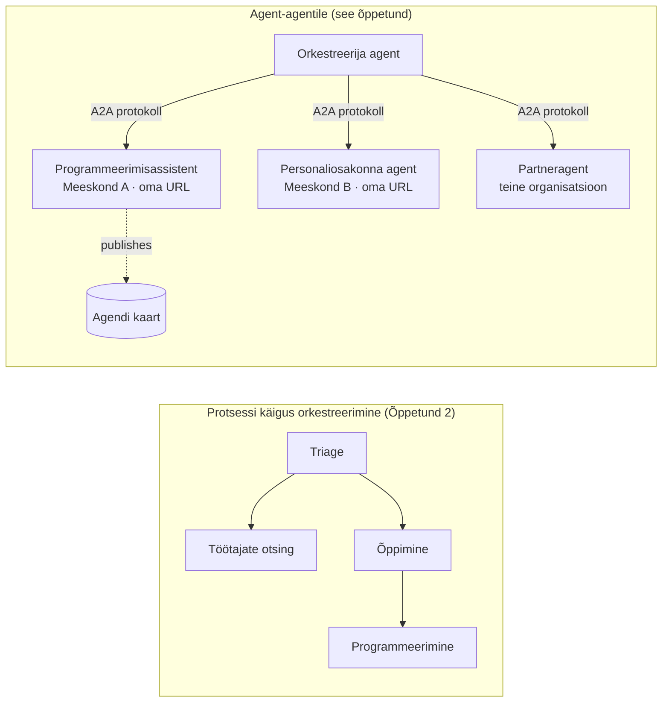

# Õppetund 7: Mitme agendi orkestreerimine ja agent-agenti suhtlus (A2A)

Õppetunni [6](../lesson-6-toolbox/README.md) lõpuks oskad ehitada juhitud tööriistu ja majutada agente.
Kuid tõelised süsteemid kasutavad harva vaid **üht** agenti. Reaalses kasutuses kombineeritakse **paljusid** agente — mõnda
omavad sinu meeskonnad, mõnda teised tiimid või koguni täiesti teised organisatsioonid. See õppetund räägib sellest,
kuidas agendid töötavad **koos**.

Sa oled juba kohtunud ühe mitmeagendi disainiga
[Õppetunnis 2 `agent-orchestration.py`](../lesson-2-agent-development/README.md): **ülekande** mustriga, kus triage agent suunab
spetsialistidele **ühe protsessi sees**. See õppetund toob sind sammu võrra edasi — **Agent-Agenti (A2A)**
juurde, mis on avatud protokoll agentidele, kes töötavad iseseisvate
**võrguteenustena** ning kutsuvad teineteist protsessi-, meeskonna- ja organisatsioonipiiride taga.

## Õpieesmärgid

Selle õppetunni lõpuks oskad:

- Selgitada erinevust **protsessisisese orkestreerimise** (ülekanded/töövood) ja
  **Agent-Agenti (A2A)** kommunikatsiooni vahel ning valida õige lähenemise.
- Kirjeldada A2A põhielemente: **Agent Card**, **oskused**, **ülesanded** ja **leidmine**.
- **Pakkuda** Microsoft Agent Frameworki agenti A2A teenusena `A2AExecutor` abil.
- **Tarbi** kaugagenti võrgus võrdsena `A2AAgent` abil.
- Rakendada ettevõtte muresid A2A puhul: **turbeseisund, identiteet, juhitavus, jälgitavus ja kulu**.

---

## Eelteadmised

1. Läbitud [õppetund 2](../lesson-2-agent-development/README.md) (agendi arendus ja orkestreerimine).
2. **Microsoft Foundry** projekt kehtiva mudeli väljalaske (näiteks `gpt-5.1` ja
   `gpt-5-codex` koodi näidise jaoks). Väldi vananenud GPT-4o / GPT-4.1 mudeleid.
3. Autentitud **Azure CLI** kaudu: `az login`.
4. **Python 3.12+** koos kursuse sõltuvustega paigaldatud (`pip install -r ../requirements.txt`).
   Õppetund 7 lisab eelvaate paketid `agent-framework-a2a`, `a2a-sdk` ja `uvicorn`.
5. Muutujad `FOUNDRY_PROJECT_ENDPOINT` ja `FOUNDRY_MODEL` on seadistatud sinu `.env` failis (vt kursuse README).

---

## 1. Kaks viisi, kuidas agendid töötavad koos

Ühtset "mitmeagendi" mustrit ei ole. Vali see, mis sobib sinu **piiridele**:

| Muster | Kus agendid jooksevad | Kuidas nad ühenduvad | Kasutusejuhtum |
|---------|------------------|------------------|----------|
| **Üleandmine / Töövoog** (Õppetund 2) | Üks protsess, üks koodipõhi | Mälu sees graafik (`HandoffBuilder`, `WorkflowBuilder`) | Sa omad kõiki agente ja paigaldad neid koos. |
| **Agent-Agent (A2A)** (see õppetund) | Eraldi teenused, eraldi elutsüklid | Avatud **A2A protokoll** HTTP peal, avastatud **Agent Card'ide** kaudu | Agendid on erinevate tiimide/organisatsioonide omad, skaleeruvad iseseisvalt või on kirjutatud eri raamistikus. |

Üleandmine tähendab **suunamist rakenduse sees**. A2A tähendab **agentide ühendamist iseseisvate teenustena** — agentide vastavus
funktsioonikõnede teisendamisele mikroteenusteks.



> **Nad komponeerivad.** Orkestreerija, mille ehitad `HandoffBuilder`-iga, võib kaasa teha **kaug-A2A agente** —
> protsessisisest suunamist teenustele, mis jooksevad ükskõik kus.

---

## 2. A2A põhielemendid

A2A on **avatud protokoll** (ei ole Microsofti-spetsiifiline), seega saab A2A agenti kasutada Microsoft Agent Framework,
LangGraph, kohandatud kood või mõne teise firma stack. Nelja kontseptsiooni tasub teada:

- **Agent Card** — väike JSON dokument, mis on avaldatud aadressil
  `/.well-known/agent-card.json` ja reklaamib agendi **nimi, kirjeldus, URL, versioon,
  oskused ja võimekused**. See on viis, kuidas klient **leiab**, mida kaugagent oskab teha.
- **Oskused** — agendi deklareeritud võimed (`id`, `nimi`, `kirjeldus`, `sildid`,
  `näited`). Kliendid (ja mudelid) kasutavad neid otsustamaks, kas neid kutsuda.
- **Ülesanded** — A2A agendi kõne on **ülesanne** oma elutsükliga (esitatud → töötlemisel →
  lõpetatud/ebaõnnestunud). Server jälgib ülesandeid **ülesandepoes**; voo uuendused on toetatud.
- **Leidmine** — kliendil, kellel on ainult URL, on võimalik tõmmata Agent Card ning teada, kuidas agenti kutsuda.

---

## 3. Näita agenti A2A teenusena — `a2a_server.py`

**Ehita/serveeri** pool keerab iga Microsoft Agent Frameworki agendi `A2AExecutor` abil ümber ja paigaldab A2A HTTP rakendusse.
Vaata näidet failis [`a2a_server.py`](../../../lesson-7-multi-agent-a2a/a2a_server.py). Peamine ühenduskood:

```python
from agent_framework.a2a import A2AExecutor
from a2a.server.apps import A2AStarletteApplication
from a2a.server.request_handlers import DefaultRequestHandler
from a2a.server.tasks import InMemoryTaskStore
from a2a.types import AgentCapabilities, AgentCard, AgentSkill

agent = client.as_agent(name="coding-assistant", instructions="...")

agent_card = AgentCard(
    name="Coding Assistant",
    description="Generates runnable code samples...",
    url="http://localhost:9000/",
    version="1.0.0",
    capabilities=AgentCapabilities(streaming=True),
    default_input_modes=["text"],
    default_output_modes=["text"],
    skills=[AgentSkill(id="generate-code", name="Generate code",
                       description="Write a runnable code snippet.", tags=["code"])],
)

request_handler = DefaultRequestHandler(
    agent_executor=A2AExecutor(agent),
    task_store=InMemoryTaskStore(),
)
app = A2AStarletteApplication(agent_card=agent_card, http_handler=request_handler).build()
# serveeritakse uvicorniga pordil 9000
```

Pane tähele, et agendi kood on **muutumata** — `A2AExecutor` kohandab su olemasoleva agendi protokolliks.
Agent Card on see, mis teeb agente A2A kliendile **leidmatuks**.

---

## 4. Kasuta kaugagentti — `a2a_client.py`

**Tarbi** pool ühendub kaugagendiga **URL-i kaudu**, tõmbab selle Agent Card’i ja kutsub seda
täpselt nagu kohalikku agenti. Vaata faili [`a2a_client.py`](../../../lesson-7-multi-agent-a2a/a2a_client.py):

```python
from agent_framework.a2a import A2AAgent

remote_agent = A2AAgent(name="remote-coding-assistant", url="http://localhost:9000")
result = await remote_agent.run("Write a Python function that reverses a string.")
print(result.text)
```

See ongi A2A mõte: kaugagent käitub kutsuja vaates nagu iga teine
`agent_framework` agent, nii et seda saab lisada töövoogu või muuta sihtpunktiks — kuigi see töötab
teises protsessis, teisel masinal ja teise meeskonna omandis.

### Käivita see lõpust lõpuni

```bash
# Terminal 1 — alusta A2A teenust
python a2a_server.py

# Terminal 2 — kutsu see üles
python a2a_client.py "Write a Python function that reverses a string."
```

Sa näed koodiabimehe vastust saabumas A2A protokolli kaudu. Ava
`http://localhost:9000/.well-known/agent-card.json` brauseris, et näha avaldatud Agent Card'i.

---

## 5. Ettevõtte mured

Agentide võrguteenusteks muutmine toob kaasa samad probleemid, mis iga hajutatud süsteemi puhul —
pluss mõned AI-spetsiifilised:


- **Identiteet ja autentimine.** Ärge kunagi avalikustage A2A agenti ilma autentimiseta. Agentkaardil on
  `security` / `security_schemes` ning `A2AAgent` aktsepteerib `auth_interceptor` nii, et kutsujad lisavad
  mandaadid (OAuth bearer-tokenid, API-võtmed). Kasutage tootmises teenuste vaheliseks autentimiseks Entra ID / hallatavaid identiteete;
  paigutage teenus värava taha.
- **Juhtimine.** Kombineerige A2A koos [Lesson 6 tööriistakastiga](../lesson-6-toolbox/README.md): kaugel olev agent
  saab avaldada **A2A tööriistana** juhitava tööriistakasti sees, kus kehtivad tsentraalsed RBAC,
  mandaadi süstimine ja kaitsepoliitikad.
- **Jälgitavus.** Taotlus läbib nüüd protsessipiire, levitage jälgimist päringu vältel.
  Lülitage sisse [Foundry Observability / OpenTelemetry](../lesson-3-agent-evals/README.md) nii
  orkestri eest kui ka iga kaugagentide juures, et saada üks lõpust-lõpuni jälgimine.
- **Versioonihaldus.** Agentkaardil on `version`. Kohtle seda nagu API-d: lisavad muudatused on ohutud;
  oskuse lepingu murdmine nõuab uut versiooni ja migratsiooni aega tarbijatele.
- **Usaldusväärsus.** Kaugagentidel esineb ebaõnnestumisi iseseisvalt. Sea ajapiiranguid (`A2AAgent(timeout=...)`),
  käsitle osalist tõrget ning ära lase ühel aeglasel peeril blokeerida kogu orkestratsiooni.
- **Kulu.** Iga kaugagentide päring on oma mudeli kutsumine. Fännimine mitmesse suunas suurendab tokeni kulutusi —
  planeeri eelarve ning eelista ühele kõige paremale agentidele suunamist, mitte paljudele avaldamist.

---

## Praktilised harjutused

1. **Lisa teine teenus.** Kopeeri `a2a_server.py`, et eksponeerida **employee-search** agent port 9001 peal
   oma Agentkaardi ja oskustega. Käivitage mõlemad ning las klient kutsub mõlemat.
2. **Orkestreeri kaugpeere.** Ehita väike `HandoffBuilder` (või lihtne ruuter), kus osalejad
   on kaks `A2AAgent`i, mis osutavad nendele kahele teenusele. Suuna päring õigesse agenti.
3. **Turvasta see.** Lisa kliendile `auth_interceptor` ja nõua serveril bearer-tokenit.
   Mis juhtub, kui token puudub? Kuhu sa hoiaksid tokenit tootmises?
4. **Handoff vs A2A.** Kirjuta kaks lühikest lõiku: millal säilitad Loengu 2 protsessisisese
   handoffi ja millal on A2A täiendav keerukus õigustatud? Too igaühe kohta konkreetne näide.

---

## Ressursid

- [Agent-to-Agent (A2A) — Microsoft Agent Framework](https://learn.microsoft.com/agent-framework/user-guide/agent-orchestration/a2a)
- [Mitme agendi orkestratsioon — Microsoft Agent Framework](https://learn.microsoft.com/agent-framework/user-guide/agent-orchestration/)
- [A2A protokolli spetsifikatsioon](https://a2a-protocol.org/)
- [A2A Python SDK (`a2a-sdk`)](https://github.com/a2aproject/a2a-python)
- [Foundry Agent Service — mitme agendi mustrid](https://learn.microsoft.com/azure/ai-foundry/agents/concepts/connected-agents)

---

**Eelmine:** [Lesson 6 — Microsoft Toolbox](../lesson-6-toolbox/README.md)

---

<!-- CO-OP TRANSLATOR DISCLAIMER START -->
**Lahtiütlus**:
See dokument on tõlgitud kasutades AI tõlketeenust [Co-op Translator](https://github.com/Azure/co-op-translator). Kuigi me püüdleme täpsuse poole, palun pange tähele, et automatiseeritud tõlgetes võib esineda vigu või ebatäpsusi. Originaaldokument selle emakeeles tuleks pidada autoriteetseks allikaks. Olulise teabe puhul soovitatakse kasutada professionaalset inimtõlget. Me ei vastuta selle tõlkega seotud eksimustest või valesti mõistmistest.
<!-- CO-OP TRANSLATOR DISCLAIMER END -->