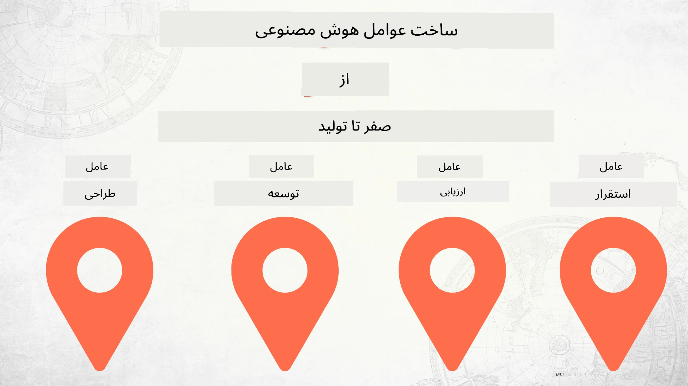

# ساخت عوامل هوش مصنوعی از صفر تا تولید



### 🌐 پشتیبانی چندزبانه

#### پشتیبانی شده از طریق GitHub Action (خودکار و همیشه به‌روز)

<!-- CO-OP TRANSLATOR LANGUAGES TABLE START -->
[Arabic](../ar/README.md) | [Bengali](../bn/README.md) | [Bulgarian](../bg/README.md) | [Burmese (Myanmar)](../my/README.md) | [Chinese (Simplified)](../zh-CN/README.md) | [Chinese (Traditional, Hong Kong)](../zh-HK/README.md) | [Chinese (Traditional, Macau)](../zh-MO/README.md) | [Chinese (Traditional, Taiwan)](../zh-TW/README.md) | [Croatian](../hr/README.md) | [Czech](../cs/README.md) | [Danish](../da/README.md) | [Dutch](../nl/README.md) | [Estonian](../et/README.md) | [Finnish](../fi/README.md) | [French](../fr/README.md) | [German](../de/README.md) | [Greek](../el/README.md) | [Hebrew](../he/README.md) | [Hindi](../hi/README.md) | [Hungarian](../hu/README.md) | [Indonesian](../id/README.md) | [Italian](../it/README.md) | [Japanese](../ja/README.md) | [Kannada](../kn/README.md) | [Khmer](../km/README.md) | [Korean](../ko/README.md) | [Lithuanian](../lt/README.md) | [Malay](../ms/README.md) | [Malayalam](../ml/README.md) | [Marathi](../mr/README.md) | [Nepali](../ne/README.md) | [Nigerian Pidgin](../pcm/README.md) | [Norwegian](../no/README.md) | [Persian (Farsi)](./README.md) | [Polish](../pl/README.md) | [Portuguese (Brazil)](../pt-BR/README.md) | [Portuguese (Portugal)](../pt-PT/README.md) | [Punjabi (Gurmukhi)](../pa/README.md) | [Romanian](../ro/README.md) | [Russian](../ru/README.md) | [Serbian (Cyrillic)](../sr/README.md) | [Slovak](../sk/README.md) | [Slovenian](../sl/README.md) | [Spanish](../es/README.md) | [Swahili](../sw/README.md) | [Swedish](../sv/README.md) | [Tagalog (Filipino)](../tl/README.md) | [Tamil](../ta/README.md) | [Telugu](../te/README.md) | [Thai](../th/README.md) | [Turkish](../tr/README.md) | [Ukrainian](../uk/README.md) | [Urdu](../ur/README.md) | [Vietnamese](../vi/README.md)

> **ترجیح می‌دهید به‌صورت محلی کلون کنید؟**
>
> این مخزن شامل بیش از ۵۰ ترجمه زبان است که حجم دانلود را به طور قابل توجهی افزایش می‌دهد. برای کلون کردن بدون ترجمه‌ها، از sparse checkout استفاده کنید:
>
> **Bash / macOS / Linux:**
> ```bash
> git clone --filter=blob:none --sparse https://github.com/microsoft/Building-AI-Agents-From-Zero-To-Production.git
> cd Building-AI-Agents-From-Zero-To-Production
> git sparse-checkout set --no-cone '/*' '!translations' '!translated_images'
> ```
>
> **CMD (ویندوز):**
> ```cmd
> git clone --filter=blob:none --sparse https://github.com/microsoft/Building-AI-Agents-From-Zero-To-Production.git
> cd Building-AI-Agents-From-Zero-To-Production
> git sparse-checkout set --no-cone "/*" "!translations" "!translated_images"
> ```
>
> این به شما همه چیز را می‌دهد که برای تکمیل دوره با دانلود بسیار سریع‌تر نیاز دارید.
<!-- CO-OP TRANSLATOR LANGUAGES TABLE END -->

## دوره‌ای که اصول چرخه عمر توسعه عامل هوش مصنوعی را به شما آموزش می‌دهد

[](https://github.com/microsoft/Building-AI-Agents-From-Zero-To-Production/blob/master/LICENSE?WT.mc_id=academic-105485-koreyst)
[](https://GitHub.com/microsoft/Building-AI-Agents-From-Zero-To-Production/graphs/contributors/?WT.mc_id=academic-105485-koreyst)
[](https://GitHub.com/microsoft/Building-AI-Agents-From-Zero-To-Production/issues/?WT.mc_id=academic-105485-koreyst)
[](https://GitHub.com/microsoft/Building-AI-Agents-From-Zero-To-Production/pulls/?WT.mc_id=academic-105485-koreyst)
[](http://makeapullrequest.com?WT.mc_id=academic-105485-koreyst)

[](https://discord.gg/Kuaw3ktsu6)

## 🌱 شروع به کار

این دوره درس‌هایی را پوشش می‌دهد که اصول ساخت و استقرار عوامل هوش مصنوعی را آموزش می‌دهد.

هر درس بر درس قبلی بنا شده است، بنابراین توصیه می‌کنیم از ابتدا شروع کنید و تا انتها پیش بروید.

اگر می‌خواهید بیشتر درباره موضوعات مربوط به عوامل هوش مصنوعی کاوش کنید، می‌توانید دوره [AI Agents For Beginners](https://aka.ms/ai-agents-beginners) را بررسی کنید.

### ملاقات با دیگر یادگیرندگان، دریافت پاسخ سوالات خود

اگر گیر کردید یا سوالی درباره ساخت عوامل هوش مصنوعی داشتید، به کانال مخصوص دیسکورد ما در [Microsoft Foundry Discord](https://discord.gg/Kuaw3ktsu6) بپیوندید.

### آنچه نیاز دارید

هر درس نمونه کد خود را دارد که می‌توانید به‌صورت محلی اجرا کنید. شما می‌توانید [این مخزن را فورک کنید](https://github.com/microsoft/Building-AI-Agents-From-Zero-To-Production/fork) تا نسخه خودتان را ایجاد کنید.

این دوره فعلاً از موارد زیر استفاده می‌کند:

- [Microsoft Agent Framework (MAF)](https://aka.ms/ai-agents-beginners/agent-framework)
- [Microsoft Foundry](https://azure.microsoft.com/products/ai-foundry)
- [Azure OpenAI Service](https://azure.microsoft.com/products/ai-foundry/models/openai)
- [Azure CLI](https://learn.microsoft.com/cli/azure/authenticate-azure-cli?view=azure-cli-latest)

لطفاً اطمینان حاصل کنید که قبل از شروع به این خدمات دسترسی دارید.

گزینه‌های بیشتری برای میزبانی مدل و خدمات به‌زودی اضافه خواهد شد.

## 🗃️ درس‌ها

| **درس**            | **توضیحات**                                                                                     |
|--------------------|------------------------------------------------------------------------------------------------|
| [طراحی عامل](./lesson-1-agent-design/README.md)       | معرفی استفاده از مورد «آشنایی توسعه‌دهنده» برای عامل و چگونگی طراحی عوامل مؤثر                   |
| [توسعه عامل](./lesson-2-agent-development/README.md)  | با استفاده از Microsoft Agent Framework (MAF)، سه عامل ایجاد کنید تا به توسعه‌دهندگان جدید کمک کند. |
| [ارزیابی عوامل](./lesson-3-agent-evals/README.md)  | با استفاده از Microsoft Foundry، ببینید عوامل هوش مصنوعی ما چقدر خوب عملکرد دارند و چگونه آن‌ها را بهبود بخشید. |
| [استقرار عامل](./lesson-4-agent-deployment/README.md)   | با استفاده از عوامل میزبانی شده و OpenAI Chatkit، مشاهده کنید چگونه یک عامل هوش مصنوعی را به تولید برسانید.  |


## 🎒 دوره‌های دیگر

تیم ما دوره‌های دیگری نیز تولید می‌کند! بررسی کنید:

<!-- CO-OP TRANSLATOR OTHER COURSES START -->
### LangChain
[](https://aka.ms/langchain4j-for-beginners)
[](https://aka.ms/langchainjs-for-beginners?WT.mc_id=m365-94501-dwahlin)
[](https://github.com/microsoft/langchain-for-beginners?WT.mc_id=m365-94501-dwahlin)
---

### Azure / Edge / MCP / Agents
[](https://github.com/microsoft/AZD-for-beginners?WT.mc_id=academic-105485-koreyst)
[](https://github.com/microsoft/edgeai-for-beginners?WT.mc_id=academic-105485-koreyst)
[](https://github.com/microsoft/mcp-for-beginners?WT.mc_id=academic-105485-koreyst)
[](https://github.com/microsoft/ai-agents-for-beginners?WT.mc_id=academic-105485-koreyst)

---

### سری هوش مصنوعی مولد
[](https://github.com/microsoft/generative-ai-for-beginners?WT.mc_id=academic-105485-koreyst)
[-9333EA?style=for-the-badge&labelColor=E5E7EB&color=9333EA)](https://github.com/microsoft/Generative-AI-for-beginners-dotnet?WT.mc_id=academic-105485-koreyst)
[-C084FC?style=for-the-badge&labelColor=E5E7EB&color=C084FC)](https://github.com/microsoft/generative-ai-for-beginners-java?WT.mc_id=academic-105485-koreyst)
[-E879F9?style=for-the-badge&labelColor=E5E7EB&color=E879F9)](https://github.com/microsoft/generative-ai-with-javascript?WT.mc_id=academic-105485-koreyst)

---

### یادگیری پایه
[](https://aka.ms/ml-beginners?WT.mc_id=academic-105485-koreyst)
[](https://aka.ms/datascience-beginners?WT.mc_id=academic-105485-koreyst)
[](https://aka.ms/ai-beginners?WT.mc_id=academic-105485-koreyst)
[](https://github.com/microsoft/Security-101?WT.mc_id=academic-96948-sayoung)
[](https://aka.ms/webdev-beginners?WT.mc_id=academic-105485-koreyst)
[](https://aka.ms/iot-beginners?WT.mc_id=academic-105485-koreyst)
[](https://github.com/microsoft/xr-development-for-beginners?WT.mc_id=academic-105485-koreyst)

---
 
### سری کاپیلوت
[](https://aka.ms/GitHubCopilotAI?WT.mc_id=academic-105485-koreyst)
[](https://github.com/microsoft/mastering-github-copilot-for-dotnet-csharp-developers?WT.mc_id=academic-105485-koreyst)
[](https://github.com/microsoft/CopilotAdventures?WT.mc_id=academic-105485-koreyst)
<!-- CO-OP TRANSLATOR OTHER COURSES END -->

## مشارکت

این پروژه از مشارکت‌ها و پیشنهادات استقبال می‌کند. اکثر مشارکت‌ها مستلزم قبول یک
توافقنامه مجوز مشارکت کننده (CLA) است که اعلام می‌کنید حق دارید و در واقع به ما
حقوق استفاده از مشارکت شما را اعطا می‌کنید. برای جزئیات بیشتر، به <https://cla.opensource.microsoft.com> مراجعه کنید.

وقتی یک درخواست کشش (.Pull Request) ارسال می‌کنید، یک ربات CLA به‌طور خودکار تعیین می‌کند که آیا نیاز به ارائه
یک CLA دارید و درخواست را به‌طور مناسب علامت‌گذاری می‌کند (مثلاً بررسی وضعیت، نظر). کافی است دستورالعمل‌های ارائه شده توسط ربات را دنبال کنید.
شما فقط یک بار در بین تمام مخازن از CLA ما باید این کار را انجام دهید.

این پروژه منشور رفتار منبع باز مایکروسافت [Microsoft Open Source Code of Conduct](https://opensource.microsoft.com/codeofconduct/) را پذیرفته است.
برای اطلاعات بیشتر به [سوالات متداول منشور رفتار](https://opensource.microsoft.com/codeofconduct/faq/) مراجعه کنید یا با
[opencode@microsoft.com](mailto:opencode@microsoft.com) تماس بگیرید تا سوالات یا نظرات بیشتری را مطرح کنید.

## علائم تجاری

این پروژه ممکن است حاوی علائم تجاری یا لوگوهایی برای پروژه‌ها، محصولات یا خدمات باشد. استفاده مجاز از علائم تجاری یا لوگوهای مایکروسافت
مشروط به رعایت
[راهنمای علائم تجاری و برند Microsoft](https://www.microsoft.com/legal/intellectualproperty/trademarks/usage/general) است.
استفاده از علائم تجاری یا لوگوهای مایکروسافت در نسخه‌های اصلاح‌شده این پروژه نباید باعث سردرگمی شود یا حمایت مایکروسافت را القا کند.
هرگونه استفاده از علائم تجاری یا لوگوهای شخص ثالث تابع سیاست‌های آن شرکت‌های ثالث است.

## دریافت کمک

اگر گیر کردید یا سوالی در مورد ساخت برنامه‌های هوش مصنوعی داشتید، بپیوندید به:

[](https://discord.gg/Kuaw3ktsu6)

اگر بازخورد محصول یا خطاهایی هنگام ساخت دارید، به اینجا مراجعه کنید:

[](https://aka.ms/foundry/forum)

---

<!-- CO-OP TRANSLATOR DISCLAIMER START -->
**سلب مسئولیت**:  
این سند با استفاده از سرویس ترجمه هوش مصنوعی [Co-op Translator](https://github.com/Azure/co-op-translator) ترجمه شده است. در حالی که ما برای دقت تلاش می‌کنیم، لطفاً توجه داشته باشید که ترجمه‌های خودکار ممکن است شامل خطاها یا نواقصی باشند. سند اصلی به زبان بومی خود باید به عنوان منبع معتبر در نظر گرفته شود. برای اطلاعات حیاتی، استفاده از ترجمه انسانی حرفه‌ای توصیه می‌شود. ما مسئول هیچگونه سوءتفاهم یا تفسیر نادرست ناشی از استفاده از این ترجمه نیستیم.
<!-- CO-OP TRANSLATOR DISCLAIMER END -->