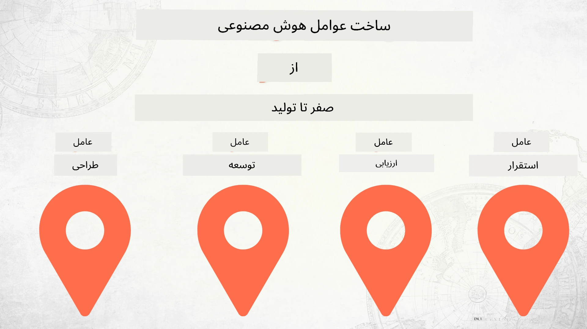

# ساخت عوامل هوش مصنوعی از صفر تا تولید



### 🌐 پشتیبانی چندزبانه

#### پشتیبانی از طریق GitHub Action (خودکار و همیشه به‌روز)

<!-- CO-OP TRANSLATOR LANGUAGES TABLE START -->
[Arabic](../ar/README.md) | [Bengali](../bn/README.md) | [Bulgarian](../bg/README.md) | [Burmese (Myanmar)](../my/README.md) | [Chinese (Simplified)](../zh-CN/README.md) | [Chinese (Traditional, Hong Kong)](../zh-HK/README.md) | [Chinese (Traditional, Macau)](../zh-MO/README.md) | [Chinese (Traditional, Taiwan)](../zh-TW/README.md) | [Croatian](../hr/README.md) | [Czech](../cs/README.md) | [Danish](../da/README.md) | [Dutch](../nl/README.md) | [Estonian](../et/README.md) | [Finnish](../fi/README.md) | [French](../fr/README.md) | [German](../de/README.md) | [Greek](../el/README.md) | [Hebrew](../he/README.md) | [Hindi](../hi/README.md) | [Hungarian](../hu/README.md) | [Indonesian](../id/README.md) | [Italian](../it/README.md) | [Japanese](../ja/README.md) | [Kannada](../kn/README.md) | [Khmer](../km/README.md) | [Korean](../ko/README.md) | [Lithuanian](../lt/README.md) | [Malay](../ms/README.md) | [Malayalam](../ml/README.md) | [Marathi](../mr/README.md) | [Nepali](../ne/README.md) | [Nigerian Pidgin](../pcm/README.md) | [Norwegian](../no/README.md) | [Persian (Farsi)](./README.md) | [Polish](../pl/README.md) | [Portuguese (Brazil)](../pt-BR/README.md) | [Portuguese (Portugal)](../pt-PT/README.md) | [Punjabi (Gurmukhi)](../pa/README.md) | [Romanian](../ro/README.md) | [Russian](../ru/README.md) | [Serbian (Cyrillic)](../sr/README.md) | [Slovak](../sk/README.md) | [Slovenian](../sl/README.md) | [Spanish](../es/README.md) | [Swahili](../sw/README.md) | [Swedish](../sv/README.md) | [Tagalog (Filipino)](../tl/README.md) | [Tamil](../ta/README.md) | [Telugu](../te/README.md) | [Thai](../th/README.md) | [Turkish](../tr/README.md) | [Ukrainian](../uk/README.md) | [Urdu](../ur/README.md) | [Vietnamese](../vi/README.md)

> **ترجیح می‌دهید به صورت محلی کلون کنید؟**
>
> این مخزن بیش از ۵۰ ترجمه زبان دارد که حجم دانلود را به طور قابل توجهی افزایش می‌دهد. برای کلون بدون ترجمه‌ها، از sparse checkout استفاده کنید:
>
> **Bash / macOS / Linux:**
> ```bash
> git clone --filter=blob:none --sparse https://github.com/microsoft/Building-AI-Agents-From-Zero-To-Production.git
> cd Building-AI-Agents-From-Zero-To-Production
> git sparse-checkout set --no-cone '/*' '!translations' '!translated_images'
> ```
>
> **CMD (ویندوز):**
> ```cmd
> git clone --filter=blob:none --sparse https://github.com/microsoft/Building-AI-Agents-From-Zero-To-Production.git
> cd Building-AI-Agents-From-Zero-To-Production
> git sparse-checkout set --no-cone "/*" "!translations" "!translated_images"
> ```
>
> این به شما همه چیز لازم برای تکمیل دوره با دانلود بسیار سریع‌تر را می‌دهد.
<!-- CO-OP TRANSLATOR LANGUAGES TABLE END -->

## دوره‌ای که اصول چرخه عمر توسعه عوامل هوش مصنوعی را به شما آموزش می‌دهد

[](https://github.com/microsoft/Building-AI-Agents-From-Zero-To-Production/blob/master/LICENSE?WT.mc_id=academic-105485-koreyst)
[](https://GitHub.com/microsoft/Building-AI-Agents-From-Zero-To-Production/graphs/contributors/?WT.mc_id=academic-105485-koreyst)
[](https://GitHub.com/microsoft/Building-AI-Agents-From-Zero-To-Production/issues/?WT.mc_id=academic-105485-koreyst)
[](https://GitHub.com/microsoft/Building-AI-Agents-From-Zero-To-Production/pulls/?WT.mc_id=academic-105485-koreyst)
[](http://makeapullrequest.com?WT.mc_id=academic-105485-koreyst)

[](https://discord.gg/Kuaw3ktsu6)

## 🌱 شروع به کار

این دوره درس‌هایی درباره اصول ساخت و استقرار عوامل هوش مصنوعی دارد.

هر درس بر درس قبلی بنا شده است، پس توصیه می‌کنیم از ابتدا شروع کرده و تا پایان پیش بروید.

اگر می‌خواهید بیشتر درباره موضوعات عوامل هوش مصنوعی کاوش کنید، می‌توانید دوره [AI Agents For Beginners Course](https://aka.ms/ai-agents-beginners) را بررسی کنید.

### ملاقات با دیگر یادگیرندگان، پاسخ به سوالات شما

اگر به مشکلی خوردید یا سوالی درباره ساخت عوامل هوش مصنوعی داشتید، به کانال دیسکورد اختصاصی ما در [Microsoft Foundry Discord](https://discord.gg/Kuaw3ktsu6) بپیوندید.

### موارد مورد نیاز شما


هر درس نمونه کد مخصوص به خود را دارد که می‌توانید به صورت محلی اجرا کنید. می‌توانید این مخزن را [فورک کنید](https://github.com/microsoft/Building-AI-Agents-From-Zero-To-Production/fork) تا نسخه خودتان را بسازید.

این دوره در حال حاضر از موارد زیر استفاده می‌کند:

- [Microsoft Agent Framework (MAF)](https://aka.ms/ai-agents-beginners/agent-framework)
- [Microsoft Foundry](https://azure.microsoft.com/products/ai-foundry) — پروژه‌ای با مدلی از سری **GPT-5** مستقر (مثلاً `gpt-5.1`). لطفاً از مدل‌های بازنشسته GPT-4o / GPT-4.1 استفاده نکنید.
- [Azure OpenAI Service](https://azure.microsoft.com/products/ai-foundry/models/openai)
- [Azure CLI](https://learn.microsoft.com/cli/azure/authenticate-azure-cli?view=azure-cli-latest) — قبل از اجرای هر نمونه با `az login` وارد شوید
- **Python 3.12 یا جدیدتر**

لطفاً قبل از شروع مطمئن شوید به این سرویس‌ها دسترسی دارید.

> **💰 هزینه و پاکسازی.** درس‌های عملی منابع واقعی Azure ایجاد می‌کنند — پروژه Microsoft Foundry،
> استقرار مدل، فروشگاه برداری، و (در دروس ۴–۶) عوامل میزبانی شده و جعبه‌ابزارها.
> این‌ها می‌توانند تا زمانی که وجود دارند هزینه داشته باشند. وقتی درس یا کل دوره را تمام کردید،
> منابعی که دیگر نیاز ندارید را حذف کنید. ساده‌ترین روش این است که همه چیز را در یک گروه منبع اختصاصی قرار دهید
> و وقتی تمام شد آن گروه را پاک کنید:
>
> ```bash
> az group delete --name <your-resource-group> --yes --no-wait
> ```
>
> همچنین می‌توانید عوامل، فروشگاه‌های برداری، و جعبه‌ابزارهای جداگانه را از پرتال Foundry حذف کنید.

> **توجه درباره مدل‌ها.** این دوره همه مدل‌ها را از طریق **Microsoft Foundry** ارائه می‌دهد. این دوره از *GitHub Models* استفاده نمی‌کند، که در
> تاریخ **۳۰ ژوئیه ۲۰۲۶** بازنشسته می‌شود — Microsoft Foundry مسیر رسمی مهاجرت است. اگر کد قدیمی دارید که از GitHub Models استفاده می‌کند،
> آن را به جای آن به استقرار یک مدل Foundry اشاره دهید.


## 🗃️ دروس

| **درس**         | **توضیح**                                                                                  |
|--------------------|--------------------------------------------------------------------------------------------------|
| [طراحی عامل](./lesson-1-agent-design/README.md)       | مقدمه‌ای بر مورد استفاده "آموزش توسعه‌دهنده" ما برای عامل و نحوه طراحی عوامل مؤثر  |
| [توسعه عامل](./lesson-2-agent-development/README.md)  | با استفاده از Microsoft Agent Framework (MAF)، مجموعه‌ای از عوامل تخصصی برای کمک به آموزش توسعه‌دهندگان جدید بسازید.       |
| [ارزیابی عوامل](./lesson-3-agent-evals/README.md)  | با استفاده از Microsoft Foundry، بررسی کنید که عوامل هوش مصنوعی ما چقدر خوب عمل می‌کنند و چگونه آن‌ها را بهتر کنید. |
| [استقرار عامل](./lesson-4-agentdeployment/README.md)   | با استفاده از عوامل میزبانی شده در Microsoft Foundry و OpenAI ChatKit، نحوه استقرار یک عامل هوش مصنوعی در محیط تولید را ببینید.       |
| [عوامل میزبانی شده در تولید](./lesson-5-hosted-agents-production/README.md)   | یک عامل میزبانی شده را به تولید سازمانی ببرید: عوامل میزبانی شده در مقابل میزبان‌های قابلیت، ذخیره‌سازی، حافظه، و حاکمیت خود را به همراه داشته باشید.       |
| [جعبه‌ابزار مایکروسافت](./lesson-6-toolbox/README.md)   | ابزارها را یک بار تعریف کنید و به صورت مرکزی مدیریت کنید: یک جعبه‌ابزار بسازید، از طریق یک نقطه پایان MCP آن را برای عامل مصرف کنید، و نسخه‌بندی امن ابزارها.       |
| [چندعامله‌ای و A2A](./lesson-7-multi-agent-a2a/README.md)   | عوامل را به عنوان خدمات شبکه‌ای ترکیب کنید: یک عامل را از طریق پروتکل باز عامل به عامل (A2A) قرار دهید و یک عامل از راه دور را به عنوان همتا مصرف کنید.       |


## 🎒 دوره‌های دیگر

تیم ما دوره‌های دیگری نیز تولید می‌کند! این‌ها را بررسی کنید:

<!-- CO-OP TRANSLATOR OTHER COURSES START -->
### LangChain
[](https://aka.ms/langchain4j-for-beginners)
[](https://aka.ms/langchainjs-for-beginners?WT.mc_id=m365-94501-dwahlin)
[](https://github.com/microsoft/langchain-for-beginners?WT.mc_id=m365-94501-dwahlin)
---

### Azure / Edge / MCP / Agents
[](https://github.com/microsoft/AZD-for-beginners?WT.mc_id=academic-105485-koreyst)
[](https://github.com/microsoft/edgeai-for-beginners?WT.mc_id=academic-105485-koreyst)
[](https://github.com/microsoft/mcp-for-beginners?WT.mc_id=academic-105485-koreyst)
[](https://github.com/microsoft/ai-agents-for-beginners?WT.mc_id=academic-105485-koreyst)

---
 
### سری هوش مصنوعی مولد

[](https://github.com/microsoft/generative-ai-for-beginners?WT.mc_id=academic-105485-koreyst)
[-9333EA?style=for-the-badge&labelColor=E5E7EB&color=9333EA)](https://github.com/microsoft/Generative-AI-for-beginners-dotnet?WT.mc_id=academic-105485-koreyst)
[-C084FC?style=for-the-badge&labelColor=E5E7EB&color=C084FC)](https://github.com/microsoft/generative-ai-for-beginners-java?WT.mc_id=academic-105485-koreyst)
[-E879F9?style=for-the-badge&labelColor=E5E7EB&color=E879F9)](https://github.com/microsoft/generative-ai-with-javascript?WT.mc_id=academic-105485-koreyst)

---
 
### یادگیری اصلی
[](https://aka.ms/ml-beginners?WT.mc_id=academic-105485-koreyst)
[](https://aka.ms/datascience-beginners?WT.mc_id=academic-105485-koreyst)
[](https://aka.ms/ai-beginners?WT.mc_id=academic-105485-koreyst)
[](https://github.com/microsoft/Security-101?WT.mc_id=academic-96948-sayoung)
[](https://aka.ms/webdev-beginners?WT.mc_id=academic-105485-koreyst)
[](https://aka.ms/iot-beginners?WT.mc_id=academic-105485-koreyst)
[](https://github.com/microsoft/xr-development-for-beginners?WT.mc_id=academic-105485-koreyst)

---
 
### مجموعه Copilot
[](https://aka.ms/GitHubCopilotAI?WT.mc_id=academic-105485-koreyst)
[](https://github.com/microsoft/mastering-github-copilot-for-dotnet-csharp-developers?WT.mc_id=academic-105485-koreyst)
[](https://github.com/microsoft/CopilotAdventures?WT.mc_id=academic-105485-koreyst)
<!-- CO-OP TRANSLATOR OTHER COURSES END -->

## مشارکت

این پروژه استقبال می‌کند از مشارکت‌ها و پیشنهادات. بیشتر مشارکت‌ها نیازمند آن است که با
توافق‌نامه مجوز مشارکت‌کننده (CLA) موافقت کنید که اعلام می‌کند شما حق دارید و در واقع به ما اجازه می‌دهید
تا از مشارکت شما استفاده کنیم. برای جزئیات به <https://cla.opensource.microsoft.com> مراجعه کنید.

هنگامی که درخواست کشش (pull request) ارسال می‌کنید، یک ربات CLA به طور خودکار تعیین می‌کند که آیا باید
یک توافق‌نامه CLA ارائه دهید و درخواست کشش را به صورت مناسب علامت‌گذاری می‌کند (مثلاً بررسی وضعیت، نظر).
کافی است دستورالعمل‌های ارائه شده توسط ربات را دنبال کنید. شما فقط یک بار برای همه مخازن که از CLA ما استفاده می‌کنند باید این کار را انجام دهید.

این پروژه کد رفتار منبع باز مایکروسافت را اتخاذ کرده است [Microsoft Open Source Code of Conduct](https://opensource.microsoft.com/codeofconduct/).
برای اطلاعات بیشتر، بخش سوالات متداول کد رفتار [Code of Conduct FAQ](https://opensource.microsoft.com/codeofconduct/faq/) را ببینید یا
با [opencode@microsoft.com](mailto:opencode@microsoft.com) تماس بگیرید برای هر سوال یا نظر اضافی.

## علائم تجاری

این پروژه ممکن است شامل علائم تجاری یا لوگوهایی برای پروژه‌ها، محصولات یا خدمات باشد. استفاده مجاز از علائم تجاری یا لوگوهای مایکروسافت
مشروط بر این است که مطابق با
[راهنمای علائم تجاری و برند مایکروسافت](https://www.microsoft.com/legal/intellectualproperty/trademarks/usage/general) باشد.
استفاده از علائم تجاری یا لوگوهای مایکروسافت در نسخه‌های تغییر یافته این پروژه نباید باعث سردرگمی شود یا به معنای حمایت مایکروسافت باشد.
هرگونه استفاده از علائم تجاری یا لوگوی شخص ثالث تحت سیاست‌های آن اشخاص است.

## دریافت کمک

اگر در ساخت برنامه‌های هوش مصنوعی گیر کردید یا سوالی داشتید، بپیوندید به:

[](https://discord.gg/Kuaw3ktsu6)

اگر بازخورد محصول یا خطایی هنگام ساخت داشتید به:

[](https://aka.ms/foundry/forum)

---

<!-- CO-OP TRANSLATOR DISCLAIMER START -->
**سلب مسئولیت**:
این سند با استفاده از سرویس ترجمه هوش مصنوعی [Co-op Translator](https://github.com/Azure/co-op-translator) ترجمه شده است. در حالی که ما در تلاش برای دقت هستیم، لطفاً توجه داشته باشید که ترجمه‌های خودکار ممکن است شامل خطاها یا نادرستی‌هایی باشند. سند اصلی به زبان مادری خود باید به عنوان منبع معتبر در نظر گرفته شود. برای اطلاعات حیاتی، ترجمه حرفه‌ای انسانی توصیه می‌شود. ما در قبال هرگونه سوء تفاهم یا برداشت نادرست ناشی از استفاده از این ترجمه مسئولیتی نداریم.
<!-- CO-OP TRANSLATOR DISCLAIMER END -->