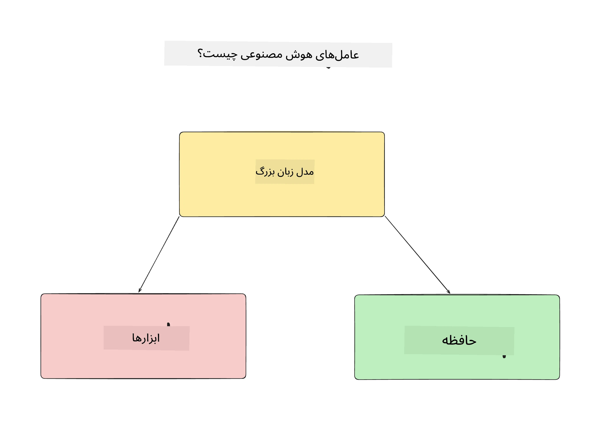
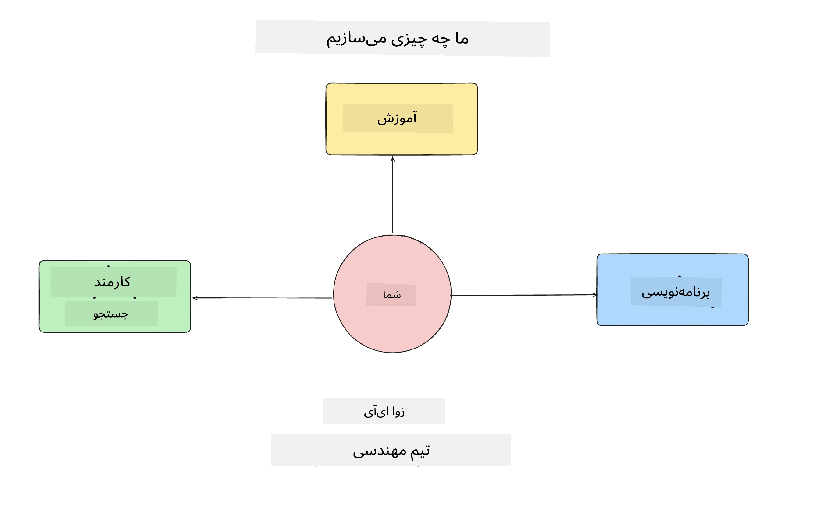
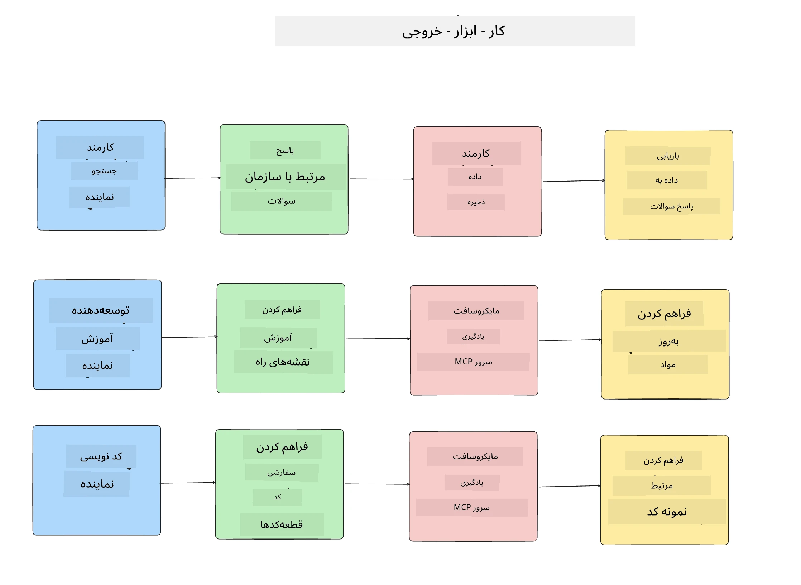
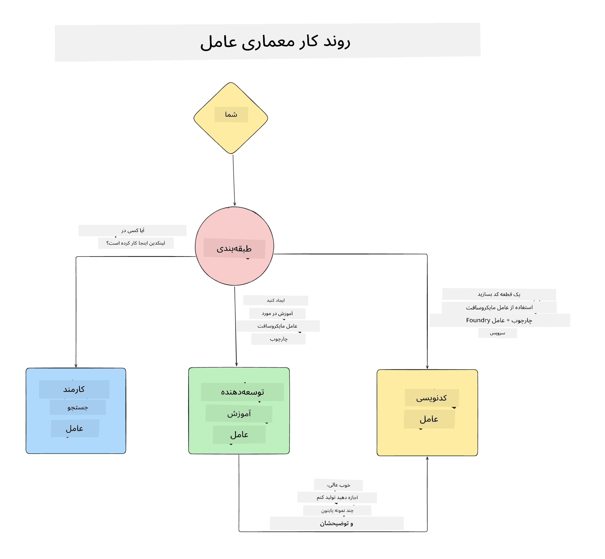

# درس ۱: طراحی عامل هوش مصنوعی

خوش آمدید به اولین درس از دوره‌ی «ساخت عامل هوش مصنوعی از صفر تا تولید»!

در این درس موارد زیر را پوشش خواهیم داد:

- تعریف اینکه عوامل هوش مصنوعی چه هستند
  
- بحث در مورد برنامه عامل هوش مصنوعی که ما می‌سازیم  

- شناسایی ابزارها و خدمات مورد نیاز برای هر عامل
  
- معماری برنامه عامل خود را طراحی کنیم
  
بیایید با تعریف اینکه عامل چیست و چرا ممکن است در یک برنامه از آن استفاده کنیم شروع کنیم.

> **قبل از شروع دوره.** این اولین درس مفهومی است — هیچ کدی برای اجرا وجود ندارد.
> از [درس ۲](../lesson-2-agent-development/README.md) به بعد شما نیاز دارید به: یک **اشتراک آزور**
> با دسترسی به **Microsoft Foundry**، یک مدل سری **GPT-5** مستقر شده (برای مثال `gpt-5.1` — از GPT-4o / GPT-4.1 بازنشسته شده اجتناب کنید)، **پایتون ۳.۱۲+** و **ابزار خط فرمان آزور**
> (`az login`). برای فهرست کامل و پیوندها به [آنچه نیاز دارید](../README.md#what-you-need) در پرونده README دوره مراجعه کنید.

## عوامل هوش مصنوعی چیستند؟

اگر این اولین بار است که به کاوش در نحوه ساخت یک عامل هوش مصنوعی می‌پردازید، ممکن است سؤال داشته باشید که دقیقاً یک عامل هوش مصنوعی چیست.

برای یک تعریف ساده از عامل هوش مصنوعی، آن را از اجزایی که آن را می‌سازند تعریف می‌کنیم:

**مدل زبان بزرگ** - LLM قدرت هم توانایی پردازش زبان طبیعی از سمت کاربر برای تفسیر کاری که می‌خواهند انجام دهند را دارد و هم توصیف ابزارهای در دسترس برای انجام آن وظایف.

**ابزارها** - این‌ها توابع، APIها، مخازن داده و سایر خدماتی هستند که LLM می‌تواند برای انجام وظایف درخواستی از سمت کاربر انتخاب کند.

**حافظه** - این نحوه ذخیره تعامل‌های کوتاه مدت و بلند مدت بین عامل هوش مصنوعی و کاربر است. ذخیره و بازیابی این اطلاعات برای بهبودها و حفظ ترجیحات کاربر در طول زمان مهم است.

## مورد استفاده عامل هوش مصنوعی ما

برای این دوره، قصد داریم برنامه‌ای عامل هوش مصنوعی بسازیم که به توسعه‌دهندگان جدید کمک می‌کند به تیم توسعه عامل هوش مصنوعی ما ملحق شوند!

قبل از انجام هر گونه توسعه، اولین گام برای ایجاد یک برنامه عامل هوش مصنوعی موفق، تعریف سناریوهای واضح است که انتظار داریم کاربران ما چگونه با عوامل هوش مصنوعی ما کار کنند.

برای این برنامه، ما با این سناریوها کار خواهیم کرد:

**سناریو ۱**: یک کارمند جدید به سازمان ما ملحق شده و می‌خواهد درباره تیمی که به آن پیوسته و نحوه اتصال با آن‌ها اطلاعات بیشتری کسب کند.

**سناریو ۲:** یک کارمند جدید می‌خواهد بداند بهترین کار اول برای شروع چیست.

**سناریو ۳:** یک کارمند جدید می‌خواهد منابع آموزشی و نمونه‌های کد جمع‌آوری کند تا به شروع کار روی این وظیفه کمک کند.

## شناسایی ابزارها و خدمات

حال که این سناریوها را تعریف کرده‌ایم، مرحله بعدی اتصال آن‌ها به ابزارها و خدماتی است که عوامل هوش مصنوعی ما برای انجام این وظایف به آن نیاز خواهند داشت.

این فرآیند در دسته مهندسی زمینه قرار می‌گیرد زیرا تمرکز ما بر این است که عوامل هوش مصنوعی ما زمینه‌ی مناسب را در زمان مناسب برای انجام وظایف داشته باشند.

بیایید این کار را سناریو به سناریو انجام دهیم و با طراحی خوب عاملی هر وظیفه عامل، ابزارها و نتایج مورد انتظار را فهرست کنیم.

### سناریو ۱ - عامل جستجوی کارکنان

**وظیفه** - پاسخ به سوالات درباره کارکنان سازمان مانند تاریخ پیوستن، تیم فعلی، محل و آخرین موقعیت شغلی.

**ابزارها** - پایگاه داده فهرست کارکنان فعلی و نمودار سازمانی

**نتایج** - توانایی بازیابی اطلاعات از پایگاه داده برای پاسخ به سوالات عمومی سازمان و سوالات خاص درباره کارکنان.

### سناریو ۲ - عامل توصیه وظیفه

**وظیفه** - بر اساس تجربه توسعه‌دهنده کارمند جدید، ارائه ۱ تا ۳ مسئله که کارمند جدید می‌تواند روی آن‌ها کار کند.

**ابزارها** - سرور MCP گیت‌هاب برای گرفتن مسائل باز و ایجاد پروفایل توسعه‌دهنده

**نتایج** - توانایی خواندن ۵ کامیت آخر یک پروفایل گیت‌هاب و مسائل باز در یک پروژه گیت‌هاب و ارائه توصیه‌ها بر اساس تطبیق

### سناریو ۳ - عامل دستیار کد

**وظیفه** - بر اساس مسائل باز که توسط عامل «توصیه وظیفه» پیشنهاد شده، تحقیق و ارائه منابع و تولید قطعات کدی برای کمک به کارمند.

**ابزارها** - سرور Learn MCP مایکروسافت برای یافتن منابع و مفسر کد برای تولید قطعات کد سفارشی.

**نتایج** - اگر کاربر درخواست کمک بیشتر کند، جریان کار باید از سرور Learn MCP برای ارائه پیوندها و قطعات به منابع استفاده کند و سپس به عامل مفسر کد برای تولید قطعات کوچک کد با توضیحات واگذار کند.

## معماری برنامه عامل ما

حال که هر یک از عوامل خود را تعریف کرده‌ایم، بیایید یک نمودار معماری ایجاد کنیم که به ما کمک کند بفهمیم هر عامل چگونه به صورت جداگانه و با هم بسته به وظیفه کار خواهد کرد:

## مراحل بعدی

حال که طراحی هر عامل و سیستم عاملی خود را انجام داده‌ایم، بیایید به درس بعدی برویم که در آن هر یک از این عوامل را توسعه خواهیم داد!

---

<!-- CO-OP TRANSLATOR DISCLAIMER START -->
**سلب مسئولیت**:
این سند با استفاده از سرویس ترجمه هوش مصنوعی [Co-op Translator](https://github.com/Azure/co-op-translator) ترجمه شده است. در حالی که ما در تلاش برای دقت هستیم، لطفاً توجه داشته باشید که ترجمه‌های خودکار ممکن است شامل خطاها یا نادرستی‌هایی باشند. سند اصلی به زبان مادری خود باید به عنوان منبع معتبر در نظر گرفته شود. برای اطلاعات حیاتی، ترجمه حرفه‌ای انسانی توصیه می‌شود. ما در قبال هرگونه سوء تفاهم یا برداشت نادرست ناشی از استفاده از این ترجمه مسئولیتی نداریم.
<!-- CO-OP TRANSLATOR DISCLAIMER END -->