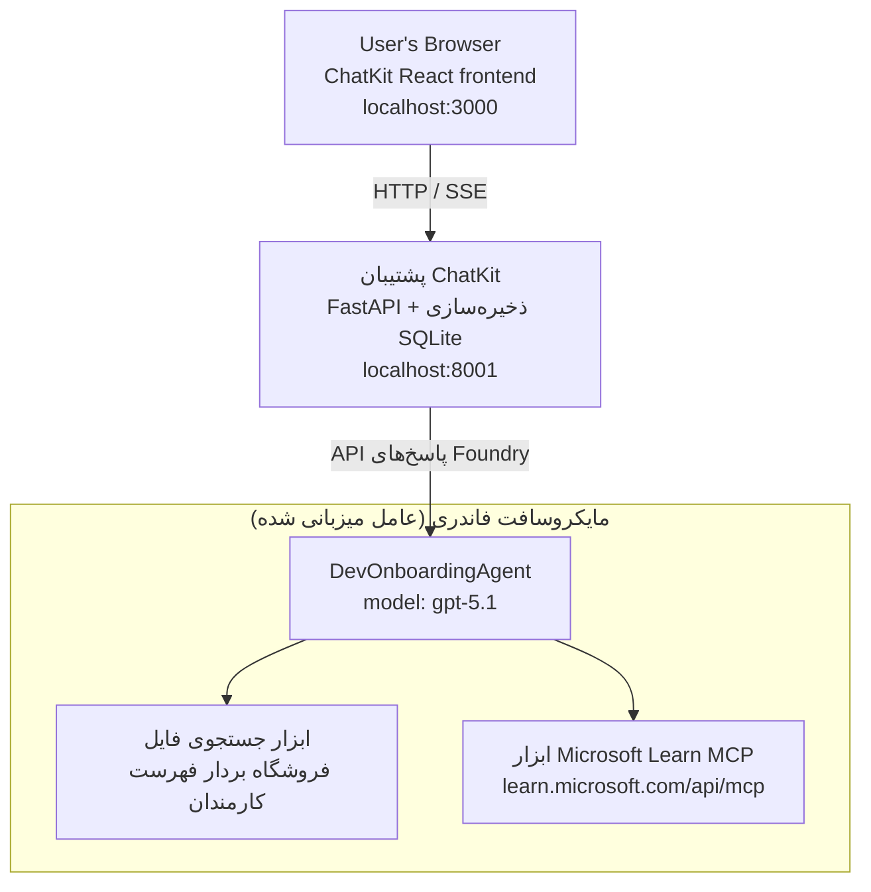

# درس ۴: استقرار عامل با استفاده از Microsoft Foundry Hosted Agents + ChatKit

این درس نشان می‌دهد چگونه یک عامل استفاده‌کننده از ابزار را به‌عنوان یک عامل میزبانی‌شده در Microsoft Foundry مستقر کرده و یک رابط کاربری مبتنی بر ChatKit برای تعامل با آن ایجاد کنیم.

## معماری

عامل میزبانی‌شده یک **عامل `DevOnboardingAgent` واحد** است (که روی `gpt-5.1` اجرا می‌شود) که به سوالات ورود توسعه‌دهنده پاسخ می‌دهد و از دو ابزار میزبانی‌شده استفاده می‌کند: یک ابزار **جستجوی فایل** روی فروشگاه برداری employee-directory و ابزار **Microsoft Learn MCP**. یک رابط React ChatKit با بک‌اند FastAPI ارتباط دارد که عامل را از طریق **Responses API** Foundry فراخوانی می‌کند.



## پیش‌نیازها

۱. **پروژه Microsoft Foundry** در منطقه North Central US
۲. **Azure CLI** احراز هویت شده (`az login`)
۳. نصب شده بودن **Azure Developer CLI** (`azd`)
۴. **Python 3.12+** و **Node.js 18+**
۵. ایجاد **فروشگاه برداری** با داده‌های کارمندان

## شروع سریع

### ۱. تنظیم متغیرهای محیطی

```bash
cd lesson-4-agentdeployment
cp .env.example .env
# فایل .env را با جزئیات پروژه Microsoft Foundry خود ویرایش کنید
```

### ۲. استقرار عامل میزبانی‌شده

**گزینه A: استفاده از Azure Developer CLI (توصیه شده)**

```bash
cd hosted-agent
azd auth login
azd agent deploy
```

**گزینه B: استفاده از Docker + Azure Container Registry**

```bash
cd hosted-agent

# ساخت کانتینر
docker build -t developer-onboarding-agent:latest .

# برچسب برای ACR
docker tag developer-onboarding-agent:latest <your-acr>.azurecr.io/developer-onboarding-agent:latest

# ارسال به ACR
az acr login --name <your-acr>
docker push <your-acr>.azurecr.io/developer-onboarding-agent:latest

# استقرار از طریق پورتال Microsoft Foundry یا SDK
```

### ۳. راه‌اندازی بک‌اند ChatKit

```bash
cd chatkit-server
python -m venv .venv
source .venv/bin/activate  # در ویندوز: .venv\Scripts\activate
pip install -r requirements.txt
python app.py
```

سرور روی `http://localhost:8001` شروع به کار خواهد کرد

### ۴. راه‌اندازی فرانت‌اند ChatKit

```bash
cd chatkit-server/frontend
npm install
npm run dev
```

فرانت‌اند روی `http://localhost:3000` شروع به کار خواهد کرد

### ۵. تست برنامه

`http://localhost:3000` را در مرورگر خود باز کنید و این پرسش‌ها را امتحان کنید:

**جستجوی کارمند:**
- "من تازه وارد هستم! آیا کسی قبلاً در مایکروسافت کار کرده است؟"
- "چه کسی تجربه کار با Azure Functions را دارد؟"

**منابع یادگیری:**
- "یک مسیر یادگیری برای Kubernetes ایجاد کن"
- "چه گواهینامه‌هایی باید برای معماری ابری دنبال کنم؟"

**کمک کدنویسی:**
- "کمکم کن کد پایتون برای اتصال به CosmosDB بنویسم"
- "نشانم بده چطور یک Azure Function بسازم"

**پرسش‌های چندعاملی:**
- "من به‌عنوان مهندس ابری شروع می‌کنم. با چه کسی باید ارتباط برقرار کنم و چه چیزهایی باید یاد بگیرم؟"

## ساختار پروژه

```
lesson-4-agentdeployment/
├── .env.example                 # Environment variables template
├── implementation-plan.md       # Detailed implementation guide
├── README.md                    # This file
├── hosted-agent/               # Microsoft Foundry hosted agent
│   ├── main.py                 # Multi-agent workflow implementation
│   ├── requirements.txt        # Python dependencies
│   ├── Dockerfile              # Container definition
│   └── agent.yaml              # Agent deployment configuration
└── chatkit-server/             # ChatKit server application
    ├── app.py                  # FastAPI backend
    ├── store.py                # SQLite persistence layer
    ├── requirements.txt        # Python dependencies
    └── frontend/               # React frontend
        ├── package.json
        ├── vite.config.ts
        ├── tsconfig.json
        ├── index.html
        └── src/
            ├── main.tsx
            ├── App.tsx
            ├── App.css
            └── index.css
```

## عامل و ابزارهای آن

عامل میزبانی‌شده یک **عامل واحد** است (`DevOnboardingAgent`، تعریف‌شده در `hosted-agent/main.py`) که سه حوزه ورود به سازمان را مدیریت می‌کند. به‌جای هماهنگ‌سازی زیرعامل‌های جداگانه، هر قابلیت را به‌عنوان یک ابزار ارائه می‌دهد (یا مستقیماً به مدل متکی است):

| قابلیت | چگونه مدیریت می‌شود | ابزار |
|-----------|------------------|------|
| **جستجو و ارتباطات کارمندی** | جستجوی فایل میزبانی‌شده توسط Foundry روی فروشگاه برداری employee-directory | `client.get_file_search_tool(vector_store_ids=[...])` |
| **یادگیری و آموزش** | سرور Microsoft Learn MCP (ابزار MCP میزبانی‌شده) | `client.get_mcp_tool(url="https://learn.microsoft.com/api/mcp")` |
| **کمک کدنویسی** | مستقیماً توسط مدل `gpt-5.1` مدیریت می‌شود — بدون ابزار خارجی | — |


عامل با `client.as_agent(name="DevOnboardingAgent", instructions=..., tools=[file_search_tool, learn_mcp_tool])` ساخته شده و با `from_agent_framework(agent).run()` اجرا می‌شود.

> **یادداشت طراحی.** پیش‌نویس‌های اولیه این درس از یک جریان کاری چندعاملی `HandoffBuilder` (تفکیک → متخصصان) استفاده می‌کردند. عامل ارائه شده یک عامل تک-ابزاری است که ساده‌تر برای پیاده‌سازی و درک در پرسش‌وپاسخ‌های ورود به سیستم است. برای نمونه‌ای از هماهنگی چندعاملی و انتقال‌ها به درس ۲ و درس ۳ مراجعه کنید.

## آزمون دود برای عامل میزبانی شده (دروازه CI)

استقرار یک عامل میزبانی شده "موفق" فقط ثابت می‌کند که صفحه کنترل تعریف را پذیرفته است —
این **ثابت نمی‌کند** عامل واقعاً پاسخ می‌دهد. کمبود وابستگی،
مسیر‌یابی نامناسب مدل، یا اتصال منقضی شده می‌تواند عاملی سبز اما خاموش باقی بگذارد.

این درس یک **آزمون دود** سبک‌وزن ارائه می‌دهد که به عنوان یک دروازه سریع و ارزان پس از استقرار عمل می‌کند.
از اکشن GitHub [AI Smoke Test](https://github.com/marketplace/actions/ai-smoke-test)
برای ارسال درخواست‌ها به نقطه پایان **Responses** فاندری عامل استفاده می‌کند
(`POST {project_endpoint}/agents/{agent_name}/endpoint/protocols/openai/responses`)
و روی متن بازگشتی احراز هویت می‌کند. این روش خطاهای استقرار، پسرفت‌های احراز هویت،
تغییر سیستم-پرومپت، و خرابی موضوع‌بندی را در چند ثانیه تشخیص می‌دهد.

> آزمون‌های دود جایگزین ارزیابی‌های کامل در
> [درس ۳](../lesson-3-agent-evals/README.md) نیستند — بلکه مکمل آن‌ها هستند. آزمون‌های دود
> پاسخ می‌دهند به *"آیا عامل قابل دسترسی، پاسخگو و دنبال‌کننده انتظارات پایه پرومپت است؟"*؛
> ارزیابی‌ها پاسخ می‌دهند به *"پاسخ چقدر خوب است؟"*. دروازه ارزان را روی هر استقرار اجرا کنید.

### چه مواردی آزمون داده می‌شوند

فهرست در [`hosted-agent/tests/smoke-tests.json`](../../../lesson-4-agentdeployment/hosted-agent/tests/smoke-tests.json)
قرار دارد و سه حوزه عامل به‌علاوه رعایت پرومپت و موضوع‌بندی چندگانه را آزمایش می‌کند:

| آزمون | آنچه تایید می‌کند |
|------|------------------|
| `reachability` | عامل با متن غیرخالی و مرتبط پاسخ می‌دهد |
| `employee-search` | حوزه جستجوی فایل پاسخ سالم `200` می‌دهد (پاسخ به داده‌ها وابسته است) |
| `learning-path` | حوزه یادگیری موضوع را تکرار کرده و پاسخ به شکل مسیر تولید می‌کند |
| `coding-assistance` | حوزه کدنویسی پاسخ پایتون به شکل کد باز می‌گرداند |
| `prompt-adherence-offtopic` | درخواست خارج از موضوع هدایت می‌شود، پاسخ تفصیلی داده نمی‌شود |
| `threading-turn-1/2` | وضعیت گفتگو از طریق `previous_response_id` در طول چرخش‌ها حفظ می‌شود |

### اجرای آن در CI

جریان کاری در [`.github/workflows/smoke-test-hosted-agent.yml`](../../../.github/workflows/smoke-test-hosted-agent.yml)
دارای دو کار است:

- **`static`** — دروازه سریع بدون Azure که در هر درخواست کشش و پوشش اجرا می‌شود:
  تمام کدهای پایتون را ترجمه می‌کند (`py_compile`) و لینک‌های Markdown را بررسی می‌کند. هیچ راز
  مورد نیاز نیست، پس روی PRهای فورک هم کار می‌کند.
- **`smoke`** — آزمون دود متصل به Azure پایین. روی درخواست اجرا می‌شود
  (Actions → **Agent CI (static + smoke)** → اجرای جریان کاری) و می‌تواند بعد از جریان کاری استقرار شما
  زنجیر شود.

این **متغیرها** و **رازهای** مخزن را برای کار دود پیکربندی کنید:


| نوع | نام | مقدار |
|------|------|-------|

| متغیر | `FOUNDRY_PROJECT_ENDPOINT` | `https://<account>.services.ai.azure.com/api/projects/<project>` |
| متغیر | `HOSTED_AGENT_NAME` | نام عامل مستقر شده (مثلاً `dev-onboarding` — باید با استقرار شما مطابقت داشته باشد) |
| مخفی | `AZURE_CLIENT_ID` / `AZURE_TENANT_ID` / `AZURE_SUBSCRIPTION_ID` | هویت متصل OIDC برای `azure/login` |

هویت رانر نیاز به نقش **`Azure AI User`** در **محدوده پروژه Foundry** دارد تا بتواند
به نقاط پایانی داده پاسخ‌ها (و مکالمات) دسترسی پیدا کند. نقش را به این شکل به آن بدهید:

```bash
az role assignment create \
  --assignee <object-id-or-appId-of-runner-identity> \
  --role "Azure AI User" \
  --scope "/subscriptions/<sub>/resourceGroups/<rg>/providers/Microsoft.CognitiveServices/accounts/<account>/projects/<project>"
```

### اجرای محلی

می‌توانید همان کاتالوگ را قبل از ارسال اجرا کنید. یک توکن داده‌محور با دامنه
`https://ai.azure.com/` دریافت کرده و رانر را به استقرار خود اشاره دهید:

```bash
# مخاطب باید https://ai.azure.com/ باشد (توکن‌های cognitiveservices.azure.com رد می‌شوند)
export FOUNDRY_TOKEN=$(az account get-access-token --resource https://ai.azure.com/ --query accessToken -o tsv)

git clone https://github.com/JFolberth/ai-smoketest && cd ai-smoketest
python runner.py \
  --project-endpoint "https://<account>.services.ai.azure.com/api/projects/<project>" \
  --agent-name dev-onboarding \
  --tests-file ../lesson-4-agentdeployment/hosted-agent/tests/smoke-tests.json
```

کدهای خروج: `0` همه موفقیت‌آمیز بود، `1` یک تأیید صحت شکست خورد، `2` خطای رانر (کاتالوگ یا توکن نامعتبر).

## عیب‌یابی

### عامل پاسخگو نیست
- تأیید کنید که عامل میزبانی شده در Microsoft Foundry مستقر و در حال اجرا است
- بررسی کنید `HOSTED_AGENT_NAME` و `HOSTED_AGENT_VERSION` با استقرار شما مطابقت دارند

### خطاهای فروشگاه برداری
- مطمئن شوید که `VECTOR_STORE_ID` به درستی تنظیم شده است
- تأیید کنید که فروشگاه برداری حاوی داده‌های کارمندان است

### خطاهای احراز هویت
- اجرای `az login` برای تازه‌سازی مجوزها
- اطمینان حاصل کنید که به پروژه Microsoft Foundry دسترسی دارید

## منابع

- [مستندات عوامل میزبانی شده Microsoft Foundry](https://learn.microsoft.com/en-us/azure/ai-foundry/agents/concepts/hosted-agents)
- [چارچوب عامل مایکروسافت](https://github.com/microsoft/agent-framework)
- [نمونه ادغام ChatKit](https://github.com/microsoft/agent-framework/tree/main/python/samples/demos/chatkit-integration)
- [رابط خط فرمان توسعه‌دهنده Azure](https://learn.microsoft.com/en-us/azure/developer/azure-developer-cli/overview)
- [عملیات GitHub آزمایش اولیه هوش مصنوعی](https://github.com/marketplace/actions/ai-smoke-test)
- [آزمایش اولیه عوامل Microsoft Foundry با GitHub Actions (وبلاگ)](https://techcommunity.microsoft.com/blog/azuredevcommunityblog/smoke-test-microsoft-foundry-agents-with-github-actions/4531912)

---

## مراحل بعدی

عامل شما روی زیرساخت مدیریت‌شده توسط مایکروسافت اجرا می‌شود. برای انتقال آن به تولید سازمانی —
کنترل محل نگهداری داده‌های آن (حاکمیت داده، شبکه خصوصی، استفاده از پایگاه داده یا فضای ذخیره Azure 
Cosmos DB / Storage / AI Search شخصی‌سازی‌شده) و مدیریت ابزارهای آن — ادامه دهید به
**[درس ۵: عوامل میزبان تولید](../lesson-5-hosted-agents-production/README.md)**، که
تفاوت حیاتی بین **عوامل میزبان** و **میزبان‌های قابلیت** را توضیح می‌دهد.

---

<!-- CO-OP TRANSLATOR DISCLAIMER START -->
**سلب مسئولیت**:
این سند با استفاده از سرویس ترجمه هوش مصنوعی [Co-op Translator](https://github.com/Azure/co-op-translator) ترجمه شده است. در حالی که ما در تلاش برای دقت هستیم، لطفاً توجه داشته باشید که ترجمه‌های خودکار ممکن است شامل خطاها یا نادرستی‌هایی باشند. سند اصلی به زبان مادری خود باید به عنوان منبع معتبر در نظر گرفته شود. برای اطلاعات حیاتی، ترجمه حرفه‌ای انسانی توصیه می‌شود. ما در قبال هرگونه سوء تفاهم یا برداشت نادرست ناشی از استفاده از این ترجمه مسئولیتی نداریم.
<!-- CO-OP TRANSLATOR DISCLAIMER END -->