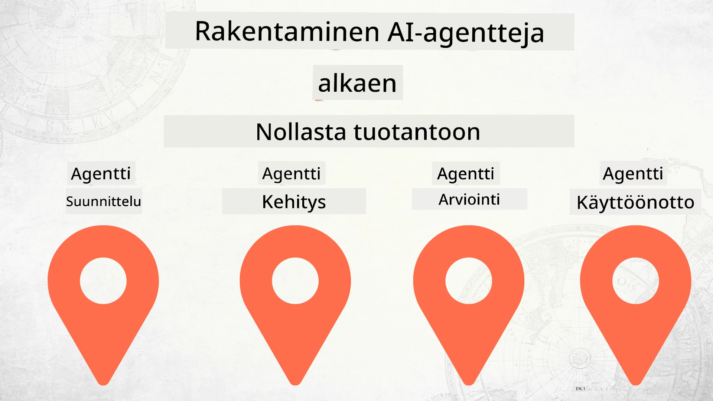

# AI-agenttien rakentaminen alusta tuotantoon



### 🌐 Monikielinen tuki

#### Tuettu GitHub Actionin kautta (Automaattinen ja aina ajan tasalla)

<!-- CO-OP TRANSLATOR LANGUAGES TABLE START -->
[Arabic](../ar/README.md) | [Bengali](../bn/README.md) | [Bulgarian](../bg/README.md) | [Burmese (Myanmar)](../my/README.md) | [Chinese (Simplified)](../zh-CN/README.md) | [Chinese (Traditional, Hong Kong)](../zh-HK/README.md) | [Chinese (Traditional, Macau)](../zh-MO/README.md) | [Chinese (Traditional, Taiwan)](../zh-TW/README.md) | [Croatian](../hr/README.md) | [Czech](../cs/README.md) | [Danish](../da/README.md) | [Dutch](../nl/README.md) | [Estonian](../et/README.md) | [Finnish](./README.md) | [French](../fr/README.md) | [German](../de/README.md) | [Greek](../el/README.md) | [Hebrew](../he/README.md) | [Hindi](../hi/README.md) | [Hungarian](../hu/README.md) | [Indonesian](../id/README.md) | [Italian](../it/README.md) | [Japanese](../ja/README.md) | [Kannada](../kn/README.md) | [Korean](../ko/README.md) | [Lithuanian](../lt/README.md) | [Malay](../ms/README.md) | [Malayalam](../ml/README.md) | [Marathi](../mr/README.md) | [Nepali](../ne/README.md) | [Nigerian Pidgin](../pcm/README.md) | [Norwegian](../no/README.md) | [Persian (Farsi)](../fa/README.md) | [Polish](../pl/README.md) | [Portuguese (Brazil)](../pt-BR/README.md) | [Portuguese (Portugal)](../pt-PT/README.md) | [Punjabi (Gurmukhi)](../pa/README.md) | [Romanian](../ro/README.md) | [Russian](../ru/README.md) | [Serbian (Cyrillic)](../sr/README.md) | [Slovak](../sk/README.md) | [Slovenian](../sl/README.md) | [Spanish](../es/README.md) | [Swahili](../sw/README.md) | [Swedish](../sv/README.md) | [Tagalog (Filipino)](../tl/README.md) | [Tamil](../ta/README.md) | [Telugu](../te/README.md) | [Thai](../th/README.md) | [Turkish](../tr/README.md) | [Ukrainian](../uk/README.md) | [Urdu](../ur/README.md) | [Vietnamese](../vi/README.md)

> **Haluatko mieluummin kloonata paikallisesti?**

> Tämä repositorio sisältää yli 50 käännöstä, mikä kasvattaa merkittävästi latauskoon. Jos haluat kloonata ilman käännöksiä, käytä sparse checkout -toimintoa:
> ```bash
> git clone --filter=blob:none --sparse https://github.com/microsoft/Building-AI-Agents-From-Zero-To-Production.git
> cd Building-AI-Agents-From-Zero-To-Production
> git sparse-checkout set --no-cone '/*' '!translations' '!translated_images'
> ```
> Tämä antaa sinulle kaiken tarvittavan kurssin suorittamiseen huomattavasti nopeammalla latauksella.
<!-- CO-OP TRANSLATOR LANGUAGES TABLE END -->

## Kurssi, joka opettaa AI-agenttien kehityssyklin perusteet

[](https://github.com/microsoft/Building-AI-Agents-From-Zero-To-Production/blob/master/LICENSE?WT.mc_id=academic-105485-koreyst)
[](https://GitHub.com/microsoft/Building-AI-Agents-From-Zero-To-Production/graphs/contributors/?WT.mc_id=academic-105485-koreyst)
[](https://GitHub.com/microsoft/Building-AI-Agents-From-Zero-To-Production/issues/?WT.mc_id=academic-105485-koreyst)
[](https://GitHub.com/microsoft/Building-AI-Agents-From-Zero-To-Production/pulls/?WT.mc_id=academic-105485-koreyst)
[](http://makeapullrequest.com?WT.mc_id=academic-105485-koreyst)

[](https://discord.gg/Kuaw3ktsu6)

## 🌱 Aloittaminen

Tällä kurssilla käsitellään AI-agenttien rakentamisen ja käyttöönoton perusteet.

Jokainen oppitunti rakentuu edellisen päälle, joten suosittelemme aloittamaan alusta ja etenemään loppuun.

Jos haluat tutustua AI-agenttien aiheisiin laajemmin, voit tutustua [AI Agents For Beginners -kurssiin](https://aka.ms/ai-agents-beginners).

### Tapaa muita oppijoita, saa vastauksia kysymyksiisi

Jos jäät jumiin tai sinulla on kysyttävää AI-agenttien rakentamisesta, liity omalle Discord-kanavallemme osoitteessa [Microsoft Foundry Discord](https://discord.gg/Kuaw3ktsu6).

### Mitä tarvitset

Jokaisella oppitunnilla on oma koodinäyte, jonka voit suorittaa paikallisesti. Voit [forkata tämän repositorion](https://github.com/microsoft/Building-AI-Agents-From-Zero-To-Production/fork) luodaksesi oman kopion.

Tällä hetkellä kurssi käyttää seuraavia:

- [Microsoft Agent Framework (MAF)](https://aka.ms/ai-agents-beginners/agent-framework)
- [Microsoft Foundry](https://azure.microsoft.com/products/ai-foundry)
- [Azure OpenAI Service](https://azure.microsoft.com/products/ai-foundry/models/openai)
- [Azure CLI](https://learn.microsoft.com/cli/azure/authenticate-azure-cli?view=azure-cli-latest)

Varmista, että sinulla on pääsy näihin palveluihin ennen aloittamista.

Lisävaihtoehtoja mallien isännöinnissä ja palveluissa tulossa pian.

## 🗃️ Oppitunnit

| **Oppitunti**             | **Kuvaus**                                                                                     |
|--------------------------|------------------------------------------------------------------------------------------------|
| [Agent Design](./lesson-1-agent-design/README.md)         | Johdanto "Developer Onboarding" -agentin käyttötapaukseen ja tehokkaiden agenttien suunnitteluun |
| [Agent Development](./lesson-2-agent-development/README.md)    | Microsoft Agent Frameworkin (MAF) avulla luodaan 3 agenttia auttamaan uusia kehittäjiä alkuun.   |
| [Agent Evaluations](./lesson-3-agent-evals/README.md)      | Microsoft Foundryn avulla selvitetään, miten AI-agenttimme toimivat ja miten niitä voidaan parantaa. |
| [Agent Deployment](./lesson-4-agent-deployment/README.md)      | Käyttämällä Hosted Agentsia ja OpenAI Chatkitia, nähdään miten AI-agentti otetaan käyttöön tuotannossa. |


## 🎒 Muut kurssit

Tiimimme tuottaa myös muita kursseja! Tutustu:

<!-- CO-OP TRANSLATOR OTHER COURSES START -->
### LangChain
[](https://aka.ms/langchain4j-for-beginners)
[](https://aka.ms/langchainjs-for-beginners?WT.mc_id=m365-94501-dwahlin)

---

### Azure / Edge / MCP / Agents
[](https://github.com/microsoft/AZD-for-beginners?WT.mc_id=academic-105485-koreyst)
[](https://github.com/microsoft/edgeai-for-beginners?WT.mc_id=academic-105485-koreyst)
[](https://github.com/microsoft/mcp-for-beginners?WT.mc_id=academic-105485-koreyst)
[](https://github.com/microsoft/ai-agents-for-beginners?WT.mc_id=academic-105485-koreyst)

---
 
### Generative AI Series
[](https://github.com/microsoft/generative-ai-for-beginners?WT.mc_id=academic-105485-koreyst)
[-9333EA?style=for-the-badge&labelColor=E5E7EB&color=9333EA)](https://github.com/microsoft/Generative-AI-for-beginners-dotnet?WT.mc_id=academic-105485-koreyst)
[-C084FC?style=for-the-badge&labelColor=E5E7EB&color=C084FC)](https://github.com/microsoft/generative-ai-for-beginners-java?WT.mc_id=academic-105485-koreyst)
[-E879F9?style=for-the-badge&labelColor=E5E7EB&color=E879F9)](https://github.com/microsoft/generative-ai-with-javascript?WT.mc_id=academic-105485-koreyst)

---
 
### Perusteet
[](https://aka.ms/ml-beginners?WT.mc_id=academic-105485-koreyst)
[](https://aka.ms/datascience-beginners?WT.mc_id=academic-105485-koreyst)
[](https://aka.ms/ai-beginners?WT.mc_id=academic-105485-koreyst)
[](https://github.com/microsoft/Security-101?WT.mc_id=academic-96948-sayoung)
[](https://aka.ms/webdev-beginners?WT.mc_id=academic-105485-koreyst)
[](https://aka.ms/iot-beginners?WT.mc_id=academic-105485-koreyst)
[](https://github.com/microsoft/xr-development-for-beginners?WT.mc_id=academic-105485-koreyst)

---
 
### Copilot-sarja
[](https://aka.ms/GitHubCopilotAI?WT.mc_id=academic-105485-koreyst)
[](https://github.com/microsoft/mastering-github-copilot-for-dotnet-csharp-developers?WT.mc_id=academic-105485-koreyst)
[](https://github.com/microsoft/CopilotAdventures?WT.mc_id=academic-105485-koreyst)
<!-- CO-OP TRANSLATOR OTHER COURSES END -->

## Osallistuminen

Tämä projekti toivottaa tervetulleiksi osallistumiset ja ehdotukset. Useimmat osallistumiset edellyttävät, että hyväksyt
Osallistujan lisenssisopimuksen (CLA), jossa ilmoitat, että sinulla on oikeus ja myönnät meille oikeudet
käyttää panostustasi. Lisätietoja löytyy osoitteesta <https://cla.opensource.microsoft.com>.

Kun lähetät pull-pyynnön, CLA-botti määrittää automaattisesti, tarvitsetko toimittaa
CLA:n ja koristaa PR:n asianmukaisesti (esim. tilatarkistus, kommentti). Noudata yksinkertaisesti botin antamia ohjeita.
Sinun tarvitsee tehdä tämä vain kerran kaikissa CLA:tamme käyttäviä repositorioita koskien.

Tämä projekti on ottanut käyttöön [Microsoftin avoimen lähdekoodin käytöksen ohjeet](https://opensource.microsoft.com/codeofconduct/).
Lisätietoja löydät [käytösetiikan UKK:sta](https://opensource.microsoft.com/codeofconduct/faq/) tai ota yhteyttä osoitteeseen [opencode@microsoft.com](mailto:opencode@microsoft.com) jos sinulla on lisäkysymyksiä tai kommentteja.

## Tavaranmerkit

Tämä projekti saattaa sisältää tavaranmerkkejä tai logoja projekteille, tuotteille tai palveluille. Microsoftin tavaranmerkkien
tai logojen käyttö on sallittua ja noudattaa
[Microsoftin tavaranmerkki- ja brändiohjeita](https://www.microsoft.com/legal/intellectualproperty/trademarks/usage/general).
Microsoftin tavaranmerkkien tai logojen käyttö muokatuissa versioissa tästä projektista ei saa aiheuttaa sekaannuksia tai antaa vaikutelmaa Microsoftin sponsoroinnista.
Kolmannen osapuolen tavaranmerkkien tai logojen käyttö on kyseisten kolmansien osapuolten sääntöjen alaista.

## Apua saamaan

Jos jäät jumiin tai sinulla on kysyttävää tekoälysovellusten rakentamisesta, liity:

[](https://discord.gg/Kuaw3ktsu6)

Jos sinulla on tuotepalaute tai kohtaat virheitä rakentamisen aikana, käy:

[](https://aka.ms/foundry/forum)

---

<!-- CO-OP TRANSLATOR DISCLAIMER START -->
**Vastuuvapauslauseke**:  
Tämä asiakirja on käännetty käyttämällä tekoälypohjaista käännöspalvelua [Co-op Translator](https://github.com/Azure/co-op-translator). Vaikka pyrimme tarkkuuteen, otathan huomioon, että automaattiset käännökset voivat sisältää virheitä tai epätarkkuuksia. Alkuperäistä asiakirjaa sen omalla kielellä tulee pitää määräävänä lähteenä. Tärkeiden tietojen osalta suositellaan ammattilaisten tekemää käännöstä. Emme ole vastuussa tämän käännöksen käytöstä johtuvista väärinymmärryksistä tai virhetulkintojen seurauksista.
<!-- CO-OP TRANSLATOR DISCLAIMER END -->