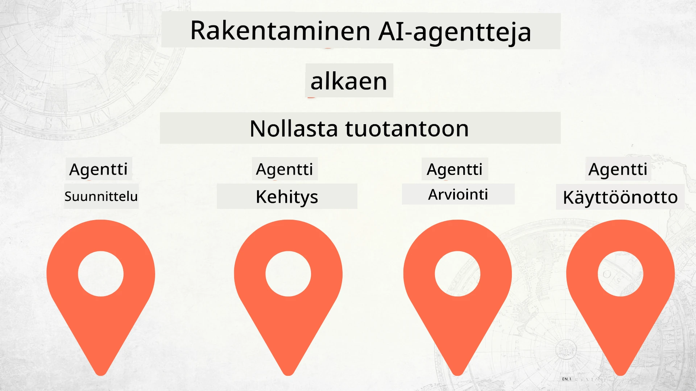

# AI-agenttien rakentaminen alusta tuotantoon



### 🌐 Monikielinen tuki

#### Tuettu GitHub Actionin kautta (automaattinen ja aina ajan tasalla)

<!-- CO-OP TRANSLATOR LANGUAGES TABLE START -->
[Arabic](../ar/README.md) | [Bengali](../bn/README.md) | [Bulgarian](../bg/README.md) | [Burmese (Myanmar)](../my/README.md) | [Chinese (Simplified)](../zh-CN/README.md) | [Chinese (Traditional, Hong Kong)](../zh-HK/README.md) | [Chinese (Traditional, Macau)](../zh-MO/README.md) | [Chinese (Traditional, Taiwan)](../zh-TW/README.md) | [Croatian](../hr/README.md) | [Czech](../cs/README.md) | [Danish](../da/README.md) | [Dutch](../nl/README.md) | [Estonian](../et/README.md) | [Finnish](./README.md) | [French](../fr/README.md) | [German](../de/README.md) | [Greek](../el/README.md) | [Hebrew](../he/README.md) | [Hindi](../hi/README.md) | [Hungarian](../hu/README.md) | [Indonesian](../id/README.md) | [Italian](../it/README.md) | [Japanese](../ja/README.md) | [Kannada](../kn/README.md) | [Khmer](../km/README.md) | [Korean](../ko/README.md) | [Lithuanian](../lt/README.md) | [Malay](../ms/README.md) | [Malayalam](../ml/README.md) | [Marathi](../mr/README.md) | [Nepali](../ne/README.md) | [Nigerian Pidgin](../pcm/README.md) | [Norwegian](../no/README.md) | [Persian (Farsi)](../fa/README.md) | [Polish](../pl/README.md) | [Portuguese (Brazil)](../pt-BR/README.md) | [Portuguese (Portugal)](../pt-PT/README.md) | [Punjabi (Gurmukhi)](../pa/README.md) | [Romanian](../ro/README.md) | [Russian](../ru/README.md) | [Serbian (Cyrillic)](../sr/README.md) | [Slovak](../sk/README.md) | [Slovenian](../sl/README.md) | [Spanish](../es/README.md) | [Swahili](../sw/README.md) | [Swedish](../sv/README.md) | [Tagalog (Filipino)](../tl/README.md) | [Tamil](../ta/README.md) | [Telugu](../te/README.md) | [Thai](../th/README.md) | [Turkish](../tr/README.md) | [Ukrainian](../uk/README.md) | [Urdu](../ur/README.md) | [Vietnamese](../vi/README.md)

> **Haluatko kloonata paikallisesti?**
>
> Tämä arkisto sisältää yli 50 kielen käännöksiä, mikä lisää merkittävästi latauskokoa. Jos haluat kloonata ilman käännöksiä, käytä sparse checkout -ominaisuutta:
>
> **Bash / macOS / Linux:**
> ```bash
> git clone --filter=blob:none --sparse https://github.com/microsoft/Building-AI-Agents-From-Zero-To-Production.git
> cd Building-AI-Agents-From-Zero-To-Production
> git sparse-checkout set --no-cone '/*' '!translations' '!translated_images'
> ```
>
> **CMD (Windows):**
> ```cmd
> git clone --filter=blob:none --sparse https://github.com/microsoft/Building-AI-Agents-From-Zero-To-Production.git
> cd Building-AI-Agents-From-Zero-To-Production
> git sparse-checkout set --no-cone "/*" "!translations" "!translated_images"
> ```
>
> Näin saat kaiken tarpeellisen kurssin suorittamiseen huomattavasti nopeammalla latauksella.
<!-- CO-OP TRANSLATOR LANGUAGES TABLE END -->

## Kurssi, joka opettaa sinulle AI-agenttien kehityssyklin perusteet

[](https://github.com/microsoft/Building-AI-Agents-From-Zero-To-Production/blob/master/LICENSE?WT.mc_id=academic-105485-koreyst)
[](https://GitHub.com/microsoft/Building-AI-Agents-From-Zero-To-Production/graphs/contributors/?WT.mc_id=academic-105485-koreyst)
[](https://GitHub.com/microsoft/Building-AI-Agents-From-Zero-To-Production/issues/?WT.mc_id=academic-105485-koreyst)
[](https://GitHub.com/microsoft/Building-AI-Agents-From-Zero-To-Production/pulls/?WT.mc_id=academic-105485-koreyst)
[](http://makeapullrequest.com?WT.mc_id=academic-105485-koreyst)

[](https://discord.gg/Kuaw3ktsu6)

## 🌱 Aloittaminen

Tämä kurssi sisältää oppitunteja, jotka kattavat AI-agenttien rakentamisen ja käyttöönoton perusteet.

Jokainen oppitunti rakentuu edellisen päälle, joten suosittelemme aloittamaan alusta ja etenemään loppuun asti.

Jos haluat tutkia lisää AI-agentteihin liittyviä aiheita, voit tutustua [AI Agents For Beginners -kurssiin](https://aka.ms/ai-agents-beginners).

### Tapaa muita oppijoita, saa vastauksia kysymyksiisi

Jos jäät jumiin tai sinulla on kysymyksiä AI-agenttien rakentamisesta, liity omistettuun Discord-kanavaamme [Microsoft Foundry Discordissa](https://discord.gg/Kuaw3ktsu6).

### Mitä tarvitset

Jokaisella oppitunnilla on oma koodiesimerkkinsä, jonka voit suorittaa paikallisesti. Voit [forkata tämän repositorion](https://github.com/microsoft/Building-AI-Agents-From-Zero-To-Production/fork) luodaksesi oman kopiosi.

Tämä kurssi käyttää tällä hetkellä seuraavia:

- [Microsoft Agent Framework (MAF)](https://aka.ms/ai-agents-beginners/agent-framework)
- [Microsoft Foundry](https://azure.microsoft.com/products/ai-foundry) — projekti, jossa on käytössä **GPT-5 -sarjan** malli (esim. `gpt-5.1`). Älä käytä lopetettuja GPT-4o / GPT-4.1 -malleja.
- [Azure OpenAI Service](https://azure.microsoft.com/products/ai-foundry/models/openai)
- [Azure CLI](https://learn.microsoft.com/cli/azure/authenticate-azure-cli?view=azure-cli-latest) — kirjaudu sisään komennolla `az login` ennen koodiesimerkin suorittamista
- **Python 3.12 tai uudempi**

Varmista, että sinulla on pääsy näihin palveluihin ennen aloittamista.

> **💰 Kustannukset ja siivous.** Käytännön oppitunnit luovat todellisia Azure-resursseja — Microsoft Foundry
> -projektin, mallin käyttöönoton, vektorivaraston sekä (oppitunneilla 4–6) isännöityjä agentteja ja työkalupakkeja.
> Näistä voi aiheutua kustannuksia voimassaoloaikanaan. Kun olet suorittanut oppitunnin tai kurssin,
> poista resurssit, joita et enää tarvitse. Helpoin tapa on laittaa kaikki omaan resurssiryhmään
> ja poistaa koko ryhmä, kun olet valmis:
>
> ```bash
> az group delete --name <your-resource-group> --yes --no-wait
> ```
>
> Voit myös poistaa yksittäisiä agentteja, vektorivarastoja ja työkalupakkeja Foundry-portaalista.

> **Mallien huomautus.** Tämä kurssi tarjoaa kaikki mallit **Microsoft Foundryn** kautta. Se ei käytä
> *GitHub Models* -malleja, jotka lopetetaan **30.7.2026** — Microsoft Foundry on virallinen
> siirtymäpolku. Jos sinulla on vanhaa koodia, joka kutsuu GitHub Models -malleja, ohjaa se sen sijaan
> Foundryn mallin käyttöönottoon.

Lisää vaihtoehtoja mallien hostaamiseen ja palveluihin tulossa pian.

## 🗃️ Oppitunnit

| **Oppitunti**         | **Kuvaus**                                                                                  |
|--------------------|--------------------------------------------------------------------------------------------------|
| [Agentin suunnittelu](./lesson-1-agent-design/README.md)       | Johdanto "Kehittäjän perehdytys" -agenttikäyttötapaukseen ja tehokkaiden agenttien suunnitteluun  |
| [Agentin kehitys](./lesson-2-agent-development/README.md)  | Microsoft Agent Frameworkin (MAF) avulla luodaan joukko erikoistuneita agentteja auttamaan uusia kehittäjiä perehtymään.       |
| [Agentin arvioinnit](./lesson-3-agent-evals/README.md)  | Microsoft Foundryn avulla tarkastellaan, kuinka hyvin AI-agenttimme suoriutuvat ja miten niitä voi parantaa. |
| [Agentin käyttöönotto](./lesson-4-agentdeployment/README.md)   | Microsoft Foundryn isännöityjä agentteja ja OpenAI ChatKit:iä käyttäen näytetään, miten AI-agentti otetaan tuotantoon.       |
| [Tuotannon isännöidyt agentit](./lesson-5-hosted-agents-production/README.md)   | Viedään isännöity agentti yritystuotantoon: isännöidyt agentit vs kyvykkyysisännät, käytä omaa tallennusta, muistia ja hallintaa.       |
| [Microsoftin työkalupakki](./lesson-6-toolbox/README.md)   | Määritä työkalut kerran ja hallitse niitä keskitetysti: rakenna työkalupakki, käytä sitä agentilta yhden MCP-päätepisteen kautta, ja versioi työkalut turvallisesti.       |
| [Moni-agentti & A2A](./lesson-7-multi-agent-a2a/README.md)   | Kokoa agentteja verkotetuiksi palveluiksi: tarjoa agentti avoimen Agent-to-Agent (A2A) -protokollan avulla ja käytä etäagenttia vertaisena.       |


## 🎒 Muut kurssit

Tiimimme tuottaa myös muita kursseja! Tutustu:

<!-- CO-OP TRANSLATOR OTHER COURSES START -->
### LangChain
[](https://aka.ms/langchain4j-for-beginners)
[](https://aka.ms/langchainjs-for-beginners?WT.mc_id=m365-94501-dwahlin)
[](https://github.com/microsoft/langchain-for-beginners?WT.mc_id=m365-94501-dwahlin)
---

### Azure / Edge / MCP / Agentit
[](https://github.com/microsoft/AZD-for-beginners?WT.mc_id=academic-105485-koreyst)
[](https://github.com/microsoft/edgeai-for-beginners?WT.mc_id=academic-105485-koreyst)
[](https://github.com/microsoft/mcp-for-beginners?WT.mc_id=academic-105485-koreyst)
[](https://github.com/microsoft/ai-agents-for-beginners?WT.mc_id=academic-105485-koreyst)

---
 
### Generative AI -sarja

[](https://github.com/microsoft/generative-ai-for-beginners?WT.mc_id=academic-105485-koreyst)
[-9333EA?style=for-the-badge&labelColor=E5E7EB&color=9333EA)](https://github.com/microsoft/Generative-AI-for-beginners-dotnet?WT.mc_id=academic-105485-koreyst)
[-C084FC?style=for-the-badge&labelColor=E5E7EB&color=C084FC)](https://github.com/microsoft/generative-ai-for-beginners-java?WT.mc_id=academic-105485-koreyst)
[-E879F9?style=for-the-badge&labelColor=E5E7EB&color=E879F9)](https://github.com/microsoft/generative-ai-with-javascript?WT.mc_id=academic-105485-koreyst)

---
 
### Keskeinen oppiminen
[](https://aka.ms/ml-beginners?WT.mc_id=academic-105485-koreyst)
[](https://aka.ms/datascience-beginners?WT.mc_id=academic-105485-koreyst)
[](https://aka.ms/ai-beginners?WT.mc_id=academic-105485-koreyst)
[](https://github.com/microsoft/Security-101?WT.mc_id=academic-96948-sayoung)

[](https://aka.ms/webdev-beginners?WT.mc_id=academic-105485-koreyst)
[](https://aka.ms/iot-beginners?WT.mc_id=academic-105485-koreyst)
[](https://github.com/microsoft/xr-development-for-beginners?WT.mc_id=academic-105485-koreyst)

---
 
### Copilot-sarja
[](https://aka.ms/GitHubCopilotAI?WT.mc_id=academic-105485-koreyst)
[](https://github.com/microsoft/mastering-github-copilot-for-dotnet-csharp-developers?WT.mc_id=academic-105485-koreyst)
[](https://github.com/microsoft/CopilotAdventures?WT.mc_id=academic-105485-koreyst)
<!-- CO-OP TRANSLATOR OTHER COURSES END -->

## Osallistuminen

Tämä projekti toivottaa tervetulleiksi osallistumiset ja ehdotukset. Useimmat osallistumiset vaativat, että hyväksyt
Avustajasopimuksen (Contributor License Agreement, CLA), jossa todetaan, että sinulla on oikeus ja että myönnät
meille oikeudet käyttää panostustasi. Lisätietoja saat osoitteesta <https://cla.opensource.microsoft.com>.

Kun lähetät vetopyynnön (pull request), CLA-botti määrittää automaattisesti, tarvitsetko toimittaa CLA:n
ja merkitsee PR:n asianmukaisesti (esim. tilantarkastus, kommentti). Noudata yksinkertaisesti botin antamia ohjeita.
Tätä tarvitsee tehdä vain kerran kaikissa CLA:ta käyttävissä repoissa.

Tämä projekti on ottanut käyttöön [Microsoft Open Source Code of Conductin](https://opensource.microsoft.com/codeofconduct/).
Lisätietoja löytyy [Code of Conduct FAQ](https://opensource.microsoft.com/codeofconduct/faq/) -sivulta tai
ota yhteyttä sähköpostitse osoitteeseen [opencode@microsoft.com](mailto:opencode@microsoft.com) jos sinulla on lisäkysymyksiä tai kommentteja.

## Tavara- ja palvelumerkit


Tässä projektissa saattaa olla tavaramerkkejä tai logoja projekteille, tuotteille tai palveluille. Microsoftin
tavaramerkkien tai logojen valtuutettu käyttö on ehdollista ja sen on noudatettava
[Microsoftin tavaramerkki- ja brändiohjeita](https://www.microsoft.com/legal/intellectualproperty/trademarks/usage/general).
Microsoftin tavaramerkkien tai logojen käyttö muokatuissa versioissa tästä projektista ei saa aiheuttaa sekaannusta eikä antaa ymmärtää Microsoftin sponsorointia.

Kolmansien osapuolten tavaramerkkien tai logojen käyttö on näiden kolmansien osapuolten sääntöjen alaista.

## Apua saamaan

Jos jumitut tai sinulla on kysymyksiä tekoälysovellusten rakentamisesta, liity:

[](https://discord.gg/Kuaw3ktsu6)

Jos sinulla on palautetta tuotteesta tai kohtaat virheitä rakentamisen aikana, käy:

[](https://aka.ms/foundry/forum)

---

<!-- CO-OP TRANSLATOR DISCLAIMER START -->
**Vastuuvapauslauseke**:
Tämä asiakirja on käännetty käyttämällä tekoälypohjaista käännöspalvelua [Co-op Translator](https://github.com/Azure/co-op-translator). Vaikka pyrimme tarkkuuteen, otathan huomioon, että automaattiset käännökset saattavat sisältää virheitä tai epätarkkuuksia. Alkuperäinen asiakirja sen alkuperäiskielellä on virallinen lähde. Tärkeissä asioissa suositellaan ammattimaista ihmiskäännöstä. Emme ole vastuussa tämän käännöksen käytöstä aiheutuvista väärinymmärryksistä tai tulkinnoista.
<!-- CO-OP TRANSLATOR DISCLAIMER END -->