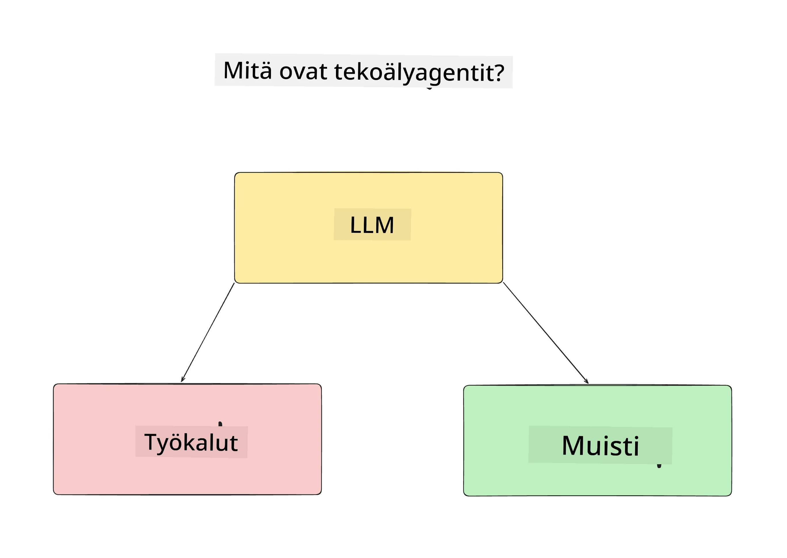
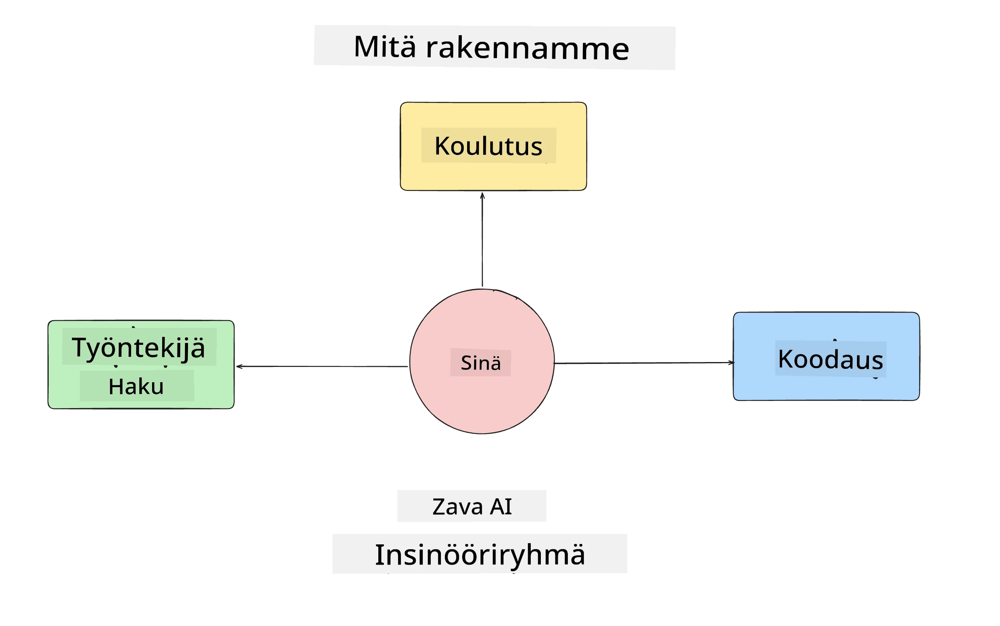
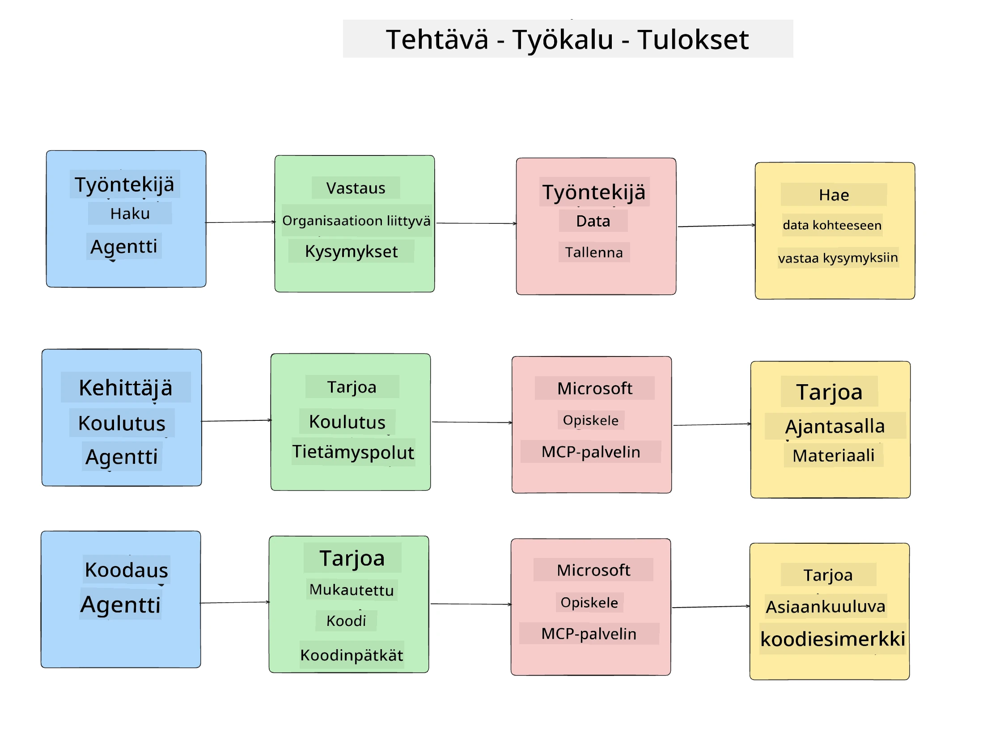
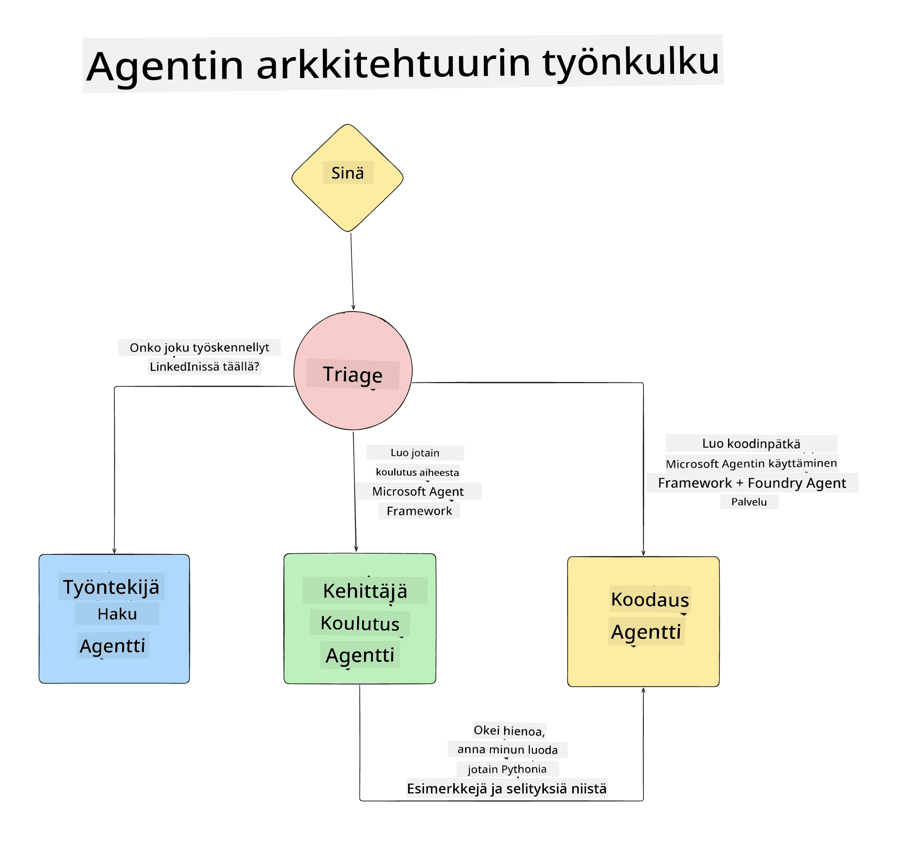

# Oppitunti 1: AI-agentin suunnittelu

Tervetuloa "Rakennetaan AI-agentti tyhjästä tuotantoon" -kurssin ensimmäiseen oppituntiin!

Tässä oppitunnissa käsittelemme:

- Mitä AI-agentit ovat
  
- Keskustelemme rakentamastamme AI-agenttisovelluksesta  

- Tunnistamme tarvittavat työkalut ja palvelut jokaiselle agentille
  
- Suunnittelemme agenttisovelluksemme arkkitehtuurin
  
Aloitetaan määrittelemällä, mitä agentti on ja miksi käyttäisimme niitä sovelluksessa.

> **Ennen kuin aloitat kurssin.** Tämä ensimmäinen oppitunti on käsitteellinen — siinä ei ole suoritettavaa koodia.
> Jatkaessasi [Oppitunti 2](../lesson-2-agent-development/README.md) tarvitset: **Azure-tilauksen**, jolla on pääsy **Microsoft Foundryyn**, käyttöön otetun **GPT-5-sarjan mallin** (esimerkiksi `gpt-5.1` — vältä jo eläkkeelle jääneitä GPT-4o / GPT-4.1 -malleja), **Python 3.12+** ja **Azure CLI:n** (`az login`). Katso [Mitä tarvitset](../README.md#what-you-need) kurssin README-tiedostosta koko lista ja linkit.

## Mitä ovat AI-agentit?

Jos tutustut AI-agentin rakentamiseen ensimmäistä kertaa, saatat miettiä, miten AI-agentti tarkalleen määritellään.

Yksinkertainen tapa määritellä AI-agentti on sen osien kautta:

**Suuri kielimalli** - LLM mahdollistaa luonnollisen kielen käsittelyn käyttäjältä niin, että se ymmärtää heidän suoritettavaksi haluamansa tehtävän ja osaa tulkita työkaluja, joita tehtävien suorittamiseen on käytettävissä.

**Työkalut** - Nämä ovat toimintoja, API-rajapintoja, tietovarastoja ja muita palveluita, joita LLM voi käyttää käyttäjän pyytämien tehtävien suorittamiseksi.

**Muisti** - Tämä on tapa tallentaa sekä lyhyen että pitkän aikavälin vuorovaikutukset AI-agentin ja käyttäjän välillä. Tietojen tallentaminen ja hakeminen on tärkeää parannusten tekemiseksi ja käyttäjäasetusten säilyttämiseksi ajan kuluessa.

## Meidän AI-agentin käyttötapaus

Tässä kurssissa rakennamme AI-agenttisovelluksen, joka auttaa uusia kehittäjiä liittymään AI-agenttikehitystiimiimme!

Ennen kehitystyön aloittamista ensimmäinen askel menestyvän AI-agenttisovelluksen luomisessa on määritellä selkeät käyttötapaukset siitä, miten käyttäjien odotetaan työskentelevän AI-agenttiemme kanssa.

Tässä sovelluksessa työskentelemme seuraavien käyttötapausten kanssa:

**Käyttötapaus 1**: Uusi työntekijä liittyy organisaatioomme ja haluaa tietää enemmän tiimistä, johon hän liittyi, ja miten olla yhteydessä siihen.

**Käyttötapaus 2:** Uusi työntekijä haluaa tietää, mikä olisi paras ensimmäinen tehtävä, johon ryhtyä.

**Käyttötapaus 3:** Uusi työntekijä haluaa kerätä oppimateriaaleja ja koodiesimerkkejä, jotka auttavat tehtävän aloittamisessa.

## Työkalujen ja palveluiden tunnistaminen

Nyt kun meillä on nämä käyttötapaukset, seuraava askel on liittää ne työkaluihin ja palveluihin, joita AI-agenttimme tarvitsevat tehtävien suorittamiseen.

Tämä prosessi kuuluu kontekstisuunnittelun kategoriaan, koska keskitymme varmistamaan, että AI-agenttimme saavat oikean kontekstin oikeaan aikaan tehtävien suorittamiseksi.

Tehkäämme tämä käyttötapauksittain ja toteutetaan hyvä agenttisuunnittelu listaamalla kunkin agentin tehtävät, työkalut ja toivotut lopputulokset.

### Käyttötapaus 1 - Työntekijähakuagentti

**Tehtävä** - Vastata organisaation työntekijöitä koskeviin kysymyksiin, kuten liittymispäivä, nykyinen tiimi, sijainti ja viimeisin tehtävä.

**Työkalut** - Tietovarasto nykyisestä työntekijälistasta ja organisaatiokaaviosta

**Lopputulokset** - Pystyy hakemaan tietoja tietovarastosta vastatakseen yleisiin organisaatiokysymyksiin ja työntekijöitä koskeviin erityiskysymyksiin.

### Käyttötapaus 2 - Tehtäväehdotusagentti

**Tehtävä** - Uuden työntekijän kehittäjäkokemuksen perusteella ehdottaa 1-3 tehtävää, joihin uusi työntekijä voi ryhtyä.

**Työkalut** - GitHub MCP -palvelin avoimien tehtävien ja kehittäjäprofiilin luomiseen

**Lopputulokset** - Pystyy lukemaan GitHub-profiilin viimeiset 5 committia ja GitHub-projektin avoimet tehtävät sekä tekemään ehdotuksia vastaavuuksien perusteella.

### Käyttötapaus 3 - Koodiassistenttiagentti

**Tehtävä** - "Tehtäväehdotus" -agentin ehdottamien avoimien tehtävien perusteella tutkii ja tarjoaa oppimateriaaleja sekä generoi koodinpätkiä työntekijän avuksi.

**Työkalut** - Microsoft Learn MCP resurssien löytämiseen ja Koodin tulkki mukautettujen koodinpätkien generointiin.

**Lopputulokset** - Jos käyttäjä pyytää lisäapua, työnkulku käyttää Learn MCP -palvelinta tarjoamaan linkkejä ja koodipätkiä resursseista ja sitten siirtää tehtävän Koodin tulkkiagentille pienten koodiesimerkkien ja selitysten tuottamiseksi.

## Agenttisovelluksen arkkitehtuuri

Nyt kun olemme määritelleet jokaisen agentin, luodaan arkkitehtuurikaavio, joka auttaa meitä ymmärtämään, miten kukin agentti toimii yhdessä ja erikseen tehtävän mukaan:

## Seuraavat askeleet

Nyt kun olemme suunnitelleet jokaisen agentin ja agenttijärjestelmämme, siirrytään seuraavaan oppituntiin, jossa kehitymme näitä agenteja!

---

<!-- CO-OP TRANSLATOR DISCLAIMER START -->
**Vastuuvapauslauseke**:
Tämä asiakirja on käännetty käyttämällä tekoälypohjaista käännöspalvelua [Co-op Translator](https://github.com/Azure/co-op-translator). Vaikka pyrimme tarkkuuteen, otathan huomioon, että automaattiset käännökset saattavat sisältää virheitä tai epätarkkuuksia. Alkuperäinen asiakirja sen alkuperäiskielellä on virallinen lähde. Tärkeissä asioissa suositellaan ammattimaista ihmiskäännöstä. Emme ole vastuussa tämän käännöksen käytöstä aiheutuvista väärinymmärryksistä tai tulkinnoista.
<!-- CO-OP TRANSLATOR DISCLAIMER END -->