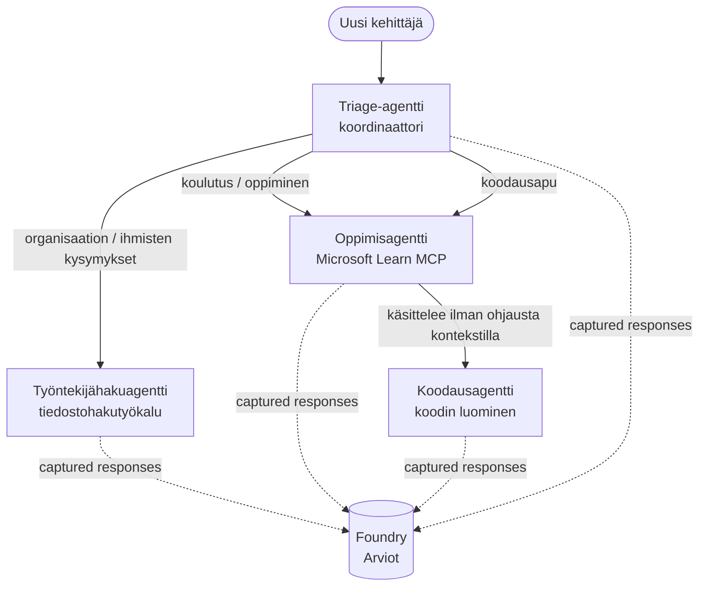

# Oppitunti 3: Agenttien arvioinnit Microsoft Foundrylla

Tervetuloa **"Rakennetaan tekoälyagentteja nollasta tuotantoon"** -kurssin kolmanteen oppituntiin!

Oppitunnissa [Oppitunti 2](../lesson-2-agent-development/README.md) rakensit agentteja. Tässä oppitunnissa
opit vastaamaan paljon vaikeampaan kysymykseen: **ovatko ne hyviä?** Agentin saattaminen
toimimaan on helppoa; sen tietäminen, ohjaako se oikein, pysyykö se datassasi ja käyttääkö se
työkalujaan oikein, erottaa demon tuotantojärjestelmästä.

Tässä oppitunnissa käsittelemme:

- Miksi agenttien arviointi on tärkeää ja miten se eroaa perinteisestä testauksesta
- Erot **havaittavuuden**, **savukokeiden** ja **arviointien** välillä
- Moniagenttityönkulun, jota aiomme mitata
- Sisäänrakennetut **Microsoft Foundry arvioijat** (relevanssi, perustuminen, työkalukutsun tarkkuus, työkalun tuloksen hyödyntäminen)
- Vaiheittainen läpikäynti arviointiputkesta tiedostossa [`agent-evals.py`](../../../lesson-3-agent-evals/agent-evals.py)
- Kuinka suorittaa se ja lukea tulokset

---

## Miksi arvioida agentteja?

Perinteinen yksikkötesti toteaa, että `add(2, 2) == 4`. Agentit eivät toimi näin — sama
kehotus voi tuottaa eri sanamuotoja jokaisella ajokerralla, työkaluja voidaan kutsua eri järjestyksessä, ja
"oikea" on usein asteikollinen eikä totuusarvoinen. Et voi väittää täsmällisistä merkkijonoista.

Sen sijaan arvioit agentteja **laatumittareiden** mukaan mallipohjaisilla *arvioijilla* (myös
kutsutaan "LLM-tuomariksi") sekä deterministisillä tarkistuksilla työkalujen käytössä. Tämä kertoo sinulle esimerkiksi:

- Vastasiko vastaus todella kysymykseen? (**relevanssi**)
- Tukevatko haetut tiedot vastausta vai keksiikö agentti? (**perustuminen**)
- Kutsuko agentti oikeaa työkalua oikeilla argumenteilla? (**työkalukutsun tarkkuus**)
- Käyttikö agentti todella työkalun palauttamaa tulosta? (**työkalun tuloksen hyödyntäminen**)

### Kolme täydentävää laatutaso

Nämä eivät ole kilpailevia menetelmiä — tuotantoagentti käyttää kaikkia kolmea:

| Taso | Kysymys johon vastaa | Kustannus | Milloin suoritetaan | Käsitellään |
|-------|--------------------|------|--------------|------------|
| **Havaittavuus / jäljitys** | *Mitä agentti teki, vaihe vaiheelta?* | Ilmainen (aina päällä) | Jatkuvasti tuotannossa | Tässä oppitunnissa |
| **Savukokeet** | *Onko agentti saavutettavissa ja seuraa peruskehotustaan?* | Halpa, sekunteja | Jokaisessa julkaisuversiossa | [Oppitunti 4](../lesson-4-agentdeployment/README.md#savukokeet-isännöidylle-agentille-ci-portti) |
| **Arvioinnit** | *Kuinka **hyviä** vastaukset ovat?* | Hitaampi, mallin käytön mukaan laskutettu | Tarvittaessa / yöllä / ennen julkaisua | Tässä oppitunnissa |

Savukokeet vastaavat "rikkoutuiko se?"; arvioinnit vastaavat "onko se hyvää?". Tarvitset molemmat.

---

## Esivaatimukset

1. Suoritettu [Oppitunti 2](../lesson-2-agent-development/README.md) (agentit + vektorivarasto).
2. **Microsoft Foundry** -projekti.
3. **Azure CLI** kirjautunut sisään: `az login`.
4. **Python 3.12+** ja kurssin riippuvuudet asennettuna:

   ```bash
   pip install -r ../requirements.txt
   ```

5. Ympäristömuuttujat (luo `.env` tiedosto tähän kansioon tai aseta ne export-komennolla):

   | Muuttuja | Tarkoitus |
   |----------|---------|
   | `FOUNDRY_PROJECT_ENDPOINT` | Foundry-projektin päätepisteesi (`https://<account>.services.ai.azure.com/api/projects/<project>`). Luetaan agenttien `FoundryChatClient`-asiakasohjelmasta **ja myös** arviointiavustajasta. |
   | `FOUNDRY_MODEL` | Mallin käyttöönotto, jolla **agentit** toimivat (esim. `gpt-5.1`). |
   | `VECTOR_STORE_ID` | Oppitunnissa 2 luotu työntekijähakemiston vektorivarasto |
   | `AZURE_AI_MODEL_DEPLOYMENT_NAME` | Mallin käyttöönotto, jota **arvioijat** käyttävät (oletuksena `FOUNDRY_MODEL`, sitten `gpt-5.1`) |

> Agentit käyttävät `FoundryChatClient`-asiakasta, joka lukee asetukset `FOUNDRY_`-alkuisista
> muuttujista (`FOUNDRY_PROJECT_ENDPOINT`, `FOUNDRY_MODEL`). Pilviarviointiapu
> käyttää `azure-ai-projects` SDK:ta ja palaa tarvittaessa `FOUNDRY_PROJECT_ENDPOINT`-arvoon jos
> `AZURE_AI_PROJECT_ENDPOINT` ei ole asetettu — joten kahdet `FOUNDRY_`-muuttujat riittävät
> koko oppitunnin suorittamiseen.
>
> Arvioijat käyttävät itse mallia, joten `AZURE_AI_MODEL_DEPLOYMENT_NAME`
> ohjaa, mikä käyttöönotto tekee tuomaroinnin — sen ei tarvitse olla sama malli, jota
> agenttisi käyttävät.

---

## Työnkulku, jota arvioimme

Jotta jotain voi arvioida, sitä täytyy ensin käyttää. Tämä oppitunti käyttää uudelleen **Kehittäjän perehdytys**
moniagenttityönkulkua: **lähetteiden käsittelijä** luovuttaa työn kolmelle asiantuntijalle.



Työnkulku on rakennettu Microsoft Agent Frameworkin **handoff**-orkestroinnilla. Arvioinnin keskeinen
idea on, että **jokainen agentin vuoro tallennetaan palvelimelle** ja tunnistetaan
`response_id`-tunnuksella. Näitä tunnuksia annamme arviointipalvelulle.

---

## Arviointiputki, vaihe vaiheelta

Tiedostossa [`agent-evals.py`](../../../lesson-3-agent-evals/agent-evals.py) on kuuden vaiheen putki. Tässä, mitä kukin vaihe tekee
ja miksi.

### Vaihe 1 — Suorita työnkulku ja seuraa vastaustunnuksia

Työnkulku ajetaan komennolla `run_stream(...)` ja tapahtumien virratessa koodi tallentaa
kutakin agenttia kohti tuotetut `response_id`- ja `conversation_id`-arvot. Tallennetut vastaukset ovat raakamateriaalia
arviointiin — arvioit *aidosti* tuotannon kaltaisia vastauksia etkä uudelleenluotuja.


### Vaihe 2 — Tiivistä tallennettu materiaali

Nopeasti tulostetaan, kuinka monta vastausta kukin agentti tuotti, jotta voit varmistaa, että työnkulku
todella käytti arvioitavia agentteja.

### Vaihe 3 — Hae lopulliset vastaukset

Jokaiselle agentille haetaan viimeinen `response_id` OpenAI-yhteensopivan
projektin asiakasohjelman kautta (`project_client.get_openai_client().responses.retrieve(...)`), jotta näet arvioitavan
tekstin.

### Vaihe 4 — Luo arviointi

Arviointi luodaan neljällä **sisäänrakennetulla Foundry-arvioijalla**:

| Arvioija | `evaluator_name` | Mitä mittaa |
|-----------|------------------|------------------|
| Relevanssi | `builtin.relevance` | Vastauksiko se käyttäjän pyyntöön? |

| Perusteltavuus | `builtin.groundedness` | Onko vastaus tuettu haetuilla/työkalun tiedoilla (ei tuotettu keksittynä)? |
| Työkalukutsun tarkkuus | `builtin.tool_call_accuracy` | Oliko oikeat työkalut kutsuttu oikeilla argumenteilla? |
| Työkalun tulosten hyödyntäminen | `builtin.tool_output_utilization` | Käyttikö agentti todella työkalun tuloksia vastauksessaan? |

Jokainen arvioija alustetaan nimetyllä käyttöönottolla `AZURE_AI_MODEL_DEPLOYMENT_NAME`.

> **Miksi nämä neljä?** Relevanssi ja perusteltavuus mittaavat *vastauksen laatua*; kaksi työkalu-
> arvioijaa mittaavat *agenttikäyttäytymistä* — osaa, jonka perinteiset NLP-mittarit ohittavat kokonaan. Työkaluja käyttä-
> välle moniotantojärjestelmälle työkaluindikaattorit paljastavat usein todelliset heikennykset.

### Vaihe 5 — Suorita arviointi

Kaapatut `response_id` arvot välitetään `evals.runs.create(...)`-funktiolle tietolähteenä. Palvelu toistaa
jokaisen tallennetun vastauksen jokaisen arvioijan läpi.

### Vaihe 6 — Seuraa ja lue tulokset

Koodi kysyy suorituksen tilaa, kunnes se on `completed` tai `failed`, ja tulostaa sitten tulosmäärät sekä
**`report_url`** — syvälinkin Foundry-portaaliin, jossa voit tarkastella mittareiden pisteitä,
hyväksytty/hylätty -määriä sekä yksittäisiä arvosteltuja vastauksia.

---

## Suorita se

```bash
cd lesson-3-agent-evals
python agent-evals.py
```

Oletuksena arvioidaan ensimmäinen esimerkkikysely
(`"Olen uusi täällä! Onko täällä kukaan, joka on työskennellyt Microsoftilla?"`). Kaksi muuta monintentoista esimerkkikyselyä
sisältyy `run_evaluation_workflow()` -funktioon — vaihda `query`-muuttujaa kokeillaksesi ohjausvaihtoehtoja,
joissa useammat agentit osallistuvat yhteen suoritukseen.

Odotettu konsolin eteneminen:

```
Step 1: Running Developer Onboarding Workflow
Step 2: Response Data Summary
Step 3: Fetching Agent Responses
Step 4: Creating Evaluation
Step 5: Running Evaluation
Step 6: Monitoring Evaluation
  Status: running ...
  Evaluation completed successfully
  Report URL: https://...   <-- open this in the Foundry portal
```

---

## Tarkkailtavuus ja jäljitys

Arvioinnit kertovat, *kuinka hyviä* vastaukset olivat; **tarkkailtavuus** kertoo *mitä tapahtui*,
jotta ne syntyivät — jokainen agenttikäynti, työkalukutsu, tokenien määrä ja viive. Microsoft Foundryssa
agentin suoritukset lähettävät OpenTelemetry-jäljityksiä, joita voit tarkastella portaalissa, ja Agent Framework
voi viedä ne Azure Monitoriin / Application Insightsiin yhdellä kutsulla:

```python
from agent_framework.foundry import FoundryChatClient

client = FoundryChatClient()
client.configure_azure_monitor()   # vie jäljitykset + mittarit Application Insightsiin
```

Käytä jäljitystä **debuggaamiseen** huonon arviointipistemäärän yhteydessä: kun perusteltavuus laskee, jäljitys näyttää,
palauttiko tiedostonhakutyökalu mitään vai palauttiko se tietoa, jonka agentti sitten ohitti (mikä on
juuri se, mitä työkalun tulosten hyödyntäminen pisteyttää).

---

## "Suorituksista" "hyviksi": kuinka käyttää tätä käytännössä

- **Esijulkaisun portti.** Suorita arvioinnit kiinteällä edustavien kyselyiden joukolla ennen
  uuden kehotteen tai mallin julkaisua. Vertaa pisteitä edelliseen versioon — suhtaudu laskuun
  takapakkana.
- **Yöllinen laatusignaali.** Ajoita arviointi havaitsemaan datan tai riippuvuuksien
  muutoksista johtuvaa poikkeamaa.
- **Parita tarkistustestien kanssa.** [Lesson 4 savutesti](../lesson-4-agentdeployment/README.md#smoke-testing-the-hosted-agent-ci-gate)
  on nopea deploy-porttisi; arvioinnit ovat hitaampi, perusteellisempi laatuportti.
  Suorita halpa testi jokaisella yhdistämisellä ja kallis testi aikataulun mukaisesti tai ennen julkaisua.

---

## Modernisointimuistio

Tämä esimerkki on siirtymässä nykyiseen Microsoft Agent Framework Foundry API -pintaan
(`agent_framework.foundry`). Jos päivität koodia, katso repositorion juurihakemistosta

[`MIGRATION-GUIDE.md`](../MIGRATION-GUIDE.md) varmennettujen ennen/jälkeen tuonnin ja asiakas
kartoitusten (esimerkiksi `AzureAIClient` -> `FoundryChatClient` sekä isännöidyn työkalun rakennus
`client.get_file_search_tool(...)` / `client.get_mcp_tool(...)` kautta). Arviointikäsitteet ja
yllä oleva kuusivaiheinen putkisto eivät muutu tämän siirtymän myötä.

---

## Resurssit

- [Generatiivisten tekoälymallien ja -sovellusten arviointi (Microsoft Learn)](https://learn.microsoft.com/en-us/azure/ai-foundry/concepts/evaluation-approach-gen-ai)
- [Sisäänrakennetut arvioijat generatiiviselle tekoälylle](https://learn.microsoft.com/en-us/azure/ai-foundry/concepts/evaluation-evaluators/agent-evaluators)
- [Havaittavuus Microsoft Foundryssa](https://learn.microsoft.com/en-us/azure/ai-foundry/concepts/observability)
- [Microsoft Agent Framework](https://github.com/microsoft/agent-framework)
- [Agentin siirron orkestrointi](https://learn.microsoft.com/en-us/agent-framework/workflows/orchestrations/handoff)

---

<!-- CO-OP TRANSLATOR DISCLAIMER START -->
**Vastuuvapauslauseke**:
Tämä asiakirja on käännetty käyttämällä tekoälypohjaista käännöspalvelua [Co-op Translator](https://github.com/Azure/co-op-translator). Vaikka pyrimme tarkkuuteen, otathan huomioon, että automaattiset käännökset saattavat sisältää virheitä tai epätarkkuuksia. Alkuperäinen asiakirja sen alkuperäiskielellä on virallinen lähde. Tärkeissä asioissa suositellaan ammattimaista ihmiskäännöstä. Emme ole vastuussa tämän käännöksen käytöstä aiheutuvista väärinymmärryksistä tai tulkinnoista.
<!-- CO-OP TRANSLATOR DISCLAIMER END -->