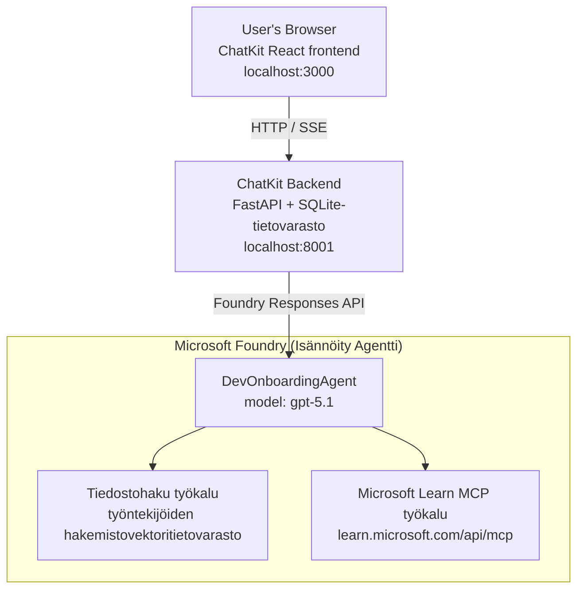

# Oppitunti 4: Agentin käyttöönotto Microsoft Foundryn isännöimillä agenteilla + ChatKit

Tässä oppitunnissa näytetään, kuinka työkaluja käyttävä agentti otetaan käyttöön Microsoft Foundryssä isännöitynä agenttina ja luodaan ChatKit-pohjainen käyttöliittymä sen kanssa vuorovaikutukseen.

## Arkkitehtuuri

Isännöity agentti on **yksi `DevOnboardingAgent`** (joka toimii `gpt-5.1`:llä) ja vastaa kehittäjien perehdytyskysymyksiin käyttäen kahta isännöityä työkalua: **Tiedostohaku**-työkalua työntekijähakemiston vektorivarastoa vasten sekä **Microsoft Learn MCP** -työkalua. ChatKit React -käyttöliittymä kommunikoi FastAPI-taustapalvelun kanssa, joka kutsuu agenttia Foundryn **Responses API:n** kautta.



## Vaatimukset

1. **Microsoft Foundry -projekti** North Central US -alueella
2. **Azure CLI** todennettu (`az login`)
3. **Azure Developer CLI** (`azd`) asennettuna
4. **Python 3.12+** ja **Node.js 18+**
5. **Vektorivarasto** luotu työntekijätiedoilla

## Nopein Aloitus

### 1. Määritä Ympäristömuuttujat

```bash
cd lesson-4-agentdeployment
cp .env.example .env
# Muokkaa .env tiedostoa Microsoft Foundry -projektisi tiedoilla
```

### 2. Ota Isännöity Agentti Käyttöön

**Vaihtoehto A: Azure Developer CLI:n käyttäminen (suositeltu)**

```bash
cd hosted-agent
azd auth login
azd agent deploy
```

**Vaihtoehto B: Docker + Azure Container Registry**

```bash
cd hosted-agent

# Rakenna kontti
docker build -t developer-onboarding-agent:latest .

# Tunniste ACR:lle
docker tag developer-onboarding-agent:latest <your-acr>.azurecr.io/developer-onboarding-agent:latest

# Työnnä ACR:lle
az acr login --name <your-acr>
docker push <your-acr>.azurecr.io/developer-onboarding-agent:latest

# Ota käyttöön Microsoft Foundry -portaalin tai SDK:n kautta
```

### 3. Käynnistä ChatKit-taustapalvelu

```bash
cd chatkit-server
python -m venv .venv
source .venv/bin/activate  # Windowsilla: .venv\Scripts\activate
pip install -r requirements.txt
python app.py
```

Palvelin käynnistyy osoitteeseen `http://localhost:8001`

### 4. Käynnistä ChatKit-käyttöliittymä

```bash
cd chatkit-server/frontend
npm install
npm run dev
```

Käyttöliittymä käynnistyy osoitteeseen `http://localhost:3000`

### 5. Testaa Sovellusta

Avaa `http://localhost:3000` selaimessasi ja kokeile näitä kyselyjä:

**Työntekijähaku:**
- "Olen uusi täällä! Onko kukaan työskennellyt Microsoftilla?"
- "Kenellä on kokemusta Azure Functionsista?"

**Oppimateriaalit:**
- "Luo oppimispolku Kubernetesille"
- "Mitä sertifikaatteja minun pitäisi hakea pilviohjelmistojen arkkitehtuurissa?"

**Ohjelmointiapu:**
- "Auta minua kirjoittamaan Python-koodi CosmosDB:hen yhdistämiseen"
- "Näytä, miten luon Azure Functionin"

**Moniagenttikyselyt:**
- "Aloitan pilvi-insinöörinä. Kenen kanssa minun pitäisi ottaa yhteyttä ja mitä minun pitäisi oppia?"

## Projektin Rakenne

```
lesson-4-agentdeployment/
├── .env.example                 # Environment variables template
├── implementation-plan.md       # Detailed implementation guide
├── README.md                    # This file
├── hosted-agent/               # Microsoft Foundry hosted agent
│   ├── main.py                 # Multi-agent workflow implementation
│   ├── requirements.txt        # Python dependencies
│   ├── Dockerfile              # Container definition
│   └── agent.yaml              # Agent deployment configuration
└── chatkit-server/             # ChatKit server application
    ├── app.py                  # FastAPI backend
    ├── store.py                # SQLite persistence layer
    ├── requirements.txt        # Python dependencies
    └── frontend/               # React frontend
        ├── package.json
        ├── vite.config.ts
        ├── tsconfig.json
        ├── index.html
        └── src/
            ├── main.tsx
            ├── App.tsx
            ├── App.css
            └── index.css
```

## Agentti ja sen työkalut

Isännöity agentti on **yksi agentti** (`DevOnboardingAgent`, määritelty tiedostossa `hosted-agent/main.py`), joka käsittelee kolme perehdytysaluetta. Sen sijaan että se orkestroisi erillisiä alianteja, se tarjoaa jokaisen kyvykkyyden työkaluna (tai luottaa suoraan malliin):

| Kyvykkyys | Kuinka se hoidetaan | Työkalu |
|-----------|------------------|------|
| **Työntekijähaku & yhteydet** | Foundryn isännöimä Tiedostohaku työntekijähakemiston vektorivarastoa vasten | `client.get_file_search_tool(vector_store_ids=[...])` |
| **Oppiminen & koulutus** | Microsoft Learn MCP -palvelin (isännöity MCP-työkalu) | `client.get_mcp_tool(url="https://learn.microsoft.com/api/mcp")` |
| **Ohjelmointiapu** | Hoidetaan suoraan `gpt-5.1`-mallilla — ei ulkoista työkalua | — |


Agentti luodaan komennolla `client.as_agent(name="DevOnboardingAgent", instructions=..., tools=[file_search_tool, learn_mcp_tool])` ja sitä palvellaan komennolla `from_agent_framework(agent).run()`.

> **Suunnittelumuistio.** Tämän oppitunnin aiemmissa luonnoksissa käytettiin `HandoffBuilder`-moni-agenttityönkulkua (Triage → asiantuntijat). Lopullinen agentti on yksittäinen työkalua käyttävä agentti, mikä on yksinkertaisempi ottaa käyttöön ja ymmärtää perehdytyksen tyyppisessä kysymys-vastaus-tilanteessa. Esimerkkiä moni-agenttien orkestroinnista ja luovutuksista löytyy oppitunneilta 2 ja 3.

## Palvelimella olevan agentin savutestaus (CI-portti)

Onnistunut hosted-agentin käyttöönotto todistaa ainoastaan, että ohjaustaso hyväksyi
määritelmän — se **ei** todista, että agentti todella vastaa. Puuttuva riippuvuus,
huono mallinohjaus tai vanhentunut yhteys voivat jättää vihreän mutta hiljaisen agentin.

Tämä oppitunti sisältää kevyen **savutestin**, joka toimii nopeana ja edullisena jälkikäyttöönoton
porttina. Se käyttää [AI Smoke Test](https://github.com/marketplace/actions/ai-smoke-test)
GitHub-toimintoa, joka POSTAA pyyntöjä agentin Foundryn **Responses**-päätepisteeseen
(`POST {project_endpoint}/agents/{agent_name}/endpoint/protocols/openai/responses`)
ja tarkistaa palautetun tekstin. Se havaitsee vioittuneet käyttöönotot, auktorisointiregressiot,
järjestelmäkehotteen harharetket ja ketjutuksen katkeamiset sekunneissa.

> Savutestit eivät ole **korvike** kattaville arvioinneille
> [Oppitunti 3](../lesson-3-agent-evals/README.md) — ne täydentävät niitä. Savutestit
> vastaavat *"onko agentti saavutettavissa, vastaako se ja noudattaako peruskehotteen odotuksia?"*;
> arvioinnit vastaavat *"kuinka hyvä vastaus on?"*. Suorita edullinen portti aina käyttöönoton yhteydessä.

### Mitä testataan

Katalogi sijaitsee osoitteessa [`hosted-agent/tests/smoke-tests.json`](../../../lesson-4-agentdeployment/hosted-agent/tests/smoke-tests.json)
ja testaa agentin kolmea toiminta-aluetta sekä kehotteiden noudattamista ja moni-kierroksista ketjutusta:

| Testi | Mitä se varmistaa |
|------|------------------|
| `reachability` | Agentti vastaa ei-tyhjällä ja aihepiiriin liittyvällä tekstillä |
| `employee-search` | Tiedostohaku palauttaa terveellisen `200`-vastauksen (vastaus riippuu datasta) |
| `learning-path` | Oppimisalue palauttaa pyydetyn aiheen ja tekee reitti-tyyppisen vastauksen |
| `coding-assistance` | Ohjelmointi-alue palauttaa koodin muotoisen Python-vastauksen |
| `prompt-adherence-offtopic` | Aiheesta poikkeava pyyntö ohjataan uudelleen, siihen ei vastata yksityiskohtaisesti |
| `threading-turn-1/2` | Keskustelutila säilyy kierrosten välillä `previous_response_id`-parametrin avulla |

### Suorita CI-ympäristössä

Työnkulku [`.github/workflows/smoke-test-hosted-agent.yml`](../../../.github/workflows/smoke-test-hosted-agent.yml)
sisältää kaksi tehtävää:

- **`static`** — nopea, Azurea käyttämätön portti, joka ajetaan jokaisessa pull requestissa ja pushissa:
  se kääntää kaikki Python-lähteet (`py_compile`) ja tarkistaa Markdown-linkit. Salaisuuksia
  ei tarvita, joten se toimii myös fork PR:issä.
- **`smoke`** — alla oleva Azure-yhteyksinen savutesti. Se ajetaan pyynnöstä
  (Actions → **Agent CI (static + smoke)** → Run workflow) ja voidaan kytkeä ketjuun käyttöönoton
  jälkeen.

Määritä nämä repositorion **muuttujat** ja **salaisuudet** savutestiä varten:


| Tyyppi | Nimi | Arvo |
|------|------|-------|

| Muuttuja | `FOUNDRY_PROJECT_ENDPOINT` | `https://<account>.services.ai.azure.com/api/projects/<project>` |
| Muuttuja | `HOSTED_AGENT_NAME` | Olevan agentin nimi (esim. `dev-onboarding` — on sovitettava käyttöönne) |
| Salaisuus | `AZURE_CLIENT_ID` / `AZURE_TENANT_ID` / `AZURE_SUBSCRIPTION_ID` | OIDC-federoidun identiteetin käyttö `azure/login` varten |

Ajurin identiteetillä tulee olla **`Azure AI User`** -rooli **Foundryn projektin laajuudessa**, jotta se voi
kutsua Vastausten (ja keskustelujen) datataso-päätteitä. Myönnä oikeus käyttämällä:

```bash
az role assignment create \
  --assignee <object-id-or-appId-of-runner-identity> \
  --role "Azure AI User" \
  --scope "/subscriptions/<sub>/resourceGroups/<rg>/providers/Microsoft.CognitiveServices/accounts/<account>/projects/<project>"
```

### Suorita se paikallisesti

Voit suorittaa saman luettelon ennen työntöä. Hanki datatason token, joka on laajuudeltaan
`https://ai.azure.com/` ja osoita ajuri käyttöönottoosi:

```bash
# Yleisön on OLTAVA https://ai.azure.com/ (cognitiveservices.azure.com -tunnuksia hylätään)
export FOUNDRY_TOKEN=$(az account get-access-token --resource https://ai.azure.com/ --query accessToken -o tsv)

git clone https://github.com/JFolberth/ai-smoketest && cd ai-smoketest
python runner.py \
  --project-endpoint "https://<account>.services.ai.azure.com/api/projects/<project>" \
  --agent-name dev-onboarding \
  --tests-file ../lesson-4-agentdeployment/hosted-agent/tests/smoke-tests.json
```

Poistumiskoodit: `0` kaikki meni läpi, `1` väite epäonnistui, `2` ajurivirhe (huono luettelo / token).

## Vianmääritys

### Agentti ei vastaa
- Varmista, että hostattu agentti on otettu käyttöön ja toiminnassa Microsoft Foundryssa
- Tarkista, että `HOSTED_AGENT_NAME` ja `HOSTED_AGENT_VERSION` vastaavat käyttöönottoasi

### Vektoritallennusvirheet
- Varmista, että `VECTOR_STORE_ID` on asetettu oikein
- Tarkista, että vektoritallennus sisältää työntekijätiedot

### Tunnistautumisvirheet
- Suorita `az login` päivittääksesi tunnistetiedot
- Varmista, että sinulla on pääsy Microsoft Foundryn projektiin

## Resurssit

- [Microsoft Foundryn hostatut agentit -dokumentaatio](https://learn.microsoft.com/en-us/azure/ai-foundry/agents/concepts/hosted-agents)
- [Microsoft Agent Framework](https://github.com/microsoft/agent-framework)
- [ChatKit-integraatiovain esimerkki](https://github.com/microsoft/agent-framework/tree/main/python/samples/demos/chatkit-integration)
- [Azure Developer CLI](https://learn.microsoft.com/en-us/azure/developer/azure-developer-cli/overview)
- [AI Smoke Test GitHub Action](https://github.com/marketplace/actions/ai-smoke-test)
- [Testaa Microsoft Foundryn agentit GitHub Actions -toiminnolla (blogi)](https://techcommunity.microsoft.com/blog/azuredevcommunityblog/smoke-test-microsoft-foundry-agents-with-github-actions/4531912)

---

## Seuraavat vaiheet

Agenttisi toimii Microsoftin hallinnoimalla infrastruktuurilla. Viedäksesi sen yritystason tuotantoon —
halliten missä sen tiedot sijaitsevat (tietojen suvereniteetti, yksityinen verkko, tuo oma Azure
Cosmos DB / tallennus / AI-haku) ja halliten sen työkaluja — jatka
**[Oppitunti 5: Tuotannon hostatut agentit](../lesson-5-hosted-agents-production/README.md)**, jossa
selitetään ratkaiseva ero **Hostattujen agenttien** ja **Kyvykkyys-isäntien** välillä.

---

<!-- CO-OP TRANSLATOR DISCLAIMER START -->
**Vastuuvapauslauseke**:
Tämä asiakirja on käännetty käyttämällä tekoälypohjaista käännöspalvelua [Co-op Translator](https://github.com/Azure/co-op-translator). Vaikka pyrimme tarkkuuteen, otathan huomioon, että automaattiset käännökset saattavat sisältää virheitä tai epätarkkuuksia. Alkuperäinen asiakirja sen alkuperäiskielellä on virallinen lähde. Tärkeissä asioissa suositellaan ammattimaista ihmiskäännöstä. Emme ole vastuussa tämän käännöksen käytöstä aiheutuvista väärinymmärryksistä tai tulkinnoista.
<!-- CO-OP TRANSLATOR DISCLAIMER END -->