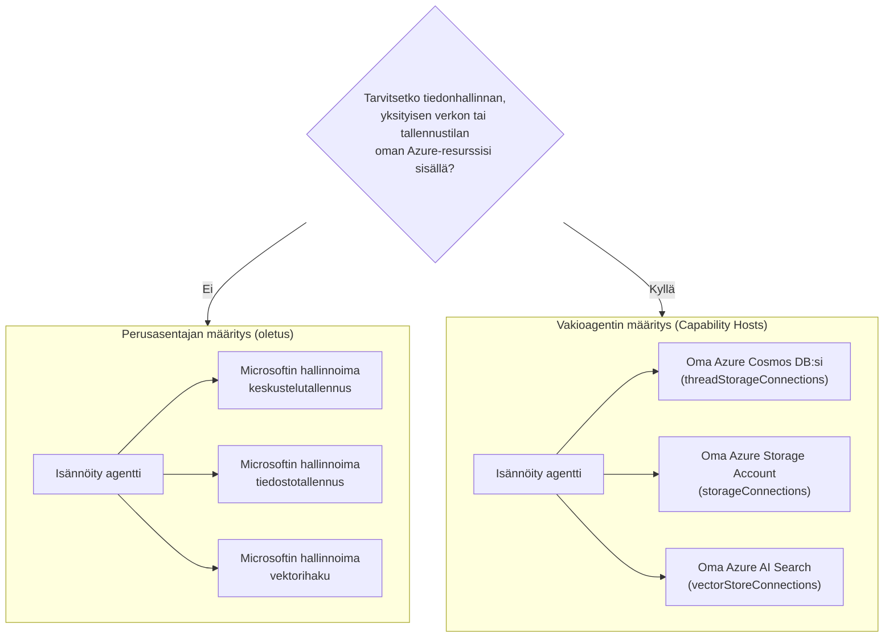

# Oppitunti 5: Tuotannossa isännöidyt agentit — tallennus, muisti ja hallinta

Oppitunnissa [Oppitunti 4](../lesson-4-agentdeployment/README.md) otit käyttöön Developer Onboarding
Agentin **Microsoft Foundry -isännöitynä agenttina** ja sijoitit sen eteen ChatKit-käyttöliittymän. Tämä
oppitunti vastasi kysymykseen *"miten toimitan agentin?"*. Tämä oppitunti vastaa seuraaviin
yrityksen kysymyksiin: **Missä agenttini data säilytetään? Kuka sitä hallinnoi? Kuinka täytän vaatimukset
liittyen säädösten noudattamiseen, verkottumiseen ja hallintaan?**

Tämän oppitunnin tärkein ajatus on ero **isännöidyn agentin** ja
**kyvykkyyksien isännän** välillä — kaksi käsitettä, jotka on helppo sekoittaa, mutta jotka ratkaisevat täysin eri
ongelmia.

## Oppimistavoitteet

Oppitunnin lopussa osaat:

- Selittää, mitä **isännöity agentti** tarjoaa (Microsoftin hallitsema suoritusaika) ja mitä se **ei** tarjoa.
- Selittää, mikä **kyvykkyyksien isäntä** on ja milloin sitä tarkalleen ottaen tarvitset.
- Valita **perusagentin asennuksen** (Microsoftin hallitsema tallennus) ja **tavanomaisen agentin asennuksen**
  (tuo omat Azure-resurssit) välillä.
- Ymmärtää, miten **keskusteluhistoria, tiedostojen lataukset ja vektorikaupat** tallennetaan ja miten
  ne voidaan ohjata omalle Azure Cosmos DB:lle, Azure Storagelle ja Azure AI Searchille.
- Soveltaa hallintakontrolleja: datan suvereniteetti, yksityinen verkottuminen ja **Hosted MCP -työkalun hyväksyntä**.

---

## Esivaatimukset

1. Valmis [Oppitunti 4](../lesson-4-agentdeployment/README.md) — sinulla on käytössä isännöity agentti.
2. **Microsoft Foundry** -projekti ja Azure-tili, jolla on oikeudet luoda resursseja
   (Cosmos DB, Storage, Azure AI Search) ja määrittää rooleja tilauksen/resurssiryhmän sisällä.
3. **Azure CLI** kirjautuneena: `az login` (ja `az account set --subscription <id>`, jos sinulla on
   enemmän kuin yksi tilaus).
4. **Azure Developer CLI** (`azd`) asennettuna — käytetään tavanomaisen asennuksen provisiointivirtaan.
5. **Python 3.12+** ja kurssin riippuvuudet asennettuna (`pip install -r ../requirements.txt`).
6. Ajantasainen, ei-eläkkeelle siirretty mallin käyttöönotto (esimerkiksi `gpt-5.1`). Vältä eläkkeelle siirrettyjä GPT-4o / GPT-4.1 -malleja.

> Tämä oppitunti on enimmäkseen käsitteellinen ja hallintapainotteinen. Voit lukea sen alusta loppuun ilman,
> että provisioisit mitään, ja käyttää harjoituksia, kun olet valmis konfiguroimaan tavanomaisen asennuksen.


---

## 1. Isännöidyt agentit: mitä Foundry hallinnoi puolestasi

**Isännöity agentti** on agentti, jonka *suoritusympäristö* on täysin Microsoft Foundry Agent Service:n hallinnoima.
Kun otat käyttöön isännöidyn agentin (kuten teit Oppitunnissa 4), Foundry tarjoaa:

- **Laskentatehon** — suoritusaika, joka ajaa agenttisi koodin ja työkalut.
- **Skaalauksen** — kopiot skaalautuvat kuormituksen mukaan ylös ja alas (katso `agent.yaml` `scale` Oppitunnissa 4).
- **Identiteetin** — hallittu identiteetti agentille, jotta se todentaa Azuren ilman salaisuuksia.
- **Havaitsemisen** — jäljitys ja telemetria (katso Oppitunti 3:n havaittavuusosio).
- **Istuntojen hallinnan** — ketjut/keskustelut, jotta monivuorokeskustelut "muistavat" aiemmat kierrokset.


> **Tärkeä kohta:** Sinun ei tarvitse määrittää Capability Hostia pelkästään isännöidyn
> agentin suorittamista varten. Isännöity agentti toimii heti Microsoftin hallinnoimalla infrastruktuurilla.

---

## 2. Isännöidyt agentit vs Capability Hostit

**Isännöidyt agentit ja Capability Hostit ratkaisevat eri ongelmia.**

**Isännöidyt agentit** tarjoavat Microsoftin hallinnoiman suoritusalustan, mukaan lukien laskenta, skaalaus,
identiteetti, havainnointi ja istunnon hallinta. Sinun ei tarvitse Capability Hostia pelkästään
ajaaksesi isännöityä agenttia.

**Capability Hostit** ovat tarpeen vain, kun haluat Agent Servicen käyttävän **asiakkaan omistamia
resursseja** Microsoftin hallinnoiman tallennustilan sijaan. Jos olet tyytyväinen oletus-
Microsoftin hallinnoimaan tallennustilaan, vektorihakuun ja keskustelun pysyvyyteen, **Capability Hostin
määritystä ei tarvita.**

Jos organisaatiosi vaatii **datan omistajuuden, yksityisen verkon, vaatimustenmukaisuuden tai
tallennuksen omiin Azure Cosmos DB-, Azure Storage Account- ja Azure AI Search -resursseihin**, niin
määrität Capability Hostit yhdistämään Agent Servicen näihin resursseihin.

Yhdellä lauseella:

> **Isännöity agentti** on siitä, *missä agenttisi toimii*. **Capability Host** on siitä, *missä agentin
> data sijaitsee*.

| Asia | Isännöity agentti | Capability Host |
|---------|--------------|-----------------|
| Laskenta / skaalaus / identiteetti | ✅ Tarjotaan | — |
| Havainnointi / jäljitettävyys | ✅ Tarjotaan | — |
| Keskustelun ja säikeen istunnon hallinta | ✅ Tarjotaan | Ohjaa *mihin se tallennetaan* |
| Missä keskusteluhistoria säilytetään | Oletuksena Microsoftin hallinnoima | Oma Azure Cosmos DB:si |
| Missä ladatut tiedostot säilytetään | Oletuksena Microsoftin hallinnoima | Oma Azure Storage Accountisi |
| Missä vektori-integraatiot säilytetään | Oletuksena Microsoftin hallinnoima | Oma Azure AI Searchisi |
| Tarvitaanko agentin suorittamiseen? | ✅ Kyllä (se *on* agentin isäntä) | ❌ Ei — valinnainen |
| Tarvitaanko datan omistajuuden / oman tallennuksen vuoksi? | ❌ Ei yksin riitä | ✅ Kyllä |

---

## 3. Perus- vs vakioagentin asetukset

Foundry kuvaa kahta datakonfiguraatiota nimellä **perus** ja **vakio** agentin asennus.



### Milloin pysyä perusasetuksissa (ei Capability Hostia)

- Kehitys, prototyyppien tekeminen ja testaus.
- Sisäiset työkalut, joissa Microsoftin hallinnoima tallennustila täyttää tietojen käsittelypolitiikkasi.
- Haluat nopeimman reitin toimivaan agenttiin vähäisimmällä infrastruktuurilla.

### Milloin tarvitset vakioasetuksen (Capability Hostit)

- **Datan omistajuus** — kaikki agentin data on pysyttävä Azure-tililläsi/alueellasi.
- **Turvallisuuden hallinta** — käytät omia tallennustilejä, tietokantoja ja hakupalveluja.
- **Vaatimustenmukaisuus** — sinulla on sääntely- tai organisaatiovaatimuksia datan sijainnista.
- **Yksityinen verkko** — liikenteen on pysyttävä virtuaaliverkkosi sisällä (BYO virtuaaliverkko).

> **Microsoftin suositus:** käytä *erillisiä* Foundry-tilejä/projekteja vakio- ja perusasetuksille.
> Vältä eri asetustyyppien sekoittamista samassa Foundry-tilissä.

---

## 4. Kuinka Capability Hostit toimivat

**Capability Host** on aliresurssi, jonka määrität **kahdella laajuudella**: Foundry **tilillä**
ja Foundry **projektilla**. Se kertoo Agent Servicelle, mihin agentin data:
keskusteluhistoria, tiedostojen lataukset ja vektorivarastot tallennetaan ja käsitellään.

Kaksi sääntöä on tärkein:

1. **Tili ennen projektia.** Et voi luoda projektikohtaista Capability Hostia, jos tilikohtaista
   Capability Hostia ei vielä ole.

2. **Ei konfiguraation periytymistä.** **Projektin** kyvykkyysisäntä on se, mitä Agent Service
   todella lukee päättääkseen, mitä tallennus/keskustelu/vektoriresursseja käytetään. Tilin tason
   yhteyksiä *ei* käytetä automaattisesti projektissa — projektin kyvykkyysisännän on
   viitattava niihin nimenomaisesti.

### Yhteydet, joita vakioasennus tarvitsee

Kyvykkyysisännät viittaavat **yhteyksiin** (luotu Foundry-tililläsi/projektissasi), jotka osoittavat
Azure-resursseihisi:

| Kyvykkyysisännän ominaisuus | Tallentaa | Azure-resurssisi |
|----------------------------|----------|-----------------|
| `threadStorageConnections` | Agenttien määritelmät + keskusteluiden historia | Azure Cosmos DB |
| `storageConnections` | Tiedostojen lataukset / blob-tallennus | Azure Storage Account |
| `vectorStoreConnections` | Vektoriedustukset hakua/hakemista varten | Azure AI Search |
| `aiServicesConnections` *(valinnainen)* | Omia mallin käyttöönottoja | Azure OpenAI |

Jokaisessa yhteydessä on oltava täytettynä `authType`, `category`, `target` (palvelun **päätepiste-URL**, ei
resurssi-ID:tä) ja `metadata.ResourceId` (täysi Azure-resurssi-ID), muuten Agent Service
ei osaa ratkaista resurssia suoritusaikana.

### Kyvykkyysisäntien konfigurointi (hallintataso)

Kyvykkyysisäntiä hallitaan tällä hetkellä **Azure Resource Manager REST API:n** kautta (kyvykkyysisäntä-
hallintaan ei ole vielä SDK:ta). Luo ensin **tilin** kyvykkyysisäntä:

```http
PUT https://management.azure.com/subscriptions/{subscriptionId}/resourceGroups/{rg}/providers/Microsoft.CognitiveServices/accounts/{account}/capabilityHosts/{name}?api-version=2025-06-01

{
  "properties": { "capabilityHostKind": "Agents" }
}
```

Sitten luo **projektin** kyvykkyysisäntä, joka viittaa yhteyksiisi:

```http
PUT https://management.azure.com/subscriptions/{subscriptionId}/resourceGroups/{rg}/providers/Microsoft.CognitiveServices/accounts/{account}/projects/{project}/capabilityHosts/{name}?api-version=2025-06-01

{
  "properties": {
    "capabilityHostKind": "Agents",
    "threadStorageConnections": ["my-cosmosdb-connection"],
    "vectorStoreConnections":  ["my-ai-search-connection"],
    "storageConnections":      ["my-storage-connection"]
  }
}
```

> **Rajoitukset muistettavaksi:**
> - **Yksi kyvykkyysisäntä kutakin laajuutta kohden.** Toinen saman laajuuden kohdalla palauttaa `409 Conflict`.
> - **Päivityksiä ei ole.** Konfiguraation muuttamiseksi kyvykkyysisäntä täytyy **poistaa ja luoda uudelleen**.
> - **Poisto on tuhoavaa.** Kyvykkyysisännän poisto poistaa agenttien pääsyn tiedostoihin,
>   keskusteluihin ja vektorikauppoihin, joihin se viittasi.

### Varmista, että se toimii

Konfiguraation jälkeen suorita testikeskustelu ja varmista, että:

- Keskustelut näkyvät **Azure Cosmos DB:ssäsi**.
- Ladatut tiedostot näkyvät **Azure Storage -tililläsi**.
- Vektoritiedot näkyvät **Azure AI Search -indeksissäsi**.

---

## 5. Muistin ja kontekstin hallinta

"Istunnon hallinta" (Hosted Agent -ominaisuus) ja "missä ketjut tallennetaan" (Kyvykkyysisännän
vastuulla) yhdistyvät antaen agentillesi **muistin**:

- **Ketju** (keskustelu) pitää järjestetyt vuorot erillisessä chatissa. Responses API yhdistää ketjut kutsuja
  `previous_response_id` kautta (näit tämän Oppitunti 4:n savutesteissä).
- **Perusasennuksessa** ketju/keskustelun tila sijaitsee Microsoftin hallinnoimassa tallennustilassa.
- **Vakioasennuksessa** sama tila tallennetaan **Azure Cosmos DB:hen** `threadStorageConnections` avulla —
  tarjoten sinulle kestävän, kyseltävän, omassa hallinnassasi olevan keskusteluhistorian.

Tämä on ero agentin välillä, joka "muistaa istunnon sisällä", ja yritysjärjestelmän, jossa jokainen
keskustelu säilytetään omien vaatimusten mukaisesti.

---

## 6. Hallintaa ja turvallisuutta koskeva tarkistuslista

Käytä tätä tarkistuslistaa, kun siirrät hosted agentin prototyypistä tuotantoon:

- [ ] **Päätä perus- vs vakioasennus** käyttäen §3 kysymyksiä — dokumentoi päätös.
- [ ] **Tietosuojavaltuuudet:** jos vaaditaan, konfiguroi kyvykkyysisännät siten, että keskusteluhistoria
      (Cosmos DB), tiedostot (Storage) ja vektorit (AI Search) pysyvät tilauksessasi/alueellasi.
- [ ] **Yksityinen verkko:** vakioasennuksessa rajoita liikennettä "Bring Your Own Virtual
      Network" -ratkaisulla, jotta data ei poistu verkostasi (auttaa estämään tietovuotoa).
- [ ] **RBAC:** myönnä vähimmäisprivilegiot. Kyvykkyysisäntien luominen vaatii **Contributor**-tason
      Foundry-tilille; Azure-resurssien käyttöoikeuksien myöntäminen vaatii **User Access Administrator**-
      tai **Owner**-oikeudet.
- [ ] **Hosted MCP -työkalujen hallinta:** tarkista jokainen MCP-palvelin, johon agenttisi voi soittaa ja määritä
      **hyväksymistila** (katso §7). Älä koskaan altista tarkistamatonta ulkoista työkalua tuotantoagentille.
- [ ] **Havaittavuus:** varmista, että jäljitys/telemetria on päällä (Oppitunti 3), jotta voit auditoida työkalukutsut.
- [ ] **Kustannukset:** BYO-resurssit (Cosmos DB, AI Search, Storage) laskutetaan *sinun* tilillesi —
      seuraa ja valvo niitä. Perusasennuksessa tallennus sisältyy hallittuun palveluun.

---

## 7. Hosted MCP -työkalut ja hyväksymisprosessit

Kehittäjän onboarding-agentti Oppitunnilla 4 käyttää jo **Hosted MCP -työkalua** — 
[Microsoft Learn MCP serveriä](https://learn.microsoft.com/api/mcp) — lisättynä:

```python
client.get_mcp_tool(
    name="Microsoft Learn MCP",
    url="https://learn.microsoft.com/api/mcp",
    approval_mode="never_require",
)
```

**Model Context Protocol (MCP)** on avoin standardi, joka antaa agentille mahdollisuuden löytää ja kutsua
ulkoisia työkaluja yhtenäisen käyttöliittymän kautta. **Hosted MCP -työkalut** antavat Foundrylle mahdollisuuden soittaa MCP-
palvelimelle agentin puolesta. Kaksi hallintavipuetta ovat tärkeitä tuotannossa:

- **`approval_mode`** — säätelee, vaaditaanko ihmiskutsujan hyväksyntä jokaiselle työkalukutsulle.
  - `never_require` on kätevä luotetulle, vain-luku -palvelimelle kuten Microsoft Learn.
  - Palvelimille, jotka voivat **kirjoittaa** tai päästä arkaluonteisiin järjestelmiin, vaadi hyväksyntä, jotta kutsu
    tarkastetaan ennen suorittamista. Tämä on sinun **hyväksymisprosessisi**.
- **Palvelin sallittujen listalla** — yhdistä vain MCP-palvelimiin, jotka olet tarkistanut ja joihin luotat.
  Kohtele MCP URL:ää kuten mitä tahansa muuta tuotantoriippuvuutta.

> **Kokeile:** vaihda Oppitunti 4:n agentin `approval_mode` vaatimaan hyväksyntä, ota uudelleen käyttöön ja
> huomaa, miten työkalukutsut nyt pysähtyvät vahvistuksen odotukseen ennen suorittamista.

---

## Käytännön harjoitukset

1. **Luokittele skenaario.** Päätä kullekin, onko kyseessä *perus* vai *vakio* asetelma ja perustele:
   (a) hackathon-demo, (b) terveydenhuollon onboarding-avustaja, joka käsittelee PII:tä, (c) sisäinen
   FAQ-botti, (d) pankin agentti, jonka kaikki data on säilytettävä alueellisesti.
2. **Kartoitus tallennuksesta.** Oppitunti 4:n agentille listaa, mikä kyvykkyysisännän ominaisuus tallentaa
   sen (a) keskusteluhistorian, (b) ladatut työntekijätiedostot, (c) vektoriesitykset.
3. **Suunnittele hyväksymisprosessi.** Lisää hypoteettinen "luo Jira-lippu" MCP-työkalu agentille.
   Minkä `approval_mode` valitsisit ja miksi?
4. **Kustannusten vertailu.** Kirjoita kaksi tai kolme lausetta kustannuksista siirryttäessä perus-
   asennuksesta vakioasennukseen korkealiikenteisellä agentilla.

---

## Resurssit

- [Kyvykkyysisännät — Microsoft Foundry](https://learn.microsoft.com/azure/foundry/agents/concepts/capability-hosts)
- [Vakioagentin asennus (sisäänrakennettu yritysvalmius)](https://learn.microsoft.com/azure/foundry/agents/concepts/standard-agent-setup)

- [Käytä omia resurssejasi](https://learn.microsoft.com/azure/foundry/agents/how-to/use-your-own-resources)

- [Määritä agenttiympäristösi (perus vs standard)](https://learn.microsoft.com/azure/foundry/agents/environment-setup)
- [Määritä yksityinen verkko Foundry Agent Servicelle](https://learn.microsoft.com/azure/foundry/agents/how-to/virtual-networks)
- [Lisää yhteys projektiisi](https://learn.microsoft.com/azure/foundry/how-to/connections-add)
- [Microsoft Learn MCP -palvelin](https://learn.microsoft.com/training/support/mcp)
- [Model Context Protocol](https://modelcontextprotocol.io/)

---

**Edellinen:** [Oppitunti 4 — Agentin käyttöönotto](../lesson-4-agentdeployment/README.md) &nbsp;·&nbsp; **Seuraava:** [Oppitunti 6 — Microsoft Toolbox](../lesson-6-toolbox/README.md)

---

<!-- CO-OP TRANSLATOR DISCLAIMER START -->
**Vastuuvapauslauseke**:
Tämä asiakirja on käännetty käyttämällä tekoälypohjaista käännöspalvelua [Co-op Translator](https://github.com/Azure/co-op-translator). Vaikka pyrimme tarkkuuteen, otathan huomioon, että automaattiset käännökset saattavat sisältää virheitä tai epätarkkuuksia. Alkuperäinen asiakirja sen alkuperäiskielellä on virallinen lähde. Tärkeissä asioissa suositellaan ammattimaista ihmiskäännöstä. Emme ole vastuussa tämän käännöksen käytöstä aiheutuvista väärinymmärryksistä tai tulkinnoista.
<!-- CO-OP TRANSLATOR DISCLAIMER END -->