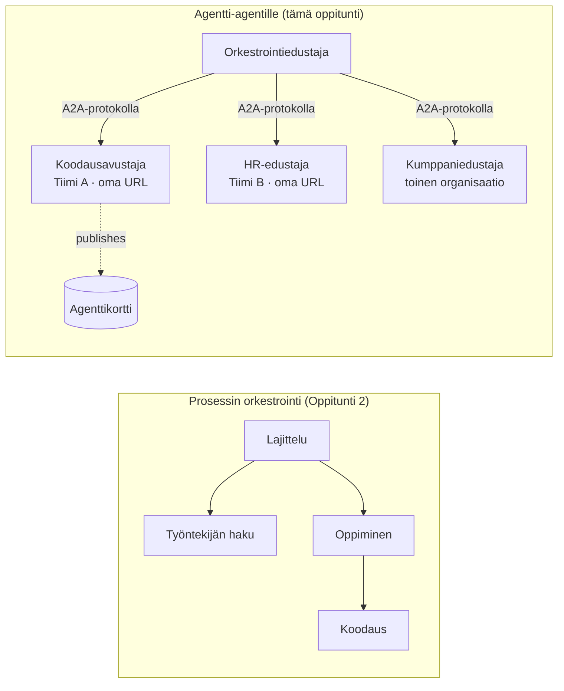

# Oppitunti 7: Moni-agenttien orkestrointi & Agentti-agentille (A2A)

Oppitunnissa [Oppitunti 6](../lesson-6-toolbox/README.md) voit rakentaa hallittuja työkaluja ja isännöityjä agentteja.
Mutta todelliset järjestelmät harvoin käyttävät **yhtä** agenttia. Kun skaalaat, yhdistät **monta** agenttia — osa on sinun,
osa muiden tiimien omistuksessa, osa toimii kokonaan muissa organisaatioissa. Tämä oppitunti käsittelee
miten agentit toimivat **yhdessä**.

Tapasit jo yhden moni-agenttisen suunnittelun muodon
[Oppitunnin 2 `agent-orchestration.py`](../lesson-2-agent-development/README.md) tapauksessa: **handoff**
-malli, jossa seulontagentti ohjaa spesialisteille **yhden prosessin sisällä**. Tässä oppitunnissa mennään
seuraavalle tasolle — **Agentti-agentille (A2A)**, avoin protokolla agentteille, jotka toimivat itsenäisinä
**verkottuneina palveluina** ja kommunikoivat keskenään prosessin, tiimin ja organisaatiorajojen yli.

## Oppimistavoitteet

Tämän oppitunnin lopussa osaat:

- Selittää eron **prosessin sisäisen orkestroinnin** (handoff / työnkulut) ja
  **Agentti-agentti (A2A)** -viestinnän välillä ja valita oikean.
- Kuvailla A2A:n rakennuspalikat: **Agenttikortti**, **taidot**, **tehtävät** ja **löytö**.
- **Julkistaa** Microsoft Agent Framework -agentin A2A-palveluna `A2AExecutor`-luokalla.
- **Kuluttaa** etäagenttia verkottuneena vertaisena `A2AAgent`-luokalla.
- Soveltaa yritystarpeita A2A:han: **turvallisuus, identiteetti, hallinto, havaittavuus ja kustannukset**.

---

## Esivaatimukset

1. Suoritettu [Oppitunti 2](../lesson-2-agent-development/README.md) (agenttien kehitys & orkestrointi).
2. **Microsoft Foundry** -projekti, jossa ajantasainen mallin käyttöönotto (esim. `gpt-5.1` ja
   `gpt-5-codex` koodausesimerkissä). Vältä käytöstä poistetut GPT-4o / GPT-4.1 -mallit.
3. **Azure CLI** – kirjautuneena: `az login`.
4. **Python 3.12+** ja kurssin riippuvuudet asennettuna (`pip install -r ../requirements.txt`).
   Oppitunti 7 lisää esikatselupaketit `agent-framework-a2a`, `a2a-sdk` ja `uvicorn`.
5. `FOUNDRY_PROJECT_ENDPOINT` ja `FOUNDRY_MODEL` asetettuna `.env`-tiedostoon (katso kurssin README).

---

## 1. Kaksi tapaa, joilla agentit toimivat yhdessä

Ei ole olemassa yhtä ainoaa "moni-agentti" -mallia. Valitse se, joka sopii sinun **rajallesi**:

| Malli | Missä agentit toimivat | Miten ne yhdistyvät | Käytä kun |
|---------|------------------|------------------|----------|
| **Handoff / Työnkulku** (Oppitunti 2) | Yksi prosessi, yksi koodikanta | Muistissa oleva grafiikka (`HandoffBuilder`, `WorkflowBuilder`) | Omistat kaikki agentit ja otat ne käyttöön yhdessä. |
| **Agentti-agentille (A2A)** (tässä oppitunnissa) | Eri palvelut, erilliset elinkaaret | Avoin **A2A-protokolla** HTTP:n yli, löydetty **Agenttikorttien** avulla | Agentit ovat eri tiimien/organisaatioiden omistuksessa, skaalautuvat itsenäisesti tai on kirjoitettu eri kehyksillä. |

Handoff tarkoittaa **reititystä sovelluksen sisällä.** A2A tarkoittaa **agenttien koostamista itsenäisiksi
palveluiksi** — agenttien vastine siirtymiselle funktiokutsuista mikropalveluihin.



> **Ne muodostavat kokonaisuuden.** Orkestroija, jonka rakennat `HandoffBuilder`-luokalla, voi sisältää **etä-A2A-agentteja**
> osallistujina — prosessin sisäinen reititys palveluihin, jotka voivat toimia missä tahansa.

---

## 2. A2A:n rakennuspalikat

A2A on **avoin protokolla** (ei vain Microsoftin oma), joten A2A-agenttia voi käyttää Microsoft Agent Framework,
LangGraph, oma koodi tai toisen yrityksen stack. Neljä keskeistä käsitettä:

- **Agenttikortti** — pieni JSON-dokumentti, julkaistaan osoitteessa
  `/.well-known/agent-card.json`, joka mainostaa agentin **nimen, kuvauksen, URL-osoitteen, version,
  taidot ja kyvyt**. Tällä asiakas löytä agentin kyvyt.
- **Taidot** — agentin julistamat tehtävät (`id`, `nimi`, `kuvaus`, `tagit`,
  `esimerkit`). Asiakkaat (ja mallit) käyttävät näitä päättääkseen, kutsutaanko agenttia.
- **Tehtävät** — A2A-agentin kutsu on **tehtävä**, jolla on elinkaari (lähetetty → työn alla →
  suoritettu/epäonnistunut). Palvelin seuraa tehtäviä **tehtävävarastossa**; päivitykset striimataan.
- **Löytö** — asiakas, jolla on vain URL, hakee Agenttikortin ja tietää miten agenttia kutsutaan.

---

## 3. Julkista agentti A2A-palveluna — `a2a_server.py`

**Rakennus/palvelin**-puoli käärii minkä tahansa Microsoft Agent Framework -agentin `A2AExecutor`-sisään
ja asentaa sen A2A HTTP -sovellukseen. Katso [`a2a_server.py`](../../../lesson-7-multi-agent-a2a/a2a_server.py). Keskeinen kytkentä:

```python
from agent_framework.a2a import A2AExecutor
from a2a.server.apps import A2AStarletteApplication
from a2a.server.request_handlers import DefaultRequestHandler
from a2a.server.tasks import InMemoryTaskStore
from a2a.types import AgentCapabilities, AgentCard, AgentSkill

agent = client.as_agent(name="coding-assistant", instructions="...")

agent_card = AgentCard(
    name="Coding Assistant",
    description="Generates runnable code samples...",
    url="http://localhost:9000/",
    version="1.0.0",
    capabilities=AgentCapabilities(streaming=True),
    default_input_modes=["text"],
    default_output_modes=["text"],
    skills=[AgentSkill(id="generate-code", name="Generate code",
                       description="Write a runnable code snippet.", tags=["code"])],
)

request_handler = DefaultRequestHandler(
    agent_executor=A2AExecutor(agent),
    task_store=InMemoryTaskStore(),
)
app = A2AStarletteApplication(agent_card=agent_card, http_handler=request_handler).build()
# tarjoillaan uvicornilla portissa 9000
```

Huomaa, että agentin koodi on **muuttumatonta** — `A2AExecutor` sovittaa olemassa olevan agenttisi protokollaan.
Agenttikortti tekee siitä **löydettävän** mille tahansa A2A-asiakkaalle.

---

## 4. Käytä etäagenttia — `a2a_client.py`

**Käyttäjä** yhdistyy etäagenttiin **URL:n kautta**, hakee sen Agenttikortin ja kutsuu sitä
kuten paikallista agenttia. Katso [`a2a_client.py`](../../../lesson-7-multi-agent-a2a/a2a_client.py):

```python
from agent_framework.a2a import A2AAgent

remote_agent = A2AAgent(name="remote-coding-assistant", url="http://localhost:9000")
result = await remote_agent.run("Write a Python function that reverses a string.")
print(result.text)
```

Se on koko A2A:n idea: kutsujan näkökulmasta etäagentti toimii kuin mikä tahansa `agent_framework`-agentti,
joten voit käyttää sitä työnkulussa tai ohjata sille — vaikka se pyörii eri prosessissa,
eri koneella, eri tiimin omistamana.

### Suorita päästä päähän

```bash
# Terminaali 1 — käynnistä A2A-palvelu
python a2a_server.py

# Terminaali 2 — kutsu se
python a2a_client.py "Write a Python function that reverses a string."
```

Näet koodausavustajan vastauksen saapuvan A2A-protokollan yli. Avaa selaimella
`http://localhost:9000/.well-known/agent-card.json` nähdäksesi julkaistun Agenttikortin.

---

## 5. Yritysnäkökohdat

Agenttien muuttaminen verkottuneiksi palveluiksi tuo samat haasteet kuin minkä tahansa hajautetun järjestelmän —
plus muutamat tekoälykohtaiset:

- **Identiteetti & todennus.** Älä koskaan julkaise A2A-agenttia ilman todennusta. Agenttikortissa on
  `security` / `security_schemes`, ja `A2AAgent` hyväksyy `auth_interceptor`:n, jotta kutsujat voivat liittää
  tunnistetiedot (OAuth bearer -tokenit, API-avaimet). Käytä Entra ID:tä / hallittuja identiteettejä
  palvelujen väliseen todennukseen tuotannossa; aseta palvelu takaamaan suojattu rajapinta.
- **Hallinto.** Yhdistä A2A ja [Oppitunti 6 Toolbox](../lesson-6-toolbox/README.md): etäagentti voidaan julkaista
  **A2A-työkaluna** hallitussa työkalupakissa, jolloin RBAC, tunnistetietojen injektointi
  ja turvakäytännöt soveltuvat keskitetysti.
- **Havaittavuus.** Pyyntö ylittää nyt prosessirajat, joten lähetä jäljitystiedot kutsusta eteenpäin.
  Ota käyttöön [Foundryn havaittavuus / OpenTelemetry](../lesson-3-agent-evals/README.md) sekä
  orkestroijalle että jokaiselle etäagentille saadaksesi kokonaisen end-to-end-jäljityksen.
- **Versiointi.** Agenttikortissa on `version`. Kohtele sitä kuin API:ta: lisäykset ovat turvallisia;
  taitojen sopimuksen rikkominen vaatii uuden version ja migraatioajan käyttäjille.
- **Luotettavuus.** Etäagentit voivat epäonnistua itsenäisesti. Aseta aikakatkaisut (`A2AAgent(timeout=...)`), käsittele
  osittaiset virheet, äläkä anna yhden hitaan vertaisen estää koko orkestrointia.
- **Kustannukset.** Jokainen etäagenttikutsu on oma mallin kutsunsa. Haarautuminen lisää token-kulutusta —
  budjetoi sen mukaan, ja mieluummin reititä **yhdelle** parhaalle agentille kuin levitä monille.

---

## Käytännön harjoitukset

1. **Lisää toinen palvelu.** Kopioi `a2a_server.py` julkistaaksesi **employee-search** -agentin portissa
   9001 omalla Agenttikortilla ja taidoilla. Käynnistä molemmat ja kutsu kumpaakin asiakkaalta.
2. **Orkestroi etävertaiset.** Rakenna pieni `HandoffBuilder` (tai tavallinen reititin), jonka osallistujina ovat
   kaksi `A2AAgent`ia osoittamaan palveluihisi. Reititä kysely oikealle agentille.
3. **Suojaa se.** Lisää asiakaspuolelle `auth_interceptor` ja vaadi bearer-token palvelimelle.
   Mikä menee pieleen, jos token puuttuu? Mihin tallentaisit tokenin tuotannossa?
4. **Handoff_vs_A2A.** Kirjoita kaksi lyhyttä kappaletta: milloin pidät Oppitunnin 2 prosessin sisäisen
   handoffin, ja milloin A2A:n lisäkompleksisuus on perusteltu? Anna konkreettinen esimerkki kummastakin.

---

## Resurssit

- [Agentti-agentille (A2A) — Microsoft Agent Framework](https://learn.microsoft.com/agent-framework/user-guide/agent-orchestration/a2a)
- [Moni-agenttien orkestrointi — Microsoft Agent Framework](https://learn.microsoft.com/agent-framework/user-guide/agent-orchestration/)
- [A2A-protokollan määrittely](https://a2a-protocol.org/)
- [A2A Python SDK (`a2a-sdk`)](https://github.com/a2aproject/a2a-python)
- [Foundry Agent Service — moni-agenttien mallit](https://learn.microsoft.com/azure/ai-foundry/agents/concepts/connected-agents)

---

**Edellinen:** [Oppitunti 6 — Microsoft Toolbox](../lesson-6-toolbox/README.md)

---

<!-- CO-OP TRANSLATOR DISCLAIMER START -->
**Vastuuvapauslauseke**:
Tämä asiakirja on käännetty käyttämällä tekoälypohjaista käännöspalvelua [Co-op Translator](https://github.com/Azure/co-op-translator). Vaikka pyrimme tarkkuuteen, otathan huomioon, että automaattiset käännökset saattavat sisältää virheitä tai epätarkkuuksia. Alkuperäinen asiakirja sen alkuperäiskielellä on virallinen lähde. Tärkeissä asioissa suositellaan ammattimaista ihmiskäännöstä. Emme ole vastuussa tämän käännöksen käytöstä aiheutuvista väärinymmärryksistä tai tulkinnoista.
<!-- CO-OP TRANSLATOR DISCLAIMER END -->