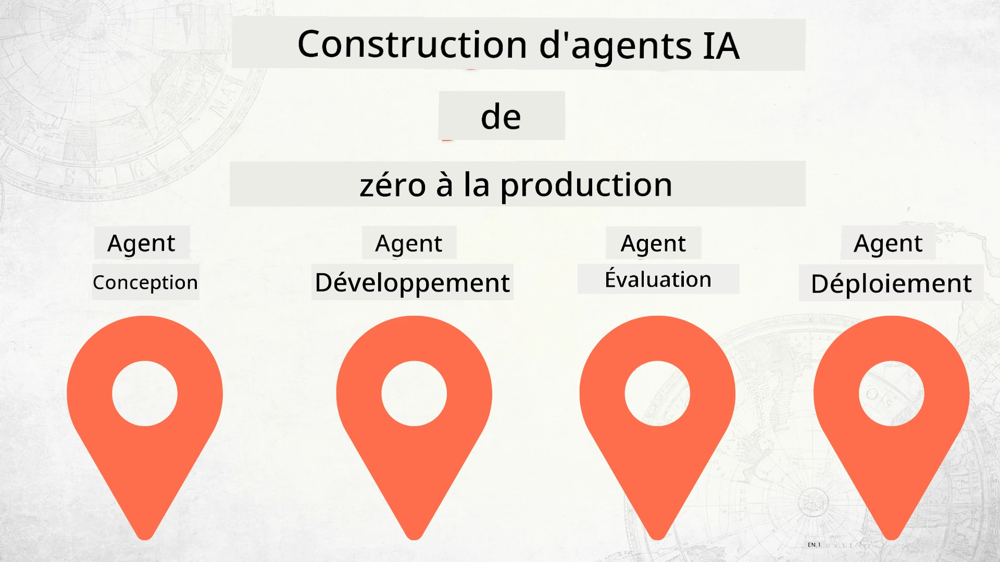

# Construire des Agents IA de Zéro à la Production



### 🌐 Support Multilingue

#### Pris en charge via GitHub Action (Automatisé & Toujours à Jour)

<!-- CO-OP TRANSLATOR LANGUAGES TABLE START -->
[Arabe](../ar/README.md) | [Bengali](../bn/README.md) | [Bulgare](../bg/README.md) | [Birman (Myanmar)](../my/README.md) | [Chinois (Simplifié)](../zh-CN/README.md) | [Chinois (Traditionnel, Hong Kong)](../zh-HK/README.md) | [Chinois (Traditionnel, Macao)](../zh-MO/README.md) | [Chinois (Traditionnel, Taïwan)](../zh-TW/README.md) | [Croate](../hr/README.md) | [Tchèque](../cs/README.md) | [Danois](../da/README.md) | [Néerlandais](../nl/README.md) | [Estonien](../et/README.md) | [Finnois](../fi/README.md) | [Français](./README.md) | [Allemand](../de/README.md) | [Grec](../el/README.md) | [Hébreu](../he/README.md) | [Hindi](../hi/README.md) | [Hongrois](../hu/README.md) | [Indonésien](../id/README.md) | [Italien](../it/README.md) | [Japonais](../ja/README.md) | [Kannada](../kn/README.md) | [Khmer](../km/README.md) | [Coréen](../ko/README.md) | [Lituanien](../lt/README.md) | [Malais](../ms/README.md) | [Malayalam](../ml/README.md) | [Marathi](../mr/README.md) | [Népalais](../ne/README.md) | [Pidgin Nigérian](../pcm/README.md) | [Norvégien](../no/README.md) | [Persan (Farsi)](../fa/README.md) | [Polonais](../pl/README.md) | [Portugais (Brésil)](../pt-BR/README.md) | [Portugais (Portugal)](../pt-PT/README.md) | [Pendjabi (Gurmukhi)](../pa/README.md) | [Roumain](../ro/README.md) | [Russe](../ru/README.md) | [Serbe (Cyrillique)](../sr/README.md) | [Slovaque](../sk/README.md) | [Slovène](../sl/README.md) | [Espagnol](../es/README.md) | [Swahili](../sw/README.md) | [Suédois](../sv/README.md) | [Tagalog (Filipino)](../tl/README.md) | [Tamoul](../ta/README.md) | [Télougou](../te/README.md) | [Thaï](../th/README.md) | [Turc](../tr/README.md) | [Ukrainien](../uk/README.md) | [Ourdou](../ur/README.md) | [Vietnamien](../vi/README.md)

> **Vous préférez cloner localement ?**
>
> Ce dépôt inclut plus de 50 traductions qui augmentent significativement la taille du téléchargement. Pour cloner sans les traductions, utilisez le sparse checkout :
>
> **Bash / macOS / Linux :**
> ```bash
> git clone --filter=blob:none --sparse https://github.com/microsoft/Building-AI-Agents-From-Zero-To-Production.git
> cd Building-AI-Agents-From-Zero-To-Production
> git sparse-checkout set --no-cone '/*' '!translations' '!translated_images'
> ```
>
> **CMD (Windows) :**
> ```cmd
> git clone --filter=blob:none --sparse https://github.com/microsoft/Building-AI-Agents-From-Zero-To-Production.git
> cd Building-AI-Agents-From-Zero-To-Production
> git sparse-checkout set --no-cone "/*" "!translations" "!translated_images"
> ```
>
> Cela vous donne tout ce dont vous avez besoin pour compléter le cours avec un téléchargement beaucoup plus rapide.
<!-- CO-OP TRANSLATOR LANGUAGES TABLE END -->

## Un cours vous enseignant les fondamentaux du cycle de vie de développement des agents IA

[](https://github.com/microsoft/Building-AI-Agents-From-Zero-To-Production/blob/master/LICENSE?WT.mc_id=academic-105485-koreyst)
[](https://GitHub.com/microsoft/Building-AI-Agents-From-Zero-To-Production/graphs/contributors/?WT.mc_id=academic-105485-koreyst)
[](https://GitHub.com/microsoft/Building-AI-Agents-From-Zero-To-Production/issues/?WT.mc_id=academic-105485-koreyst)
[](https://GitHub.com/microsoft/Building-AI-Agents-From-Zero-To-Production/pulls/?WT.mc_id=academic-105485-koreyst)
[](http://makeapullrequest.com?WT.mc_id=academic-105485-koreyst)

[](https://discord.gg/Kuaw3ktsu6)

## 🌱 Commencer

Ce cours comporte des leçons couvrant les fondamentaux de la création et du déploiement d’agents IA.

Chaque leçon s’appuie sur la précédente, nous recommandons donc de commencer par le début et de progresser jusqu'à la fin.

Si vous souhaitez explorer davantage les sujets relatifs aux agents IA, vous pouvez consulter le [cours Agents IA pour débutants](https://aka.ms/ai-agents-beginners).

### Rencontrez d’autres apprenants, obtenez des réponses à vos questions

Si vous êtes bloqué ou avez des questions sur la création d’agents IA, rejoignez notre canal Discord dédié dans le [Microsoft Foundry Discord](https://discord.gg/Kuaw3ktsu6).

### Ce dont vous avez besoin

Chaque leçon a son propre exemple de code que vous pouvez exécuter localement. Vous pouvez [forker ce dépôt](https://github.com/microsoft/Building-AI-Agents-From-Zero-To-Production/fork) pour créer votre propre copie.

Ce cours utilise actuellement les éléments suivants :

- [Microsoft Agent Framework (MAF)](https://aka.ms/ai-agents-beginners/agent-framework)
- [Microsoft Foundry](https://azure.microsoft.com/products/ai-foundry)
- [Azure OpenAI Service](https://azure.microsoft.com/products/ai-foundry/models/openai)
- [Azure CLI](https://learn.microsoft.com/cli/azure/authenticate-azure-cli?view=azure-cli-latest)

Veuillez vous assurer d’avoir accès à ces services avant de commencer.

Plus d’options autour de l’hébergement des modèles et des services à venir bientôt.

## 🗃️ Leçons

| **Leçon**           | **Description**                                                                                  |
|--------------------|--------------------------------------------------------------------------------------------------|
| [Conception d’agent](./lesson-1-agent-design/README.md)       | Une introduction à notre cas d’usage "Intégration des développeurs" et comment concevoir des agents efficaces |
| [Développement d’agent](./lesson-2-agent-development/README.md)  | En utilisant Microsoft Agent Framework (MAF), créez 3 agents pour aider les nouveaux développeurs à s’intégrer.      |
| [Évaluations d’agents](./lesson-3-agent-evals/README.md)  | Avec Microsoft Foundry, découvrez les performances de nos agents IA et comment les améliorer.                       |
| [Déploiement d’agent](./lesson-4-agent-deployment/README.md)   | Avec les agents hébergés et OpenAI Chatkit, découvrez comment déployer un agent IA en production.                     |


## 🎒 Autres cours

Notre équipe produit d’autres cours ! Découvrez :

<!-- CO-OP TRANSLATOR OTHER COURSES START -->
### LangChain
[](https://aka.ms/langchain4j-for-beginners)
[](https://aka.ms/langchainjs-for-beginners?WT.mc_id=m365-94501-dwahlin)
[](https://github.com/microsoft/langchain-for-beginners?WT.mc_id=m365-94501-dwahlin)
---

### Azure / Edge / MCP / Agents
[](https://github.com/microsoft/AZD-for-beginners?WT.mc_id=academic-105485-koreyst)
[](https://github.com/microsoft/edgeai-for-beginners?WT.mc_id=academic-105485-koreyst)
[](https://github.com/microsoft/mcp-for-beginners?WT.mc_id=academic-105485-koreyst)
[](https://github.com/microsoft/ai-agents-for-beginners?WT.mc_id=academic-105485-koreyst)

---
 
### Série IA Générative
[](https://github.com/microsoft/generative-ai-for-beginners?WT.mc_id=academic-105485-koreyst)
[-9333EA?style=for-the-badge&labelColor=E5E7EB&color=9333EA)](https://github.com/microsoft/Generative-AI-for-beginners-dotnet?WT.mc_id=academic-105485-koreyst)
[-C084FC?style=for-the-badge&labelColor=E5E7EB&color=C084FC)](https://github.com/microsoft/generative-ai-for-beginners-java?WT.mc_id=academic-105485-koreyst)
[-E879F9?style=for-the-badge&labelColor=E5E7EB&color=E879F9)](https://github.com/microsoft/generative-ai-with-javascript?WT.mc_id=academic-105485-koreyst)

---
 
### Apprentissage Fondamental
[](https://aka.ms/ml-beginners?WT.mc_id=academic-105485-koreyst)
[](https://aka.ms/datascience-beginners?WT.mc_id=academic-105485-koreyst)
[](https://aka.ms/ai-beginners?WT.mc_id=academic-105485-koreyst)
[](https://github.com/microsoft/Security-101?WT.mc_id=academic-96948-sayoung)
[](https://aka.ms/webdev-beginners?WT.mc_id=academic-105485-koreyst)
[](https://aka.ms/iot-beginners?WT.mc_id=academic-105485-koreyst)
[](https://github.com/microsoft/xr-development-for-beginners?WT.mc_id=academic-105485-koreyst)

---
 
### Série Copilot
[](https://aka.ms/GitHubCopilotAI?WT.mc_id=academic-105485-koreyst)
[](https://github.com/microsoft/mastering-github-copilot-for-dotnet-csharp-developers?WT.mc_id=academic-105485-koreyst)
[](https://github.com/microsoft/CopilotAdventures?WT.mc_id=academic-105485-koreyst)
<!-- CO-OP TRANSLATOR OTHER COURSES END -->

## Contribution

Ce projet accueille volontiers les contributions et suggestions. La plupart des contributions nécessitent que vous acceptiez un
Accord de Licence de Contributeur (CLA) déclarant que vous avez le droit de, et que vous accordez effectivement,
les droits d'utiliser votre contribution. Pour plus de détails, consultez <https://cla.opensource.microsoft.com>.

Lorsque vous soumettez une demande de tirage, un robot CLA déterminera automatiquement si vous devez fournir
un CLA et décorera la PR en conséquence (par exemple, vérification du statut, commentaire). Suivez simplement les instructions
fournies par le robot. Vous n'aurez à faire cela qu'une seule fois pour tous les dépôts utilisant notre CLA.

Ce projet a adopté le [Code de conduite Open Source de Microsoft](https://opensource.microsoft.com/codeofconduct/).
Pour plus d'informations, consultez la [FAQ du Code de conduite](https://opensource.microsoft.com/codeofconduct/faq/) ou
contactez [opencode@microsoft.com](mailto:opencode@microsoft.com) pour toute question ou commentaire supplémentaire.

## Marques déposées

Ce projet peut contenir des marques déposées ou logos de projets, produits ou services. L'utilisation autorisée des marques
ou logos Microsoft est soumise aux [Directives sur les marques et la marque Microsoft](https://www.microsoft.com/legal/intellectualproperty/trademarks/usage/general).
L'utilisation des marques ou logos Microsoft dans des versions modifiées de ce projet ne doit pas prêter à confusion ni impliquer un parrainage de Microsoft.
Toute utilisation des marques déposées ou logos de tiers est soumise aux politiques de ces tiers.

## Obtenir de l'aide

Si vous êtes bloqué ou avez des questions sur la création d'applications IA, rejoignez :

[](https://discord.gg/Kuaw3ktsu6)

Si vous avez des retours sur le produit ou rencontrez des erreurs lors du développement, visitez :

[](https://aka.ms/foundry/forum)

---

<!-- CO-OP TRANSLATOR DISCLAIMER START -->
**Avertissement** :  
Ce document a été traduit à l'aide du service de traduction automatique [Co-op Translator](https://github.com/Azure/co-op-translator). Bien que nous nous efforçons d'assurer l'exactitude, veuillez noter que les traductions automatisées peuvent contenir des erreurs ou des inexactitudes. Le document original dans sa langue native doit être considéré comme la source faisant autorité. Pour des informations critiques, une traduction humaine professionnelle est recommandée. Nous ne sommes pas responsables des malentendus ou des mauvaises interprétations résultant de l'utilisation de cette traduction.
<!-- CO-OP TRANSLATOR DISCLAIMER END -->