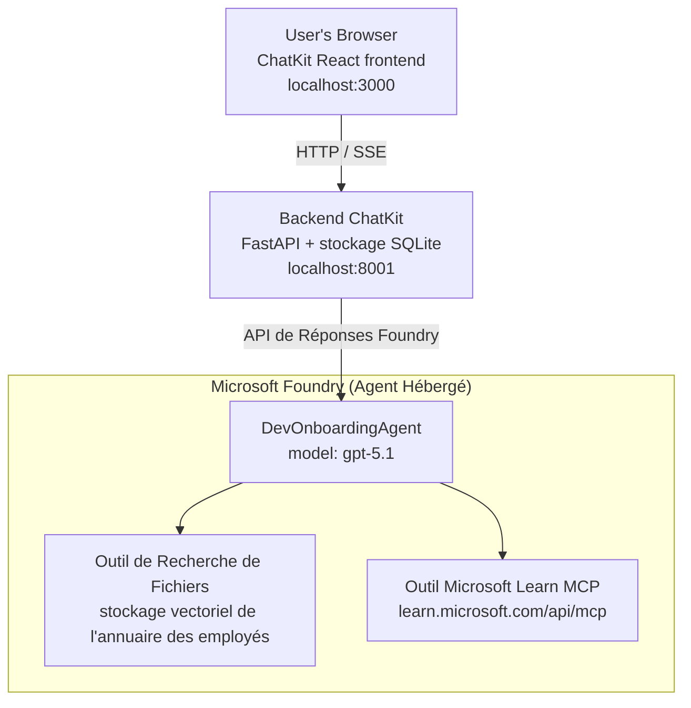

# Leçon 4 : Déploiement d'Agent avec les Agents Hébergés Microsoft Foundry + ChatKit

Cette leçon montre comment déployer un agent utilisant des outils sur Microsoft Foundry en tant qu'agent hébergé et créer un frontend basé sur ChatKit pour interagir avec lui.

## Architecture

L'agent hébergé est un **unique `DevOnboardingAgent`** (fonctionnant sur `gpt-5.1`) qui répond aux questions d'intégration des développeurs en utilisant deux outils hébergés : un outil **Recherche de Fichiers** sur le magasin vectoriel employee-directory, et l'outil **Microsoft Learn MCP**. Un frontend React ChatKit communique avec un backend FastAPI, qui appelle l'agent via l'**API Responses** de Foundry.



## Prérequis

1. **Projet Microsoft Foundry** dans la région North Central US
2. **Azure CLI** authentifié (`az login`)
3. **Azure Developer CLI** (`azd`) installé
4. **Python 3.12+** et **Node.js 18+**
5. **Magasin vectoriel** créé avec les données des employés

## Démarrage rapide

### 1. Configurez les variables d'environnement

```bash
cd lesson-4-agentdeployment
cp .env.example .env
# Modifiez .env avec les détails de votre projet Microsoft Foundry
```

### 2. Déployez l'agent hébergé

**Option A : Utilisation d'Azure Developer CLI (recommandé)**

```bash
cd hosted-agent
azd auth login
azd agent deploy
```

**Option B : Utilisation de Docker + Azure Container Registry**

```bash
cd hosted-agent

# Construire le conteneur
docker build -t developer-onboarding-agent:latest .

# Étiquette pour ACR
docker tag developer-onboarding-agent:latest <your-acr>.azurecr.io/developer-onboarding-agent:latest

# Pousser vers ACR
az acr login --name <your-acr>
docker push <your-acr>.azurecr.io/developer-onboarding-agent:latest

# Déployer via le portail Microsoft Foundry ou le SDK
```

### 3. Lancez le backend ChatKit

```bash
cd chatkit-server
python -m venv .venv
source .venv/bin/activate  # Sous Windows : .venv\Scripts\activate
pip install -r requirements.txt
python app.py
```

Le serveur démarrera à l'adresse `http://localhost:8001`

### 4. Lancez le frontend ChatKit

```bash
cd chatkit-server/frontend
npm install
npm run dev
```

Le frontend démarrera à l'adresse `http://localhost:3000`

### 5. Testez l'application

Ouvrez `http://localhost:3000` dans votre navigateur et essayez ces requêtes :

**Recherche d'employés :**
- "Je suis nouveau ici ! Quelqu'un a-t-il déjà travaillé chez Microsoft ?"
- "Qui a de l'expérience avec Azure Functions ?"

**Ressources d'apprentissage :**
- "Créez un parcours d'apprentissage pour Kubernetes"
- "Quelles certifications devrais-je obtenir pour l'architecture cloud ?"

**Aide au codage :**
- "Aide-moi à écrire du code Python pour me connecter à CosmosDB"
- "Montre-moi comment créer une Azure Function"

**Requêtes multi-agents :**
- "Je commence en tant qu'ingénieur cloud. À qui devrais-je me connecter et que devrais-je apprendre ?"

## Structure du projet

```
lesson-4-agentdeployment/
├── .env.example                 # Environment variables template
├── implementation-plan.md       # Detailed implementation guide
├── README.md                    # This file
├── hosted-agent/               # Microsoft Foundry hosted agent
│   ├── main.py                 # Multi-agent workflow implementation
│   ├── requirements.txt        # Python dependencies
│   ├── Dockerfile              # Container definition
│   └── agent.yaml              # Agent deployment configuration
└── chatkit-server/             # ChatKit server application
    ├── app.py                  # FastAPI backend
    ├── store.py                # SQLite persistence layer
    ├── requirements.txt        # Python dependencies
    └── frontend/               # React frontend
        ├── package.json
        ├── vite.config.ts
        ├── tsconfig.json
        ├── index.html
        └── src/
            ├── main.tsx
            ├── App.tsx
            ├── App.css
            └── index.css
```

## L'agent et ses outils

L'agent hébergé est un **agent unique** (`DevOnboardingAgent`, défini dans `hosted-agent/main.py`) qui gère trois domaines d'intégration. Plutôt que d'orchestrer des sous-agents séparés, il expose chaque capacité comme un outil (ou s'appuie directement sur le modèle) :

| Capacité | Comment elle est gérée | Outil |
|-----------|--------------------|------|
| **Recherche d'employés & connexions** | Recherche de fichiers hébergée par Foundry sur le magasin vectoriel employee-directory | `client.get_file_search_tool(vector_store_ids=[...])` |
| **Apprentissage & formation** | Serveur Microsoft Learn MCP (outil MCP hébergé) | `client.get_mcp_tool(url="https://learn.microsoft.com/api/mcp")` |
| **Assistance au codage** | Gérée directement par le modèle `gpt-5.1` — pas d'outil externe | — |

L'agent est créé avec `client.as_agent(name="DevOnboardingAgent", instructions=..., tools=[file_search_tool, learn_mcp_tool])` et servi avec `from_agent_framework(agent).run()`.

> **Note de conception.** Les premières versions de cette leçon utilisaient un workflow multi-agent `HandoffBuilder` (Triage → spécialistes). L'agent livré est un agent unique utilisant des outils, plus simple à déployer et à comprendre pour les Q&R d'intégration. Pour un exemple d'orchestration multi-agent et de transfert, voir la Leçon 2 et la Leçon 3.

## Test rapide de l'agent hébergé (gate CI)

Déployer un agent hébergé « avec succès » ne prouve que le plan de contrôle a accepté la
définition — cela ne prouve **pas** que l'agent répond réellement. Une dépendance manquante,
un mauvais routage du modèle ou une connexion expirée peuvent laisser un agent vert mais silencieux.

Cette leçon fournit un **test rapide** léger qui sert de gate rapide et peu coûteux post-déploiement.
Il utilise l’action GitHub [AI Smoke Test](https://github.com/marketplace/actions/ai-smoke-test)
pour POSTER des prompts au point de terminaison Foundry **Responses** de l'agent
(`POST {project_endpoint}/agents/{agent_name}/endpoint/protocols/openai/responses`)
et vérifier le texte retourné. Cela détecte en quelques secondes des déploiements cassés, des régressions d’auth, des dérives de prompt système et des ruptures de threading.


> Les tests rapides **ne remplacent pas** les évaluations complètes dans
> [Leçon 3](../lesson-3-agent-evals/README.md) — ils sont complémentaires. Les tests rapides
> répondent à *« l'agent est-il accessible, répond-il, et suit-il les attentes basiques du prompt ? »* ;
> les évaluations répondent à *« quelle est la qualité de la réponse ? »*. Exécutez la gate peu coûteuse à chaque déploiement.

### Ce qui est testé

Le catalogue se trouve dans [`hosted-agent/tests/smoke-tests.json`](../../../lesson-4-agentdeployment/hosted-agent/tests/smoke-tests.json)
et teste les trois domaines de l'agent ainsi que le respect du prompt et le threading multi-tours :

| Test | Ce qu'il vérifie |
|------|------------------|
| `reachability` | L'agent répond avec un texte non vide, dans le périmètre |
| `employee-search` | Le domaine recherche de fichiers renvoie un `200` sain (réponse dépendant des données) |
| `learning-path` | Le domaine apprentissage répète le sujet et produit une réponse de type parcours |
| `coding-assistance` | Le domaine codage renvoie une réponse Python sous forme de code |
| `prompt-adherence-offtopic` | La demande hors-sujet est redirigée, non répondue en détail |
| `threading-turn-1/2` | L'état de la conversation est conservé entre tours via `previous_response_id` |

### Exécutez-le en CI

Le workflow dans [`.github/workflows/smoke-test-hosted-agent.yml`](../../../.github/workflows/smoke-test-hosted-agent.yml)
a deux jobs :

- **`static`** — une gate rapide sans Azure qui s'exécute à chaque pull request et push :
  compile toutes les sources Python (`py_compile`) et vérifie les liens Markdown. Pas de secrets
  requis, donc cela fonctionne sur les PR fork.
- **`smoke`** — le test rapide connecté à Azure ci-dessous. Il s'exécute à la demande
  (Actions → **Agent CI (static + smoke)** → Run workflow) et peut être enchaîné après votre
  workflow de déploiement.

Configurez ces **variables** et **secrets** du dépôt pour le job smoke :

| Type | Nom | Valeur |
|------|------|-------|
| Variable | `FOUNDRY_PROJECT_ENDPOINT` | `https://<account>.services.ai.azure.com/api/projects/<project>` |
| Variable | `HOSTED_AGENT_NAME` | Nom de l'agent déployé (ex. `dev-onboarding` — doit correspondre à votre déploiement) |
| Secret | `AZURE_CLIENT_ID` / `AZURE_TENANT_ID` / `AZURE_SUBSCRIPTION_ID` | Identité fédérée OIDC pour `azure/login` |

L'identité du runner doit avoir le rôle **`Azure AI User`** sur le **scope du projet Foundry** pour pouvoir
appeler les points d'accès data-plane Responses (et conversations). Accordez-le avec :

```bash
az role assignment create \
  --assignee <object-id-or-appId-of-runner-identity> \
  --role "Azure AI User" \
  --scope "/subscriptions/<sub>/resourceGroups/<rg>/providers/Microsoft.CognitiveServices/accounts/<account>/projects/<project>"
```

### Exécutez-le localement

Vous pouvez exécuter le même catalogue avant de pousser. Obtenez un token data-plane avec le scope
`https://ai.azure.com/` et ciblez le runner sur votre déploiement :

```bash
# L'audience DOIT être https://ai.azure.com/ (les jetons cognitiveservices.azure.com sont rejetés)
export FOUNDRY_TOKEN=$(az account get-access-token --resource https://ai.azure.com/ --query accessToken -o tsv)

git clone https://github.com/JFolberth/ai-smoketest && cd ai-smoketest
python runner.py \
  --project-endpoint "https://<account>.services.ai.azure.com/api/projects/<project>" \
  --agent-name dev-onboarding \
  --tests-file ../lesson-4-agentdeployment/hosted-agent/tests/smoke-tests.json
```

Codes de sortie : `0` tous passés, `1` une assertion a échoué, `2` erreur runner (catalogue / token incorrect).

## Dépannage

### Agent ne répond pas
- Vérifiez que l'agent hébergé est déployé et en cours d'exécution dans Microsoft Foundry
- Vérifiez que `HOSTED_AGENT_NAME` et `HOSTED_AGENT_VERSION` correspondent à votre déploiement

### Erreurs du magasin vectoriel
- Assurez-vous que `VECTOR_STORE_ID` est correctement défini
- Vérifiez que le magasin vectoriel contient les données des employés

### Erreurs d'authentification
- Exécutez `az login` pour rafraîchir les identifiants
- Assurez-vous d'avoir accès au projet Microsoft Foundry

## Ressources

- [Documentation des Agents Hébergés Microsoft Foundry](https://learn.microsoft.com/en-us/azure/ai-foundry/agents/concepts/hosted-agents)
- [Microsoft Agent Framework](https://github.com/microsoft/agent-framework)
- [Exemple d’Intégration ChatKit](https://github.com/microsoft/agent-framework/tree/main/python/samples/demos/chatkit-integration)
- [Azure Developer CLI](https://learn.microsoft.com/en-us/azure/developer/azure-developer-cli/overview)
- [AI Smoke Test GitHub Action](https://github.com/marketplace/actions/ai-smoke-test)
- [Test rapide des agents Microsoft Foundry avec GitHub Actions (blog)](https://techcommunity.microsoft.com/blog/azuredevcommunityblog/smoke-test-microsoft-foundry-agents-with-github-actions/4531912)

---

## Étapes suivantes

Votre agent fonctionne sur une infrastructure gérée par Microsoft. Pour passer en production d'entreprise —
contrôler où ses données résident (souveraineté des données, réseau privé, apportez votre propre Azure
Cosmos DB / Stockage / Recherche AI) et gérer ses outils — continuez avec
**[Leçon 5 : Agents Hébergés en Production](../lesson-5-hosted-agents-production/README.md)**, qui
explique la différence cruciale entre **Agents Hébergés** et **Hôtes de Capacités**.

---

<!-- CO-OP TRANSLATOR DISCLAIMER START -->
**Avertissement** :
Ce document a été traduit à l'aide du service de traduction automatique [Co-op Translator](https://github.com/Azure/co-op-translator). Bien que nous nous efforçions d'assurer l'exactitude, veuillez noter que les traductions automatisées peuvent contenir des erreurs ou des inexactitudes. Le document original dans sa langue native doit être considéré comme la source faisant autorité. Pour les informations critiques, il est recommandé de recourir à une traduction professionnelle réalisée par un humain. Nous ne saurions être tenus responsables des malentendus ou erreurs d'interprétation découlant de l'utilisation de cette traduction.
<!-- CO-OP TRANSLATOR DISCLAIMER END -->