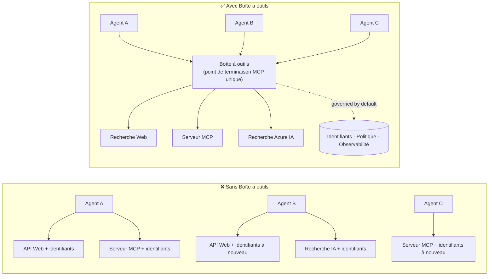

# Leçon 6 : Boîte à outils Microsoft — Outils gouvernés pour les agents

Comme expliqué dans la [Leçon 5](../lesson-5-hosted-agents-production/README.md), votre agent hébergé fonctionne en
production avec le stockage et la posture de gouvernance dont votre organisation a besoin. Mais regardez l'agent de la
Leçon 4 : chaque outil était **codé en dur** dans `main.py` — l'URL MCP de Microsoft Learn,
le magasin vectoriel de recherche de fichiers, etc. Cela fonctionne pour un seul agent. Cela ne **s'échelonne pas** à une
organisation avec des dizaines d'agents et d'équipes.

Cette leçon présente **Microsoft Toolbox** : la manière dont Foundry vous permet de définir un ensemble trié d'
outils **une fois**, de les gérer **centralement**, et de les exposer à n'importe quel agent via un **point de terminaison
unique et gouverné**.

## Objectifs d'apprentissage

À la fin de cette leçon, vous serez capable de :

- Expliquer le problème de prolifération des outils que Toolbox résout.
- Décrire les piliers **Build** et **Consume** ainsi que les types d'outils qu'une boîte à outils peut contenir.
- **Construire** une version de boîte à outils avec le SDK Foundry.
- **Consommer** une boîte à outils depuis un agent hébergé avec Microsoft Agent Framework via un point MCP unique.
- Utiliser la **gestion des versions** pour déployer des changements d'outils sans modifier ni redéployer le code de l'agent.
- Appliquer la **gouvernance** : RBAC, injection d'identifiants, et politiques de garde-fous (RAI).

---

## Prérequis

1. Avoir terminé la [Leçon 4](../lesson-4-agentdeployment/README.md) et idéalement
   la [Leçon 5](../lesson-5-hosted-agents-production/README.md).
2. Un projet **Microsoft Foundry** avec les permissions pour créer et gérer des ressources de boîte à outils.
3. **Azure CLI** authentifié : `az login`. Les API de la boîte à outils Foundry requièrent la
   portée de jeton `https://ai.azure.com/.default` (montrée dans le code ci-dessous).
4. **Python 3.12+** avec les dépendances du cours installées (`pip install -r ../requirements.txt`).
5. Un modèle déployé actuel et non retiré (par exemple `gpt-5.1`). Éviter GPT-4o / GPT-4.1 retirés.

---

## 1. Le problème : prolifération des outils

Un seul agent peut dépendre de nombreux outils — API REST, serveurs MCP, connecteurs, et flux — chacun
avec son propre modèle d'authentification et équipe propriétaire. En étendant à toute une organisation :

- Les équipes **ré-implémentent les mêmes outils** indépendamment.
- **Les identifiants sont dupliqués** entre agents et dépôts.
- La **gouvernance devient incohérente** — chaque agent applique (ou oublie) les politiques de son côté.
- Il y a **peu de visibilité** sur les outils existants ou leur utilisation.

Les développeurs bloquent — non pas parce que les modèles sont insuffisants, mais parce que **l’intégration des outils devient
un goulot d'étranglement**.



Les entreprises disposent déjà de l’infrastructure — passerelles, coffres-forts d’identifiants, politiques, observabilité.
Ce qui manquait, c’était une expérience développeur qui regroupe cela dans quelque chose **réutilisable,
découvrable et gouverné par défaut**. C’est cela que propose Toolbox.

---

## 2. Ce qu’est une boîte à outils

Une **Boîte à outils** est une **ressource gérée Foundry**. Vous définissez un ensemble trié d'outils une seule fois, les gérez
centralement dans Foundry, et les exposez via **un seul point de terminaison compatible MCP** que tout
agent peut consommer. Au moment de l'exécution, la plateforme gère **l'injection d'identifiants, le rafraîchissement de jeton, et
l'application des politiques d'entreprise**.

Parce qu'une boîte à outils est une ressource gérée, vous pouvez ajouter, retirer, ou reconfigurer des outils **sans
modifier le code de votre agent** — l'agent se connecte toujours au même point de terminaison.

Toolbox couvre le cycle de vie de l'outil à travers quatre piliers ; **Build** et **Consume** sont disponibles
dès aujourd'hui :

| Pilier | Statut | Ce qu’il permet |
|--------|--------|-----------------|
| **Build** | Disponible aujourd’hui | Sélectionner des outils, configurer l’authentification centralement, publier une boîte à outils réutilisable que toute équipe peut consommer. |
| **Consume** | Disponible aujourd’hui | Connecter n’importe quel agent à un point MCP compatible pour découvrir dynamiquement et invoquer tous les outils de la boîte à outils. |

La surface de consommation est **ouverte** : toute exécution ou client compatible MCP peut utiliser une boîte à outils —
Microsoft Agent Framework, LangGraph, GitHub Copilot, Claude Code, Microsoft Copilot Studio, ou
du code personnalisé.

### Types d'outils qu'une boîte à outils peut contenir

Recherche web · MCP · Azure AI Search · Interpréteur de code · Recherche de fichiers · OpenAPI · **Agent-à-agent
(A2A)** · Fabric IQ · Recherche d’outils · Work IQ · Automatisation de navigateur · Références de compétences, plus une
**politique de garde-fou (RAI)** appliquée au niveau de la boîte à outils.

> **Conseil :** Ajoutez une `description` à **chaque** outil afin que le modèle puisse choisir le bon. Une boîte à outils
> permet au maximum **un outil non nommé par type** — donnez à chaque instance supplémentaire du même type un
> `name` unique, sinon vous obtiendrez une erreur `invalid_payload`.

---

## 3. Construire une boîte à outils

Les boîtes à outils sont gérées avec les SDK Foundry (Python/.NET/JavaScript), l’API REST, `azd`, et le
**Microsoft Foundry Toolkit pour VS Code**. Voici le pattern Python (`azure-ai-projects`) :

```python
from azure.identity import DefaultAzureCredential
from azure.ai.projects import AIProjectClient
from azure.ai.projects.models import MCPTool, ToolboxSearchPreviewTool, WebSearchTool

endpoint = "https://<your-foundry-account>.services.ai.azure.com/api/projects/<your-project>"
project = AIProjectClient(endpoint=endpoint, credential=DefaultAzureCredential())

toolbox_version = project.toolboxes.create_toolbox_version(
    name="agent-tools",
    description="Web search + an MCP server + tool search",
    tools=[
        WebSearchTool(),
        MCPTool(
            server_label="myserver",
            server_url="https://your-mcp-server.example.com",
            require_approval="never",
            project_connection_id="my-key-auth-connection",  # les identifiants vivent dans Foundry
        ),
        ToolboxSearchPreviewTool(),
    ],
)
print(f"Created toolbox: {toolbox_version.name}, version: {toolbox_version.version}")
```

Notez ce que vous ne faites **pas** : pas de secrets dans l’agent. Les identifiants sont détenus par une
**connexion** Foundry (`project_connection_id`) et injectés par la plateforme au moment de l’appel.

> **Note préliminaire.** La **gestion** de Toolbox (création/mise à jour des versions) est une capacité en aperçu.
> Les opérations `project.toolboxes.*` montrées ci-dessus sont fournies dans les builds preview du SDK, l’API REST, `azd`,
> et le **Foundry Toolkit pour VS Code** — elles ne sont **pas** dans la version figée de `azure-ai-projects` utilisée
> ailleurs dans ce cours. Considérez ce snippet comme la forme de l’étape Build ; pour un
> parcours complet, créez la boîte à outils dans le **portail Foundry** ou avec le **Foundry Toolkit**. L’étape
> **Consume** ci-dessous fonctionne avec le SDK figé du cours aujourd’hui.

---

## 4. Consommer une boîte à outils depuis votre agent

Une boîte à outils expose un **point de terminaison MCP**. Il existe deux modèles :

| Rôle | Point de terminaison | Quand l’utiliser |
|------|----------|-------------|
| **Consommateur de boîte à outils** | `{project_endpoint}/toolboxes/{name}/mcp?api-version=v1` | Connecter les agents. Sert toujours la **version par défaut**. |
| **Développeur de boîte à outils** | `{project_endpoint}/toolboxes/{name}/versions/{version}/mcp?api-version=v1` | Tester une version spécifique avant de la promouvoir. |

> **Connectez les agents au point *consommateur*.** Puisqu’il sert toujours la version par défaut, vous
> pouvez promouvoir de nouvelles versions **sans modifier le code des agents ni redéployer**.

### Intégration avec un agent hébergé Microsoft Agent Framework

Rappelez-vous que l’agent de la Leçon 4 ajoutait un seul outil MCP codé en dur avec `client.get_mcp_tool(...)`. Avec
Toolbox, vous pointez à la place **un** `MCPStreamableHTTPTool` vers le point de terminaison de la boîte à outils — et l’agent
obtient **tous** les outils de la boîte, gouvernés centralement :

```python
import httpx
from azure.identity import DefaultAzureCredential, get_bearer_token_provider
from agent_framework import MCPStreamableHTTPTool

# Auth : La boîte à outils Foundry nécessite la portée https://ai.azure.com/.default
credential = DefaultAzureCredential()
token_provider = get_bearer_token_provider(credential, "https://ai.azure.com/.default")
http_client = httpx.AsyncClient(auth=_ToolboxAuth(token_provider), timeout=120.0)

TOOLBOX_ENDPOINT = os.environ["TOOLBOX_ENDPOINT"]  # injecté par la plateforme au moment de l'exécution

mcp_tool = MCPStreamableHTTPTool(
    name="toolbox",
    url=TOOLBOX_ENDPOINT,
    http_client=http_client,
    load_prompts=False,
)

agent = chat_client.as_agent(
    name="my-toolbox-agent",
    instructions="You are a helpful assistant with access to Foundry toolbox tools.",
    tools=[mcp_tool],
)
```

`.env` correspondant (notez : utilisez un modèle **actuel** tel que `gpt-5.1`, **pas** le retraité
`gpt-4o`) :

```env
FOUNDRY_PROJECT_ENDPOINT=https://<account>.services.ai.azure.com/api/projects/<project>
TOOLBOX_ENDPOINT=https://<account>.services.ai.azure.com/api/projects/<project>/toolboxes/agent-tools/mcp?api-version=v1
AZURE_AI_MODEL_DEPLOYMENT_NAME=gpt-5.1
```

> **Vérifiez d’abord.** Avant de câbler l’agent complet, connectez un SDK client MCP (`pip install mcp`) au
> point de terminaison **version-spécifique** et listez les outils pour confirmer qu’ils chargent comme attendu.

### Exécutez l'exemple de consommation

Cette leçon fournit un exemple exécutable côté consommation, [`toolbox_agent.py`](../../../lesson-6-toolbox/toolbox_agent.py). Il utilise
le même pattern `FoundryChatClient.get_mcp_tool(...)` que vous avez appris dans la Leçon 2, mais pointe l’unique
outil MCP vers votre point **boîte à outils** — ainsi l’agent obtient chaque outil gouverné dans la boîte :

```bash
# Dans votre .env, définissez TOOLBOX_ENDPOINT sur votre point de terminaison consommateur de la boîte à outils, puis :
python lesson-6-toolbox/toolbox_agent.py
```

Ouvrez l’URL imprimée `http://localhost:8096` et posez une question qui sollicite un des
outils de votre boîte. Ajoutez ou mettez à niveau un outil dans la boîte et posez de nouveau la question — **sans changer ce
code** — pour voir la gouvernance centrale et la gestion des versions en action.

---

## 5. Gestion des versions : déployer les changements d’outils en toute sécurité

La gestion des versions de Toolbox vous donne un contrôle explicite sur le moment où les changements prennent effet :

1. **Créez** une nouvelle version de la boîte à outils avec l’ensemble d’outils mis à jour.
2. **Testez** cette version via le point de terminaison version-spécifique (développeur).
3. **Promouvez** cette version en `default_version` quand vous êtes prêt.

Chaque agent pointé vers le point de terminaison **consommateur** prend en charge automatiquement la version
promue — **pas de modification de code, pas de redéploiement**. (La première version créée est automatiquement promue par défaut.)

C’est l’équivalent gouvernance des outils d’un déploiement blue/green : vous validez un changement dans l’isolement,
puis basculez la version par défaut pour tous les consommateurs simultanément.

---

## 6. Gouvernance : comment Toolbox améliore le contrôle

Toolbox est **gouverné par défaut**. Les leviers de gouvernance que vous devez connaître :

- **RBAC.** Accordez le rôle **Foundry User** sur le projet à chaque identité : le **développeur** qui
  gère les versions de la boîte à outils, l’**identité managée de l’agent** (pour les agents hébergés appelant les outils à
  l’exécution), et, pour les flux OAuth, l’**utilisateur final** dont l’identité est déléguée.
- **Identifiants centralisés.** Les identifiants des outils résident dans les **connexions** Foundry, pas dans le code de l’agent
  ni dans les fichiers `.env`. La plateforme les injecte et rafraîchit les jetons à l’exécution.
- **Garde-fous (politique RAI).** Attachez une politique d’IA responsable nommée à une version de boîte à outils via
  `policies.rai_config.rai_policy_name`. Elle s’exécute au **niveau de la boîte à outils**, indépendamment de tout
  filtre de contenu au niveau du modèle, en analysant les entrées et sorties des outils.
- **Approbation MCP.** Le paramètre par outil `require_approval` contrôle si un appel outil MCP nécessite une approbation —
  le même concept de workflow d’approbation que vous avez vu en [Leçon 5 §7](../lesson-5-hosted-agents-production/README.md#7-hosted-mcp-tools--approval-workflows).
- **Réseautage privé.** Toolbox prend en charge les configurations de réseau virtuel pour les entreprises souhaitant
  garder le trafic à l’intérieur de leur réseau.
- **Visibilité.** Parce que les outils sont catalogués centralement, vous obtenez enfin un inventaire de ce qui
  existe et qui le consomme.

---

## Exercices pratiques

1. **Refacturez la Leçon 4.** L’agent de la Leçon 4 code en dur l’outil MCP Microsoft Learn. Esquissez comment vous
   déplaceriez cet outil dans une boîte à outils `agent-tools` et redirigeriez `main.py` vers le point de terminaison
   consommateur de la boîte à outils. Quels changements dans `main.py` ? Qu’est-ce qui n’y vit plus ?
2. **Concevez une montée de version.** Vous devez ajouter un outil Web Search à une boîte à outils en production utilisée par cinq
   agents. Décrivez la séquence créer → tester → promouvoir et expliquez pourquoi aucun des cinq agents
   n’a besoin d’être redéployé.
3. **Choisissez les identités d’authentification.** Pour un agent hébergé qui appelle un outil MCP basé OAuth via une
   boîte à outils, listez quelles identités ont besoin du rôle **Foundry User** et pourquoi.
4. **Placement des garde-fous.** Expliquez la différence entre un filtre de contenu au niveau du modèle et un
   garde-fou de boîte à outils, et donnez un scénario où vous avez spécifiquement besoin du garde-fou de boîte à outils.

---

## Ressources

- [Créer, tester et déployer une boîte à outils dans Foundry](https://learn.microsoft.com/azure/foundry/agents/how-to/tools/toolbox)
- [Catalogue d’outils — Service Agent Foundry](https://learn.microsoft.com/azure/foundry/agents/concepts/tool-catalog)
- [Microsoft Agent Framework — fournisseur Microsoft Foundry (outils)](https://learn.microsoft.com/agent-framework/agents/providers/microsoft-foundry)
- [Présentation des garde-fous](https://learn.microsoft.com/azure/foundry/guardrails/guardrails-overview)
- [Commencer avec Foundry dans VS Code (Foundry Toolkit)](https://learn.microsoft.com/azure/ai-foundry/how-to/develop/get-started-projects-vs-code)
- [Model Context Protocol](https://modelcontextprotocol.io/)

---

**Précédent :** [Leçon 5 — Agents hébergés en production](../lesson-5-hosted-agents-production/README.md)
&nbsp;·&nbsp; **Suivant :** [Leçon 7 — Multi-agent & A2A](../lesson-7-multi-agent-a2a/README.md)

---

<!-- CO-OP TRANSLATOR DISCLAIMER START -->
**Avertissement** :
Ce document a été traduit à l'aide du service de traduction automatique [Co-op Translator](https://github.com/Azure/co-op-translator). Bien que nous nous efforçions d'assurer l'exactitude, veuillez noter que les traductions automatisées peuvent contenir des erreurs ou des inexactitudes. Le document original dans sa langue native doit être considéré comme la source faisant autorité. Pour les informations critiques, il est recommandé de recourir à une traduction professionnelle réalisée par un humain. Nous ne saurions être tenus responsables des malentendus ou erreurs d'interprétation découlant de l'utilisation de cette traduction.
<!-- CO-OP TRANSLATOR DISCLAIMER END -->