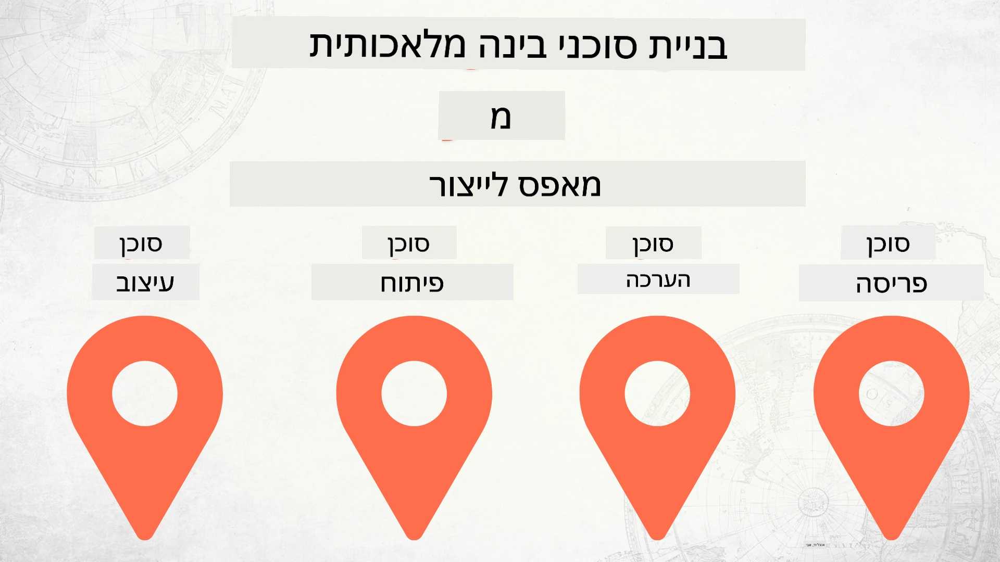

# בניית סוכני AI מאפס עד להפצה



### 🌐 תמיכה ברב-שפות

#### נתמך באמצעות GitHub Action (אוטומטי ותמיד מעודכן)

<!-- CO-OP TRANSLATOR LANGUAGES TABLE START -->
[ערבית](../ar/README.md) | [בנגלית](../bn/README.md) | [בולגרית](../bg/README.md) | [בורמזית (מיאנמר)](../my/README.md) | [סינית (מפושטת)](../zh-CN/README.md) | [סינית (מסורתית, הונג קונג)](../zh-HK/README.md) | [סינית (מסורתית, מקאו)](../zh-MO/README.md) | [סינית (מסורתית, טייוואן)](../zh-TW/README.md) | [קרואטית](../hr/README.md) | [צ׳כית](../cs/README.md) | [דנית](../da/README.md) | [הולנדית](../nl/README.md) | [אסטונית](../et/README.md) | [פינית](../fi/README.md) | [צרפתית](../fr/README.md) | [גרמנית](../de/README.md) | [יוונית](../el/README.md) | [עברית](./README.md) | [הינדי](../hi/README.md) | [הונגרית](../hu/README.md) | [אינדונזית](../id/README.md) | [איטלקית](../it/README.md) | [יפנית](../ja/README.md) | [קאנדה](../kn/README.md) | [קוריאנית](../ko/README.md) | [ליטאית](../lt/README.md) | [מלאית](../ms/README.md) | [מליאלאם](../ml/README.md) | [מרטהי](../mr/README.md) | [נפאלית](../ne/README.md) | [פידג'ין ניגרי](../pcm/README.md) | [נורווגית](../no/README.md) | [פרסית (פרסי)](../fa/README.md) | [פולנית](../pl/README.md) | [פורטוגזית (ברזיל)](../pt-BR/README.md) | [פורטוגזית (פורטוגל)](../pt-PT/README.md) | [פונג׳אבית (גרמוכי)](../pa/README.md) | [רומנית](../ro/README.md) | [רוסית](../ru/README.md) | [סרבית (קירילית)](../sr/README.md) | [סלובקית](../sk/README.md) | [סלובנית](../sl/README.md) | [ספרדית](../es/README.md) | [סווהילית](../sw/README.md) | [שוודית](../sv/README.md) | [טגלוג (פיליפינית)](../tl/README.md) | [טמילית](../ta/README.md) | [טלווגו](../te/README.md) | [תאית](../th/README.md) | [טורקית](../tr/README.md) | [אוקראינית](../uk/README.md) | [אורדו](../ur/README.md) | [וייטנאמית](../vi/README.md)

> **מעדיף לשכפל מקומית?**
>
> מאגר זה כולל מעל 50 תרגומים לשפות שונות, מה שמגדיל משמעותית את גודל ההורדה. כדי לשכפל ללא תרגומים, השתמש ב-sparse checkout:
>
> **Bash / macOS / Linux:**
> ```bash
> git clone --filter=blob:none --sparse https://github.com/microsoft/Building-AI-Agents-From-Zero-To-Production.git
> cd Building-AI-Agents-From-Zero-To-Production
> git sparse-checkout set --no-cone '/*' '!translations' '!translated_images'
> ```
>
> **CMD (Windows):**
> ```cmd
> git clone --filter=blob:none --sparse https://github.com/microsoft/Building-AI-Agents-From-Zero-To-Production.git
> cd Building-AI-Agents-From-Zero-To-Production
> git sparse-checkout set --no-cone "/*" "!translations" "!translated_images"
> ```
>
> זה נותן לך את כל מה שאתה צריך כדי להשלים את הקורס בהורדה הרבה יותר מהירה.
<!-- CO-OP TRANSLATOR LANGUAGES TABLE END -->

## קורס המלמד אותך את יסודות מחזור חיי הפיתוח של סוכן AI

[](https://github.com/microsoft/Building-AI-Agents-From-Zero-To-Production/blob/master/LICENSE?WT.mc_id=academic-105485-koreyst)
[](https://GitHub.com/microsoft/Building-AI-Agents-From-Zero-To-Production/graphs/contributors/?WT.mc_id=academic-105485-koreyst)
[](https://GitHub.com/microsoft/Building-AI-Agents-From-Zero-To-Production/issues/?WT.mc_id=academic-105485-koreyst)
[](https://GitHub.com/microsoft/Building-AI-Agents-From-Zero-To-Production/pulls/?WT.mc_id=academic-105485-koreyst)
[](http://makeapullrequest.com?WT.mc_id=academic-105485-koreyst)

[](https://discord.gg/Kuaw3ktsu6)

## 🌱 איך להתחיל

בקורס זה יש שיעורים המכסים את יסודות בניית והפצת סוכני AI.

כל שיעור בונה על הקודם, לכן מומלץ להתחיל מההתחלה ולעבור בהדרגה עד הסוף.

אם ברצונך לחקור נושאים נוספים הקשורים לסוכני AI, תוכל לעיין ב-[קורס סוכני AI למתחילים](https://aka.ms/ai-agents-beginners).

### פגוש לומדים אחרים, קבל מענה על שאלותיך

אם נתקעת או יש לך שאלות על בניית סוכני AI, הצטרף לערוץ הדיסקורד הייעודי שלנו ב-[Microsoft Foundry Discord](https://discord.gg/Kuaw3ktsu6).

### מה אתה צריך

לכל שיעור יש דוגמת קוד משלו שאפשר להריץ מקומית. ניתן [לפלג את המאגר הזה](https://github.com/microsoft/Building-AI-Agents-From-Zero-To-Production/fork) ליצירת עותק משלך.

כיום הקורס משתמש ב:

- [מסגרת הסוכן של מיקרוסופט (MAF)](https://aka.ms/ai-agents-beginners/agent-framework)
- [Microsoft Foundry](https://azure.microsoft.com/products/ai-foundry)
- [שירות Azure OpenAI](https://azure.microsoft.com/products/ai-foundry/models/openai)
- [Azure CLI](https://learn.microsoft.com/cli/azure/authenticate-azure-cli?view=azure-cli-latest)

אנא ודא שיש לך גישה לשירותים אלו לפני שתתחיל.

אפשרויות נוספות לאירוח מודלים ושירותים יגיעו בקרוב.

## 🗃️ שיעורים

| **שיעור**               | **תאור**                                                                                  |
|------------------------|---------------------------------------------------------------------------------------------|
| [עיצוב סוכן](./lesson-1-agent-design/README.md)         | מבוא למקרה השימוש "הסקת מפתחים" של הסוכן שלנו ואיך לעצב סוכנים יעילים                       |
| [פיתוח סוכן](./lesson-2-agent-development/README.md)     | שימוש במסגרת הסוכן של מיקרוסופט (MAF) ליצירת 3 סוכנים שיעזרו למפתחים חדשים להתוודע למערכת.    |
| [הערכת סוכן](./lesson-3-agent-evals/README.md)          | שימוש ב-Microsoft Foundry כדי לבדוק עד כמה סוכני ה-AI שלנו מבצעים ואיך לשפר אותם.             |
| [הפצת סוכן](./lesson-4-agent-deployment/README.md)       | שימוש בסוכנים מתארחים ו-OpenAI Chatkit, לראות איך לפרוס סוכן AI לפרודקשן.                     |


## 🎒 קורסים נוספים

הצוות שלנו מייצר קורסים נוספים! עיין ב:

<!-- CO-OP TRANSLATOR OTHER COURSES START -->
### LangChain
[](https://aka.ms/langchain4j-for-beginners)
[](https://aka.ms/langchainjs-for-beginners?WT.mc_id=m365-94501-dwahlin)
[](https://github.com/microsoft/langchain-for-beginners?WT.mc_id=m365-94501-dwahlin)
---

### Azure / Edge / MCP / Agents
[](https://github.com/microsoft/AZD-for-beginners?WT.mc_id=academic-105485-koreyst)
[](https://github.com/microsoft/edgeai-for-beginners?WT.mc_id=academic-105485-koreyst)
[](https://github.com/microsoft/mcp-for-beginners?WT.mc_id=academic-105485-koreyst)
[](https://github.com/microsoft/ai-agents-for-beginners?WT.mc_id=academic-105485-koreyst)

---

### סדרת Generative AI
[](https://github.com/microsoft/generative-ai-for-beginners?WT.mc_id=academic-105485-koreyst)
[-9333EA?style=for-the-badge&labelColor=E5E7EB&color=9333EA)](https://github.com/microsoft/Generative-AI-for-beginners-dotnet?WT.mc_id=academic-105485-koreyst)
[-C084FC?style=for-the-badge&labelColor=E5E7EB&color=C084FC)](https://github.com/microsoft/generative-ai-for-beginners-java?WT.mc_id=academic-105485-koreyst)
[-E879F9?style=for-the-badge&labelColor=E5E7EB&color=E879F9)](https://github.com/microsoft/generative-ai-with-javascript?WT.mc_id=academic-105485-koreyst)

---

### ליבה ללמידה
[](https://aka.ms/ml-beginners?WT.mc_id=academic-105485-koreyst)
[](https://aka.ms/datascience-beginners?WT.mc_id=academic-105485-koreyst)
[](https://aka.ms/ai-beginners?WT.mc_id=academic-105485-koreyst)
[](https://github.com/microsoft/Security-101?WT.mc_id=academic-96948-sayoung)
[](https://aka.ms/webdev-beginners?WT.mc_id=academic-105485-koreyst)
[](https://aka.ms/iot-beginners?WT.mc_id=academic-105485-koreyst)
[](https://github.com/microsoft/xr-development-for-beginners?WT.mc_id=academic-105485-koreyst)

---
 
### סדרת קופילוט
[](https://aka.ms/GitHubCopilotAI?WT.mc_id=academic-105485-koreyst)
[](https://github.com/microsoft/mastering-github-copilot-for-dotnet-csharp-developers?WT.mc_id=academic-105485-koreyst)
[](https://github.com/microsoft/CopilotAdventures?WT.mc_id=academic-105485-koreyst)
<!-- CO-OP TRANSLATOR OTHER COURSES END -->

## השתתפות בתרומות

פרויקט זה מקבל בברכה תרומות והצעות. רוב התרומות מצריכות שתסכים להסכם רישיון תורם (CLA) המצהיר שיש לך את הזכות, ובפועל אתה מעניק לנו את הזכויות להשתמש בתרומתך. לפרטים, בקר בכתובת <https://cla.opensource.microsoft.com>.

בעת הגשת בקשת משיכה, רובוט CLA יקבע באופן אוטומטי האם עליך לספק CLA ויעטר את בקשת המשיכה בהתאם (למשל, בדיקת סטטוס, תגובה). פשוט עקוב אחר ההוראות שמספק הרובוט. תצטרך לעשות זאת רק פעם אחת בכל הריפוזיטוריות המשתמשות ב-CLA שלנו.

פרויקט זה אימץ את [קוד ההתנהגות של מיקרוסופט בקוד פתוח](https://opensource.microsoft.com/codeofconduct/).
למידע נוסף ראה את [שאלות נפוצות על קוד ההתנהגות](https://opensource.microsoft.com/codeofconduct/faq/) או פנה ל-[opencode@microsoft.com](mailto:opencode@microsoft.com) לכל שאלה או הערה נוספת.

## סימני מסחר

פרויקט זה עשוי לכלול סימני מסחר או לוגואים של פרויקטים, מוצרים או שירותים. שימוש מורשה בסימני המסחר או הלוגואים של מיקרוסופט כפוף לחוקים וצריך לעקוב אחרי
[ההנחיות לסימני מסחר ומותגים של מיקרוסופט](https://www.microsoft.com/legal/intellectualproperty/trademarks/usage/general).
שימוש בסימני מסחר או לוגואים של מיקרוסופט בגרסאות שונו של פרויקט זה אסור שיגרום לבלבול או יביע חסות של מיקרוסופט.
כל שימוש בסימני מסחר או לוגואים של צדדים שלישיים כפוף למדיניות אותם צדדים שלישיים.

## קבלת עזרה

אם נתקלת בקושי או יש לך שאלות לגבי בניית אפליקציות AI, הצטרף ל:

[](https://discord.gg/Kuaw3ktsu6)

אם יש לך משוב על המוצר או שגיאות במהלך הבנייה, בקר ב:

[](https://aka.ms/foundry/forum)

---

<!-- CO-OP TRANSLATOR DISCLAIMER START -->
**הצהרת אחריות**:  
מסמך זה תורגם באמצעות שירות התרגום המבוסס בינה מלאכותית [Co-op Translator](https://github.com/Azure/co-op-translator). למרות שאנו שואפים לדיוק, יש להיות מודעים לכך שתרגומים אוטומטיים עלולים להכיל שגיאות או אי-דיוקים. יש להתייחס למסמך המקורי בשפת המקור שלו כמקור הסמכות. למידע קריטי מומלץ להיעזר בתרגום מקצועי אנושי. אנו לא נישא באחריות על הבנות שגויות או פרשנויות מוטעות הנובעות משימוש בתרגום זה.
<!-- CO-OP TRANSLATOR DISCLAIMER END -->