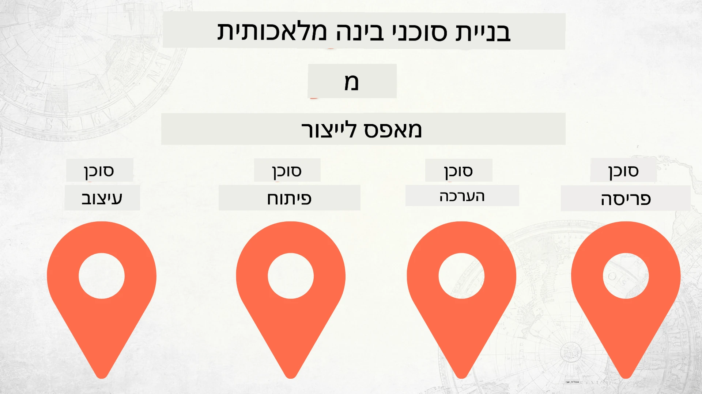

# בניית סוכני בינה מלאכותית מאפס ועד פרודקשן



### 🌐 תמיכה בריבוי שפות

#### נתמך באמצעות פעולה ב-GitHub (אוטומטי ותמיד מעודכן)

<!-- CO-OP TRANSLATOR LANGUAGES TABLE START -->
[Arabic](../ar/README.md) | [Bengali](../bn/README.md) | [Bulgarian](../bg/README.md) | [Burmese (Myanmar)](../my/README.md) | [Chinese (Simplified)](../zh-CN/README.md) | [Chinese (Traditional, Hong Kong)](../zh-HK/README.md) | [Chinese (Traditional, Macau)](../zh-MO/README.md) | [Chinese (Traditional, Taiwan)](../zh-TW/README.md) | [Croatian](../hr/README.md) | [Czech](../cs/README.md) | [Danish](../da/README.md) | [Dutch](../nl/README.md) | [Estonian](../et/README.md) | [Finnish](../fi/README.md) | [French](../fr/README.md) | [German](../de/README.md) | [Greek](../el/README.md) | [Hebrew](./README.md) | [Hindi](../hi/README.md) | [Hungarian](../hu/README.md) | [Indonesian](../id/README.md) | [Italian](../it/README.md) | [Japanese](../ja/README.md) | [Kannada](../kn/README.md) | [Khmer](../km/README.md) | [Korean](../ko/README.md) | [Lithuanian](../lt/README.md) | [Malay](../ms/README.md) | [Malayalam](../ml/README.md) | [Marathi](../mr/README.md) | [Nepali](../ne/README.md) | [Nigerian Pidgin](../pcm/README.md) | [Norwegian](../no/README.md) | [Persian (Farsi)](../fa/README.md) | [Polish](../pl/README.md) | [Portuguese (Brazil)](../pt-BR/README.md) | [Portuguese (Portugal)](../pt-PT/README.md) | [Punjabi (Gurmukhi)](../pa/README.md) | [Romanian](../ro/README.md) | [Russian](../ru/README.md) | [Serbian (Cyrillic)](../sr/README.md) | [Slovak](../sk/README.md) | [Slovenian](../sl/README.md) | [Spanish](../es/README.md) | [Swahili](../sw/README.md) | [Swedish](../sv/README.md) | [Tagalog (Filipino)](../tl/README.md) | [Tamil](../ta/README.md) | [Telugu](../te/README.md) | [Thai](../th/README.md) | [Turkish](../tr/README.md) | [Ukrainian](../uk/README.md) | [Urdu](../ur/README.md) | [Vietnamese](../vi/README.md)

> **מעדיפים לשכפל מקומית?**
>
> מאגר זה כולל יותר מ-50 תרגומים לשפות שונות, מה שמגדיל משמעותית את גודל ההורדה. כדי לשכפל ללא תרגומים, השתמשו ב-sparse checkout:
>
> **Bash / macOS / Linux:**
> ```bash
> git clone --filter=blob:none --sparse https://github.com/microsoft/Building-AI-Agents-From-Zero-To-Production.git
> cd Building-AI-Agents-From-Zero-To-Production
> git sparse-checkout set --no-cone '/*' '!translations' '!translated_images'
> ```
>
> **CMD (Windows):**
> ```cmd
> git clone --filter=blob:none --sparse https://github.com/microsoft/Building-AI-Agents-From-Zero-To-Production.git
> cd Building-AI-Agents-From-Zero-To-Production
> git sparse-checkout set --no-cone "/*" "!translations" "!translated_images"
> ```
>
> זה נותן לכם את כל מה שצריך להשלמת הקורס עם הורדה מהירה הרבה יותר.
<!-- CO-OP TRANSLATOR LANGUAGES TABLE END -->

## קורס המלמד את היסודות של מחזור פיתוח סוכני בינה מלאכותית

[](https://github.com/microsoft/Building-AI-Agents-From-Zero-To-Production/blob/master/LICENSE?WT.mc_id=academic-105485-koreyst)
[](https://GitHub.com/microsoft/Building-AI-Agents-From-Zero-To-Production/graphs/contributors/?WT.mc_id=academic-105485-koreyst)
[](https://GitHub.com/microsoft/Building-AI-Agents-From-Zero-To-Production/issues/?WT.mc_id=academic-105485-koreyst)
[](https://GitHub.com/microsoft/Building-AI-Agents-From-Zero-To-Production/pulls/?WT.mc_id=academic-105485-koreyst)
[](http://makeapullrequest.com?WT.mc_id=academic-105485-koreyst)

[](https://discord.gg/Kuaw3ktsu6)

## 🌱 נקודת התחלה

בקורס זה יש שיעורים שמכסים את היסודות של בנייה ופריסה של סוכני בינה מלאכותית.

כל שיעור בונה על קודמו, לכן מומלץ להתחיל מהתחלה ולהתקדם עד הסוף.

אם ברצונכם לחקור עוד על נושאי סוכני בינה מלאכותית, תוכלו לבדוק את [קורס סוכני בינה מלאכותית למתחילים](https://aka.ms/ai-agents-beginners).

### תפגשו לומדים אחרים, קבלו תשובות לשאלותיכם

אם נתקעתם או יש לכם שאלות לגבי בניית סוכני בינה מלאכותית, הצטרפו לערוץ ה-Discord הייעודי שלנו ב-[Microsoft Foundry Discord](https://discord.gg/Kuaw3ktsu6).

### מה שתצטרכו

לכל שיעור יש דוגמת קוד שניתן להריץ מקומית. אתם יכולים [לפורק את המאגר הזה](https://github.com/microsoft/Building-AI-Agents-From-Zero-To-Production/fork) כדי ליצור עותק משלכם.

הקורס משתמש כרגע ב:

- [מסגרת סוכנים של מייקרוסופט (MAF)](https://aka.ms/ai-agents-beginners/agent-framework)
- [Microsoft Foundry](https://azure.microsoft.com/products/ai-foundry) — פרויקט עם מודל בסדרת **GPT-5** פרוס (לדוגמה `gpt-5.1`). אל תשתמשו במודלים שפג תוקפם GPT-4o / GPT-4.1.
- [שירות OpenAI של Azure](https://azure.microsoft.com/products/ai-foundry/models/openai)
- [Azure CLI](https://learn.microsoft.com/cli/azure/authenticate-azure-cli?view=azure-cli-latest) — התחברו עם `az login` לפני הרצת דוגמה כלשהי
- **Python 3.12 או חדש יותר**

ודא שיש לך גישה לשירותים אלה לפני שתתחיל.

> **💰 עלויות וניקיון.** השיעורים המעשיים יוצרים משאבי Azure אמיתיים — פרויקט Microsoft Foundry,
> פריסת מודל, מאגר וקטורים, ובשיעורים 4 עד 6 סוכנים וכלי עבודה בהוסטינג.
> אלה עשויים לגרום לעלויות כל עוד הם קיימים. בסיום שיעור — או הקורס — מחקו את
> המשאבים שאינכם צריכים עוד. הפתרון הפשוט הוא לשים את הכל בקבוצת משאבים ייעודית
> ולמחוק את כל הקבוצה כשמסיימים:
>
> ```bash
> az group delete --name <your-resource-group> --yes --no-wait
> ```
>
> אפשר גם למחוק סוכנים פרטניים, מאגרי וקטורים, וכלי עבודה מהפורטל של Foundry.

> **הערה על מודלים.** קורס זה מספק את כל המודלים דרך **Microsoft Foundry**. הוא **אינו**
> משתמש ב-*GitHub Models*, שמפוטר ב-**30 ביולי 2026** — Microsoft Foundry היא
> הדרך הרשמית למעבר. אם יש לכם קוד ישן שפונה ל-GitHub Models, הפנו אותו לפריסת מודל Foundry
> במקום.

אפשרויות נוספות לאירוח מודלים ושירותים יגיעו בקרוב.

## 🗃️ שיעורים

| **שיעור**          | **תיאור**                                                                                   |
|--------------------|----------------------------------------------------------------------------------------------|
| [עיצוב סוכן](./lesson-1-agent-design/README.md)              | מבוא למקרה השימוש "הכשרת מפתחים" בעיצוב סוכנים יעילים                               |
| [פיתוח סוכן](./lesson-2-agent-development/README.md)         | באמצעות מסגרת סוכנים של מייקרוסופט (MAF), בנו קבוצת סוכנים מיוחדים שיעזרו למפתחים חדשים להשתלב.  |
| [הערכת סוכנים](./lesson-3-agent-evals/README.md)             | באמצעות Microsoft Foundry, בדקו כיצד סוכני הבינה המלאכותית שלנו מתפקדים ואיך לשפרם.            |
| [פריסת סוכן](./lesson-4-agentdeployment/README.md)            | באמצעות סוכנים מאוחסנים של Microsoft Foundry ו-OpenAI ChatKit, ראו כיצד לפרוס סוכן בינה מלאכותית לפרודקשן. |
| [סוכנים בהוסטינג פרודקשן](./lesson-5-hosted-agents-production/README.md) | קחו סוכן מאוחסן לפרודקשן ארגוני: סוכנים מאוחסנים מול מארחי יכולות, אחסון, זיכרון וממשל משלכם.     |
| [ארגז כלים של מייקרוסופט](./lesson-6-toolbox/README.md)       | הגדירו כלים פעם אחת ונוהלו אותם מרכזית: בנו ארגז כלים, צרכו אותו מסוכן דרך נקודת קצה MCP אחת, וגרסו כלים בבטחה.  |
| [סוכנים מרובי & A2A](./lesson-7-multi-agent-a2a/README.md)     | צרו סוכנים כשירותים מקושרים: חשפו סוכן דרך פרוטוקול Agent-to-Agent (A2A) פתוח, וצרכו סוכן מרוחק כעמית.        |


## 🎒 קורסים נוספים

הצוות שלנו מייצר קורסים נוספים! בדקו:

<!-- CO-OP TRANSLATOR OTHER COURSES START -->
### LangChain
[](https://aka.ms/langchain4j-for-beginners)
[](https://aka.ms/langchainjs-for-beginners?WT.mc_id=m365-94501-dwahlin)
[](https://github.com/microsoft/langchain-for-beginners?WT.mc_id=m365-94501-dwahlin)
---

### Azure / Edge / MCP / סוכנים
[](https://github.com/microsoft/AZD-for-beginners?WT.mc_id=academic-105485-koreyst)
[](https://github.com/microsoft/edgeai-for-beginners?WT.mc_id=academic-105485-koreyst)
[](https://github.com/microsoft/mcp-for-beginners?WT.mc_id=academic-105485-koreyst)
[](https://github.com/microsoft/ai-agents-for-beginners?WT.mc_id=academic-105485-koreyst)

---
 
### סדרת בינה מלאכותית יוצרת

[](https://github.com/microsoft/generative-ai-for-beginners?WT.mc_id=academic-105485-koreyst)
[-9333EA?style=for-the-badge&labelColor=E5E7EB&color=9333EA)](https://github.com/microsoft/Generative-AI-for-beginners-dotnet?WT.mc_id=academic-105485-koreyst)
[-C084FC?style=for-the-badge&labelColor=E5E7EB&color=C084FC)](https://github.com/microsoft/generative-ai-for-beginners-java?WT.mc_id=academic-105485-koreyst)
[-E879F9?style=for-the-badge&labelColor=E5E7EB&color=E879F9)](https://github.com/microsoft/generative-ai-with-javascript?WT.mc_id=academic-105485-koreyst)

---
 
### לימודי ליבה
[](https://aka.ms/ml-beginners?WT.mc_id=academic-105485-koreyst)
[](https://aka.ms/datascience-beginners?WT.mc_id=academic-105485-koreyst)
[](https://aka.ms/ai-beginners?WT.mc_id=academic-105485-koreyst)
[](https://github.com/microsoft/Security-101?WT.mc_id=academic-96948-sayoung)
[](https://aka.ms/webdev-beginners?WT.mc_id=academic-105485-koreyst)
[](https://aka.ms/iot-beginners?WT.mc_id=academic-105485-koreyst)
[](https://github.com/microsoft/xr-development-for-beginners?WT.mc_id=academic-105485-koreyst)

---
 
### סדרת קופיילוט
[](https://aka.ms/GitHubCopilotAI?WT.mc_id=academic-105485-koreyst)
[](https://github.com/microsoft/mastering-github-copilot-for-dotnet-csharp-developers?WT.mc_id=academic-105485-koreyst)
[](https://github.com/microsoft/CopilotAdventures?WT.mc_id=academic-105485-koreyst)
<!-- CO-OP TRANSLATOR OTHER COURSES END -->

## תרומה לפרויקט

פרויקט זה מקבל בברכה תרומות והצעות. רוב התרומות דורשות שתסכים ל-
הסכם זכויות תורם (CLA) המצהיר שיש לך את הזכות, ובאופן ממשי מעניק לנו
את הזכויות להשתמש בתרומתך. לפרטים, בקר בכתובת <https://cla.opensource.microsoft.com>.

כשאתה מגיש בקשת משיכה, בוט של CLA יקבע אוטומטית אם אתה צריך לספק
CLA ויעטר את בקשת המשיכה באופן מתאים (למשל, בדיקת סטטוס, תגובה). פשוט עקוב אחרי ההוראות
שסיפק הבוט. תצטרך לבצע זאת רק פעם אחת בכל הרפוזיטוריים שמשתמשים ב-CLA שלנו.

פרויקט זה אימץ את [קוד ההתנהגות של מיקרוסופט לקוד פתוח](https://opensource.microsoft.com/codeofconduct/).
למידע נוסף ראה את [שאלות נפוצות על קוד ההתנהגות](https://opensource.microsoft.com/codeofconduct/faq/) או
פנה ל-[opencode@microsoft.com](mailto:opencode@microsoft.com) עם שאלות או הערות נוספות.

## סימני מסחר

פרויקט זה עשוי להכיל סימני מסחר או לוגואים של פרויקטים, מוצרים או שירותים. שימוש מורשה ב-
סימני מסחר או לוגואים של מיקרוסופט כפוף ויש לעקוב אחרי
[הנחיות סימני המסחר והמותג של מיקרוסופט](https://www.microsoft.com/legal/intellectualproperty/trademarks/usage/general).
שימוש בסימני מסחר או לוגואים של מיקרוסופט בגרסאות משוננות של פרויקט זה אסור שיוביל לבלבול או ירמז על חסות מיקרוסופט.
כל שימוש בסימני מסחר או לוגואים של צדדים שלישיים כפוף למדיניות אותם צדדים.

## קבלת סיוע

אם אתה נתקע או שיש לך שאלות בנוגע לבניית אפליקציות בינה מלאכותית, הצטרף ל-

[](https://discord.gg/Kuaw3ktsu6)

אם יש לך משוב על מוצרים או שגיאות במהלך הבנייה, בקר ב-

[](https://aka.ms/foundry/forum)

---

<!-- CO-OP TRANSLATOR DISCLAIMER START -->
**כתב ויתור**:
מסמך זה תורגם באמצעות שירות תרגום אוטומטי [Co-op Translator](https://github.com/Azure/co-op-translator). למרות שאנו שואפים לדיוק, יש לקחת בחשבון שתרגומים אוטומטיים עלולים להכיל שגיאות או אי-דיוקים. יש להחשיב את המסמך המקורי בשפתו הטבעית כמקור הסמכות. למידע קריטי מומלץ להשתמש בתרגום מקצועי על ידי מתרגם אדם. אנו לא אחראים לכל אי-הבנה או פירוש שגוי הנובע מהשימוש בתרגום זה.
<!-- CO-OP TRANSLATOR DISCLAIMER END -->