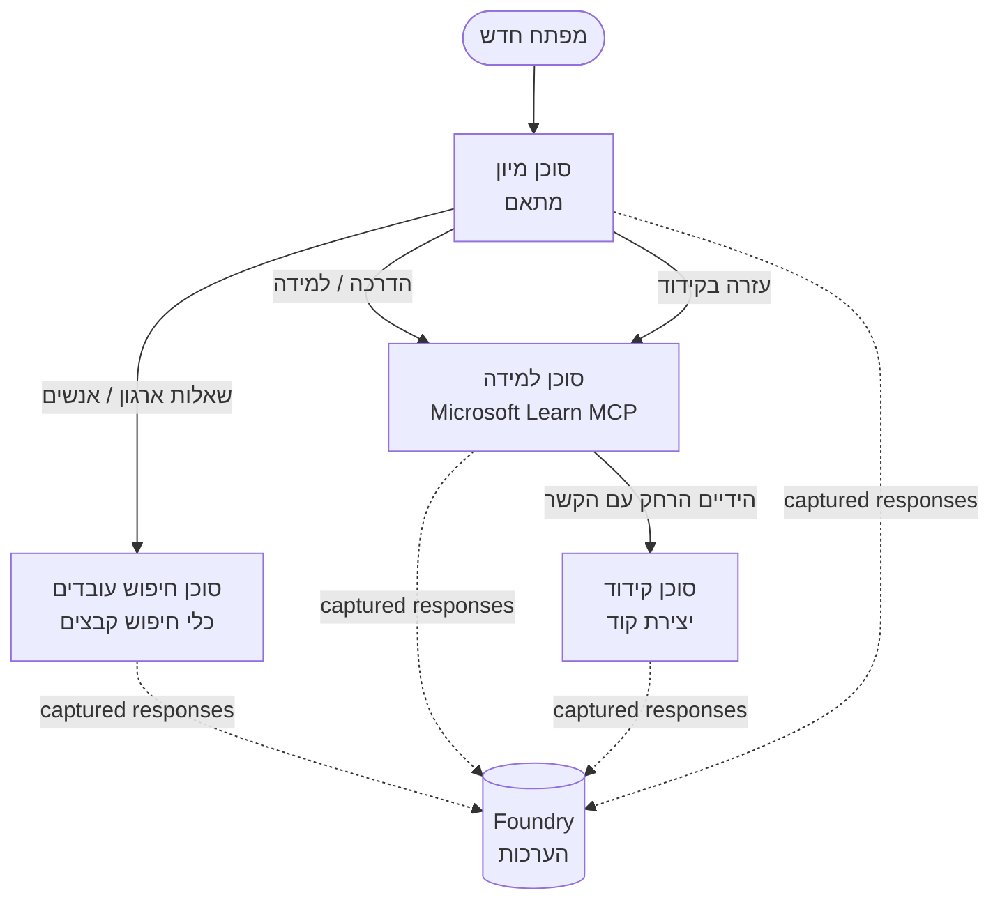

# שיעור 3: הערכת סוכנים עם Microsoft Foundry

ברוכים הבאים לשיעור השלישי בקורס **"בניית סוכני בינה מלאכותית מאפס לייצור"**!

ב-[שיעור 2](../lesson-2-agent-development/README.md) בניתם סוכנים. בשיעור זה תלמדו
איך לענות על שאלה הרבה יותר קשה: **האם הם טובים?** הפעלת סוכן
זה קל; לדעת האם הוא מנתב נכון, נשאר מעוגן בנתונים שלך, ומשתמש בכלים שלו כראוי - זה מה שמבחין בין הדגמה למערכת ייצור.


בשיעור זה נכסה:

- מדוע הערכת סוכנים חשובה וכיצד היא שונה מבדיקות מסורתיות
- ההבדל בין **תצפיתיות**, **בדיקות עישון**, ו**הערכות**
- תהליך העבודה הרב-סוכני שנמדוד
- ה**מעריכים המובנים של Microsoft Foundry** (רלוונטיות, עיגון, דיוק קריאת כלי, ניצול פלט הכלי)
- תהליך שלב אחר שלב של צינור ההערכה בקובץ [`agent-evals.py`](../../../lesson-3-agent-evals/agent-evals.py)
- כיצד להריץ את זה ולקרוא את התוצאות

---

## מדוע להעריך סוכנים?

בדיקת יחידה מסורתית בודקת ש-`add(2, 2) == 4`. סוכנים לא עובדים כך — אותו
פקודה יכולה לייצר נוסח שונה בכל הרצה, כלים יכולים להיקרא בסדרות שונות,
ו"נכון" הוא לעיתים קרובות עניין של דרגה ולא ערך בוליאני. אי אפשר לבדוק מחרוזות מדויקות.

במקום זאת, אתם מעריכים סוכנים לאורך **ממדי איכות** באמצעות מעריכים מבוססי מודל (נקראים גם
"LLM כמו שופט") בתוספת בדיקות דטרמיניסטיות על שימוש בכלים. זה אומר לכם דברים כמו:

- האם התשובה באמת התייחסה לשאלה? (**רלוונטיות**)
- האם התשובה נתמכה על ידי הנתונים שנשלפו, או שהסוכן הזים? (**עיגון**)
- האם הסוכן קרא לכלי הנכון עם הפרמטרים הנכונים? (**דיוק קריאת כלי**)
- האם הסוכן באמת ניצל את מה שהכלי החזיר? (**ניצול פלט הכלי**)

### שלוש שכבות איכות משלימות

אלו לא טכניקות מתחרות — סוכן ייצור משתמש בשלוש:

| שכבה | שאלה שהיא עונה | עלות | מתי היא רצה | מיושם ב |
|-------|--------------------|------|--------------|------------|
| **תצפיתיות / מעקב** | *מה הסוכן עשה, שלב אחר שלב?* | חינם (תמיד פועל) | ברציפות בייצור | שיעור זה |
| **בדיקות עישון** | *האם הסוכן זמין ועוקב אחר הפקודה הבסיסית שלו?* | זול, שניות | בכל פריסה | [שיעור 4](../lesson-4-agentdeployment/README.md#smoke-testing-the-hosted-agent-ci-gate) |
| **הערכות** | *כמה **טובות** התגובות?* | איטי יותר, מדוד על ידי המודל | על פי דרישה / מדי לילה / לפני שחרור | שיעור זה |

בדיקות עישון עונות "האם זה נשבר?"; הערכות עונות "האם זה טוב?". אתם רוצים את שניהם.

---

## דרישות מוקדמות

1. סיום [שיעור 2](../lesson-2-agent-development/README.md) (סוכנים + חנות וקטורים).
2. פרויקט **Microsoft Foundry**.
3. **התחברות ל-Azure CLI**: `az login`.
4. **Python 3.12+** ותלויות הקורס מותקנות:

   ```bash
   pip install -r ../requirements.txt
   ```


5. משתני סביבה (צור קובץ `.env` בתיקייה זו או ייצא אותם):

   | משתנה | מטרה |
   |----------|---------|
   | `FOUNDRY_PROJECT_ENDPOINT` | נקודת הסיום של פרויקט Foundry שלך (`https://<account>.services.ai.azure.com/api/projects/<project>`). נקרא על-ידי ה-`FoundryChatClient` של הסוכנים **וגם** על ידי העוזר להערכה. |
   | `FOUNDRY_MODEL` | פריסת המודל שעליו רצים **הסוכנים** (למשל `gpt-5.1`). |
   | `VECTOR_STORE_ID` | מאגר וקטורים של ספר הטלפונים ל עובדים שנוצר בשיעור 2 |
   | `AZURE_AI_MODEL_DEPLOYMENT_NAME` | פריסת המודל המשמשת **על ידי המעריכים** (ברירת מחדל ל-`FOUNDRY_MODEL`, ואז `gpt-5.1`) |

> הסוכנים משתמשים ב-`FoundryChatClient`, שקורא תצורה ממשתני הסביבה שמתחילים ב-`FOUNDRY_`
> (`FOUNDRY_PROJECT_ENDPOINT`, `FOUNDRY_MODEL`). העוזר להערכה בענן משתמש ב-SDK של `azure-ai-projects` ויחזור אל `FOUNDRY_PROJECT_ENDPOINT` אם
> `AZURE_AI_PROJECT_ENDPOINT` לא מוגדר — אז שני משתני ה-`FOUNDRY_` מספיקים
> כדי להפעיל את כל השיעור.
>
> המעריכים עצמם מופעלים על ידי מודל, לכן `AZURE_AI_MODEL_DEPLOYMENT_NAME`
> שולט באיזו פריסה מתבצע השיפוט — אין צורך שזה יהיה אותו מודל שהסוכנים שלך
> משתמשים בו.


---

## תהליך העבודה שאנחנו מעריכים

כדי להעריך משהו, קודם כל צריך להריץ אותו. שיעור זה משתמש שוב בתהליך העבודה רבי-הסוכנים של **קבלת מפתחים חדשים**:
מתאם **טירז'** מעביר לשלושה מומחים.



תהליך העבודה בנוי בעזרת תזמור ה-**העברת תפקידים (handoff)** במסגרת Microsoft Agent Framework. הרעיון המרכזי להערכה הוא שכל סיבוב של סוכן
נשמר בצד השרת ומזוהה על ידי `response_id`.
מזהי התגובות האלה הם מה שאנחנו מעבירים לשירות ההערכה.

---

## תהליך ההערכה שלב אחרי שלב

[`agent-evals.py`](../../../lesson-3-agent-evals/agent-evals.py) מיישם תהליך שישה שלבים. הנה מה שכל שלב עושה ולמה.


### שלב 1 — הרץ את תהליך העבודה ועקוב אחרי מזהי התגובה

תהליך העבודה מורץ עם `run_stream(...)`, וכשהאירועים זורמים חזרה הקוד רושם את
ה-`response_id` ו-`conversation_id` שהופקו על ידי כל סוכן. תגובות שנשמרו הן החומר הגולמי להערכה — אתה מדרג תגובות *אמיתיות* שצורפו לייצור, לא תגובות שנוצרו מחדש.


אכן הפעיל את הסוכנים שאתה מתכוון לדרג.


### שלב 3 — שלוף את התגובות הסופיות

עבור כל סוכן, מזהה התגובה האחרון (`response_id`) נשלף דרך הלקוח התומך OpenAI של הפרויקט
(`project_client.get_openai_client().responses.retrieve(...)`) כך שתוכל לצפות בטקסט
שיוערך.

### שלב 4 — צור את ההערכה

ההערכה נוצרת עם ארבעה **מעריכי Foundry מובנים**:

| מעריך | `evaluator_name` | מה שהוא מודד |
|-----------|------------------|------------------|

| רלוונטיות | `builtin.relevance` | האם התשובה מתייחסת לבקשת המשתמש? |

| עיגון | `builtin.groundedness` | האם התגובה נתמכת על ידי נתוני חיפוש/כלים שהושבו (ולא היא הזייה)? |
| דיוק קריאת כלי | `builtin.tool_call_accuracy` | האם הוזמנו הכלים הנכונים עם הפרמטרים הנכונים? |
| שימוש בתוצאות הכלי | `builtin.tool_output_utilization` | האם הסוכן אכן השתמש בתוצאות הכלי בתשובתו? |

כל מעריך מאותחל עם ההטמעה בשם `AZURE_AI_MODEL_DEPLOYMENT_NAME`.

> **למה ארבעת המדדים האלה?** הרלוונטיות והעיגון מודדים את *איכות התשובה*; שני המעריכים
> של הכלים מודדים *התנהגות סוכנית* — החלק שמדדי NLP מסורתיים מפספסים לחלוטין. עבור מערכת
> מרובת סוכנים המשתמשת בכלים, מדדי הכלים הם לרוב היכן שההידרדרויות האמיתיות מתרחשות.

### שלב 5 — הרץ את ההערכה

מזהי `response_id` שנתפסו מועברים ל- `evals.runs.create(...)` כמקור הנתונים. השירות משמיע כל תגובה שמורה דרך כל מעריך.


### שלב 6 — נטר וקרא את התוצאות

הקוד מבצע פולינג להרצה עד שהיא `completed` או `failed`, ואז מדפיס את ספירות התוצאות ו-
**`report_url`** — קישור עמוק בתוך פורטל Foundry שבו ניתן לבדוק ניקוד לפי מדד, ספרות הצלחה/כישלון, ותגובות מוערכות פרטניות.


---

## הרץ את זה

```bash
cd lesson-3-agent-evals
python agent-evals.py
```

כברירת מחדל הוא מעריך את שאילתת הדוגמה הראשונה
(`"אני חדש כאן! האם מישהו עבד כאן במיקרוסופט?"`). שתי שאילתות דוגמה נוספות מרובות מטרות
כלולות ב- `run_evaluation_workflow()` — החלף את המשתנה `query` לנסות תרחישי ניתוב
שהפעילו יותר סוכנים בהרצה אחת.

זרימת המסוף הצפויה:

```
Step 1: Running Developer Onboarding Workflow
Step 2: Response Data Summary
Step 3: Fetching Agent Responses
Step 4: Creating Evaluation
Step 5: Running Evaluation
Step 6: Monitoring Evaluation
  Status: running ...
  Evaluation completed successfully
  Report URL: https://...   <-- open this in the Foundry portal
```

---

## יכולת תצפית ומעקב

ההערכות אומרות לך *כמה טובות* התגובות היו; **יכולת התצפית** אומרת לך *מה קרה*
כדי להפיק אותן — כל קפיצה של סוכן, קריאה לכלי, ספירת טוקנים, ועכבה. ב-Microsoft Foundry,
הרצות סוכן משדרות עקבות OpenTelemetry שניתן לצפות בהם בפורטל, ומסגרת הסוכן יכולה
לייצא אותם ל-Azure Monitor / Application Insights בקריאה אחת:

```python
from agent_framework.foundry import FoundryChatClient

client = FoundryChatClient()
client.configure_azure_monitor()   # ייצוא עקבות + מדדים ל-Application Insights
```

השתמש במעקב כדי **לפתור תקלות** בציון הערכה גרוע: כאשר העיגון יורד, המעקב מראה לך
האם כלי חיפוש הקבצים לא החזיר כלום, או החזיר נתונים שהסוכן התעלם מהם (שזה בדיוק מה שציוני שימוש בתוצאות הכלי מודדים).


---

## מ"רצות" ל"טובות": איך להשתמש בזה בפועל

- **שער טרום-שחרור.** הרץ הערכות מול מערך קבוע של שאילתות ייצוגיות לפני
  קידום פקודה או דגם חדש. השווה ניקודים לגרסה הקודמת — התייחס לירידה כ
  רגרסיה.
- **סיגנל איכות לילי.** תזמן את ההערכה כדי לתפוס סטיות מ-נתונים או שינויים בתלות.
- **שילוב עם בדיקות סקור.** [בדיקת הסקור בשיעור 4](../lesson-4-agentdeployment/README.md#smoke-testing-the-hosted-agent-ci-gate)
  היא שער מהיר לכל פריסה; הערכות הן שער האיכות האיטי והעמוק יותר. הרץ את הזול
  על כל מיזוג ואת היקר בתזמון או לפני שחרור.


---

## הערת מודרניזציה

דגם זה мигרируется לממשק Microsoft Agent Framework Foundry הנוכחי
(`agent_framework.foundry`). אם אתה מעדכן את הקוד, ראה את שורש המאגר
[`MIGRATION-GUIDE.md`](../MIGRATION-GUIDE.md) עבור מיפויים מאומתים לפני/אחרי של ייבוא וקליינט
(למשל `AzureAIClient` -> `FoundryChatClient`, והקמת כלי מאוחסן באמצעות
`client.get_file_search_tool(...)` / `client.get_mcp_tool(...)`). מושגי ההערכה וצינור ששת השלבים למעלה לא השתנו עם ההגירה הזו.


---

## משאבים

- [הערכת דגמי AI גנרטיבי ויישומים (Microsoft Learn)](https://learn.microsoft.com/en-us/azure/ai-foundry/concepts/evaluation-approach-gen-ai)
- [מעריכים מובנים ל-AI גנרטיבי](https://learn.microsoft.com/en-us/azure/ai-foundry/concepts/evaluation-evaluators/agent-evaluators)
- [יכולת תצפית ב-Microsoft Foundry](https://learn.microsoft.com/en-us/azure/ai-foundry/concepts/observability)
- [Microsoft Agent Framework](https://github.com/microsoft/agent-framework)
- [תזמור העברת סוכן](https://learn.microsoft.com/en-us/agent-framework/workflows/orchestrations/handoff)

---

<!-- CO-OP TRANSLATOR DISCLAIMER START -->
**כתב ויתור**:
מסמך זה תורגם באמצעות שירות תרגום אוטומטי [Co-op Translator](https://github.com/Azure/co-op-translator). למרות שאנו שואפים לדיוק, יש לקחת בחשבון שתרגומים אוטומטיים עלולים להכיל שגיאות או אי-דיוקים. יש להחשיב את המסמך המקורי בשפתו הטבעית כמקור הסמכות. למידע קריטי מומלץ להשתמש בתרגום מקצועי על ידי מתרגם אדם. אנו לא אחראים לכל אי-הבנה או פירוש שגוי הנובע מהשימוש בתרגום זה.
<!-- CO-OP TRANSLATOR DISCLAIMER END -->