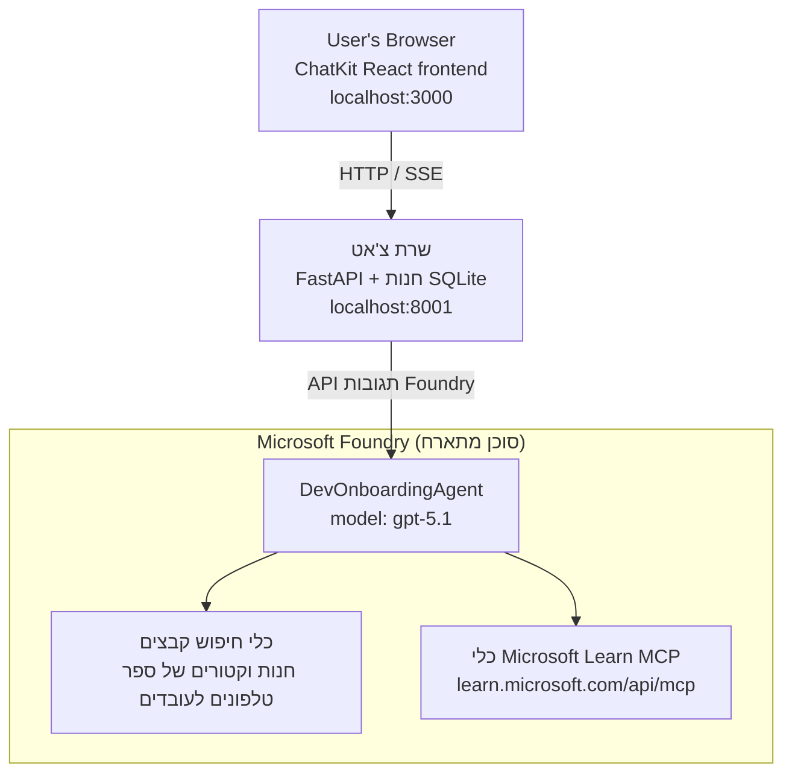

# שיעור 4: פריסת סוכן עם סוכני Microsoft Foundry בפועל + ChatKit

שיעור זה מדגים כיצד לפרוס סוכן שמשתמש בכלים ל-Microsoft Foundry כסוכן מתארח וליצור ממשק ChatKit כדי לתקשר איתו.

## ארכיטקטורה

הסוכן המתארח הוא **סוכן `DevOnboardingAgent` יחיד** (רץ על `gpt-5.1`) שמענה על שאלות שילוב למפתחים באמצעות שני כלים מתארחים: כלי **חיפוש קבצים** מעל חנות הווקטורים של ספריית העובדים, וכלי **Microsoft Learn MCP**. ממשק React של ChatKit מדבר עם backend של FastAPI, שמזמין את הסוכן דרך Foundry **Responses API**.



## דרישות מוקדמות

1. **פרויקט Microsoft Foundry** באזור North Central US
2. **Azure CLI** מאומת (`az login`)
3. **Azure Developer CLI** (`azd`) מותקן
4. **Python 3.12+** ו-**Node.js 18+**
5. **חנות וקטורים** שנוצרה עם נתוני עובדים

## התחלה מהירה

### 1. הגדרת משתני סביבה

```bash
cd lesson-4-agentdeployment
cp .env.example .env
# ערוך את קובץ .env עם פרטי פרויקט Microsoft Foundry שלך
```

### 2. פריסת הסוכן המתארח

**אפשרות א: שימוש ב-Azure Developer CLI (מומלץ)**

```bash
cd hosted-agent
azd auth login
azd agent deploy
```

**אפשרות ב: שימוש ב-Docker + Azure Container Registry**

```bash
cd hosted-agent

# בנה את המיכל
docker build -t developer-onboarding-agent:latest .

# תווית ל-ACR
docker tag developer-onboarding-agent:latest <your-acr>.azurecr.io/developer-onboarding-agent:latest

# דחוף ל-ACR
az acr login --name <your-acr>
docker push <your-acr>.azurecr.io/developer-onboarding-agent:latest

# פרוס באמצעות פורטל Microsoft Foundry או SDK
```

### 3. הפעלת backend של ChatKit

```bash
cd chatkit-server
python -m venv .venv
source .venv/bin/activate  # ב-Windows: .venv\Scripts\activate
pip install -r requirements.txt
python app.py
```

השרת יתחיל ב-`http://localhost:8001`

### 4. הפעלת frontend של ChatKit

```bash
cd chatkit-server/frontend
npm install
npm run dev
```

ה-frontend יתחיל ב-`http://localhost:3000`

### 5. בדיקת היישום

פתח את `http://localhost:3000` בדפדפן ונסה שאילתות אלה:

**חיפוש עובדים:**
- "אני חדש כאן! האם מישהו עבד במיקרוסופט?"
- "מי יש לו ניסיון עם Azure Functions?"

**משאבי למידה:**
- "צור מסלול למידה ל-Kubernetes"
- "אילו הסמכות כדאי לי לרדוף עבור אדריכלות ענן?"

**עזרה בקידוד:**
- "עזור לי לכתוב קוד Python לחיבור ל-CosmosDB"
- "הראה לי איך ליצור Azure Function"

**שאילתות עם סוכנים מרובים:**
- "אני מתחיל כמהנדס ענן. עם מי עליי להתחבר ומה עליי ללמוד?"

## מבנה הפרויקט

```
lesson-4-agentdeployment/
├── .env.example                 # Environment variables template
├── implementation-plan.md       # Detailed implementation guide
├── README.md                    # This file
├── hosted-agent/               # Microsoft Foundry hosted agent
│   ├── main.py                 # Multi-agent workflow implementation
│   ├── requirements.txt        # Python dependencies
│   ├── Dockerfile              # Container definition
│   └── agent.yaml              # Agent deployment configuration
└── chatkit-server/             # ChatKit server application
    ├── app.py                  # FastAPI backend
    ├── store.py                # SQLite persistence layer
    ├── requirements.txt        # Python dependencies
    └── frontend/               # React frontend
        ├── package.json
        ├── vite.config.ts
        ├── tsconfig.json
        ├── index.html
        └── src/
            ├── main.tsx
            ├── App.tsx
            ├── App.css
            └── index.css
```

## הסוכן וכליו

הסוכן המתארח הוא **סוכן יחיד** (`DevOnboardingAgent`, מוגדר ב-`hosted-agent/main.py`) שמטפל בשלושה תחומי שילוב. במקום לתזמן סוכנים משניים נפרדים, הוא חושף כל יכולת ככלי (או מסתמך על הדגם ישירות):

| יכולת | איך זה מטופל | כלי |
|-----------|------------------|------|
| **חיפוש וקשרים של עובדים** | כלי File Search מתארח של Foundry מעל חנות הווקטורים של ספריית העובדים | `client.get_file_search_tool(vector_store_ids=[...])` |
| **למידה והכשרה** | שרת Microsoft Learn MCP (כלי MCP מתארח) | `client.get_mcp_tool(url="https://learn.microsoft.com/api/mcp")` |
| **עזרה בקידוד** | מטופל ישירות על ידי דגם `gpt-5.1` — ללא כלי חיצוני | — |

הסוכן נוצר באמצעות `client.as_agent(name="DevOnboardingAgent", instructions=..., tools=[file_search_tool, learn_mcp_tool])` ומופעל באמצעות `from_agent_framework(agent).run()`.

> **הערת עיצוב.** טיוטות מוקדמות של שיעור זה השתמשו בתזמון מרובה סוכנים של `HandoffBuilder` (מיון → מומחים). הסוכן שהושק הוא סוכן יחיד המשתמש בכלי יחיד, וזה פשוט יותר לפריסה ולהבנה עבור סגנון שאלות ותשובות שילוב. לדוגמה של תזמון מרובה סוכנים והעברות, ראו שיעור 2 ושיעור 3.

## מבחן עישון לסוכן המתארח (שער CI)

פריסת סוכן מתארח "בהצלחה" מוכיחה רק ש-plane הבקרה קיבל את
ההגדרה — **לא** מוכיחה שהסוכן באמת עונה. תלות חסרה,
ניתוב דגם שגוי, או חיבור שפג תוקפו יכולים להשאיר סוכן ירוק אך דומם.

שיעור זה כולל **מבחן עישון** קל שמשמש כשער מהיר וזול לאחר הפריסה.
הוא משתמש ב-[AI Smoke Test](https://github.com/marketplace/actions/ai-smoke-test)
פעולת GitHub כדי לשלוח בקשות POST לנקודת הקצה של Foundry **Responses** של הסוכן
(`POST {project_endpoint}/agents/{agent_name}/endpoint/protocols/openai/responses`)
ומבצע בדיקה על הטקסט המוחזר. המבחן תופס פריסות שבורות, בעיות אישור,
סטייה מהנחיית מערכת והפרעות בשיחות תוך שניות.

> מבחני עישון **אינם** תחליף להערכות המלאות ב-
> [שיעור 3](../lesson-3-agent-evals/README.md) — הם משלים. מבחני עישון
> עונים *"האם הסוכן זמין, מגיב ועוקב אחרי ציפיות בסיסיות להנחיה?"*;
> הערכות עונות *"כמה טוב התשובה?"*. הרץ את השער הזול בכל פריסה.

### מה נבדק

הקטלוג נמצא ב-[`hosted-agent/tests/smoke-tests.json`](../../../lesson-4-agentdeployment/hosted-agent/tests/smoke-tests.json)
ומתנסה בשלושת התחומים של הסוכן בנוסף לעמידה בהנחיה ופתיחת שיחות מרובות שלבים:

| מבחן | מה הוא מאמת |
|------|------------------|
| `reachability` | הסוכן מגיב עם טקסט לא ריק ומתאים לתחום |
| `employee-search` | תחום חיפוש קבצים מחזיר תגובת `200` תקינה (התשובה תלויה בנתונים) |
| `learning-path` | תחום למידה משקף את הנושא ונותן תשובה בסגנון מסלול |
| `coding-assistance` | תחום קידוד מחזיר תשובה בצורת קוד Python |
| `prompt-adherence-offtopic` | בקשה לא שייכת מנותבת מחדש, לא נחענת בפרטים |
| `threading-turn-1/2` | מצב שיחה נשמר בין סבבים באמצעות `previous_response_id` |

### הרץ אותו ב-CI

תהליך העבודה ב-[`.github/workflows/smoke-test-hosted-agent.yml`](../../../.github/workflows/smoke-test-hosted-agent.yml)
כולל שני משימות:

- **`static`** — שער מהיר ללא Azure שמריץ בכל בקשת משיכה ודחיפה:
  הוא קומפילציה של כל קוד Python (`py_compile`) ובדיקת קישורי Markdown. אין צורך בסודות,
  ולכן עובד על בקשות משיכה מפיצול.
- **`smoke`** — מבחן העישון המחובר ל-Azure למטה. הוא מורץ לפי דרישה
  (Actions → **Agent CI (static + smoke)** → Run workflow) וניתן לקשר אותו לאחר
  תהליך הפריסה שלך.

קבע את **המשתנים** וה**סודות** של הריפוזיטורי עבור משימת העישון:

| סוג | שם | ערך |
|------|------|-------|

| משתנה | `FOUNDRY_PROJECT_ENDPOINT` | `https://<account>.services.ai.azure.com/api/projects/<project>` |
| משתנה | `HOSTED_AGENT_NAME` | שם הסוכן בפריסה (למשל `dev-onboarding` — חייב להתאים לפריסה שלך) |
| סודי | `AZURE_CLIENT_ID` / `AZURE_TENANT_ID` / `AZURE_SUBSCRIPTION_ID` | זהות מפוצלת OIDC ל־`azure/login` |

זהות הרץ צריכה את התפקיד **`Azure AI User`** בתחום הפרויקט Foundry כדי שיוכל
לקרוא לנקודות הקצה של מטוס הנתונים של Responses (ושיחות). הענק לו את זה עם:

```bash
az role assignment create \
  --assignee <object-id-or-appId-of-runner-identity> \
  --role "Azure AI User" \
  --scope "/subscriptions/<sub>/resourceGroups/<rg>/providers/Microsoft.CognitiveServices/accounts/<account>/projects/<project>"
```

### הרצה מקומית

ניתן להריץ את אותו קטלוג לפני ההעלאה. השג אסימון מטוס נתונים בטווח הכתובות של
`https://ai.azure.com/` והצב את הרץ על הפריסה שלך:

```bash
# הקהל חייב להיות https://ai.azure.com/ (אסימוני cognitiveservices.azure.com נדחים)
export FOUNDRY_TOKEN=$(az account get-access-token --resource https://ai.azure.com/ --query accessToken -o tsv)

git clone https://github.com/JFolberth/ai-smoketest && cd ai-smoketest
python runner.py \
  --project-endpoint "https://<account>.services.ai.azure.com/api/projects/<project>" \
  --agent-name dev-onboarding \
  --tests-file ../lesson-4-agentdeployment/hosted-agent/tests/smoke-tests.json
```

קודי יציאה: `0` הכל עבר, `1` אחת ההנחות נכשלה, `2` שגיאת רץ (קטלוג / אסימון שגויים).

## פתרון תקלות

### הסוכן לא מגיב
- ודא שהסוכן המתארח פרוס ופועל ב־Microsoft Foundry
- בדוק ש־`HOSTED_AGENT_NAME` ו־`HOSTED_AGENT_VERSION` מתאימים לפריסה שלך

### שגיאות באחסון הווקטורי
- ודא ש־`VECTOR_STORE_ID` מוגדר נכון
- ודא שאחסון הווקטורים מכיל את נתוני העובד

### שגיאות אימות
- הרץ `az login` לריענון האישורים
- ודא שיש לך גישה לפרויקט Microsoft Foundry

## משאבים

- [תיעוד סוכנים מתארחים של Microsoft Foundry](https://learn.microsoft.com/en-us/azure/ai-foundry/agents/concepts/hosted-agents)
- [מסגרת הסוכן של Microsoft](https://github.com/microsoft/agent-framework)
- [דוגמת שילוב ChatKit](https://github.com/microsoft/agent-framework/tree/main/python/samples/demos/chatkit-integration)
- [כלי פקודה למפתח Azure](https://learn.microsoft.com/en-us/azure/developer/azure-developer-cli/overview)
- [פעולה לבדיקת עשן AI ב־GitHub](https://github.com/marketplace/actions/ai-smoke-test)
- [בדיקת עשן לסוכני Microsoft Foundry עם פעולות GitHub (בלוג)](https://techcommunity.microsoft.com/blog/azuredevcommunityblog/smoke-test-microsoft-foundry-agents-with-github-actions/4531912)

---

## שלבים הבאים

הסוכן שלך פועל בתשתית מנוהלת על ידי מיקרוסופט. כדי להעביר אותו לייצור ארגוני –
לשלוט במקום שבו הנתונים שלו נשמרים (ריבונות נתונים, רשת פרטית, הבאת Azure Cosmos DB / Storage / AI Search משלך)
ולנהל את הכלים שלו – המשך אל
**[שיעור 5: סוכנים מתארחים בייצור](../lesson-5-hosted-agents-production/README.md)**, שבו
מוסבר ההבדל הקריטי בין **סוכנים מתארחים** לבין **מארחים עם יכולות**.

---

<!-- CO-OP TRANSLATOR DISCLAIMER START -->
**כתב ויתור**:
מסמך זה תורגם באמצעות שירות תרגום אוטומטי [Co-op Translator](https://github.com/Azure/co-op-translator). למרות שאנו שואפים לדיוק, יש לקחת בחשבון שתרגומים אוטומטיים עלולים להכיל שגיאות או אי-דיוקים. יש להחשיב את המסמך המקורי בשפתו הטבעית כמקור הסמכות. למידע קריטי מומלץ להשתמש בתרגום מקצועי על ידי מתרגם אדם. אנו לא אחראים לכל אי-הבנה או פירוש שגוי הנובע מהשימוש בתרגום זה.
<!-- CO-OP TRANSLATOR DISCLAIMER END -->