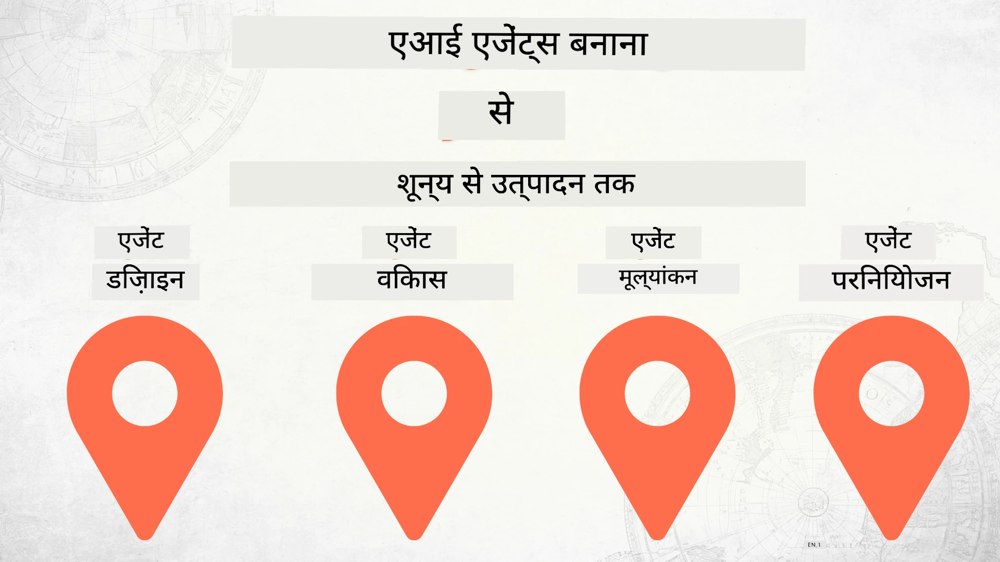

# शून्य से उत्पादन तक AI एजेंट बनाना



### 🌐 बहुभाषी समर्थन

#### GitHub Action के माध्यम से समर्थित (स्वचालित और हमेशा अपडेट रहता है)

<!-- CO-OP TRANSLATOR LANGUAGES TABLE START -->
[Arabic](../ar/README.md) | [Bengali](../bn/README.md) | [Bulgarian](../bg/README.md) | [Burmese (Myanmar)](../my/README.md) | [Chinese (Simplified)](../zh-CN/README.md) | [Chinese (Traditional, Hong Kong)](../zh-HK/README.md) | [Chinese (Traditional, Macau)](../zh-MO/README.md) | [Chinese (Traditional, Taiwan)](../zh-TW/README.md) | [Croatian](../hr/README.md) | [Czech](../cs/README.md) | [Danish](../da/README.md) | [Dutch](../nl/README.md) | [Estonian](../et/README.md) | [Finnish](../fi/README.md) | [French](../fr/README.md) | [German](../de/README.md) | [Greek](../el/README.md) | [Hebrew](../he/README.md) | [Hindi](./README.md) | [Hungarian](../hu/README.md) | [Indonesian](../id/README.md) | [Italian](../it/README.md) | [Japanese](../ja/README.md) | [Kannada](../kn/README.md) | [Korean](../ko/README.md) | [Lithuanian](../lt/README.md) | [Malay](../ms/README.md) | [Malayalam](../ml/README.md) | [Marathi](../mr/README.md) | [Nepali](../ne/README.md) | [Nigerian Pidgin](../pcm/README.md) | [Norwegian](../no/README.md) | [Persian (Farsi)](../fa/README.md) | [Polish](../pl/README.md) | [Portuguese (Brazil)](../pt-BR/README.md) | [Portuguese (Portugal)](../pt-PT/README.md) | [Punjabi (Gurmukhi)](../pa/README.md) | [Romanian](../ro/README.md) | [Russian](../ru/README.md) | [Serbian (Cyrillic)](../sr/README.md) | [Slovak](../sk/README.md) | [Slovenian](../sl/README.md) | [Spanish](../es/README.md) | [Swahili](../sw/README.md) | [Swedish](../sv/README.md) | [Tagalog (Filipino)](../tl/README.md) | [Tamil](../ta/README.md) | [Telugu](../te/README.md) | [Thai](../th/README.md) | [Turkish](../tr/README.md) | [Ukrainian](../uk/README.md) | [Urdu](../ur/README.md) | [Vietnamese](../vi/README.md)

> **स्थानीय रूप से क्लोन करना पसंद करें?**

> इस रिपॉजिटरी में 50+ भाषा अनुवाद शामिल हैं जो डाउनलोड आकार को काफी बढ़ाते हैं। अनुवाद के बिना क्लोन करने के लिए sparse checkout का उपयोग करें:
> ```bash
> git clone --filter=blob:none --sparse https://github.com/microsoft/Building-AI-Agents-From-Zero-To-Production.git
> cd Building-AI-Agents-From-Zero-To-Production
> git sparse-checkout set --no-cone '/*' '!translations' '!translated_images'
> ```
> यह आपको कोर्स पूरा करने के लिए आवश्यक सब कुछ बहुत तेज़ डाउनलोड के साथ देता है।
<!-- CO-OP TRANSLATOR LANGUAGES TABLE END -->

## AI एजेंट विकास जीवनचक्र के मूलभूत सिद्धांत पढ़ाने वाला कोर्स

[](https://github.com/microsoft/Building-AI-Agents-From-Zero-To-Production/blob/master/LICENSE?WT.mc_id=academic-105485-koreyst)
[](https://GitHub.com/microsoft/Building-AI-Agents-From-Zero-To-Production/graphs/contributors/?WT.mc_id=academic-105485-koreyst)
[](https://GitHub.com/microsoft/Building-AI-Agents-From-Zero-To-Production/issues/?WT.mc_id=academic-105485-koreyst)
[](https://GitHub.com/microsoft/Building-AI-Agents-From-Zero-To-Production/pulls/?WT.mc_id=academic-105485-koreyst)
[](http://makeapullrequest.com?WT.mc_id=academic-105485-koreyst)

[](https://discord.gg/Kuaw3ktsu6)

## 🌱 शुरुआत करना

यह कोर्स AI एजेंट बनाने और तैनात करने के मूल सिद्धांतों को कवर करता है।

प्रत्येक पाठ पिछले पाठ पर आधारित होता है, इसलिए हम शुरू से शुरू करने और अंत तक काम करने की सलाह देते हैं।

यदि आप AI एजेंट विषयों के बारे में अधिक जानना चाहते हैं, तो आप [AI Agents For Beginners Course](https://aka.ms/ai-agents-beginners) देख सकते हैं।

### अन्य शिक्षार्थियों से मिलें, अपने सवालों के जवाब पाएं

यदि आप अटक जाएं या AI एजेंट बनाने के बारे में कोई सवाल हो, तो हमारे समर्पित डिस्कॉर्ड चैनल में जुड़ें [Microsoft Foundry Discord](https://discord.gg/Kuaw3ktsu6)।

### आपको क्या चाहिए

प्रत्येक पाठ के लिए अपना कोड सैंपल होता है जिसे आप स्थानीय रूप से चला सकते हैं। आप [इस रिपॉजिटरी को फोर्क](https://github.com/microsoft/Building-AI-Agents-From-Zero-To-Production/fork) कर अपनी एक कॉपी बना सकते हैं।

यह कोर्स वर्तमान में निम्नलिखित का उपयोग करता है:

- [Microsoft Agent Framework (MAF)](https://aka.ms/ai-agents-beginners/agent-framework)
- [Microsoft Foundry](https://azure.microsoft.com/products/ai-foundry)
- [Azure OpenAI Service](https://azure.microsoft.com/products/ai-foundry/models/openai)
- [Azure CLI](https://learn.microsoft.com/cli/azure/authenticate-azure-cli?view=azure-cli-latest)

कृपया शुरू करने से पहले सुनिश्चित करें कि आपके पास इन सेवाओं तक पहुंच है।

मॉडल होस्टिंग और सेवाओं से संबंधित अधिक विकल्प जल्द ही आ रहे हैं।

## 🗃️ पाठ

| **पाठ**         | **विवरण**                                                                                  |
|--------------------|--------------------------------------------------------------------------------------------------|
| [एजेंट डिजाइन](./lesson-1-agent-design/README.md)       | हमारे "डेवलपर ऑनबोर्डिंग" एजेंट उपयोग मामले का परिचय और प्रभावी एजेंट डिजाइन कैसे करें  |
| [एजेंट विकास](./lesson-2-agent-development/README.md)  | Microsoft Agent Framework (MAF) का उपयोग करके, नए डेवलपर्स को ऑनबोर्ड करने में मदद के लिए 3 एजेंट बनाएं।       |
| [एजेंट मूल्यांकन](./lesson-3-agent-evals/README.md)  | Microsoft Foundry का उपयोग करके देखें कि हमारे AI एजेंट कितनी अच्छी प्रदर्शन कर रहे हैं और उन्हें कैसे बेहतर बनाएं। |
| [एजेंट तैनाती](./lesson-4-agent-deployment/README.md)   | Hosted Agents और OpenAI Chatkit का उपयोग करके देखें कि AI एजेंट को उत्पादन में कैसे तैनात करें।       |


## 🎒 अन्य कोर्स

हमारी टीम अन्य कोर्स भी बनाती है! देखें:

<!-- CO-OP TRANSLATOR OTHER COURSES START -->
### लैंगचेन
[](https://aka.ms/langchain4j-for-beginners)
[](https://aka.ms/langchainjs-for-beginners?WT.mc_id=m365-94501-dwahlin)

---

### Azure / Edge / MCP / Agents
[](https://github.com/microsoft/AZD-for-beginners?WT.mc_id=academic-105485-koreyst)
[](https://github.com/microsoft/edgeai-for-beginners?WT.mc_id=academic-105485-koreyst)
[](https://github.com/microsoft/mcp-for-beginners?WT.mc_id=academic-105485-koreyst)
[](https://github.com/microsoft/ai-agents-for-beginners?WT.mc_id=academic-105485-koreyst)

---
 
### जनरेटिव AI सीरीज़
[](https://github.com/microsoft/generative-ai-for-beginners?WT.mc_id=academic-105485-koreyst)
[-9333EA?style=for-the-badge&labelColor=E5E7EB&color=9333EA)](https://github.com/microsoft/Generative-AI-for-beginners-dotnet?WT.mc_id=academic-105485-koreyst)
[-C084FC?style=for-the-badge&labelColor=E5E7EB&color=C084FC)](https://github.com/microsoft/generative-ai-for-beginners-java?WT.mc_id=academic-105485-koreyst)
[-E879F9?style=for-the-badge&labelColor=E5E7EB&color=E879F9)](https://github.com/microsoft/generative-ai-with-javascript?WT.mc_id=academic-105485-koreyst)

---
 
### कोर लर्निंग
[](https://aka.ms/ml-beginners?WT.mc_id=academic-105485-koreyst)
[](https://aka.ms/datascience-beginners?WT.mc_id=academic-105485-koreyst)
[](https://aka.ms/ai-beginners?WT.mc_id=academic-105485-koreyst)
[](https://github.com/microsoft/Security-101?WT.mc_id=academic-96948-sayoung)
[](https://aka.ms/webdev-beginners?WT.mc_id=academic-105485-koreyst)
[](https://aka.ms/iot-beginners?WT.mc_id=academic-105485-koreyst)
[](https://github.com/microsoft/xr-development-for-beginners?WT.mc_id=academic-105485-koreyst)

---
 
### कॉपिलट श्रृंखला
[](https://aka.ms/GitHubCopilotAI?WT.mc_id=academic-105485-koreyst)
[](https://github.com/microsoft/mastering-github-copilot-for-dotnet-csharp-developers?WT.mc_id=academic-105485-koreyst)
[](https://github.com/microsoft/CopilotAdventures?WT.mc_id=academic-105485-koreyst)
<!-- CO-OP TRANSLATOR OTHER COURSES END -->

## योगदान करना

यह परियोजना योगदान और सुझावों का स्वागत करती है। अधिकांश योगदानों के लिए आपको एक
कॉन्ट्रिब्यूटर लाइसेंस एग्रीमेंट (CLA) से सहमति देना आवश्यक होता है जिसमें आप घोषणा करते हैं कि आपके पास
अपने योगदान का उपयोग करने का अधिकार है और आप वास्तव में हमें इसका अधिकार प्रदान करते हैं। विवरण के लिए, देखें <https://cla.opensource.microsoft.com>।

जब आप एक पुल अनुरोध सबमिट करते हैं, तो एक CLA बोट स्वचालित रूप से यह निर्धारित करेगा कि आपको CLA प्रदान करना आवश्यक है या नहीं
और PR को उपयुक्त रूप से सजाएगा (जैसे, स्थिति जांच, टिप्पणी)। बस बोट द्वारा प्रदान किए गए निर्देशों का पालन करें।
आपको हमारे CLA का उपयोग करने वाली सभी रिपोज़ में केवल एक बार यह करना होगा।

इस परियोजना ने [माइक्रोसॉफ्ट ओपन सोर्स कोड ऑफ कंडक्ट](https://opensource.microsoft.com/codeofconduct/) को अपनाया है।
अधिक जानकारी के लिए देखें [कोड ऑफ कंडक्ट FAQ](https://opensource.microsoft.com/codeofconduct/faq/) या
किसी भी अतिरिक्त सवाल या टिप्पणी के लिए [opencode@microsoft.com](mailto:opencode@microsoft.com) से संपर्क करें।

## ट्रेडमार्क्स

यह परियोजना परियोजनाओं, उत्पादों, या सेवाओं के ट्रेडमार्क या लोगो शामिल कर सकती है। माइक्रोसॉफ्ट के ट्रेडमार्क
या लोगो का अधिकृत उपयोग उस पर निर्भर करता है और उनका पालन करना आवश्यक है
[माइक्रोसॉफ्ट के ट्रेडमार्क और ब्रांड गाइडलाइंस](https://www.microsoft.com/legal/intellectualproperty/trademarks/usage/general) का।
माइक्रोसॉफ्ट ट्रेडमार्क या लोगो का इस परियोजना के संशोधित संस्करणों में उपयोग भ्रमित करने वाला नहीं होना चाहिए या माइक्रोसॉफ्ट प्रायोजन का अर्थ नहीं होना चाहिए।
तीसरे पक्ष के ट्रेडमार्क या लोगो का कोई भी उपयोग उन तीसरे पक्ष की नीतियों के अधीन है।

## मदद प्राप्त करना

यदि आप फंस गए हैं या AI ऐप्स बनाने के बारे में कोई प्रश्न हैं, तो जुड़ें:

[](https://discord.gg/Kuaw3ktsu6)

यदि आपके पास उत्पाद प्रतिक्रिया है या निर्माण के दौरान त्रुटियाँ हैं, तो जाएँ:

[](https://aka.ms/foundry/forum)

---

<!-- CO-OP TRANSLATOR DISCLAIMER START -->
**अस्वीकरण**:
इस दस्तावेज़ का अनुवाद AI अनुवाद सेवा [Co-op Translator](https://github.com/Azure/co-op-translator) का उपयोग करके किया गया है। जबकि हम सटीकता के लिए प्रयासरत हैं, कृपया ध्यान रखें कि स्वचालित अनुवादों में त्रुटियां या अशुद्धियां हो सकती हैं। मूल दस्तावेज़ अपनी मूल भाषा में प्राधिकृत स्रोत माना जाना चाहिए। महत्वपूर्ण जानकारी के लिए, पेशेवर मानव अनुवाद की सलाह दी जाती है। इस अनुवाद के उपयोग से होने वाली किसी भी गलतफहमी या गलत व्याख्या के लिए हम जिम्मेदार नहीं हैं।
<!-- CO-OP TRANSLATOR DISCLAIMER END -->