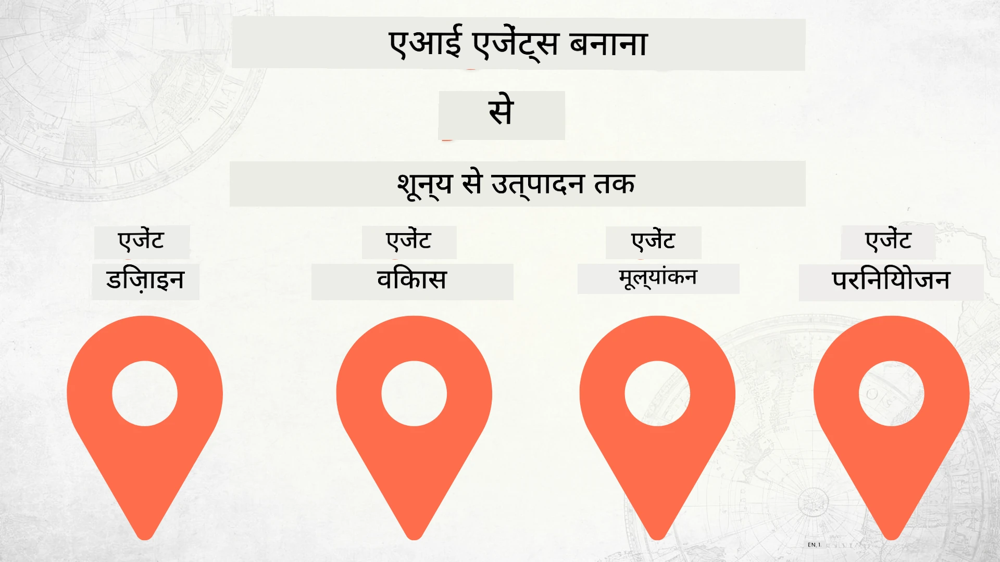

# शून्य से प्रोडक्शन तक AI एजेंट बनाना



### 🌐 बहुभाषी समर्थन

#### GitHub एक्शन के माध्यम से समर्थित (स्वचालित और हमेशा अपडेट)

<!-- CO-OP TRANSLATOR LANGUAGES TABLE START -->
[Arabic](../ar/README.md) | [Bengali](../bn/README.md) | [Bulgarian](../bg/README.md) | [Burmese (Myanmar)](../my/README.md) | [Chinese (Simplified)](../zh-CN/README.md) | [Chinese (Traditional, Hong Kong)](../zh-HK/README.md) | [Chinese (Traditional, Macau)](../zh-MO/README.md) | [Chinese (Traditional, Taiwan)](../zh-TW/README.md) | [Croatian](../hr/README.md) | [Czech](../cs/README.md) | [Danish](../da/README.md) | [Dutch](../nl/README.md) | [Estonian](../et/README.md) | [Finnish](../fi/README.md) | [French](../fr/README.md) | [German](../de/README.md) | [Greek](../el/README.md) | [Hebrew](../he/README.md) | [Hindi](./README.md) | [Hungarian](../hu/README.md) | [Indonesian](../id/README.md) | [Italian](../it/README.md) | [Japanese](../ja/README.md) | [Kannada](../kn/README.md) | [Khmer](../km/README.md) | [Korean](../ko/README.md) | [Lithuanian](../lt/README.md) | [Malay](../ms/README.md) | [Malayalam](../ml/README.md) | [Marathi](../mr/README.md) | [Nepali](../ne/README.md) | [Nigerian Pidgin](../pcm/README.md) | [Norwegian](../no/README.md) | [Persian (Farsi)](../fa/README.md) | [Polish](../pl/README.md) | [Portuguese (Brazil)](../pt-BR/README.md) | [Portuguese (Portugal)](../pt-PT/README.md) | [Punjabi (Gurmukhi)](../pa/README.md) | [Romanian](../ro/README.md) | [Russian](../ru/README.md) | [Serbian (Cyrillic)](../sr/README.md) | [Slovak](../sk/README.md) | [Slovenian](../sl/README.md) | [Spanish](../es/README.md) | [Swahili](../sw/README.md) | [Swedish](../sv/README.md) | [Tagalog (Filipino)](../tl/README.md) | [Tamil](../ta/README.md) | [Telugu](../te/README.md) | [Thai](../th/README.md) | [Turkish](../tr/README.md) | [Ukrainian](../uk/README.md) | [Urdu](../ur/README.md) | [Vietnamese](../vi/README.md)

> **स्थानीय रूप से क्लोन करना पसंद है?**
>
> यह रिपॉजिटरी 50+ भाषा अनुवाद शामिल करती है जो डाउनलोड आकार को काफी बढ़ा देती है। अनुवादों के बिना क्लोन करने के लिए, sparse checkout का उपयोग करें:
>
> **Bash / macOS / Linux:**
> ```bash
> git clone --filter=blob:none --sparse https://github.com/microsoft/Building-AI-Agents-From-Zero-To-Production.git
> cd Building-AI-Agents-From-Zero-To-Production
> git sparse-checkout set --no-cone '/*' '!translations' '!translated_images'
> ```
>
> **CMD (Windows):**
> ```cmd
> git clone --filter=blob:none --sparse https://github.com/microsoft/Building-AI-Agents-From-Zero-To-Production.git
> cd Building-AI-Agents-From-Zero-To-Production
> git sparse-checkout set --no-cone "/*" "!translations" "!translated_images"
> ```
>
> इससे आपको आवश्यक सब कुछ मिलता है जिससे कोर्स पूरा करना बहुत तेजी से डाउनलोड के साथ संभव होता है।
<!-- CO-OP TRANSLATOR LANGUAGES TABLE END -->

## AI एजेंट विकास जीवनचक्र की मूल बातें सिखाने वाला कोर्स

[](https://github.com/microsoft/Building-AI-Agents-From-Zero-To-Production/blob/master/LICENSE?WT.mc_id=academic-105485-koreyst)
[](https://GitHub.com/microsoft/Building-AI-Agents-From-Zero-To-Production/graphs/contributors/?WT.mc_id=academic-105485-koreyst)
[](https://GitHub.com/microsoft/Building-AI-Agents-From-Zero-To-Production/issues/?WT.mc_id=academic-105485-koreyst)
[](https://GitHub.com/microsoft/Building-AI-Agents-From-Zero-To-Production/pulls/?WT.mc_id=academic-105485-koreyst)
[](http://makeapullrequest.com?WT.mc_id=academic-105485-koreyst)

[](https://discord.gg/Kuaw3ktsu6)

## 🌱 शुरुआत करना

इस कोर्स में AI एजेंट बनाने और तैनात करने के मूलभूत पाठ शामिल हैं।

प्रत्येक पाठ पिछली कड़ी पर आधारित है, इसलिए हम अनुशंसा करते हैं कि आप शुरुआत से शुरू करें और अंत तक काम करें।

यदि आप AI एजेंट विषयों के बारे में और जानना चाहते हैं, तो आप [AI एजेंट्स फॉर बिगिनर्स कोर्स](https://aka.ms/ai-agents-beginners) देख सकते हैं।

### अन्य शिक्षार्थियों से मिलें, अपने सवालों के जवाब पाएं

यदि आप फंसे हैं या AI एजेंट बनाने के संबंध में कोई प्रश्न है, तो हमारे समर्पित Discord चैनल में शामिल हों [Microsoft Foundry Discord](https://discord.gg/Kuaw3ktsu6)।

### आपको क्या चाहिए


प्रत्येक पाठ का अपना कोड नमूना होता है जिसे आप स्थानीय रूप से चला सकते हैं। आप अपनी खुद की कॉपी बनाने के लिए [इस रिपॉ को फोर्क कर सकते हैं](https://github.com/microsoft/Building-AI-Agents-From-Zero-To-Production/fork)।

यह कोर्स वर्तमान में निम्नलिखित उपयोग करता है:

- [Microsoft Agent Framework (MAF)](https://aka.ms/ai-agents-beginners/agent-framework)
- [Microsoft Foundry](https://azure.microsoft.com/products/ai-foundry) — एक प्रोजेक्ट जिसमें **GPT-5 सीरीज** मॉडल तैनात है (उदाहरण के लिए `gpt-5.1`)। कृपया खोए हुए GPT-4o / GPT-4.1 मॉडलों का उपयोग **नहीं** करें।
- [Azure OpenAI Service](https://azure.microsoft.com/products/ai-foundry/models/openai)
- [Azure CLI](https://learn.microsoft.com/cli/azure/authenticate-azure-cli?view=azure-cli-latest) — किसी भी नमूना को चलाने से पहले `az login` के साथ साइन इन करें
- **Python 3.12 या बाद का संस्करण**

कृपया सुनिश्चित करें कि आपके पास शुरू करने से पहले इन सेवाओं तक पहुंच है।

> **💰 लागत और सफाई।** हैंड्स-ऑन पाठ वास्तविक Azure संसाधन बनाते हैं — एक Microsoft Foundry
> प्रोजेक्ट, एक मॉडल तैनाती, एक वेक्टर स्टोर, और (पाठ 4–6 में) होस्ट किए गए एजेंट और टूलबॉक्स।
> ये होते हुए लागत उत्पन्न कर सकते हैं। जब आप एक पाठ — या पूरा कोर्स — समाप्त कर लें, तो
> उन संसाधनों को हटा दें जिनकी आपको अब आवश्यकता नहीं है। सबसे सरल तरीका यह है कि सब कुछ एक समर्पित संसाधन
> समूह में रखें और जब आप समाप्त कर लें तो पूरे समूह को हटा दें:
>
> ```bash
> az group delete --name <your-resource-group> --yes --no-wait
> ```
>
> आप Foundry पोर्टल से व्यक्तिगत एजेंट, वेक्टर स्टोर, और टूलबॉक्स भी हटा सकते हैं।

> **मॉडल पर नोट।** यह कोर्स सभी मॉडलों को **Microsoft Foundry** के माध्यम से सेवा देता है। यह **GitHub Models** का उपयोग **नहीं** करता है, जिसे **30 जुलाई, 2026** को रिटायर किया जा रहा है — Microsoft Foundry आधिकारिक माइग्रेशन मार्ग है। यदि आपके पास पुराना कोड है जो GitHub Models को कॉल करता है, तो इसे Foundry मॉडल तैनाती की ओर निर्देशित करें।


मॉडल होस्टिंग और सेवाओं के आसपास अधिक विकल्प जल्द ही आएंगे।

## 🗃️ पाठ

| **पाठ**          | **विवरण**                                                                                      |
|--------------------|--------------------------------------------------------------------------------------------------|
| [एजेंट डिज़ाइन](./lesson-1-agent-design/README.md)       | हमारे "डेवलपर ऑनबोर्डिंग" एजेंट उपयोग मामले का परिचय और प्रभावी एजेंट डिजाइन कैसे करें              |
| [एजेंट विकास](./lesson-2-agent-development/README.md)    | Microsoft Agent Framework (MAF) का उपयोग करते हुए, नए डेवलपर्स की मदद के लिए विशिष्ट एजेंट बनाएं।       |
| [एजेंट मूल्यांकन](./lesson-3-agent-evals/README.md)  | Microsoft Foundry का उपयोग करके पता लगाएं कि हमारे AI एजेंट किस प्रकार प्रदर्शन कर रहे हैं और उन्हें कैसे बेहतर बनाया जाए। |
| [एजेंट तैनाती](./lesson-4-agentdeployment/README.md)   | Microsoft Foundry होस्ट किए गए एजेंट और OpenAI ChatKit का उपयोग करके AI एजेंट को प्रोडक्शन में तैनात करना देखें।       |
| [प्रोडक्शन होस्टेड एजेंट](./lesson-5-hosted-agents-production/README.md)   | एक होस्टेड एजेंट को उद्यम प्रोडक्शन में ले जाएं: होस्टेड एजेंट vs कैपेबिलिटी होस्ट, अपना खुद का स्टोरेज, मेमोरी, और गवर्नेंस लेकर आएं।       |
| [Microsoft टूलबॉक्स](./lesson-6-toolbox/README.md)   | उपकरणों को एक बार परिभाषित करें और उन्हें केंद्रीकृत रूप से शासन करें: एक टूलबॉक्स बनाएं, इसे एक एजेंट से एक MCP एंडपॉइंट के माध्यम से उपभोग करें, और सुरक्षित रूप से संस्करण नियंत्रित करें।       |
| [मल्टी-एजेंट और A2A](./lesson-7-multi-agent-a2a/README.md)   | एजेंटों को नेटवर्क सेवाओं के रूप में संयोजित करें: एक एजेंट को खुले Agent-to-Agent (A2A) प्रोटोकॉल पर एक्सपोज़ करें और एक दूरस्थ एजेंट को एक समकक्ष के रूप में उपभोग करें।       |


## 🎒 अन्य पाठ्यक्रम

हमारी टीम अन्य कोर्स भी बनाती है! देखें:

<!-- CO-OP TRANSLATOR OTHER COURSES START -->
### LangChain
[](https://aka.ms/langchain4j-for-beginners)
[](https://aka.ms/langchainjs-for-beginners?WT.mc_id=m365-94501-dwahlin)
[](https://github.com/microsoft/langchain-for-beginners?WT.mc_id=m365-94501-dwahlin)
---

### Azure / एज / MCP / एजेंट
[](https://github.com/microsoft/AZD-for-beginners?WT.mc_id=academic-105485-koreyst)
[](https://github.com/microsoft/edgeai-for-beginners?WT.mc_id=academic-105485-koreyst)
[](https://github.com/microsoft/mcp-for-beginners?WT.mc_id=academic-105485-koreyst)
[](https://github.com/microsoft/ai-agents-for-beginners?WT.mc_id=academic-105485-koreyst)

---
 
### जनरेटिव AI सीरीज

[](https://github.com/microsoft/generative-ai-for-beginners?WT.mc_id=academic-105485-koreyst)
[-9333EA?style=for-the-badge&labelColor=E5E7EB&color=9333EA)](https://github.com/microsoft/Generative-AI-for-beginners-dotnet?WT.mc_id=academic-105485-koreyst)
[-C084FC?style=for-the-badge&labelColor=E5E7EB&color=C084FC)](https://github.com/microsoft/generative-ai-for-beginners-java?WT.mc_id=academic-105485-koreyst)
[-E879F9?style=for-the-badge&labelColor=E5E7EB&color=E879F9)](https://github.com/microsoft/generative-ai-with-javascript?WT.mc_id=academic-105485-koreyst)

---
 
### कोर लर्निंग
[](https://aka.ms/ml-beginners?WT.mc_id=academic-105485-koreyst)
[](https://aka.ms/datascience-beginners?WT.mc_id=academic-105485-koreyst)
[](https://aka.ms/ai-beginners?WT.mc_id=academic-105485-koreyst)
[](https://github.com/microsoft/Security-101?WT.mc_id=academic-96948-sayoung)
[](https://aka.ms/webdev-beginners?WT.mc_id=academic-105485-koreyst)
[](https://aka.ms/iot-beginners?WT.mc_id=academic-105485-koreyst)
[](https://github.com/microsoft/xr-development-for-beginners?WT.mc_id=academic-105485-koreyst)

---
 
### कोपिलट सीरीज
[](https://aka.ms/GitHubCopilotAI?WT.mc_id=academic-105485-koreyst)
[](https://github.com/microsoft/mastering-github-copilot-for-dotnet-csharp-developers?WT.mc_id=academic-105485-koreyst)
[](https://github.com/microsoft/CopilotAdventures?WT.mc_id=academic-105485-koreyst)
<!-- CO-OP TRANSLATOR OTHER COURSES END -->

## योगदान करें

यह परियोजना योगदान और सुझावों का स्वागत करती है। अधिकांश योगदानों के लिए आपको एक
योगदानकर्ता लाइसेंस समझौते (CLA) से सहमत होना होगा जो घोषित करता है कि आपके पास अधिकार है, और वास्तव में आप अनुमति देते हैं,
हमें आपके योगदान का उपयोग करने के अधिकार। विवरण के लिए, कृपया देखें <https://cla.opensource.microsoft.com>।

जब आप एक पुल अनुरोध सबमिट करते हैं, तो एक CLA बोट स्वतः यह निर्धारित करेगा कि आपको CLA प्रदान करना है या नहीं
और पीआर को उपयुक्त रूप से सजाएगा (जैसे स्थिति जांच, टिप्पणी)। बस बोट द्वारा प्रदान किए गए निर्देशों का पालन करें।
आपको यह केवल एक बार हमारे CLA का उपयोग करने वाले सभी रेपो में करना होगा।

इस परियोजना ने [Microsoft Open Source कोड ऑफ कंडक्ट](https://opensource.microsoft.com/codeofconduct/) को अपनाया है।
अधिक जानकारी के लिए देखें [कोड ऑफ कंडक्ट FAQ](https://opensource.microsoft.com/codeofconduct/faq/) या
किसी भी अतिरिक्त प्रश्न या टिप्पणी के लिए संपर्क करें [opencode@microsoft.com](mailto:opencode@microsoft.com)।

## ट्रेडमार्क

इस परियोजना में परियोजनाओं, उत्पादों या सेवाओं के ट्रेडमार्क या लोगो हो सकते हैं। Microsoft के
ट्रेडमार्क या लोगो के अधिकृत उपयोग के लिए और उनका पालन करना आवश्यक है
[Microsoft के ट्रेडमार्क और ब्रांड दिशानिर्देश](https://www.microsoft.com/legal/intellectualproperty/trademarks/usage/general)।
इस परियोजना के संशोधित संस्करणों में Microsoft ट्रेडमार्क या लोगो का उपयोग भ्रम पैदा नहीं करना चाहिए या Microsoft की प्रायोजन का संकेत नहीं देना चाहिए।
तीसरे पक्ष के ट्रेडमार्क या लोगो का कोई भी उपयोग संबंधित तृतीय पक्ष की नीतियों के अधीन है।

## सहायता प्राप्त करना

यदि आप अटक जाते हैं या AI एप्लिकेशन बनाने के बारे में कोई प्रश्न हैं, तो जुड़ें:

[](https://discord.gg/Kuaw3ktsu6)

यदि आपके पास उत्पाद प्रतिक्रिया है या निर्माण में त्रुटियां हैं तो जाएं:

[](https://aka.ms/foundry/forum)

---

<!-- CO-OP TRANSLATOR DISCLAIMER START -->
**अस्वीकरण**:
इस दस्तावेज़ का अनुवाद AI अनुवाद सेवा [Co-op Translator](https://github.com/Azure/co-op-translator) का उपयोग करके किया गया है। जबकि हम सटीकता के लिए प्रयास करते हैं, कृपया ध्यान दें कि स्वचालित अनुवादों में त्रुटियाँ या अशुद्धियाँ हो सकती हैं। मूल दस्तावेज़ अपनी मूल भाषा में ही प्रामाणिक स्रोत माना जाना चाहिए। महत्वपूर्ण जानकारी के लिए, पेशेवर मानव अनुवाद की सिफारिश की जाती है। इस अनुवाद के उपयोग से उत्पन्न किसी भी गलतफहमी या गलत व्याख्या के लिए हम उत्तरदायी नहीं हैं।
<!-- CO-OP TRANSLATOR DISCLAIMER END -->