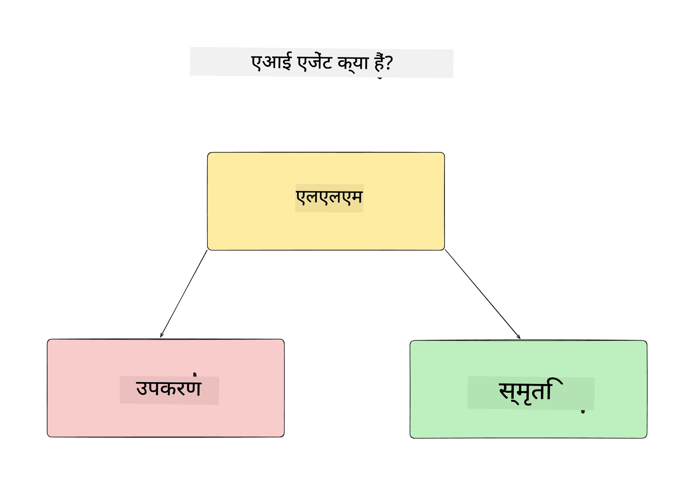
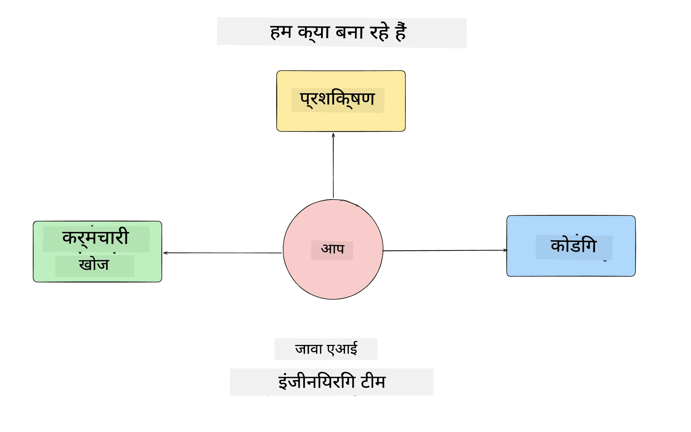
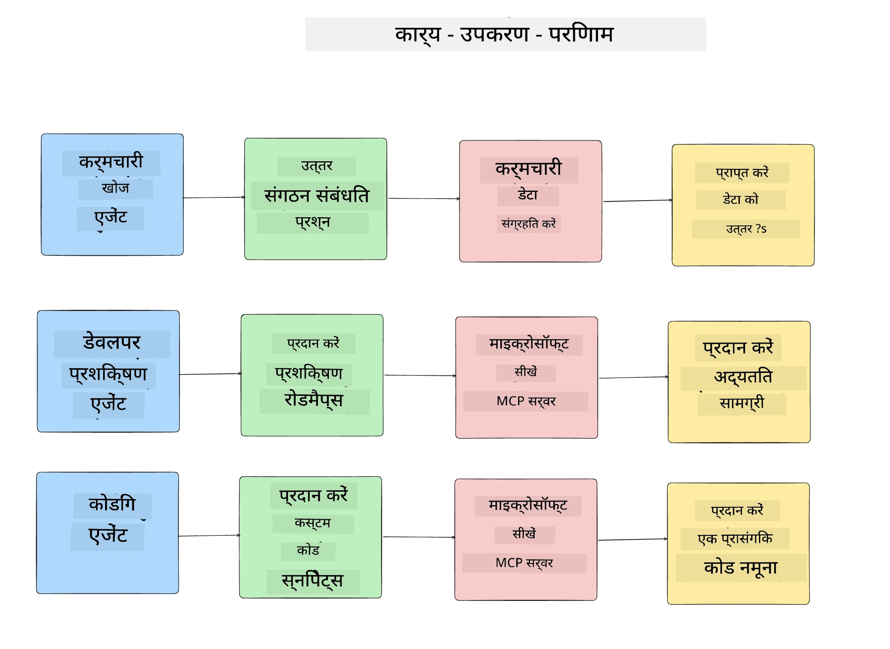
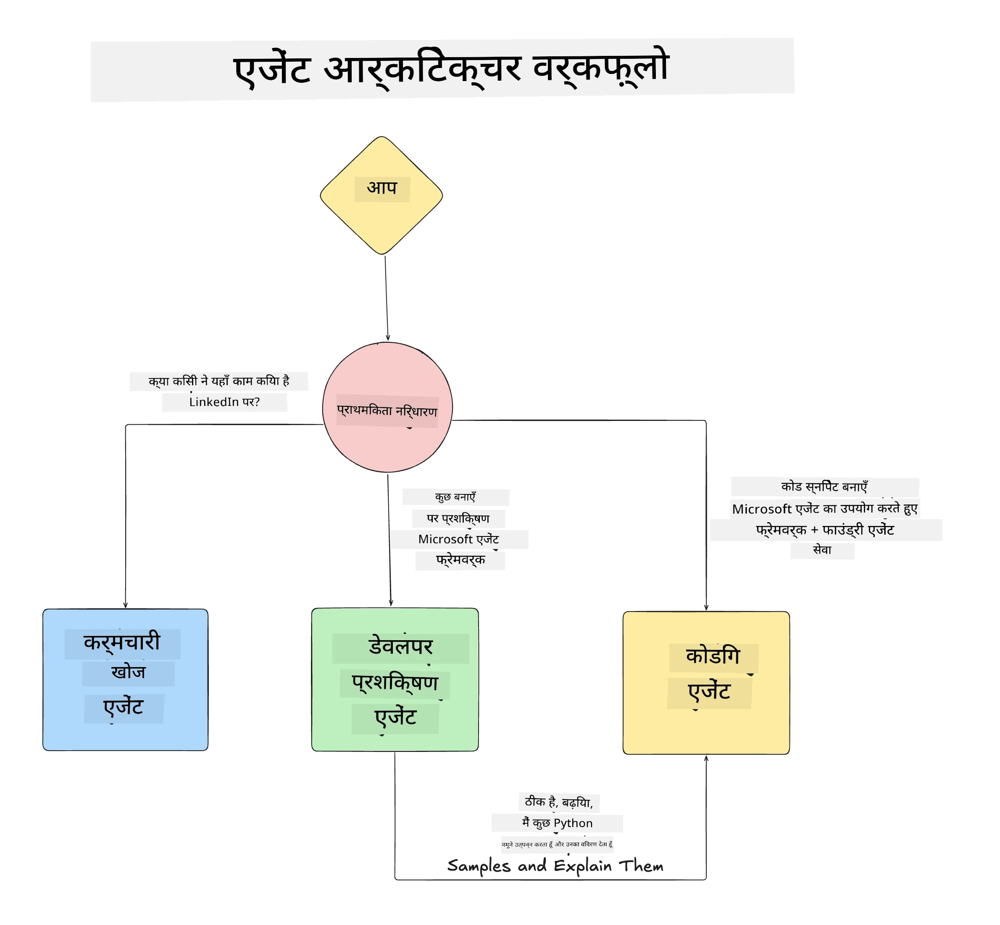

# पाठ 1: एआई एजेंट डिज़ाइन

"शून्य से उत्पादन तक AI एजेंट बनाने का कोर्स" के पहले पाठ में आपका स्वागत है!

इस पाठ में हम निम्नलिखित विषयों को कवर करेंगे:

- AI एजेंट क्या होते हैं, इसे परिभाषित करना
  
- हम जो AI एजेंट एप्लिकेशन बना रहे हैं, उसके बारे में चर्चा

- प्रत्येक एजेंट के लिए आवश्यक उपकरण और सेवाओं की पहचान
  
- हमारे एजेंट एप्लिकेशन की आर्किटेक्चर बनाना
  
चलिए शुरू करते हैं यह परिभाषित करके कि एजेंट क्या होते हैं और हम उन्हें किसी एप्लिकेशन के अंदर क्यों उपयोग करेंगे।

> **कोर्स शुरू करने से पहले।** यह पहला पाठ वैचारिक है — यहाँ कोई कोड नहीं चलाना है।
> [पाठ 2](../lesson-2-agent-development/README.md) से आगे आपको चाहिए होगा: **Azure सब्सक्रिप्शन** जिसमें **Microsoft Foundry** तक पहुँच हो, एक तैनात **GPT-5 सीरीज मॉडल** (जैसे `gpt-5.1` — सेवानिवृत्त GPT-4o / GPT-4.1 से बचें), **Python 3.12+**, और **Azure CLI** (`az login`)। पूरी सूची और लिंक कोर्स के README में [What You Need](../README.md#what-you-need) देखें।
 
 
 
 

## AI एजेंट क्या होते हैं?

यदि यह आपका पहला अनुभव है AI एजेंट बनाने का, तो आप सोच सकते हैं कि AI एजेंट को ठीक से कैसे परिभाषित किया जाए।

सरल रूप में AI एजेंट को उसकी घटकों के आधार पर परिभाषित करें:

**लार्ज लैंग्वेज मॉडल** - LLM उपयोगकर्ता से प्राकृतिक भाषा को संसाधित करने की क्षमता प्रदान करता है ताकि वे जो कार्य पूरा करना चाहते हैं उसे समझ सके, साथ ही उन कार्यों को पूरा करने के लिए उपलब्ध उपकरणों के वर्णनों की व्याख्या कर सके।

**उपकरण** - ये वे फ़ंक्शन, API, डेटा स्टोर और अन्य सेवाएँ हैं जिनका LLM उपयोगकर्ता द्वारा अनुरोधित कार्यों को पूरा करने के लिए चयन कर सकता है।

**मेमोरी** - यह वह तरीका है जिससे हम AI एजेंट और उपयोगकर्ता के बीच संक्षिप्त और दीर्घकालीन बातचीत को सहेजते हैं। इस जानकारी को संग्रहित और पुनः प्राप्त करना सुधार करने और समय के साथ उपयोगकर्ता प्राथमिकताओं को सहेजने के लिए महत्वपूर्ण है।

## हमारा AI एजेंट उपयोग मामला

इस कोर्स के लिए, हम एक AI एजेंट एप्लिकेशन बनाएंगे जो नए डेवलपर्स को हमारे AI एजेंट विकास टीम में शामिल होने में मदद करता है!

विकास कार्य शुरू करने से पहले, एक सफल AI एजेंट एप्लिकेशन बनाने का पहला कदम यह स्पष्ट परिदृश्यों को परिभाषित करना है कि हम अपने उपयोगकर्ताओं से एआई एजेंट के साथ कैसे काम करने की उम्मीद करते हैं।

इस एप्लिकेशन के लिए, हम इन परिदृश्यों पर काम करेंगे:

**परिदृश्य 1**: एक नया कर्मचारी हमारे संगठन में शामिल होता है और वह टीम के बारे में अधिक जानना चाहता है जिसमें वह शामिल हुआ है और उनसे कैसे जुड़ना है।

**परिदृश्य 2:** नया कर्मचारी जानना चाहता है कि उसके लिए सबसे अच्छा पहला कार्य क्या होगा जिसे वह शुरू कर सकता है।

**परिदृश्य 3:** नया कर्मचारी सीखने के संसाधन और कोड उदाहरण इकट्ठा करना चाहता है ताकि वह इस कार्य को पूरा करने में मदद कर सके।

## उपकरण और सेवाओं की पहचान

अब जबकि हमने ये परिदृश्य बनाए हैं, अगला कदम इन्हें उन उपकरणों और सेवाओं से जोड़ना है जिनकी हमारी AI एजेंट्स को इन कार्यों को पूरा करने के लिए आवश्यकता होगी।

यह प्रक्रिया संदर्भ इंजीनियरिंग की श्रेणी में आती है क्योंकि हम निश्चित करेंगे कि हमारे AI एजेंट के पास सही संदर्भ सही समय पर हो ताकि वे कार्य पूरा कर सकें।

चलिए इसे परिदृश्य दर परिदृश्य करते हैं और प्रत्येक एजेंट के कार्य, उपकरण और इच्छित परिणामों को सूचीबद्ध करके अच्छी एजेंटिक डिज़ाइन करें।

### परिदृश्य 1 - कर्मचारी खोज एजेंट

**कार्य** - संगठन में कर्मचारियों के बारे में प्रश्नों का उत्तर देना जैसे कि शामिल होने की तिथि, वर्तमान टीम, स्थान और पिछला पद।

**उपकरण** - वर्तमान कर्मचारी सूची और संगठन चार्ट का डेटा स्टोर

**परिणाम** - डेटा स्टोर से जानकारी पुनः प्राप्त करने में सक्षम ताकि सामान्य संगठनात्मक प्रश्नों और विशिष्ट कर्मचारियों के प्रश्नों का उत्तर दिया जा सके।

### परिदृश्य 2 - कार्य सिफारिश एजेंट

**कार्य** - नए कर्मचारी के डेवलपर अनुभव के आधार पर, 1-3 मुद्दे सुझाना जिन पर नया कर्मचारी काम कर सकता है।

**उपकरण** - GitHub MCP सर्वर से खुले मुद्दे प्राप्त करना और डेवलपर प्रोफाइल बनाना

**परिणाम** - GitHub प्रोफ़ाइल की अंतिम 5 कमिट पढ़ने और GitHub प्रोजेक्ट पर खुले मुद्दों को देखकर मैच के आधार पर सिफारिशें करना।

### परिदृश्य 3 - कोड सहायक एजेंट

**कार्य** - "कार्य सिफारिश" एजेंट द्वारा सुझाए गए खुले मुद्दों के आधार पर, संसाधनों का शोध करना और कर्मचारी की मदद के लिए कोड स्निपेट्स तैयार करना।

**उपकरण** - Microsoft Learn MCP संसाधन खोजने के लिए और कोड इंटरप्रेटर कस्टम कोड स्निपेट जनरेट करने के लिए।

**परिणाम** - यदि उपयोगकर्ता अतिरिक्त मदद मांगे, तो वर्कफ़्लो Learn MCP सर्वर का उपयोग संसाधनों के लिंक और स्निपेट प्रदान करने के लिए करेगा और फिर छोटे कोड स्निपेट्स विवरण के साथ जनरेट करने के लिए कोड इंटरप्रेटर एजेंट को सौंपेगा।

## हमारे एजेंट एप्लिकेशन की आर्किटेक्चर

अब जब हमने अपने प्रत्येक एजेंट को परिभाषित कर लिया है, तो चलिए एक आर्किटेक्चर आरेख बनाते हैं जो हमें समझने में मदद करेगा कि प्रत्येक एजेंट कार्य के आधार पर एक साथ और अलग-अलग कैसे काम करेगा:

## अगले कदम

अब जब हमने प्रत्येक एजेंट और हमारे एजेंटिक सिस्टम का डिज़ाइन कर लिया है, तो चलिए अगले पाठ पर चलते हैं जहां हम प्रत्येक एजेंट का विकास करेंगे!

---

<!-- CO-OP TRANSLATOR DISCLAIMER START -->
**अस्वीकरण**:
इस दस्तावेज़ का अनुवाद AI अनुवाद सेवा [Co-op Translator](https://github.com/Azure/co-op-translator) का उपयोग करके किया गया है। जबकि हम सटीकता के लिए प्रयास करते हैं, कृपया ध्यान दें कि स्वचालित अनुवादों में त्रुटियाँ या अशुद्धियाँ हो सकती हैं। मूल दस्तावेज़ अपनी मूल भाषा में ही प्रामाणिक स्रोत माना जाना चाहिए। महत्वपूर्ण जानकारी के लिए, पेशेवर मानव अनुवाद की सिफारिश की जाती है। इस अनुवाद के उपयोग से उत्पन्न किसी भी गलतफहमी या गलत व्याख्या के लिए हम उत्तरदायी नहीं हैं।
<!-- CO-OP TRANSLATOR DISCLAIMER END -->