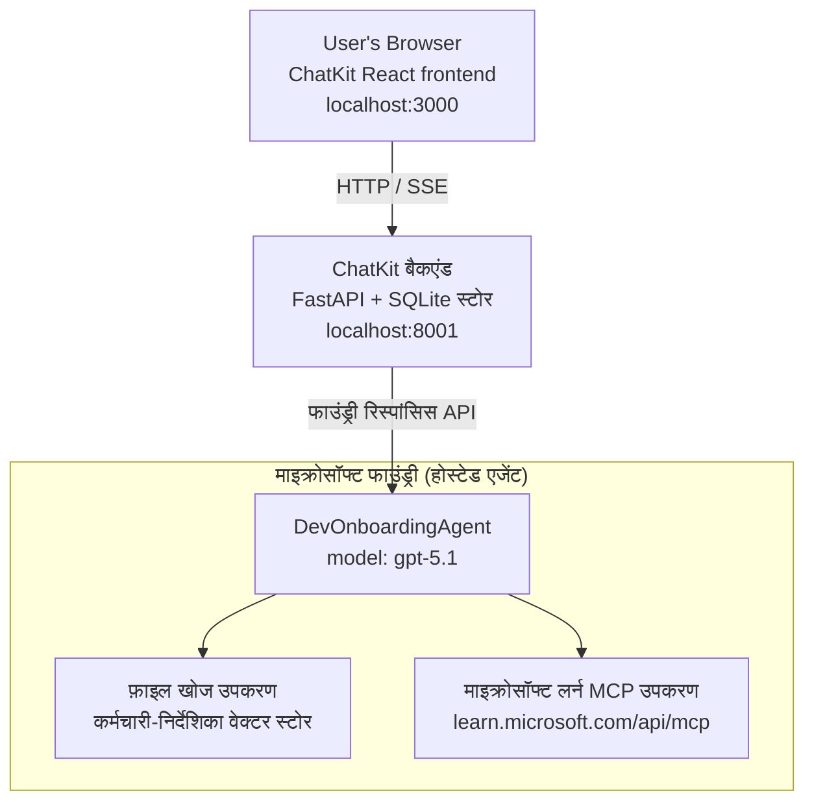

# पाठ 4: Microsoft Foundry होस्टेड एजेंट्स + ChatKit के साथ एजेंट तैनाती

यह पाठ दिखाता है कि Microsoft Foundry में एक टूल-उपयोग एजेंट को होस्टेड एजेंट के रूप में कैसे तैनात किया जाए और इसके साथ बातचीत करने के लिए ChatKit-आधारित फ्रंटेंड कैसे बनाया जाए।

## वास्तुकला

होस्टेड एजेंट एक **एकल `DevOnboardingAgent`** है (जो `gpt-5.1` पर चलता है) जो दो होस्टेड टूल्स का उपयोग करके डेवलपर-ऑनबोर्डिंग प्रश्नों का उत्तर देता है: कर्मचारी-डायरेक्टरी वेक्टर स्टोर पर आधारित **File Search** टूल, और **Microsoft Learn MCP** टूल। एक ChatKit React फ्रंटेंड एक FastAPI बैकेंड से बात करता है, जो Foundry के **Responses API** के माध्यम से एजेंट को कॉल करता है।



## पूर्वापेक्षाएँ

1. नॉर्थ सेंट्रल यूएस क्षेत्र में **Microsoft Foundry प्रोजेक्ट**
2. **Azure CLI** प्रमाणीकृत (`az login`)
3. **Azure Developer CLI** (`azd`) इंस्टॉल किया गया
4. **Python 3.12+** और **Node.js 18+**
5. कर्मचारी डेटा के साथ **वेक्टर स्टोर** बनाया गया

## त्वरित प्रारंभ

### 1. पर्यावरण चर सेट करें

```bash
cd lesson-4-agentdeployment
cp .env.example .env
# अपनी Microsoft Foundry परियोजना विवरण के साथ .env संपादित करें
```

### 2. होस्टेड एजेंट तैनात करें

**विकल्प A: Azure Developer CLI का उपयोग करना (सिफारिश की गई)**

```bash
cd hosted-agent
azd auth login
azd agent deploy
```

**विकल्प B: Docker + Azure Container Registry का उपयोग करना**

```bash
cd hosted-agent

# कंटेनर बनाएं
docker build -t developer-onboarding-agent:latest .

# ACR के लिए टैग
docker tag developer-onboarding-agent:latest <your-acr>.azurecr.io/developer-onboarding-agent:latest

# ACR में पुश करें
az acr login --name <your-acr>
docker push <your-acr>.azurecr.io/developer-onboarding-agent:latest

# माइक्रोसॉफ्ट फाउंड्री पोर्टल या SDK के माध्यम से तैनात करें
```

### 3. ChatKit बैकेंड शुरू करें

```bash
cd chatkit-server
python -m venv .venv
source .venv/bin/activate  # Windows पर: .venv\Scripts\activate
pip install -r requirements.txt
python app.py
```

सर्वर `http://localhost:8001` पर शुरू होगा

### 4. ChatKit फ्रंटेंड शुरू करें

```bash
cd chatkit-server/frontend
npm install
npm run dev
```

फ्रंटेंड `http://localhost:3000` पर शुरू होगा

### 5. एप्लिकेशन का परीक्षण करें

अपने ब्राउज़र में `http://localhost:3000` खोलें और इन प्रश्नों को आज़माएं:

**कर्मचारी खोज:**
- "मैं नया हूँ! क्या किसी ने Microsoft में काम किया है?"
- "किसके पास Azure Functions का अनुभव है?"

**अध्ययन संसाधन:**
- "Kubernetes के लिए एक अध्ययन पथ बनाएं"
- "क्लाउड आर्किटेक्चर के लिए मुझे कौन से प्रमाणपत्र लेने चाहिए?"

**कोडिंग सहायता:**
- "मुझसे Python कोड लिखने में मदद करें जो CosmosDB से जुड़े"
- "मुझे Azure Function बनाने का तरीका दिखाएं"

**मल्टी-एजेंट प्रश्न:**
- "मैं क्लाउड इंजीनियर के रूप में शुरुआत कर रहा हूँ। मुझे किससे जुड़ना चाहिए और मुझे क्या सीखना चाहिए?"

## परियोजना संरचना

```
lesson-4-agentdeployment/
├── .env.example                 # Environment variables template
├── implementation-plan.md       # Detailed implementation guide
├── README.md                    # This file
├── hosted-agent/               # Microsoft Foundry hosted agent
│   ├── main.py                 # Multi-agent workflow implementation
│   ├── requirements.txt        # Python dependencies
│   ├── Dockerfile              # Container definition
│   └── agent.yaml              # Agent deployment configuration
└── chatkit-server/             # ChatKit server application
    ├── app.py                  # FastAPI backend
    ├── store.py                # SQLite persistence layer
    ├── requirements.txt        # Python dependencies
    └── frontend/               # React frontend
        ├── package.json
        ├── vite.config.ts
        ├── tsconfig.json
        ├── index.html
        └── src/
            ├── main.tsx
            ├── App.tsx
            ├── App.css
            └── index.css
```

## एजेंट और उसके टूल्स

होस्टेड एजेंट एक **एकल एजेंट** है (`DevOnboardingAgent`, जो `hosted-agent/main.py` में परिभाषित है) जो तीन ऑनबोर्डिंग डोमेन को संभालता है। अलग-अलग उप-एजेंट्स का समन्वय करने के बजाय, यह प्रत्येक क्षमता को एक टूल के रूप में प्रस्तुत करता है (या सीधे मॉडल पर निर्भर करता है):

| क्षमता | यह कैसे संभाला जाता है | टूल |
|-----------|------------------|------|
| **कर्मचारी खोज और कनेक्शन** | Foundry होस्टेड File Search, कर्मचारी-डायरेक्टरी वेक्टर स्टोर पर आधारित | `client.get_file_search_tool(vector_store_ids=[...])` |
| **अध्ययन और प्रशिक्षण** | Microsoft Learn MCP सर्वर (होस्टेड MCP टूल) | `client.get_mcp_tool(url="https://learn.microsoft.com/api/mcp")` |
| **कोडिंग सहायता** | सीधे `gpt-5.1` मॉडल द्वारा संभाला जाता है — कोई बाहरी टूल नहीं | — |


एजेंट को `client.as_agent(name="DevOnboardingAgent", instructions=..., tools=[file_search_tool, learn_mcp_tool])` के साथ बनाया गया है और `from_agent_framework(agent).run()` के साथ सेवा दी जाती है।

> **डिजाइन नोट।** इस पाठ के प्रारंभिक ड्राफ्ट में `HandoffBuilder` मल्टी-एजेंट वर्कफ़्लो (Triage → specialists) का उपयोग किया गया था। भेजा गया एजेंट एक एकल टूल-उपयोग एजेंट है, जिसे ऑनबोर्डिंग-शैली के प्रश्नोत्तर के लिए तैनात करना और समझना सरल है। मल्टी-एजेंट ऑर्केस्ट्रेशन और हैंडऑफ का उदाहरण देखने के लिए, पाठ 2 और पाठ 3 देखें।

## होस्टेड एजेंट का स्मोक टेस्टिंग (CI गेट)

एक होस्टेड एजेंट को "सफलतापूर्वक" तैनात करना केवल यह साबित करता है कि कंट्रोल प्लेन ने
परिभाषा को स्वीकार किया है — यह साबित नहीं करता कि एजेंट वास्तव में उत्तर देता है। एक लापता निर्भरता,
खराब मॉडल राउटिंग, या समाप्त हो चुकी कनेक्शन एक हरा-परंतु-चुप एजेंट छोड़ सकती है।

यह पाठ एक हल्का **स्मोक टेस्ट** प्रदान करता है जो तेज, सस्ता पोस्ट-डिप्लॉय
गेट के रूप में कार्य करता है। यह [AI Smoke Test](https://github.com/marketplace/actions/ai-smoke-test)
गिटहब एक्शन का उपयोग करता है एजेंट के Foundry **Responses** एंडपॉइंट
(`POST {project_endpoint}/agents/{agent_name}/endpoint/protocols/openai/responses`)
पर प्रॉम्प्ट भेजने के लिए और लौटे हुए टेक्स्ट पर सत्यापन करता है। यह कुछ सेकंड में टूटे हुए डिप्लॉयमेंट्स, ऑथ रिग्रेशन,
सिस्टम-प्रॉम्प्ट दूरस्थता, और थ्रेडिंग टूटने को पकड़ता है।

> स्मोक टेस्ट पूरे मूल्यांकन का विकल्प **नहीं** हैं
> [पाठ 3](../lesson-3-agent-evals/README.md) में — वे एक पूरक हैं। स्मोक टेस्ट
> उत्तर देते हैं *"क्या एजेंट पहुंच योग्य है, उत्तर दे रहा है, और मौलिक प्रॉम्प्ट अपेक्षाओं का पालन कर रहा है?"*;
> मूल्यांकन उत्तर देते हैं *"उत्तर कितना अच्छा है?"*। हर तैनाती पर सस्ता गेट चलाएं।

### क्या परीक्षण किया जाता है

सूची [`hosted-agent/tests/smoke-tests.json`](../../../lesson-4-agentdeployment/hosted-agent/tests/smoke-tests.json)
में है और एजेंट के तीन क्षेत्रों के साथ-साथ प्रॉम्प्ट अनुपालन और मल्टी-टर्न थ्रेडिंग का परीक्षण करता है:

| परीक्षण | यह क्या सत्यापित करता है |
|------|------------------|
| `reachability` | एजेंट गैर-खाली, ऑन-स्कोप टेक्स्ट के साथ उत्तर देता है |
| `employee-search` | फ़ाइल-खोज डोमेन स्वस्थ `200` लौटाता है (उत्तर डेटा-सापेक्ष होता है) |
| `learning-path` | सीखने का क्षेत्र विषय को प्रतिध्वनित करता है और पथ-शैली उत्तर उत्पन्न करता है |
| `coding-assistance` | कोडिंग डोमेन कोड-आकार का Python उत्तर लौटाता है |
| `prompt-adherence-offtopic` | ऑफ-टॉपिक अनुरोध को पुनः निर्देशित किया जाता है, विस्तार से उत्तर नहीं दिया जाता है |
| `threading-turn-1/2` | वार्तालाप की स्थिति `previous_response_id` के माध्यम से टर्न के बीच रखी जाती है |

### इसे CI में चलाएं

वर्कफ़्लो [`.github/workflows/smoke-test-hosted-agent.yml`](../../../.github/workflows/smoke-test-hosted-agent.yml)
में दो जॉब हैं:

- **`static`** — एक तेज़, कोई-Azure गेट जो हर पुल अनुरोध और पुश पर चलता है:
  यह सभी Python स्रोतों को संकलित करता है (`py_compile`) और Markdown लिंक की जांच करता है। कोई गुप्त जानकारी आवश्यक नहीं,
  इसलिए यह फ़ोर्क PRs पर भी काम करता है।
- **`smoke`** — नीचे दिया गया Azure-कनेक्टेड स्मोक टेस्ट। यह मांग पर चलता है
  (Actions → **Agent CI (static + smoke)** → Run workflow) और इसे आपके
  डिप्लॉय वर्कफ़्लो के बाद श्रृंखलाबद्ध किया जा सकता है।

स्मोक जॉब के लिए ये रिपॉजिटरी **variables** और **secrets** कॉन्फ़िगर करें:


| प्रकार | नाम | मान |
|------|------|-------|

| वैरिएबल | `FOUNDRY_PROJECT_ENDPOINT` | `https://<account>.services.ai.azure.com/api/projects/<project>` |
| वैरिएबल | `HOSTED_AGENT_NAME` | तैनात एजेंट का नाम (जैसे `dev-onboarding` — आपकी तैनाती से मेल खाना चाहिए) |
| सीक्रेट | `AZURE_CLIENT_ID` / `AZURE_TENANT_ID` / `AZURE_SUBSCRIPTION_ID` | `azure/login` के लिए OIDC फैडरेटेड पहचान |

रनर पहचान को **फाउंडरी प्रोजेक्ट स्कोप** पर **`Azure AI User`** भूमिका की आवश्यकता होती है ताकि यह
Responses (और conversations) डेटा-प्लेन एंडपॉइंट्स को कॉल कर सके। इसे दें:

```bash
az role assignment create \
  --assignee <object-id-or-appId-of-runner-identity> \
  --role "Azure AI User" \
  --scope "/subscriptions/<sub>/resourceGroups/<rg>/providers/Microsoft.CognitiveServices/accounts/<account>/projects/<project>"
```

### इसे स्थानीय रूप से चलाएं

आप पुश करने से पहले वही कैटलॉग चला सकते हैं। `https://ai.azure.com/` को स्कोप करने वाला डेटा-प्लेन टोकन प्राप्त करें
और रनर को अपनी तैनाती की ओर इंगित करें:

```bash
# दर्शक को https://ai.azure.com/ होना चाहिए (cognitiveservices.azure.com टोकन अस्वीकार कर दिए जाते हैं)
export FOUNDRY_TOKEN=$(az account get-access-token --resource https://ai.azure.com/ --query accessToken -o tsv)

git clone https://github.com/JFolberth/ai-smoketest && cd ai-smoketest
python runner.py \
  --project-endpoint "https://<account>.services.ai.azure.com/api/projects/<project>" \
  --agent-name dev-onboarding \
  --tests-file ../lesson-4-agentdeployment/hosted-agent/tests/smoke-tests.json
```

एग्जिट कोड: `0` सभी सफल, `1` एक एसर्शन फेल हुआ, `2` रनर त्रुटि (खराब कैटलॉग / टोकन)।

## समस्याओं का निवारण

### एजेंट प्रतिक्रिया नहीं दे रहा है
- जांचें कि होस्टेड एजेंट Microsoft Foundry में तैनात और चल रहा है
- जांचें कि `HOSTED_AGENT_NAME` और `HOSTED_AGENT_VERSION` आपकी तैनाती से मेल खाते हैं

### वेक्टर स्टोर त्रुटियां
- सुनिश्चित करें कि `VECTOR_STORE_ID` सही सेट है
- पुष्टि करें कि वेक्टर स्टोर में कर्मचारी डेटा मौजूद है

### प्रमाणीकरण त्रुटियां
- क्रेडेंशियल्स को रीफ़्रेश करने के लिए `az login` चलाएं
- सुनिश्चित करें कि आपके पास Microsoft Foundry प्रोजेक्ट तक पहुंच है

## संसाधन

- [Microsoft Foundry Hosted Agents Documentation](https://learn.microsoft.com/en-us/azure/ai-foundry/agents/concepts/hosted-agents)
- [Microsoft Agent Framework](https://github.com/microsoft/agent-framework)
- [ChatKit Integration Sample](https://github.com/microsoft/agent-framework/tree/main/python/samples/demos/chatkit-integration)
- [Azure Developer CLI](https://learn.microsoft.com/en-us/azure/developer/azure-developer-cli/overview)
- [AI Smoke Test GitHub Action](https://github.com/marketplace/actions/ai-smoke-test)
- [Smoke Test Microsoft Foundry Agents with GitHub Actions (blog)](https://techcommunity.microsoft.com/blog/azuredevcommunityblog/smoke-test-microsoft-foundry-agents-with-github-actions/4531912)

---

## अगले चरण

आपका एजेंट Microsoft-प्रबंधित अवसंरचना पर चलता है। इसे उद्यम उत्पादन में ले जाने के लिए —
यह नियंत्रित करते हुए कि इसका डेटा कहाँ रहता है (डेटा संप्रभुता, निजी नेटवर्किंग, अपनी खुद की Azure
Cosmos DB / Storage / AI Search लाना) और इसके उपकरणों को नियंत्रित करना — जारी रखें
**[Lesson 5: Production Hosted Agents](../lesson-5-hosted-agents-production/README.md)**, जो
**Hosted Agents** और **Capability Hosts** के बीच महत्वपूर्ण अंतर समझाता है।

---

<!-- CO-OP TRANSLATOR DISCLAIMER START -->
**अस्वीकरण**:
इस दस्तावेज़ का अनुवाद AI अनुवाद सेवा [Co-op Translator](https://github.com/Azure/co-op-translator) का उपयोग करके किया गया है। जबकि हम सटीकता के लिए प्रयास करते हैं, कृपया ध्यान दें कि स्वचालित अनुवादों में त्रुटियाँ या अशुद्धियाँ हो सकती हैं। मूल दस्तावेज़ अपनी मूल भाषा में ही प्रामाणिक स्रोत माना जाना चाहिए। महत्वपूर्ण जानकारी के लिए, पेशेवर मानव अनुवाद की सिफारिश की जाती है। इस अनुवाद के उपयोग से उत्पन्न किसी भी गलतफहमी या गलत व्याख्या के लिए हम उत्तरदायी नहीं हैं।
<!-- CO-OP TRANSLATOR DISCLAIMER END -->