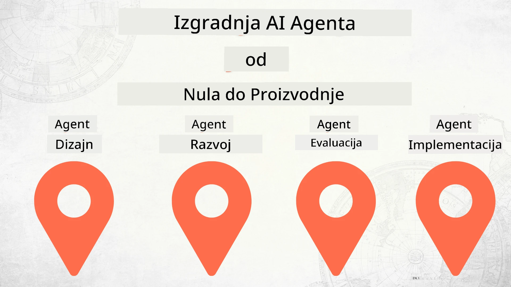

# Izrada AI agenata od nule do produkcije



### 🌐 Podrška za više jezika

#### Podržano putem GitHub akcije (Automatski i uvijek ažurno)

<!-- CO-OP TRANSLATOR LANGUAGES TABLE START -->
[Arapski](../ar/README.md) | [Bengalski](../bn/README.md) | [Bugarski](../bg/README.md) | [Burmanski (Mjanmar)](../my/README.md) | [Kineski (pojednostavljeni)](../zh-CN/README.md) | [Kineski (tradicionalni, Hong Kong)](../zh-HK/README.md) | [Kineski (tradicionalni, Makao)](../zh-MO/README.md) | [Kineski (tradicionalni, Tajvan)](../zh-TW/README.md) | [Hrvatski](./README.md) | [Češki](../cs/README.md) | [Danski](../da/README.md) | [Nizozemski](../nl/README.md) | [Estonski](../et/README.md) | [Finski](../fi/README.md) | [Francuski](../fr/README.md) | [Njemački](../de/README.md) | [Grčki](../el/README.md) | [Hebrejski](../he/README.md) | [Hindi](../hi/README.md) | [Mađarski](../hu/README.md) | [Indonezijski](../id/README.md) | [Talijanski](../it/README.md) | [Japanski](../ja/README.md) | [Kannada](../kn/README.md) | [Korejski](../ko/README.md) | [Litavski](../lt/README.md) | [Malajski](../ms/README.md) | [Malajalamski](../ml/README.md) | [Marathi](../mr/README.md) | [Nepalski](../ne/README.md) | [Nigerijski pidžin](../pcm/README.md) | [Norveški](../no/README.md) | [Perzijski (Farsi)](../fa/README.md) | [Poljski](../pl/README.md) | [Portugalski (Brazil)](../pt-BR/README.md) | [Portugalski (Portugal)](../pt-PT/README.md) | [Punjabi (Gurmukhi)](../pa/README.md) | [Rumunjski](../ro/README.md) | [Ruski](../ru/README.md) | [Srpski (ćirilica)](../sr/README.md) | [Slovački](../sk/README.md) | [Slovenski](../sl/README.md) | [Španjolski](../es/README.md) | [Svahili](../sw/README.md) | [Švedski](../sv/README.md) | [Tagalog (Filipinski)](../tl/README.md) | [Tamilski](../ta/README.md) | [Telugu](../te/README.md) | [Tajlandski](../th/README.md) | [Turski](../tr/README.md) | [Ukrajinski](../uk/README.md) | [Urdu](../ur/README.md) | [Vijetnamski](../vi/README.md)

> **Radije klonirati lokalno?**

> Ovaj repozitorij uključuje prijevode na preko 50 jezika što značajno povećava veličinu preuzimanja. Za kloniranje bez prijevoda, koristite sparse checkout:
> ```bash
> git clone --filter=blob:none --sparse https://github.com/microsoft/Building-AI-Agents-From-Zero-To-Production.git
> cd Building-AI-Agents-From-Zero-To-Production
> git sparse-checkout set --no-cone '/*' '!translations' '!translated_images'
> ```
> Ovo vam daje sve što trebate za završetak tečaja s puno bržim preuzimanjem.
<!-- CO-OP TRANSLATOR LANGUAGES TABLE END -->

## Tečaj koji vas uči osnovama životnog ciklusa razvoja AI agenata

[](https://github.com/microsoft/Building-AI-Agents-From-Zero-To-Production/blob/master/LICENSE?WT.mc_id=academic-105485-koreyst)
[](https://GitHub.com/microsoft/Building-AI-Agents-From-Zero-To-Production/graphs/contributors/?WT.mc_id=academic-105485-koreyst)
[](https://GitHub.com/microsoft/Building-AI-Agents-From-Zero-To-Production/issues/?WT.mc_id=academic-105485-koreyst)
[](https://GitHub.com/microsoft/Building-AI-Agents-From-Zero-To-Production/pulls/?WT.mc_id=academic-105485-koreyst)
[](http://makeapullrequest.com?WT.mc_id=academic-105485-koreyst)

[](https://discord.gg/Kuaw3ktsu6)

## 🌱 Početak

Ovaj tečaj sadrži lekcije koje pokrivaju osnove izrade i implementacije AI agenata.

Svaka lekcija nadograđuje prethodnu, stoga preporučujemo da započnete od početka i radite redom do kraja.

Ako želite istražiti više o temama AI agenata, možete pogledati [Tečaj za početnike o AI agentima](https://aka.ms/ai-agents-beginners).

### Upoznajte druge polaznike, dobijte odgovore na pitanja

Ako zapnete ili imate pitanja o izradi AI agenata, pridružite se našem specijaliziranom Discord kanalu u [Microsoft Foundry Discord](https://discord.gg/Kuaw3ktsu6).

### Što vam treba

Svaka lekcija ima svoj uzorak koda koji možete pokrenuti lokalno. Možete [forkati ovaj repozitorij](https://github.com/microsoft/Building-AI-Agents-From-Zero-To-Production/fork) kako biste napravili vlastitu kopiju.

Ovaj tečaj trenutačno koristi sljedeće:

- [Microsoft Agent Framework (MAF)](https://aka.ms/ai-agents-beginners/agent-framework)
- [Microsoft Foundry](https://azure.microsoft.com/products/ai-foundry)
- [Azure OpenAI Service](https://azure.microsoft.com/products/ai-foundry/models/openai)
- [Azure CLI](https://learn.microsoft.com/cli/azure/authenticate-azure-cli?view=azure-cli-latest)

Molimo vas da osigurate pristup ovim uslugama prije početka.

Više opcija za hosting modela i usluge dolazi uskoro.

## 🗃️ Lekcije

| **Lekcija**         | **Opis**                                                                                  |
|--------------------|--------------------------------------------------------------------------------------------------|
| [Dizajn agenta](./lesson-1-agent-design/README.md)       | Uvod u našu uporabu "Uvođenje programera" uloga agenta i kako dizajnirati učinkovite agente  |
| [Razvoj agenta](./lesson-2-agent-development/README.md)  | Koristeći Microsoft Agent Framework (MAF), napravite 3 agenta koji pomažu novim developerima pri uvođenju.       |
| [Evaluacija agenata](./lesson-3-agent-evals/README.md)  | Pomoću Microsoft Foundry saznajte koliko dobro naši AI agenti rade i kako ih poboljšati. |
| [Implantacija agenta](./lesson-4-agent-deployment/README.md)   | Koristeći Hosted Agents i OpenAI Chatkit, pogledajte kako implementirati AI agenta u produkciju.       |

## 🎒 Ostali tečajevi

Naš tim proizvodi druge tečajeve! Pogledajte:

<!-- CO-OP TRANSLATOR OTHER COURSES START -->
### LangChain
[](https://aka.ms/langchain4j-for-beginners)
[](https://aka.ms/langchainjs-for-beginners?WT.mc_id=m365-94501-dwahlin)
[](https://github.com/microsoft/langchain-for-beginners?WT.mc_id=m365-94501-dwahlin)
---

### Azure / Edge / MCP / Agenti
[](https://github.com/microsoft/AZD-for-beginners?WT.mc_id=academic-105485-koreyst)
[](https://github.com/microsoft/edgeai-for-beginners?WT.mc_id=academic-105485-koreyst)
[](https://github.com/microsoft/mcp-for-beginners?WT.mc_id=academic-105485-koreyst)
[](https://github.com/microsoft/ai-agents-for-beginners?WT.mc_id=academic-105485-koreyst)

---
 
### Serija Generativne AI
[](https://github.com/microsoft/generative-ai-for-beginners?WT.mc_id=academic-105485-koreyst)
[-9333EA?style=for-the-badge&labelColor=E5E7EB&color=9333EA)](https://github.com/microsoft/Generative-AI-for-beginners-dotnet?WT.mc_id=academic-105485-koreyst)
[-C084FC?style=for-the-badge&labelColor=E5E7EB&color=C084FC)](https://github.com/microsoft/generative-ai-for-beginners-java?WT.mc_id=academic-105485-koreyst)
[-E879F9?style=for-the-badge&labelColor=E5E7EB&color=E879F9)](https://github.com/microsoft/generative-ai-with-javascript?WT.mc_id=academic-105485-koreyst)

---
 
### Temeljno učenje
[](https://aka.ms/ml-beginners?WT.mc_id=academic-105485-koreyst)
[](https://aka.ms/datascience-beginners?WT.mc_id=academic-105485-koreyst)
[](https://aka.ms/ai-beginners?WT.mc_id=academic-105485-koreyst)
[](https://github.com/microsoft/Security-101?WT.mc_id=academic-96948-sayoung)
[](https://aka.ms/webdev-beginners?WT.mc_id=academic-105485-koreyst)
[](https://aka.ms/iot-beginners?WT.mc_id=academic-105485-koreyst)
[](https://github.com/microsoft/xr-development-for-beginners?WT.mc_id=academic-105485-koreyst)

---
 
### Serija Copilot
[](https://aka.ms/GitHubCopilotAI?WT.mc_id=academic-105485-koreyst)
[](https://github.com/microsoft/mastering-github-copilot-for-dotnet-csharp-developers?WT.mc_id=academic-105485-koreyst)
[](https://github.com/microsoft/CopilotAdventures?WT.mc_id=academic-105485-koreyst)
<!-- CO-OP TRANSLATOR OTHER COURSES END -->

## Doprinosi

Ovaj projekt pozdravlja doprinose i prijedloge. Većina doprinosa zahtijeva da se složite s
Ugovorom o licenci za doprinositelje (CLA) kojim izjavljujete da imate pravo, i doista dajete,
prava za korištenje vašeg doprinosa. Za detalje posjetite <https://cla.opensource.microsoft.com>.

Kada pošaljete zahtjev za povlačenje (pull request), bot za CLA će automatski odrediti trebate li
dostaviti CLA i označiti PR na odgovarajući način (npr. status provjere, komentar). Jednostavno slijedite
upute koje daje bot. Ovo ćete morati napraviti samo jednom za sve repozitorije koji koriste naš CLA.

Ovaj projekt je usvojio [Microsoftov Kodeks ponašanja za otvoreni izvor](https://opensource.microsoft.com/codeofconduct/).
Za više informacija pogledajte [Često postavljana pitanja o Kodeksu ponašanja](https://opensource.microsoft.com/codeofconduct/faq/) ili
kontaktirajte [opencode@microsoft.com](mailto:opencode@microsoft.com) za dodatna pitanja ili komentare.

## Zaštitni znakovi

Ovaj projekt može sadržavati zaštitne znakove ili logotipe projekata, proizvoda ili usluga. Ovlaštena upotreba Microsoftovih
zaštitnih znakova ili logotipa podliježe i mora slijediti
[Microsoftova pravila o zaštitnim znakovima i robnim markama](https://www.microsoft.com/legal/intellectualproperty/trademarks/usage/general).
Korištenje Microsoftovih zaštitnih znakova ili logotipa u izmijenjenim verzijama ovog projekta ne smije uzrokovati zabunu ili sugerirati Microsoftovo sponzorstvo.
Svaka upotreba zaštitnih znakova ili logotipa trećih strana podliježe pravilima tih trećih strana.

## Dobivanje pomoći

Ako zapnete ili imate pitanja o izradi AI aplikacija, pridružite se:

[](https://discord.gg/Kuaw3ktsu6)

Ako imate povratne informacije o proizvodu ili pronađete pogreške tijekom izrade, posjetite:

[](https://aka.ms/foundry/forum)

---

<!-- CO-OP TRANSLATOR DISCLAIMER START -->
**Odricanje od odgovornosti**:
Ovaj dokument preveden je korištenjem AI usluge prevođenja [Co-op Translator](https://github.com/Azure/co-op-translator). Iako težimo točnosti, imajte na umu da automatski prevedeni tekst može sadržavati pogreške ili netočnosti. Izvorni dokument na izvornom jeziku treba smatrati službenim i autoritativnim izvorom. Za kritične informacije preporučuje se profesionalni ljudski prijevod. Ne snosimo odgovornost za bilo kakve nesporazume ili pogrešne interpretacije proizašle iz korištenja ovog prijevoda.
<!-- CO-OP TRANSLATOR DISCLAIMER END -->