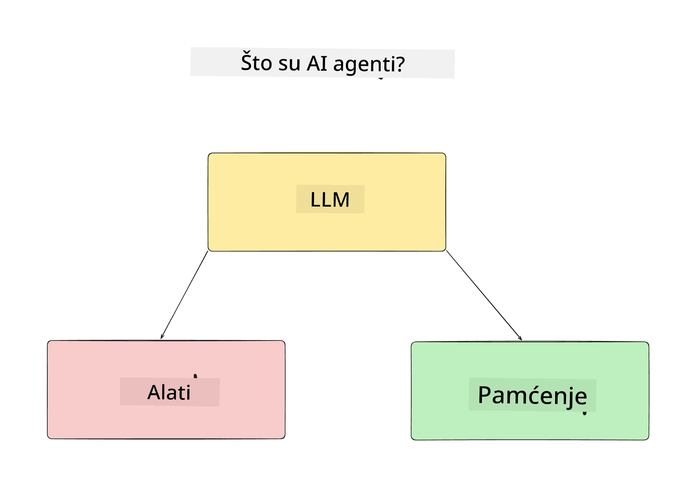
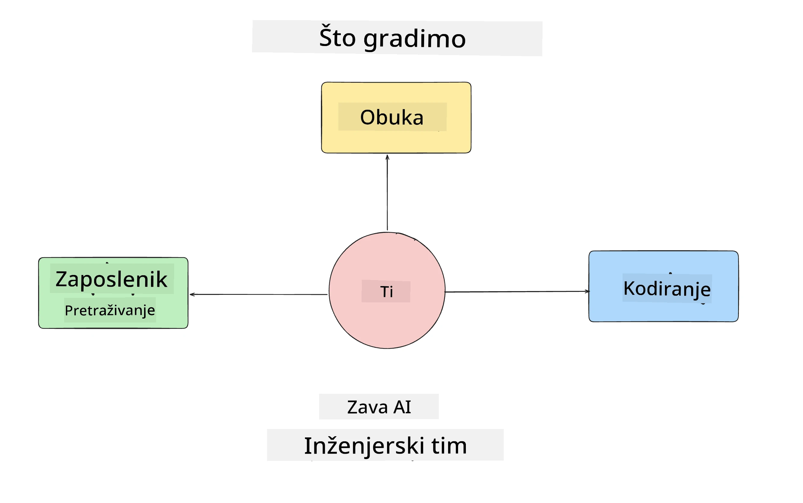
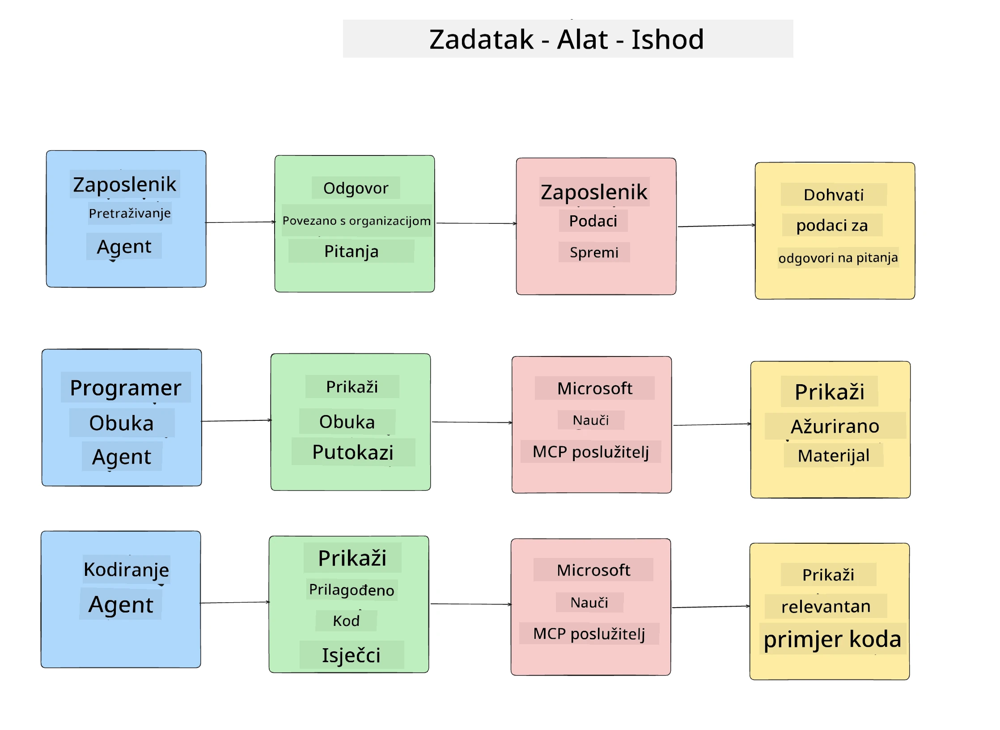
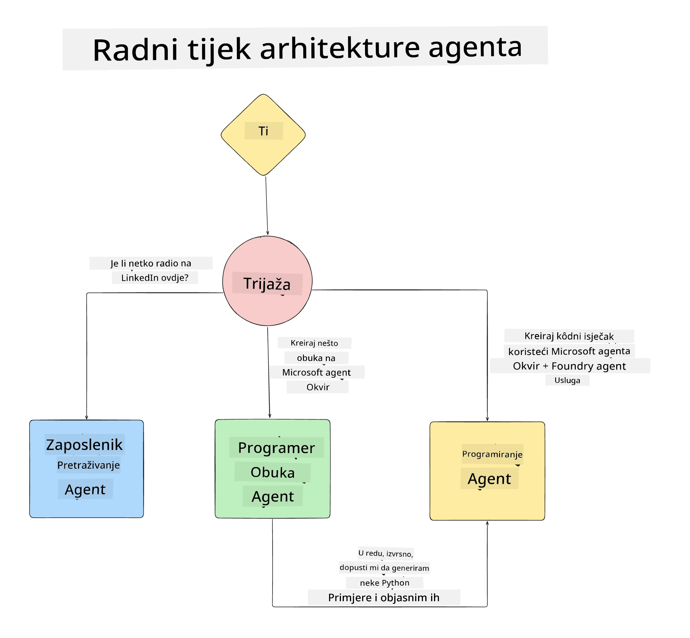

# Lekcija 1: Dizajn AI Agenta

Dobrodošli u prvu lekciju tečaja "Izgradnja AI Agenta od Nule do Produkcije"!

U ovoj lekciji ćemo pokriti:

- Definiranje što su AI Agenti
  
- Rasprava o AI Agent aplikaciji koju gradimo  

- Identificirati potrebne alate i usluge za svakog agenta
  
- Arhitektura naše Agent aplikacije
  
Počnimo definiranjem što je agent i zašto bismo ih koristili unutar aplikacije.

> **Prije nego započnete tečaj.** Ova prva lekcija je konceptualna — nema koda za izvršavanje.
> Od [Lekcije 2](../lesson-2-agent-development/README.md) nadalje trebat će vam: **Azure pretplata** s pristupom **Microsoft Foundry**, implementirani **GPT-5 serijski model** (na primjer `gpt-5.1` — izbjegavajte umirovljene GPT-4o / GPT-4.1), **Python 3.12+**, i **Azure CLI** (`az login`). Pogledajte [Što Vam Treba](../README.md#what-you-need) u README tečaja za cjeloviti popis i poveznice.

## Što su AI Agenti?

Ako prvi put istražujete kako izraditi AI Agenta, možda imate pitanja kako točno definirati što je AI Agent.

Jednostavan način definiranja AI Agenta je prema komponentama koje ga čine:

**Veliki jezični model** - LLM pokreće sposobnost obrade prirodnog jezika od korisnika za interpretaciju zadatka koji žele obaviti kao i interpretaciju opisa dostupnih alata za izvršenje tih zadataka.

**Alati** - To će biti funkcije, API-ji, baze podataka i ostale usluge koje LLM može izabrati koristiti kako bi ispunio zadatke koje je korisnik zatražio.

**Memorija** - Ovo je način na koji pohranjujemo kratkoročne i dugoročne interakcije između AI Agenta i korisnika. Pohrana i dohvat ovih podataka važni su za poboljšanja i spremanje korisničkih preferencija tijekom vremena.

## Naš AI Agent Primjer Primjene

Za ovaj tečaj izgradit ćemo AI Agent aplikaciju koja pomaže novim programerima priključiti se našem AI Agent Razvojnome timu!

Prije nego započnemo razvojni rad, prvi korak za izradu uspješne AI Agent aplikacije je definirati jasne scenarije kako očekujemo da naši korisnici rade s AI Agentima.

Za ovu aplikaciju radit ćemo s ovim scenarijima:

**Scenarij 1**: Novi zaposlenik se pridružuje našoj organizaciji i želi znati više o timu u koji je došao i kako se povezati s njima.

**Scenarij 2:** Novi zaposlenik želi znati koji je najbolji prvi zadatak na kojem bi mogao početi raditi.

**Scenarij 3:** Novi zaposlenik želi prikupiti materijale za učenje i primjere koda koji će mu pomoći započeti s izvršavanjem zadatka.

## Identificiranje Alata i Usluga

Sada kada smo stvorili ove scenarije, sljedeći korak je mapirati ih na alate i usluge koje će naši AI agenti trebati za izvršenje tih zadataka.

Ovaj proces spada u kategoriju Kontekstnog Inženjerstva jer ćemo se usredotočiti na to da naši AI Agenti imaju odgovarajući kontekst u pravom trenutku za izvršenje zadataka.

Radimo ovo scenarij po scenarij i obavljamo dobar agentski dizajn navodeći zadatke, alate i željene ishode za svakog agenta.

### Scenarij 1 - Agent za pretraživanje zaposlenika

**Zadatak** - Odgovarati na pitanja o zaposlenicima u organizaciji kao što su datum dolaska, trenutni tim, lokacija i posljednja pozicija.

**Alati** - Baza podataka trenutne liste zaposlenika i organizacijski dijagram

**Ishodi** - Mogućnost dohvaćanja informacija iz baze podataka za odgovore na opća organizacijska pitanja i specifična pitanja o zaposlenicima.

### Scenarij 2 - Agent za preporuke zadataka

**Zadatak** - Na temelju iskustva novog zaposlenika programera, osmisliti 1-3 problema na kojima novi zaposlenik može raditi.

**Alati** - GitHub MCP poslužitelj za dohvat otvorenih problema i izgradnju developerskog profila

**Ishodi** - Mogućnost čitanja posljednja 5 commitova GitHub profila i otvorenih problema na GitHub projektu te davanje preporuka na temelju podudaranja

### Scenarij 3 - Agent pomoćnik za kodiranje

**Zadatak** - Na temelju otvorenih problema koje je preporučio "Agent za preporuke zadataka", istražiti i osigurati resurse te generirati isječke koda koji će pomoći zaposleniku.

**Alati** - Microsoft Learn MCP za pronalazak resursa i Code Interpreter za generiranje prilagođenih isječaka koda.

**Ishodi** - Ako korisnik traži dodatnu pomoć, tijek rada treba koristiti Learn MCP poslužitelj za pružanje poveznica i isječaka resursa, a zatim prebaciti na Code Interpreter agenta za generiranje malih isječaka koda s objašnjenjima.

## Arhitektura naše Agent aplikacije

Sada kada smo definirali svakog od naših agenata, kreirajmo dijagram arhitekture koji će nam pomoći razumjeti kako će svaki agent raditi zajedno i zasebno ovisno o zadatku:

## Sljedeći koraci

Sada kada smo dizajnirali svakog agenta i naš agentski sustav, krenimo na sljedeću lekciju u kojoj ćemo razviti svakog od ovih agenata!

---

<!-- CO-OP TRANSLATOR DISCLAIMER START -->
**Napomena**:
Ovaj dokument je preveden korištenjem AI prevoditeljskog servisa [Co-op Translator](https://github.com/Azure/co-op-translator). Iako težimo točnosti, imajte na umu da automatski prijevodi mogu sadržavati greške ili netočnosti. Izvorni dokument na izvornom jeziku treba smatrati autoritativnim izvorom. Za važne informacije preporuča se profesionalni ljudski prijevod. Nismo odgovorni za bilo kakva nesporazumevanja ili pogrešne interpretacije koje proizlaze iz korištenja ovog prijevoda.
<!-- CO-OP TRANSLATOR DISCLAIMER END -->