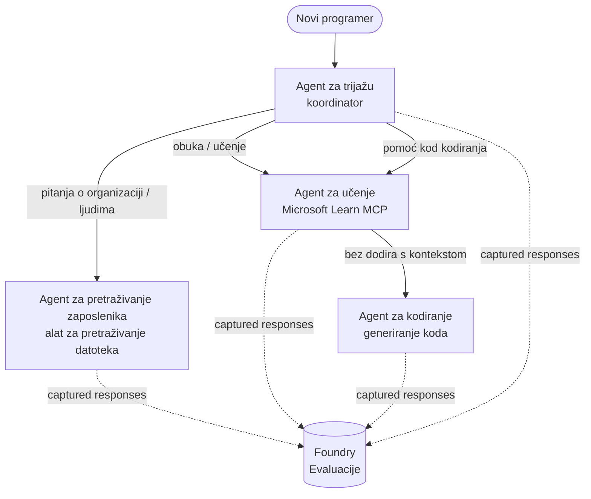

# Lekcija 3: Evaluacije agenata s Microsoft Foundry

Dobrodošli u treću lekciju tečaja **"Izgradnja AI agenata od nule do produkcije"**!

U [Lekciji 2](../lesson-2-agent-development/README.md) ste izrađivali agente. U ovoj lekciji
naučit ćete kako odgovoriti na puno teže pitanje: **jesu li uopće dobri?** Isporučiti agenta
koji radi je lako; znati radi li pravilno usmjeravanje, ostaje li utemeljen u vašim podacima i koristi li pravilno svoje
alate ono je što razlikuje demo od produkcijskog sustava.

U ovoj lekciji ćemo obraditi:

- Zašto je evaluacija agenata bitna i kako se razlikuje od tradicionalnog testiranja
- Razliku između **promatrivosti**, **smoke testova** i **evaluacija**
- Višeagentski tijek rada koji ćemo mjeriti
- Ugrađene **Microsoft Foundry evaluatore** (relevantnost, utemeljenost, točnost poziva alata, korištenje izlaza iz alata)
- Vodič korak-po-korak kroz evaluacijski pipeline u [`agent-evals.py`](../../../lesson-3-agent-evals/agent-evals.py)
- Kako ga pokrenuti i čitati rezultate

---

## Zašto evaluirati agente?

Tradicionalni jedinični test tvrdi da je `add(2, 2) == 4`. Agenti ne funkcioniraju tako — isti
upit može proizvesti različite formulacije svaki put, alati se mogu aktivirati u različitim redoslijedima, a
"točno" je često stvar stupnja, a ne booleovske vrijednosti. Ne možete tvrditi o točnim nizovima znakova.

Umjesto toga, agente evaluirate po **dimenzijama kvalitete** koristeći modele *evaluatora* (također
nazvanih "LLM-kao-suci") plus determinističke provjere korištenja alata. To vam govori stvari poput:

- Je li odgovor stvarno odgovorio na pitanje? (**relevantnost**)
- Je li odgovor podržan dohvaćenim podacima ili je agent halucinirao? (**utemeljenost**)
- Je li agent pozvao pravi alat s pravim argumentima? (**točnost poziva alata**)
- Je li agent stvarno iskoristio ono što je alat vratio? (**korištenje izlaza alata**)

### Tri komplementarne razine kvalitete

Ovo nisu konkurentne tehnike — produkcijski agent koristi sve tri:

| Razine | Pitanje na koje odgovara | Trošak | Kada se izvodi | Obrađeno u |
|--------|-------------------------|--------|---------------|------------|
| **Promatrivost / praćenje** | *Što je agent napravio, korak po korak?* | Besplatno (uvijek uključeno) | Kontinuirano u produkciji | Ova lekcija |
| **Smoke testovi** | *Je li agent dostupan i slijedi osnovni upit?* | Jeftino, sekunde | Svako implementiranje | [Lekcija 4](../lesson-4-agentdeployment/README.md#smoke-testing-the-hosted-agent-ci-gate) |
| **Evaluacije** | *Koliko su **dobri** odgovori?* | Sporije, mjereno po modelu | Na zahtjev / noćno / prije izdanja | Ova lekcija |

Smoke testovi odgovaraju "je li se srušilo?"; evaluacije odgovaraju "je li dobro?". Trebate oba.

---

## Preduvjeti

1. Završena [Lekcija 2](../lesson-2-agent-development/README.md) (agenti + vektor trgovina).
2. **Microsoft Foundry** projekt.
3. Autentifikacija s **Azure CLI**: `az login`.
4. Instaliran **Python 3.12+** i ovisnosti tečaja:

   ```bash
   pip install -r ../requirements.txt
   ```

5. Varijable okoline (kreirajte `.env` datoteku u ovoj mapi ili ih eksportirajte):

   | Varijabla | Svrha |
   |----------|--------|
   | `FOUNDRY_PROJECT_ENDPOINT` | Endpoint vašeg Foundry projekta (`https://<račun>.services.ai.azure.com/api/projects/<projekt>`). Čita ga `FoundryChatClient` agenata **i** pomoćnik za evaluaciju. |
   | `FOUNDRY_MODEL` | Model raspoređen na kojem **agenti** rade (npr. `gpt-5.1`). |
   | `VECTOR_STORE_ID` | Vektor trgovina direktorija zaposlenika kreirana u Lekciji 2 |
   | `AZURE_AI_MODEL_DEPLOYMENT_NAME` | Model raspoređen koji koriste **evaluatori** (default je `FOUNDRY_MODEL`, zatim `gpt-5.1`) |

> Agenti koriste `FoundryChatClient` koji čita konfiguraciju iz varijabli s prefiksom `FOUNDRY_`
> (`FOUNDRY_PROJECT_ENDPOINT`, `FOUNDRY_MODEL`). Pomoćnik za evaluaciju u oblaku
> koristi `azure-ai-projects` SDK i vraća se na `FOUNDRY_PROJECT_ENDPOINT` ako
> `AZURE_AI_PROJECT_ENDPOINT` nije postavljen — tako da su dvije `FOUNDRY_` varijable dovoljne za
> pokretanje cijele lekcije.
>
> Evaluatori su sami pokretani modelom, pa `AZURE_AI_MODEL_DEPLOYMENT_NAME`
> kontrolira koji raspored izvršava ocjenjivanje — ne mora nužno biti isti model koji vaši
> agenti koriste.

---

## Tijek rada koji evaluiramo

Da biste nešto evaluirali, prvo ga morate pokrenuti. Ova lekcija ponovno koristi tijek rada višestrukih agenata za **uvođenje programera**:
koordinacija **triage** predaje tri specijalista.



Tijek rada je izgrađen s Microsoft Agent Framework-ovom orkestracijom **handoff**. Ključna
ideja za evaluaciju je da se **svaki potez agenta pohranjuje na poslužitelju** i identificira s
`response_id`. Ti ID-ovi su oni koje predajemo evaluacijskom servisu.

---

## Evaluacijski pipeline, korak po korak

[`agent-evals.py`](../../../lesson-3-agent-evals/agent-evals.py) implementira pipeline u šest koraka. Evo što svaki korak radi
i zašto.

### Korak 1 — Pokreni tijek rada i prati ID-ove odgovora

Tijek rada se izvršava s `run_stream(...)`, i dok događaji stignu, kod zapisuje
`response_id` i `conversation_id` generirane od svakog agenta. Pohranjeni odgovori su sirovi
materijal za evaluaciju — ocjenjujete *stvarne* odgovore iz produkcije, a ne generirane ponovo.


### Korak 2 — Sažmi što je zabilježeno

Brzi sažetak ispisuje koliko je odgovora svaki agent napravio, tako da možete potvrditi da je tijek rada
zaista upotrijebio agente koje želite ocijeniti.

### Korak 3 — Dohvati konačne odgovore

Za svakog agenta, zadnji `response_id` se dohvaća preko OpenAI-kompatibilnog klijenta projekta
(`project_client.get_openai_client().responses.retrieve(...)`) kako biste mogli pregledati
tekst koji će se ocjenjivati.

### Korak 4 — Kreiraj evaluaciju

Evaluacija se kreira s četiri **ugrađena Foundry evaluatora**:

| Evaluator | `evaluator_name` | Što mjeri |
|-----------|------------------|-----------|
| Relevantnost | `builtin.relevance` | Odgovara li odgovor na korisnički zahtjev? |

| Utemeljenost | `builtin.groundedness` | Je li odgovor podržan dohvaćenim/pomoćnim podacima (nije haluciniran)? |
| Točnost poziva alata | `builtin.tool_call_accuracy` | Jesu li pozvani pravi alati s pravim argumentima? |
| Korištenje izlaza alata | `builtin.tool_output_utilization` | Je li agent zapravo iskoristio rezultate alata u svom odgovoru? |

Svaki evaluator se inicijalizira s implementacijom nazvanom `AZURE_AI_MODEL_DEPLOYMENT_NAME`.

> **Zašto ova četiri?** Relevantnost i utemeljenost mjere *kvalitetu odgovora*; dva evaluatora alata
> mjere *agencijsko ponašanje* — dio koji tradicionalne NLP metrike u potpunosti propuštaju. Za
> sustav s više agenata koji koristi alate, metričke vrijednosti alata često otkrivaju stvarne regresije.

### Korak 5 — Pokrenite evaluaciju

Uhvaćeni `response_id` se prosljeđuje u `evals.runs.create(...)` kao izvor podataka. Servis zatim
reproducira svaki pohranjeni odgovor kroz svakog evaluatora.

### Korak 6 — Pratite i pročitajte rezultate

Kod prati izvođenje dok ne postane `completed` ili `failed`, a zatim ispisuje broj rezultata i
**`report_url`** — dubinsku poveznicu u Foundry portal gdje možete pregledati ocjene po metriki,
broj prolaza/padova i pojedinačne ocijenjene odgovore.

---

## Pokreni to

```bash
cd lesson-3-agent-evals
python agent-evals.py
```

Po zadanim postavkama evaluira prvi primjer upita
(`"I'm new here! Has anyone worked at Microsoft here?"`). Dva dodatna višekonceptna primjera
nalaze se u `run_evaluation_workflow()` — zamijenite varijablu `query` da probate scenarije usmjeravanja
koji aktiviraju više agenata u jednom izvođenju.

Očekivani tijek konzole:

```
Step 1: Running Developer Onboarding Workflow
Step 2: Response Data Summary
Step 3: Fetching Agent Responses
Step 4: Creating Evaluation
Step 5: Running Evaluation
Step 6: Monitoring Evaluation
  Status: running ...
  Evaluation completed successfully
  Report URL: https://...   <-- open this in the Foundry portal
```

---

## Promatranje i praćenje

Evaluacije vam govore *koliko su dobri* bili odgovori; **promatranje** vam pokazuje *što se dogodilo*
da ih proizvede — svaki preskok agenta, poziv alata, broj tokena i kašnjenje. U Microsoft Foundry-u,
izvođenja agenata emitiraju OpenTelemetry tragove koje možete pregledati u portalu, a Agent Framework ih
može izvesti u Azure Monitor / Application Insights jednim pozivom:

```python
from agent_framework.foundry import FoundryChatClient

client = FoundryChatClient()
client.configure_azure_monitor()   # izvoz tragova + metrika u Application Insights
```

Koristite praćenje da **otklonite pogreške** loše evaluacijske ocjene: kad utemeljenost padne, trag vam pokazuje
je li alat za pretraživanje datoteka vratio ništa, ili je vratio podatke koje je agent zatim ignorirao (što je
upravo ono što mjeri korištenje izlaza alata).

---

## Od "izvođenja" do "dobro": kako ovo koristiti u praksi

- **Pre-release vrata.** Pokrenite evaluacije na fiksnom skupu reprezentativnih upita prije
  promocije novog prompta ili modela. Usporedite rezultate s prethodnom verzijom — pad tretirajte kao
  regresiju.
- **Noćni signal kvalitete.** Rasporedite evaluaciju za hvatanje pomaka u podacima ili promjenama ovisnosti.

- **Uparite s testovima dima.** [Lesson 4 smoke test](../lesson-4-agentdeployment/README.md#smoke-testing-the-hosted-agent-ci-gate)
  je vaš brzi prijelazni test po implementaciji; evaluacije su sporija i dublja kvalitativna vrata. Pokrenite jeftini
  test na svakom spajanju i skuplji po rasporedu ili prije izdanja.

---

## Napomena o modernizaciji

Ovaj primjer se prebacuje na trenutačni Microsoft Agent Framework Foundry API
(`agent_framework.foundry`). Ako ažurirate kôd, pogledajte korijen repozitorija

[`MIGRATION-GUIDE.md`](../MIGRATION-GUIDE.md) za potvrđene prije/nakon uvoza i klijentske
preslikavanja (na primjer `AzureAIClient` -> `FoundryChatClient`, i konstrukciju alata za hostiranje putem
`client.get_file_search_tool(...)` / `client.get_mcp_tool(...)`). Koncepti evaluacije i
šestostupanjski tijek rada gore ostaju nepromijenjeni tom migracijom.

---

## Resursi

- [Evaluacija generativnih AI modela i aplikacija (Microsoft Learn)](https://learn.microsoft.com/en-us/azure/ai-foundry/concepts/evaluation-approach-gen-ai)
- [Ugrađene evaluatore za generativnu AI](https://learn.microsoft.com/en-us/azure/ai-foundry/concepts/evaluation-evaluators/agent-evaluators)
- [Promatranje u Microsoft Foundry](https://learn.microsoft.com/en-us/azure/ai-foundry/concepts/observability)
- [Microsoft Agent Framework](https://github.com/microsoft/agent-framework)
- [Orkestracija predaje agenta](https://learn.microsoft.com/en-us/agent-framework/workflows/orchestrations/handoff)

---

<!-- CO-OP TRANSLATOR DISCLAIMER START -->
**Napomena**:
Ovaj dokument je preveden korištenjem AI prevoditeljskog servisa [Co-op Translator](https://github.com/Azure/co-op-translator). Iako težimo točnosti, imajte na umu da automatski prijevodi mogu sadržavati greške ili netočnosti. Izvorni dokument na izvornom jeziku treba smatrati autoritativnim izvorom. Za važne informacije preporuča se profesionalni ljudski prijevod. Nismo odgovorni za bilo kakva nesporazumevanja ili pogrešne interpretacije koje proizlaze iz korištenja ovog prijevoda.
<!-- CO-OP TRANSLATOR DISCLAIMER END -->