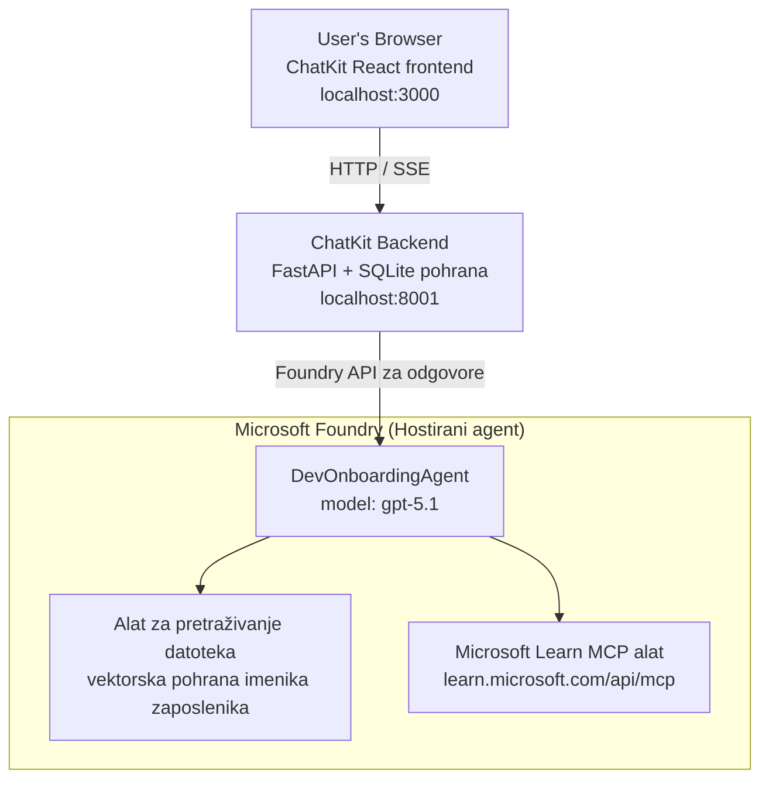

# Lekcija 4: Implementacija agenata s Microsoft Foundry hostiranim agentima + ChatKit

Ova lekcija pokazuje kako implementirati agenta koji koristi alate na Microsoft Foundry kao hostirani agent i stvoriti frontend zasnovan na ChatKit za interakciju s njim.

## Arhitektura

Hostirani agent je **jedan `DevOnboardingAgent`** (pokreće se na `gpt-5.1`) koji odgovara na pitanja o uvođenju developera koristeći dva hostirana alata: alat za **pretraživanje datoteka** preko direktorija zaposlenika u vektor bazi podataka i alat **Microsoft Learn MCP**. ChatKit React frontend razgovara s FastAPI backendom koji poziva agenta preko Foundry **Responses API-ja**.



## Preduvjeti

1. **Microsoft Foundry Projekt** u regiji North Central US
2. **Azure CLI** autentificiran (`az login`)
3. **Azure Developer CLI** (`azd`) instaliran
4. **Python 3.12+** i **Node.js 18+**
5. **Vektor trgovina** stvorena s podacima zaposlenika

## Brzi početak

### 1. Postavite varijable okoline

```bash
cd lesson-4-agentdeployment
cp .env.example .env
# Uredite .env s detaljima vašeg Microsoft Foundry projekta
```

### 2. Implementirajte hostiranog agenta

**Opcija A: Korištenje Azure Developer CLI (Preporučeno)**

```bash
cd hosted-agent
azd auth login
azd agent deploy
```

**Opcija B: Korištenje Dockera + Azure Container Registry**

```bash
cd hosted-agent

# Izgradi spremnik
docker build -t developer-onboarding-agent:latest .

# Oznaka za ACR
docker tag developer-onboarding-agent:latest <your-acr>.azurecr.io/developer-onboarding-agent:latest

# Pošalji u ACR
az acr login --name <your-acr>
docker push <your-acr>.azurecr.io/developer-onboarding-agent:latest

# Implementiraj putem Microsoft Foundry portala ili SDK-a
```

### 3. Pokrenite ChatKit Backend

```bash
cd chatkit-server
python -m venv .venv
source .venv/bin/activate  # Na Windowsima: .venv\Scripts\activate
pip install -r requirements.txt
python app.py
```

Server će startati na `http://localhost:8001`

### 4. Pokrenite ChatKit Frontend

```bash
cd chatkit-server/frontend
npm install
npm run dev
```

Frontend će startati na `http://localhost:3000`

### 5. Testirajte aplikaciju

Otvorite `http://localhost:3000` u pregledniku i isprobajte ove upite:

**Pretraživanje zaposlenika:**
- "Novi sam ovdje! Je li netko radio u Microsoftu?"
- "Tko ima iskustva s Azure Functions?"

**Resursi za učenje:**
- "Stvori put učenja za Kubernetes"
- "Koje certifikate trebam za arhitekturu u oblaku?"

**Pomoć kod kodiranja:**
- "Pomozi mi napisati Python kod za povezivanje s CosmosDB"
- "Pokaži mi kako stvoriti Azure Function"

**Upiti s više agenata:**
- "Počinjem kao cloud inženjer. S kim da se povežem i što trebam naučiti?"

## Struktura Projekta

```
lesson-4-agentdeployment/
├── .env.example                 # Environment variables template
├── implementation-plan.md       # Detailed implementation guide
├── README.md                    # This file
├── hosted-agent/               # Microsoft Foundry hosted agent
│   ├── main.py                 # Multi-agent workflow implementation
│   ├── requirements.txt        # Python dependencies
│   ├── Dockerfile              # Container definition
│   └── agent.yaml              # Agent deployment configuration
└── chatkit-server/             # ChatKit server application
    ├── app.py                  # FastAPI backend
    ├── store.py                # SQLite persistence layer
    ├── requirements.txt        # Python dependencies
    └── frontend/               # React frontend
        ├── package.json
        ├── vite.config.ts
        ├── tsconfig.json
        ├── index.html
        └── src/
            ├── main.tsx
            ├── App.tsx
            ├── App.css
            └── index.css
```

## Agent i njegovi alati

Hostirani agent je **jedan agent** (`DevOnboardingAgent`, definiran u `hosted-agent/main.py`) koji pokriva tri područja uvođenja. Umjesto orkestriranja zasebnih sub-agenta, svaki kapacitet izlaže kao alat (ili se oslanja direktno na model):

| Mogućnost | Kako je obrađeno | Alat |
|-----------|------------------|------|
| **Pretraživanje zaposlenika i veze** | Foundry hostirani File Search preko direktorija zaposlenika u vektor bazi | `client.get_file_search_tool(vector_store_ids=[...])` |
| **Učenje i trening** | Microsoft Learn MCP server (hostirani MCP alat) | `client.get_mcp_tool(url="https://learn.microsoft.com/api/mcp")` |
| **Pomoć kod kodiranja** | Direktno obrađeno modelom `gpt-5.1` — bez eksternog alata | — |

Agent je kreiran s `client.as_agent(name="DevOnboardingAgent", instructions=..., tools=[file_search_tool, learn_mcp_tool])` i poslužen s `from_agent_framework(agent).run()`.

> **Napomena za dizajn.** Ranije verzije ove lekcije koristile su `HandoffBuilder` multi-agent tijek rada (Triage → specijalisti). Dostavljeni agent je jedinstveni agent koji koristi alate, što je jednostavnije za implementaciju i razumijevanje za Q&A stil uvođenja. Za primjer orkestracije više agenata i predaje, pogledajte Lekciju 2 i Lekciju 3.

## Smoke testiranje hostiranog agenta (CI vrata)

Implementacija hostiranog agenta "uspješno" samo dokazuje da je kontrolna razina prihvatila
definiciju — **ne** dokazuje da agent stvarno odgovara. Nedostajući ovisnosti,
loše usmjeravanje modela ili istekla veza mogu ostaviti zelenog, ali nijemog agenta.

Ova lekcija donosi lagani **smoke test** koji djeluje kao brza, jeftina post-implementacijska
provjera. Koristi [AI Smoke Test](https://github.com/marketplace/actions/ai-smoke-test)
GitHub Action za POST postavljanje upita na Foundry **Responses** krajnju točku agenta
(`POST {project_endpoint}/agents/{agent_name}/endpoint/protocols/openai/responses`)
i provjeru vraćenog teksta. Hvata neispravne implementacije, regresije autentifikacije,
odstupanje sistemskih promptova i prekide u vođenju razgovora tijekom sekundi.

> Smoke testovi **nisu** zamjena za potpune evaluacije u
> [Lekcija 3](../lesson-3-agent-evals/README.md) — oni su nadopuna. Smoke testovi
> odgovaraju na pitanje *"je li agent dostupan, odgovara li i prati osnovna očekivanja prompta?"*;
> evaluacije odgovaraju na pitanje *"kvaliteta odgovora?"*. Pokrenite jeftina vrata kod svakog implementiranja.

### Što se testira

Katalog se nalazi u [`hosted-agent/tests/smoke-tests.json`](../../../lesson-4-agentdeployment/hosted-agent/tests/smoke-tests.json)
i pokriva tri domene agenta plus pridržavanje prompta i višekratno vođenje razgovora:

| Test | Što provjerava |
|------|------------------|
| `reachability` | Agent odgovara s ne-praznim, u kontekstu relevantnim tekstom |
| `employee-search` | Područje pretraživanja datoteka vraća zdrav `200` status (odgovor ovisan o podacima) |
| `learning-path` | Područje učenja odražava temu i proizvodi odgovor u obliku putanje |
| `coding-assistance` | Područje kodiranja daje odgovor u obliku Python koda |
| `prompt-adherence-offtopic` | Zahtjev izvan teme je preusmjeren, ne dobiva detaljan odgovor |
| `threading-turn-1/2` | Stanje razgovora se održava kroz krugove preko `previous_response_id` |

### Pokrenite u CI

Tijek rada u [`.github/workflows/smoke-test-hosted-agent.yml`](../../../.github/workflows/smoke-test-hosted-agent.yml)
ima dva posla:

- **`static`** — brza, bez-Azure provjera koja se izvršava pri svakom zahtjevu za povlačenje i guranju:
  kompajlira sve Python izvore (`py_compile`) i provjerava Markdown linkove. Nema potrebe za tajnama,
  pa radi i na fork zahtjevima.
- **`smoke`** — Azure-povezan smoke test dolje. Pokreće se na zahtjev
  (Actions → **Agent CI (static + smoke)** → Run workflow) i može se poredati nakon vašeg
  tijeka rada za implementaciju.

Konfigurirajte ove varijable i tajne repozitorija za smoke posao:

| Vrsta | Ime | Vrijednost |
|------|------|-------|

| Varijabla | `FOUNDRY_PROJECT_ENDPOINT` | `https://<account>.services.ai.azure.com/api/projects/<project>` |
| Varijabla | `HOSTED_AGENT_NAME` | Ime razmještenog agenta (npr. `dev-onboarding` — mora se podudarati s vašom implementacijom) |
| Tajna | `AZURE_CLIENT_ID` / `AZURE_TENANT_ID` / `AZURE_SUBSCRIPTION_ID` | OIDC federirana identitet za `azure/login` |

Identitet izvođača treba ulogu **`Azure AI User`** na **Foundry projektnoj razini** kako bi mogao
pozivati krajnje točke za Responses (i conversations) data-plane. Dodijelite mu je putem:

```bash
az role assignment create \
  --assignee <object-id-or-appId-of-runner-identity> \
  --role "Azure AI User" \
  --scope "/subscriptions/<sub>/resourceGroups/<rg>/providers/Microsoft.CognitiveServices/accounts/<account>/projects/<project>"
```

### Pokrenite lokalno

Možete pokrenuti isti katalog prije slanja. Nabavite data-plane token s područjem
`https://ai.azure.com/` i usmjerite izvođača na vašu implementaciju:

```bash
# Publica MORA biti https://ai.azure.com/ (tokeni cognitiveservices.azure.com se odbijaju)
export FOUNDRY_TOKEN=$(az account get-access-token --resource https://ai.azure.com/ --query accessToken -o tsv)

git clone https://github.com/JFolberth/ai-smoketest && cd ai-smoketest
python runner.py \
  --project-endpoint "https://<account>.services.ai.azure.com/api/projects/<project>" \
  --agent-name dev-onboarding \
  --tests-file ../lesson-4-agentdeployment/hosted-agent/tests/smoke-tests.json
```

Izlazni kodovi: `0` sve je prošlo, `1` jedna tvrdnja nije uspjela, `2` greška izvođača (loš katalog / token).

## Rješavanje problema

### Agent ne odgovara
- Provjerite je li hostovani agent raspoređen i radi u Microsoft Foundry
- Provjerite odgovaraju li `HOSTED_AGENT_NAME` i `HOSTED_AGENT_VERSION` vašoj implementaciji

### Greške sa spremištem vektora
- Provjerite je li `VECTOR_STORE_ID` ispravno postavljen
- Provjerite sadrži li spremište vektora podatke zaposlenika

### Greške autentifikacije
- Pokrenite `az login` za osvježavanje vjerodajnica
- Provjerite imate li pristup Microsoft Foundry projektu

## Resursi

- [Microsoft Foundry Hosted Agents Dokumentacija](https://learn.microsoft.com/en-us/azure/ai-foundry/agents/concepts/hosted-agents)
- [Microsoft Agent Framework](https://github.com/microsoft/agent-framework)
- [ChatKit Integracijski Primjer](https://github.com/microsoft/agent-framework/tree/main/python/samples/demos/chatkit-integration)
- [Azure Developer CLI](https://learn.microsoft.com/en-us/azure/developer/azure-developer-cli/overview)
- [AI Smoke Test GitHub akcija](https://github.com/marketplace/actions/ai-smoke-test)
- [Smoke Test Microsoft Foundry Agents sa GitHub Actions (blog)](https://techcommunity.microsoft.com/blog/azuredevcommunityblog/smoke-test-microsoft-foundry-agents-with-github-actions/4531912)

---

## Sljedeći koraci

Vaš agent radi na infrastrukturi kojom upravlja Microsoft. Da biste ga doveli do proizvodnje u poduzeću —
kontrolirajući gdje njegovi podaci žive (suverenitet podataka, privatno umrežavanje, koristite vlastiti Azure
Cosmos DB / Storage / AI Search) i upravljajući njegovim alatima — nastavite sa
**[Lekcija 5: Proizvodni hostovani agenti](../lesson-5-hosted-agents-production/README.md)**, koja
objašnjava ključnu razliku između **Hostovanih agenata** i **Capability Hosts**.

---

<!-- CO-OP TRANSLATOR DISCLAIMER START -->
**Napomena**:
Ovaj dokument je preveden korištenjem AI prevoditeljskog servisa [Co-op Translator](https://github.com/Azure/co-op-translator). Iako težimo točnosti, imajte na umu da automatski prijevodi mogu sadržavati greške ili netočnosti. Izvorni dokument na izvornom jeziku treba smatrati autoritativnim izvorom. Za važne informacije preporuča se profesionalni ljudski prijevod. Nismo odgovorni za bilo kakva nesporazumevanja ili pogrešne interpretacije koje proizlaze iz korištenja ovog prijevoda.
<!-- CO-OP TRANSLATOR DISCLAIMER END -->