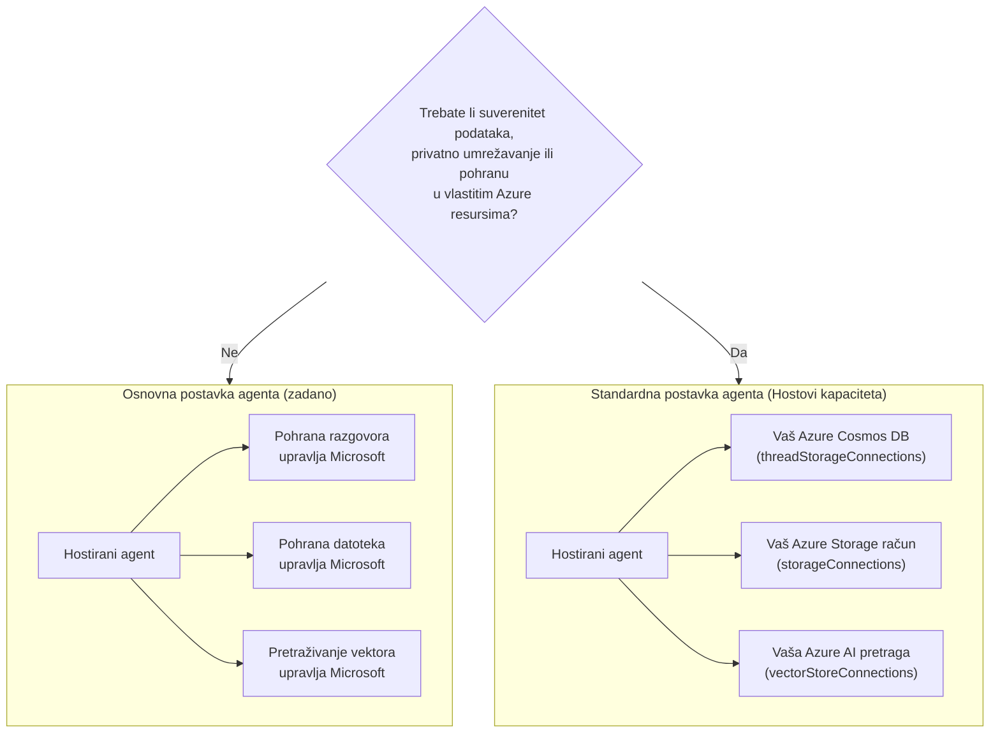

# Lekcija 5: Produkcijski hostirani agenti — Pohrana, memorija i upravljanje

U [Lekciji 4](../lesson-4-agentdeployment/README.md) ste implementirali Developer Onboarding
Agenta kao **Microsoft Foundry Hostirani Agent** i stavili ChatKit sučelje ispred njega. Ta
lekcija je odgovorila na pitanje *"kako isporučujem agenta?"*. Ova lekcija odgovara na pitanja
koja slijede u poduzeću: **Gdje se pohranjuju podaci mog agenta? Tko ih kontrolira? Kako zadobiti usklađenost,
mrežne i upravljačke zahtjeve?**

Najvažnija ideja u ovoj lekciji je razlika između **Hostiranog Agenta** i
**Capability Host-a** — dva pojma koja je lako zbuniti, ali rješavaju potpuno različite
probleme.

## Ciljevi učenja

Do kraja ove lekcije moći ćete:

- Objasniti što vam daje **Hostirani Agent** (izvršenje koje upravlja Microsoft) i što **ne** daje.
- Objasniti što je **Capability Host** i točno kada vam treba.
- Odabrati između **osnovnog postava agenta** (pohrana kojom upravlja Microsoft) i **standardnog postava agenta**
  (koristeći vlastite Azure resurse).
- Razumjeti kako se **povijest razgovora, prijenosi datoteka i vektorske baze** pohranjuju i kako ih
  preusmjeriti na vlastiti Azure Cosmos DB, Azure Storage i Azure AI Search.
- Primijeniti upravljačke kontrole: suverenitet podataka, privatni mrežni pristup i **odobrenje Hosted MCP alata**.

---

## Preduvjeti

1. Završena [Lekcija 4](../lesson-4-agentdeployment/README.md) — imate implementiran hostirani agent.
2. Projekt **Microsoft Foundry** i Azure račun s dozvolom za kreiranje resursa
   (Cosmos DB, Storage, Azure AI Search) i dodjelu uloga u pretplati/grupi resursa.
3. **Azure CLI** autentikacija: `az login` (i `az account set --subscription <id>` ako imate
   više od jedne pretplate).
4. Instaliran **Azure Developer CLI** (`azd`) — koristi se za tijek rada postavljanja standardnog okruženja.
5. **Python 3.12+** s instaliranim ovisnostima kursa (`pip install -r ../requirements.txt`).
6. Trenutna implementacija modela koja nije povučena (npr. `gpt-5.1`). Izbjegavajte povučene modele GPT-4o / GPT-4.1.

> Ova lekcija je uglavnom konceptualna i fokusirana na kontrolnu ravninu. Možete je pročitati od početka do kraja bez
> postavljanja bilo čega, a zatim koristiti praktične vježbe kad budete spremni konfigurirati
> standardni sustav.

---

## 1. Hostirani agenti: što Foundry upravlja umjesto vas

**Hostirani Agent** je agent čije *izvršno okruženje* u potpunosti upravlja Microsoft
Foundry Agent Service. Kada implementirate hostiranog agenta (kao što ste učinili u Lekciji 4), Foundry osigurava:

- **Računanje** — runtime koji izvršava vaš agentni kod i alate.
- **Skaliranje** — replike se skaliraju gore i dolje prema opterećenju (vidi `agent.yaml` `scale` u Lekciji 4).
- **Identitet** — upravljani identitet za agenta koji se autentificira na Azure bez tajni.
- **Promatranje** — praćenje i telemetrija (vidi odjeljak o promatranju u Lekciji 3).
- **Upravljanje sesijama** — teme/razgovori, tako da višekratni razgovori "pamte" prethodne korake.

> **Ključna točka:** Ne trebate konfigurirati Capability Host samo da biste *pokrenuli* hostiranog
> Agenta. Hostirani agent radi odmah na infrastrukturi kojom upravlja Microsoft.

---

## 2. Hostirani agenti nasuprot Capability Hostovima

**Hostirani agenti i Capability Hostovi rješavaju različite probleme.**

**Hostirani agenti** pružaju Microsoftom upravljano izvršno okruženje, uključujući računalne resurse, skaliranje,
identitet, promatranje i upravljanje sesijama. Ne trebate Capability Host da biste samo pokrenuli
hostiranog agenta.

**Capability Hostovi** su potrebni samo kada želite da Agent Service koristi **resurse u vlasništvu kupca**
umjesto Microsoftom upravljane pohrane. Ako ste zadovoljni zadanim
Microsoftom upravljanim pohranama, vektorskim pretraživanjem i pohranom razgovora, **nije potrebna
konfiguracija Capability Host-a.**

Ako vaša organizacija zahtijeva **suverenitet podataka, privatnu mrežu, kontrole usklađenosti ili
pohranu u vlastitom Azure Cosmos DB, Azure Storage računu i Azure AI Search resursima**, tada
konfigurirate Capability Hostove da povežete Agent Service s tim resursima.

U jednoj rečenici:

> **Hostirani Agent** se odnosi na *gdje vaš agent radi*. **Capability Host** se odnosi na *gdje žive*
> podaci vašeg agenta*.

| Briga | Hostirani agent | Capability Host |
|---------|--------------|-----------------|
| Računanje / skaliranje / identitet | ✅ Osigurano | — |
| Promatranje / praćenje | ✅ Osigurano | — |
| Upravljanje sesijama razgovora i tema | ✅ Osigurano | Preusmjerava *gdje se pohranjuje* |
| Gdje se pohranjuje povijest razgovora | Zadano od strane Microsofta | Vaš Azure Cosmos DB |
| Gdje se pohranjuju prenesene datoteke | Zadano od strane Microsofta | Vaš Azure Storage račun |
| Gdje se pohranjuju vektorske ugrađenosti | Zadano od strane Microsofta | Vaš Azure AI Search |
| Potreban za pokretanje agenta? | ✅ Da (to *jest* domaćin agenta) | ❌ Ne — opcionalno |
| Potreban za suverenitet podataka / vlastitu pohranu? | ❌ Sam ne dovoljan | ✅ Da |

---

## 3. Osnovni vs standardni postav agenta

Foundry opisuje dvije konfiguracije podataka kao **osnovni** i **standardni** postav agenta.



### Kada ostati na osnovnom postavu (bez Capability Host)

- Razvoj, prototipiranje i testiranje.
- Interni alati gdje Microsoftom upravljana pohrana zadovoljava vašu politiku rukovanja podacima.
- Želite najbrži put do radnog agenta s najmanje infrastrukture.

### Kada vam treba standardni postav (Capability Hosts)

- **Suverenitet podataka** — svi agentni podaci moraju ostati u vašoj Azure pretplati/regiji.
- **Sigurnosna kontrola** — morate koristiti vlastite račune za pohranu, baze podataka i usluge pretraživanja.
- **Usklađenost** — imate regulatorne ili organizacijske zahtjeve o tome gdje se podaci nalaze.
- **Privatna mreža** — promet mora ostati unutar vaše virtualne mreže (koristite vlastitu virtualnu mrežu).

> **Preporuka iz Microsofta:** koristite *odvojene* Foundry račune/projekte za standardni nasuprot
> osnovnog postava. Izbjegavajte miješanje tipova postava unutar istog Foundry računa.

---

## 4. Kako funkcioniraju Capability Hostovi

**Capability Host** je podresurs koji konfigurirate na **dvije razine**: Foundry **računu**
i Foundry **projektu**. On govori Agent Serviceu gdje pohraniti i obrađivati podatke agenta:
povijest razgovora, datoteke za prijenos i vektorske baze.

Dvije najvažnije pravila su:

1. **Račun prije projekta.** Ne možete kreirati Capability Host za projekt ako već ne postoji
   Capability Host na razini računa.

2. **Nema nasljeđivanja konfiguracije.** Domaćin mogućnosti **projekta** je ono što Agent Service
   zapravo čita kako bi odlučio koje resurse za pohranu/razgovor/vektore koristiti. Konekcije na razini računa
   *nisu* automatski korištene od strane projekta — domaćin mogućnosti projekta mora ih
   eksplicitno referencirati.

### Konekcije koje standardna postava treba

Domaćini mogućnosti referenciraju **konekcije** (stvorene u vašem Foundry računu/projektu) koje pokazuju na
vaše Azure resurse:

| Svojstvo domaćina mogućnosti | Pohranjuje | Vaš Azure resurs |
|------------------------------|-----------|-----------------|
| `threadStorageConnections` | Definicije agenata + povijest razgovora | Azure Cosmos DB |
| `storageConnections` | Učitane datoteke / pohrana blobova | Azure Storage Account |
| `vectorStoreConnections` | Vektorske ugrađene vrijednosti za dohvat/pretraživanje | Azure AI Search |
| `aiServicesConnections` *(opcionalno)* | Vaša vlastita postavljanja modela | Azure OpenAI |

Svaka konekcija mora imati popunjeno `authType`, `category`, `target` (URL **krajnje točke usluge**, ne
ID resursa), i `metadata.ResourceId` (puni Azure ID resursa), inače Agent Service
ne može riješiti resurs u vrijeme izvođenja.

### Konfiguriranje domaćina mogućnosti (kontrolna ravnina)

Domaćini mogućnosti trenutačno se upravljaju preko **Azure Resource Manager REST API-ja** (još nema
SDK-a za upravljanje domaćinima mogućnosti). Najprije stvorite domaćina mogućnosti **računa**:

```http
PUT https://management.azure.com/subscriptions/{subscriptionId}/resourceGroups/{rg}/providers/Microsoft.CognitiveServices/accounts/{account}/capabilityHosts/{name}?api-version=2025-06-01

{
  "properties": { "capabilityHostKind": "Agents" }
}
```

Zatim stvorite domaćina mogućnosti **projekta** koji referencira vaše konekcije:

```http
PUT https://management.azure.com/subscriptions/{subscriptionId}/resourceGroups/{rg}/providers/Microsoft.CognitiveServices/accounts/{account}/projects/{project}/capabilityHosts/{name}?api-version=2025-06-01

{
  "properties": {
    "capabilityHostKind": "Agents",
    "threadStorageConnections": ["my-cosmosdb-connection"],
    "vectorStoreConnections":  ["my-ai-search-connection"],
    "storageConnections":      ["my-storage-connection"]
  }
}
```

> **Ograničenja za zapamtiti:**
> - **Jedan domaćin mogućnosti po opsegu.** Drugi na istom opsegu vraća `409 Conflict`.
> - **Nema ažuriranja.** Za promjenu konfiguracije morate **izbrisati i ponovno stvoriti** domaćina mogućnosti.
> - **Brisanje je destruktivno.** Brisanje domaćina mogućnosti uklanja pristup agenata datotekama,
>   razgovorima i vektorskim pohranama na koje je pokazivao.

### Provjerite radi li

Nakon konfiguracije, pokrenite testni razgovor i potvrdite da:

- Razgovori se pojavljuju u **vašem Azure Cosmos DB**.
- Učitane datoteke pojavljuju se u **vašem Azure Storage računu**.
- Vektorski podaci pojavljuju se u **vašem Azure AI Search indeksu**.

---

## 5. Upravljanje memorijom i kontekstom

"Upravljanje sesijama" (značajka Hosted Agenta) i "gdje se pohranjuju niti" (odgovornost domaćina mogućnosti)
kombiniraju se da bi vaš agent imao **memoriju**:

- **Nit** (razgovor) drži naručene poteze chata. Responses API povezuje zahtjeve preko `previous_response_id`
  (to ste vidjeli u testovima iz Poglavlja 4).
- Kod **osnovne postave**, stanje niti/razgovora živi u Microsoftom upravljanoj pohrani.
- Kod **standardne postave**, isto stanje se čuva u **vašem Azure Cosmos DB-u** preko
  `threadStorageConnections` — što vam daje trajnu, upitnu, suverenističku povijest razgovora.

To je razlika između agenta koji "pamti unutar sesije" i enterprise sustava
gdje se svaki razgovor čuva unutar vaših granica usklađenosti.

---

## 6. Provjera upravljanja i sigurnosti

Upotrijebite ovaj popis za provjeru pri promociji hostanog agenta iz prototipa u proizvodnju:

- [ ] **Odlučite osnovnu ili standardnu postavu** koristeći pitanja iz §3 — dokumentirajte odluku.
- [ ] **Suverenitet podataka:** ako je potrebno, konfigurirajte domaćine mogućnosti tako da povijest
      razgovora (Cosmos DB), datoteke (Storage) i vektori (AI Search) ostanu u vašoj pretplati/regiji.
- [ ] **Privatno umrežavanje:** za standardnu postavu, ograničite promet pomoću Bring Your Own Virtual
      Network tako da podaci ne izlaze iz vaše mreže (pomaže spriječiti iznošenje podataka).
- [ ] **RBAC:** dodijelite najmanje potrebne ovlasti. Stvaranje domaćina mogućnosti zahtijeva **Contributor** na
      Foundry računu; dodjeljivanje pristupa vašim Azure resursima zahtijeva **User Access Administrator**
      ili **Owner**.
- [ ] **Upravljanje Hosted MCP alatom:** pregledajte svaki MCP server kojeg agent može pozvati i postavite
      **način odobrenja** (vidi §7). Nikada ne izlažite neprovjereni vanjski alat produkcijskom agentu.
- [ ] **Promatranje:** potvrdite da je praćenje/telemetrija uključena (Poglavlje 3) da možete pratiti pozive alata.
- [ ] **Trošak:** resursi koje donositi sami (Cosmos DB, AI Search, Storage) naplaćuju se na *vašu* pretplatu —
      pratite i kontrolirajte ih. Osnovna postava uključuje pohranu u upravljanu uslugu.

---

## 7. Hosted MCP alati i tijekovi odobrenja

Developer Onboarding Agent u Poglavlju 4 već koristi **Hosted MCP alat** — 
[Microsoft Learn MCP server](https://learn.microsoft.com/api/mcp) — dodan s:

```python
client.get_mcp_tool(
    name="Microsoft Learn MCP",
    url="https://learn.microsoft.com/api/mcp",
    approval_mode="never_require",
)
```

**Model Context Protocol (MCP)** je otvoreni standard koji agentu omogućuje otkrivanje i pozivanje
vanjskih alata preko jedinstvenog sučelja. **Hosted MCP alati** omogućuju Foundryju pozivanje MCP servera u ime
agenta. Dva upravljačka okidača su važna u produkciji:

- **`approval_mode`** — kontrolira treba li ljudski pozivatelj odobriti svaki poziv alatu.
  - `never_require` je zgodno za pouzdani, samo za čitanje server poput Microsoft Learn.
  - Za servere koji mogu **pisati** ili doći do osjetljivih sustava, zahtijevajte odobrenje da se poziv
    pregledava prije izvršenja. Ovo je vaš **tijek odobrenja**.
- **Dozvoljavanje servera na listi** — povežite samo MCP servere koje ste pregledali i kojima vjerujete.
  URL MCP tretirajte kao bilo koji drugi produkcijski uvjet.

> **Isprobajte:** promijenite `approval_mode` agenta iz Poglavlja 4 da zahtijeva odobrenje, ponovno implementirajte i
> promatrajte kako sada pozivi alatu čekaju potvrdu prije nego što se izvrše.

---

## Praktične vježbe

1. **Klasificirajte scenarij.** Za svaki odlučite *osnovnu* ili *standardnu* postavu i obrazložite:
   (a) demo na hackathonu, (b) pomoćnik za onboarding u zdravstvu koji obrađuje PII, (c) internu
   FAQ bot, (d) bankovnog agenta koji mora držati sve podatke u regiji.
2. **Mapirajte pohranu.** Za agenta iz Poglavlja 4, navedite koje svojstvo domaćina mogućnosti bi pohranilo
   njegovu (a) povijest razgovora, (b) učitane datoteke zaposlenika, (c) vektorske ugrađene vrijednosti.
3. **Dizajnirajte tijek odobrenja.** Dodajte hipotetički MCP alat "kreiraj Jira tiket" agentu.
   Koji biste `approval_mode` koristili i zašto?
4. **Protuveza troškova.** Napišite dvije ili tri rečenice o troškovnim implikacijama prelaska s osnovne
   na standardnu postavu za agenta s visokim prometom.

---

## Resursi

- [Domaćini mogućnosti — Microsoft Foundry](https://learn.microsoft.com/azure/foundry/agents/concepts/capability-hosts)
- [Standardna postava agenta (ugrađena spremnost za poduzeća)](https://learn.microsoft.com/azure/foundry/agents/concepts/standard-agent-setup)

- [Koristite vlastite resurse](https://learn.microsoft.com/azure/foundry/agents/how-to/use-your-own-resources)

- [Postavljanje okruženja agenta (osnovno naspram standardnog)](https://learn.microsoft.com/azure/foundry/agents/environment-setup)
- [Postavljanje privatne mreže za Foundry Agent Service](https://learn.microsoft.com/azure/foundry/agents/how-to/virtual-networks)
- [Dodavanje veze za vaš projekt](https://learn.microsoft.com/azure/foundry/how-to/connections-add)
- [Microsoft Learn MCP poslužitelj](https://learn.microsoft.com/training/support/mcp)
- [Model Context Protocol](https://modelcontextprotocol.io/)

---

**Prethodno:** [Lekcija 4 — Raspoređivanje agenta](../lesson-4-agentdeployment/README.md) &nbsp;·&nbsp; **Sljedeće:** [Lekcija 6 — Microsoft Toolbox](../lesson-6-toolbox/README.md)

---

<!-- CO-OP TRANSLATOR DISCLAIMER START -->
**Napomena**:
Ovaj dokument je preveden korištenjem AI prevoditeljskog servisa [Co-op Translator](https://github.com/Azure/co-op-translator). Iako težimo točnosti, imajte na umu da automatski prijevodi mogu sadržavati greške ili netočnosti. Izvorni dokument na izvornom jeziku treba smatrati autoritativnim izvorom. Za važne informacije preporuča se profesionalni ljudski prijevod. Nismo odgovorni za bilo kakva nesporazumevanja ili pogrešne interpretacije koje proizlaze iz korištenja ovog prijevoda.
<!-- CO-OP TRANSLATOR DISCLAIMER END -->