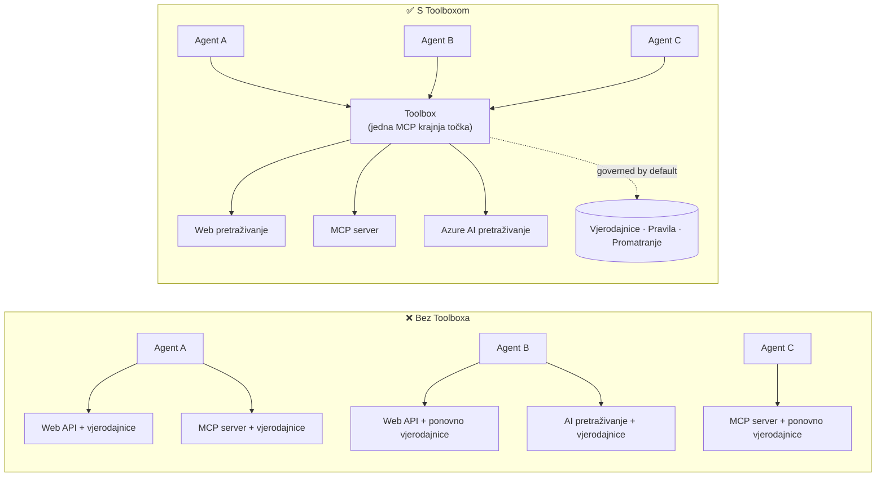

# Lekcija 6: Microsoft Toolbox — Upravljani alati za agente

Prema [Lekciji 5](../lesson-5-hosted-agents-production/README.md) vaš hostirani agent radi u
produkciji s pohranom i upravljačkim pristupom koji vaša organizacija treba. Ali pogledajte unazad
Lekciju 4 agenta: svaki je alat bio **ugrađen** u `main.py` — Microsoft Learn MCP URL,
vektorska pohrana za pretraživanje datoteka i tako dalje. To funkcionira za jednog agenta. To **ne**
skalira za organizaciju s desecima agenata i timova.

Ova lekcija uvodi **Microsoft Toolbox**: način na koji Foundry omogućuje definiranje kuriranog skupa
alata **jednom**, njihovo **centralizirano** upravljanje i izlaganje svakom agentu putem **jedinstvene,
upravljane krajnje točke**.

## Ciljevi učenja

Do kraja ove lekcije moći ćete:

- Objasniti problem širenja alata koje Toolbox rješava.
- Opišite stupove **Izgradnja** i **Konzumacija** te vrste alata koje toolbox može sadržavati.
- **Izgraditi** verziju toolboxa koristeći Foundry SDK.
- **Konzumirati** toolbox iz Microsoft Agent Framework hostiranog agenta preko jedne MCP krajnje točke.
- Koristiti **verzioniranje** za isporuku promjena alata bez promjena u kodu agenta ili ponovnog implementiranja.
- Primijeniti **upravljanje**: RBAC, injekciju vjerodajnica i pravila guardrail (RAI).

---

## Preduvjeti

1. Završene [Lekcija 4](../lesson-4-agentdeployment/README.md) i idealno
   [Lekcija 5](../lesson-5-hosted-agents-production/README.md).
2. **Microsoft Foundry** projekt s dopuštenjem za stvaranje i upravljanje toolbox resursima.
3. Autentificiran **Azure CLI**: `az login`. Foundry toolbox API-ji zahtijevaju
   opseg tokena `https://ai.azure.com/.default` (kako je prikazano u kodu dolje).
4. **Python 3.12+** s instaliranim ovisnostima tečaja (`pip install -r ../requirements.txt`).
5. Trenutno, ne zastarjelo implementiranje modela (na primjer `gpt-5.1`). Izbjegavajte zastarjele GPT-4o / GPT-4.1.

---

## 1. Problem: širenje alata

Jedan agent može ovisiti o mnogim alatima — REST API-jima, MCP poslužiteljima, konektorima i tokovima — svaki
s vlastitim modelom autentifikacije i odgovarajućim timom. Kako se širimo preko organizacije:

- Timovi **ponovno neovisno implementiraju iste alate**.
- **Vjerodajnice se dupliciraju** preko agenata i repozitorija.
- **Upravljanje postaje nekonzistentno** — svaki agent provodi (ili zaboravlja) pravila samostalno.
- Postoji **malo vidljivosti** u koji alati postoje ili tko ih koristi.

Razvijači zapinju — ne zato što modeli nisu sposobni, nego zato što **integracija alata postaje
usko grlo**.



Poduzeća već imaju infrastrukturu — pristupnike, trezore vjerodajnica, pravila, nadzor.
Ono što je nedostajalo je iskustvo za programere koje to pakira u nešto **ponovno upotrebljivo,
otkrivajuće i po zadanim postavkama upravljano**. To je Toolbox.

---

## 2. Što je Toolbox

**Toolbox** je **upravljani Foundry resurs**. Definirate kurirani skup alata jednom, upravljate njima
centralno u Foundryju i izlažete ih putem **jedne MCP-kompatibilne krajnje točke** koju bilo koji

agent može koristiti. Tijekom izvođenja platforma upravlja **ubacivanjem vjerodajnica, osvježavanjem tokena i
provođenjem korporativnih pravila**.

Budući da je toolbox upravljani resurs, možete dodavati, uklanjati ili rekonfigurirati alate **bez
mijenjanja koda u vašem agentu** — agent se uvijek povezuje na isti endpoint.

Toolbox pokriva životni ciklus alata kroz četiri stupca; **Build** i **Consume** su dostupni
danas:

| Stupac | Status | Što omogućava |
|--------|--------|-----------------|
| **Build** | Dostupno danas | Odaberite alate, centralno konfigurirajte autentifikaciju, objavite ponovo upotrebljivi toolbox kojeg svaki tim može koristiti. |
| **Consume** | Dostupno danas | Povežite bilo koji agent s jednim MCP-kompatibilnim endpointom kako biste dinamički otkrili i pozvali sve alate u toolboxu. |

Površina potrošnje je **otvorena**: bilo koji runtime ili klijent kompatibilan s MCP može koristiti toolbox —
Microsoft Agent Framework, LangGraph, GitHub Copilot, Claude Code, Microsoft Copilot Studio ili
prilagođeni kod.

### Tipovi alata koje toolbox može sadržavati

Web Search · MCP · Azure AI Search · Code Interpreter · File Search · OpenAPI · **Agent-to-Agent
(A2A)** · Fabric IQ · Tool Search · Work IQ · Browser Automation · Reference vještina, plus
**Guardrail (RAI) pravilo** primijenjeno na razini toolboxa.

> **Savjet:** Dodajte `description` za **svaki** alat kako bi model mogao odabrati pravi. Toolbox
> dopušta najviše **jedan alat bez imena po tipu** — dajte svakom dodatnom primjerku istog tipa
> jedinstveno `name`, inače ćete dobiti `invalid_payload` grešku.

---

## 3. Izgradite toolbox

Toolboxi se upravljaju pomoću Foundry SDK-a (Python/.NET/JavaScript), REST API-ja, `azd` i
**Microsoft Foundry Toolkit za VS Code**. Evo Python (`azure-ai-projects`) obrasca:

```python
from azure.identity import DefaultAzureCredential
from azure.ai.projects import AIProjectClient
from azure.ai.projects.models import MCPTool, ToolboxSearchPreviewTool, WebSearchTool

endpoint = "https://<your-foundry-account>.services.ai.azure.com/api/projects/<your-project>"
project = AIProjectClient(endpoint=endpoint, credential=DefaultAzureCredential())

toolbox_version = project.toolboxes.create_toolbox_version(
    name="agent-tools",
    description="Web search + an MCP server + tool search",
    tools=[
        WebSearchTool(),
        MCPTool(
            server_label="myserver",
            server_url="https://your-mcp-server.example.com",
            require_approval="never",
            project_connection_id="my-key-auth-connection",  # vjerodajnice se nalaze u Foundryju
        ),
        ToolboxSearchPreviewTool(),
    ],
)
print(f"Created toolbox: {toolbox_version.name}, version: {toolbox_version.version}")
```

Obratite pažnju na ono što **ne radite**: nema tajni u agentu. Vjerodajnice drži Foundry
**povezivanje** (`project_connection_id`) i platforma ih ubacuje tijekom poziva.

> **Napomena o pregledu.** Upravljanje toolboxom (kreiranje/azuriranje verzija) je značajka u pregledu.
> Operacije `project.toolboxes.*` prikazane gore dostupne su u preview SDK izdanjima, REST API-ju, `azd`,
> i **Foundry Toolkitu za VS Code** — **nisu** u fiksiranoj verziji `azure-ai-projects` koja se
> koristi drugdje u ovom tečaju. Smatrajte ovaj isječak kao oblik faze Build; za
> vođeni proces, kreirajte toolbox u **Foundry portalu** ili **Foundry Toolkitu**. Faza
> **Consume** dolje radi s fiksiranim SDK-om tečaja danas.

---

## 4. Koristite toolbox iz svog agenta

Toolbox izlaže **MCP endpoint**. Postoje dva obrasca:

| Uloga | Endpoint | Kada koristiti |
|------|----------|-------------|
| **Korisnik toolboxa** | `{project_endpoint}/toolboxes/{name}/mcp?api-version=v1` | Povežite agente. Uvijek servisira **zadanu verziju**. |
| **Razvijač toolboxa** | `{project_endpoint}/toolboxes/{name}/versions/{version}/mcp?api-version=v1` | Testirajte određenu verziju prije promocije. |


> **Povežite agente s *consumer* endpointom.** Budući da uvijek poslužuje zadanu verziju, vi

> može promovirati nove verzije **bez mijenjanja koda agenta ili ponovnog implementiranja**.

### Integracija s agentom temeljenim na Microsoft Agent Framework

Podsjetimo se da je agent iz Lekcije 4 dodao jedan tvrdo kodirani MCP alat s `client.get_mcp_tool(...)`. S
Toolboxom umjesto toga usmjeravate **jedan** `MCPStreamableHTTPTool` na krajnju točku toolboxa — i agent
dobiva **svaki** alat u toolboxu, centralno upravljan:

```python
import httpx
from azure.identity import DefaultAzureCredential, get_bearer_token_provider
from agent_framework import MCPStreamableHTTPTool

# Autentifikacija: Foundry toolbox zahtijeva https://ai.azure.com/.default opseg
credential = DefaultAzureCredential()
token_provider = get_bearer_token_provider(credential, "https://ai.azure.com/.default")
http_client = httpx.AsyncClient(auth=_ToolboxAuth(token_provider), timeout=120.0)

TOOLBOX_ENDPOINT = os.environ["TOOLBOX_ENDPOINT"]  # platforma umetnuta u vrijeme izvođenja

mcp_tool = MCPStreamableHTTPTool(
    name="toolbox",
    url=TOOLBOX_ENDPOINT,
    http_client=http_client,
    load_prompts=False,
)

agent = chat_client.as_agent(
    name="my-toolbox-agent",
    instructions="You are a helpful assistant with access to Foundry toolbox tools.",
    tools=[mcp_tool],
)
```

Odgovarajući `.env` (napomena: koristite **trenutni** model poput `gpt-5.1`, **ne** povučeni
`gpt-4o`):

```env
FOUNDRY_PROJECT_ENDPOINT=https://<account>.services.ai.azure.com/api/projects/<project>
TOOLBOX_ENDPOINT=https://<account>.services.ai.azure.com/api/projects/<project>/toolboxes/agent-tools/mcp?api-version=v1
AZURE_AI_MODEL_DEPLOYMENT_NAME=gpt-5.1
```

> **Prvo provjerite.** Prije nego što povežete cijelog agenta, spojite MCP klijentski SDK (`pip install mcp`) na
> **verzijsko specifičnu** krajnju točku i popišite alate da potvrdite da se učitavaju kako treba.

### Pokrenite primjer za korištenje

Ova lekcija dolazi s pokretnim primjerom za potrošačku stranu, [`toolbox_agent.py`](../../../lesson-6-toolbox/toolbox_agent.py). Koristi
isti `FoundryChatClient.get_mcp_tool(...)` obrazac kao što ste naučili u Lekciji 2, ali usmjerava jedan
MCP alat na vašu **toolbox** krajnju točku — tako agent dobiva svaki centralno upravljani alat u toolboxu:

```bash
# U vašem .env postavite TOOLBOX_ENDPOINT na vaš krajnji korisnički endpoint alata, zatim:
python lesson-6-toolbox/toolbox_agent.py
```

Otvorite ispisani URL `http://localhost:8096` i postavite pitanje koje koristi jedan od alata u vašem
toolboxu. Dodajte ili nadogradite alat u toolboxu i pitajte ponovno — **bez mijenjanja ovog
koda** — da biste vidjeli centralno upravljanje i verzioniranje u akciji.

---

## 5. Verzioniranje: sigurno uvodite promjene alata

Verzioniranje toolboxa daje vam izričitu kontrolu nad trenutkom kada promjene stupaju na snagu:

1. **Napravite** novu verziju toolboxa s ažuriranim skupom alata.
2. **Testirajte** je na verzijsko specifičnoj (razvojnoj) krajnjoj točki.
3. **Promovirajte** je u `default_version` kad ste spremni.

Svaki agent usmjeren na **potrošačku** krajnju točku automatski preuzima promoviranu verziju — **bez
promjena koda, bez ponovne implementacije**. (Prva verzija koju napravite automatski se promovira u zadanu.)

Ovo je ekvivalent upravljanju alatima u blue/green implementaciji: validirate promjenu izolirano,
zatim istovremeno promijenite zadanu verziju za svakog potrošača.

---

## 6. Upravljanje: kako Toolbox poboljšava kontrolu

Toolbox je **upravljački po zadanim postavkama**. Poluge upravljanja koje biste trebali znati su:

- **RBAC.** Dodijelite ulogu **Foundry User** na projektu svakom identitetu: **razvojniku** koji
  upravlja verzijama toolboxa, **upravljanom identitetu agenta** (za hostane agente koji pozivaju alate u
  runtimeu), te, za OAuth tokove, **krajnjem korisniku** čiji se identitet proxyira.
- **Centralizirane vjerodajnice.** Vjerodajnice alata nalaze se u Foundry **konekcijama**, ne u agentovom kodu
  ni u `.env` datotekama. Platforma ih ubrizgava i osvježava tokene u runtimeu.
- **Zaštitne ograde (RAI politika).** Povežite imenovanu odgovornu AI politiku na verziju toolboxa putem
  `policies.rai_config.rai_policy_name`. Izvodi se na **razini toolboxa**, neovisno o bilo kakvom
  filtriranju sadržaja na razini modela, pregledavajući ulaze i izlaze alata.
- **Odobrenje MCP-a.** Za svaki alat `require_approval` kontrolira treba li poziv MCP alata imati odobrenje —
  isti koncept tijeka odobrenja kakav ste vidjeli u [Lekcija 5 §7](../lesson-5-hosted-agents-production/README.md#7-hosted-mcp-tools--approval-workflows).
- **Privatna mreža.** Toolbox podržava konfiguracije virtualne mreže za poduzeća koja
  drže promet unutar svoje mreže.
- **Vidljivost.** Budući da su alati centralno katalogizirani, konačno imate inventar što
  postoji i tko ih koristi.

---

## Praktične vježbe

1. **Preuređivanje Lekcije 4.** Agent iz Lekcije 4 tvrdo kodira Microsoft Learn MCP alat. Nacrtajte kako biste
   premjestili taj alat u `agent-tools` toolbox i preusmjerili `main.py` na potrošačku krajnju točku toolboxa.
   Koje se promjene događaju u `main.py`? Što više ne živi tamo?
2. **Dizajnirajte povećanje verzije.** Trebate dodati Web Search alat u aktivni toolbox koji koriste pet
   agenata. Opišite redoslijed create → test → promote i objasnite zašto nijedan od pet agenata
   ne treba ponovno implementiranje.
3. **Odaberite autentifikacijske identitete.** Za hostanog agenta koji kroz toolbox poziva MCP alat temeljen na OAuth-u,
   navedite koji identiteti trebaju ulogu **Foundry User** i zašto.
4. **Postavljanje zaštitne ograde.** Objasnite razliku između filtriranja sadržaja na razini modela i
   zaštitne ograde toolboxa, i navedite jedan scenarij gdje vam je specifično potrebna zaštitna ograda toolboxa.

---

## Resursi

- [Stvorite, testirajte i implementirajte toolbox u Foundryju](https://learn.microsoft.com/azure/foundry/agents/how-to/tools/toolbox)
- [Katalog alata — Foundry Agent Service](https://learn.microsoft.com/azure/foundry/agents/concepts/tool-catalog)
- [Microsoft Agent Framework — Microsoft Foundry provider (tools)](https://learn.microsoft.com/agent-framework/agents/providers/microsoft-foundry)
- [Pregled zaštitnih ograda](https://learn.microsoft.com/azure/foundry/guardrails/guardrails-overview)
- [Započnite s Foundryjem u VS Code (Foundry Toolkit)](https://learn.microsoft.com/azure/ai-foundry/how-to/develop/get-started-projects-vs-code)
- [Model Context Protocol](https://modelcontextprotocol.io/)

---

**Prethodno:** [Lekcija 5 — Produkcijski hostani agenti](../lesson-5-hosted-agents-production/README.md)
&nbsp;·&nbsp; **Sljedeće:** [Lekcija 7 — Više agenata & A2A](../lesson-7-multi-agent-a2a/README.md)

---

<!-- CO-OP TRANSLATOR DISCLAIMER START -->
**Napomena**:
Ovaj dokument je preveden korištenjem AI prevoditeljskog servisa [Co-op Translator](https://github.com/Azure/co-op-translator). Iako težimo točnosti, imajte na umu da automatski prijevodi mogu sadržavati greške ili netočnosti. Izvorni dokument na izvornom jeziku treba smatrati autoritativnim izvorom. Za važne informacije preporuča se profesionalni ljudski prijevod. Nismo odgovorni za bilo kakva nesporazumevanja ili pogrešne interpretacije koje proizlaze iz korištenja ovog prijevoda.
<!-- CO-OP TRANSLATOR DISCLAIMER END -->