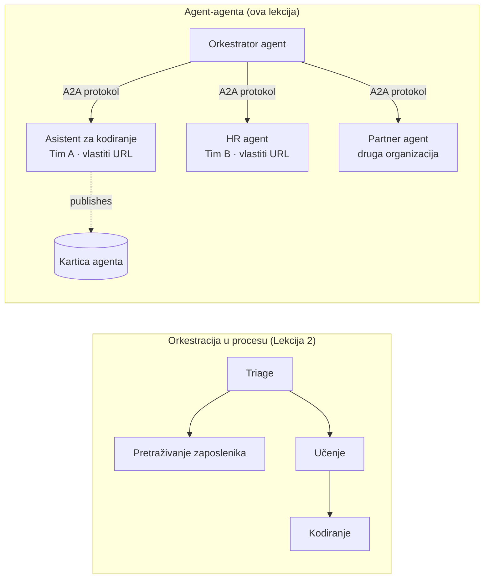

# Lekcija 7: Multi-agentna orkestracija i Agent-za-Agenta (A2A)

Preko [Lekcije 6](../lesson-6-toolbox/README.md) možete izgraditi kontrolirane alate i hostane agente.
No pravi sustavi rijetko koriste **jednog** agenta. Kako skalirate, sastavljate **više** agenata — neke koje
posjedujete sami, neke koje posjeduju drugi timovi, a neke koji rade u potpuno drugim organizacijama. Ova lekcija
govori o tome kako agenti rade **zajedno**.

Već ste upoznali jedan oblik multi-agentnog dizajna u
[Lekciji 2 u `agent-orchestration.py`](../lesson-2-agent-development/README.md): uzorak **predaje** (handoff),
gdje agent za trijažu usmjerava prema specijalistima **unutar jednog procesa**. Ova lekcija podiže razinu —
na **Agent-za-Agenta (A2A)**, otvoreni protokol za agente koji rade kao nezavisne
**umrežene usluge** i pozivaju se međusobno preko granica procesa, timova i organizacija.

## Ciljevi učenja

Do kraja ove lekcije moći ćete:

- Objasniti razliku između **orkestracije unutar procesa** (predaja/radni tokovi) i
  **Agenta-po-Agenta (A2A)** komunikacije, te izabrati ispravno rješenje.
- Opisati osnovne blokove A2A: **Agent Card**, **vještine**, **zadaci** i **otkrivanje**.
- **Izložiti** Microsoft Agent Framework agenta kao A2A uslugu pomoću `A2AExecutor`.
- **Koristiti** udaljenog agenta kao umreženog suparnika pomoću `A2AAgent`.
- Primijeniti poslovne brige na A2A: **sigurnost, identitet, upravljanje, promatranje i troškove**.

---

## Preduvjeti

1. Završena [Lekcija 2](../lesson-2-agent-development/README.md) (razvoj agenta i orkestracija).
2. Projekt **Microsoft Foundry** s trenutačnim rasporedom modela (na primjer `gpt-5.1`,
   i `gpt-5-codex` za primjer kodiranja). Izbjegavajte povučene modele GPT-4o / GPT-4.1.
3. Autentificiran **Azure CLI**: `az login`.
4. **Python 3.12+** s instaliranim ovisnostima tečaja (`pip install -r ../requirements.txt`).
   Lekcija 7 dodaje preview pakete `agent-framework-a2a`, `a2a-sdk` i `uvicorn`.
5. `FOUNDRY_PROJECT_ENDPOINT` i `FOUNDRY_MODEL` postavljeni u vašem `.env` (vidi README tečaja).

---

## 1. Dva načina na koja agenti rade zajedno

Ne postoji jedinstveni "multi-agentni" uzorak. Odaberite onaj koji odgovara vašoj **granici**:

| Uzorak | Gdje agenti rade | Kako se povezuju | Koristite kada |
|---------|------------------|------------------|----------|
| **Predaja / Radni tok** (Lekcija 2) | Jedan proces, jedna baza koda | Graf u memoriji (`HandoffBuilder`, `WorkflowBuilder`) | Posjedujete sve agente i raspoređujete ih zajedno. |
| **Agent-po-Agenta (A2A)** (ova lekcija) | Odvojene usluge, odvojeni životni ciklusi | Otvoreni **A2A protokol** preko HTTP, otkriven pomoću **Agent Card** | Agenti su u vlasništvu različitih timova/organizacija, skaliraju se neovisno, ili su napisani u različitim okvirima. |

Predaja je o **usmjeravanju unutar aplikacije**. A2A je o **sastavljanju agenata kao
nezavisne usluge** — ekvivalent prelaska s poziva funkcija na mikroservise.



> **Oni se mogu sastavljati.** Orkestrator koji izgradite s `HandoffBuilder` može imati **udaljene A2A agente**
> kao sudionike — usmjeravanje unutar procesa prema uslugama koje same mogu raditi bilo gdje.

---

## 2. Osnovni elementi A2A

A2A je **otvoreni protokol** (nije specifičan za Microsoft), pa A2A agent može koristiti Microsoft
Agent Framework, LangGraph, prilagođeni kod ili stog druge tvrtke. Četiri koncepta su važna:

- **Agent Card** — mali JSON dokument, objavljen na
  `/.well-known/agent-card.json`, koji oglašava agentov **naziv, opis, URL, verziju,
  vještine i sposobnosti**. Ovo je način na koji klijent **otkriva** što udaljeni agent može učiniti.
- **Vještine** — deklarirane stvari koje agent može raditi (`id`, `name`, `description`, `tags`,
  `examples`). Klijenti (i modeli) ih koriste da odluče treba li ga pozvati.
- **Zadaci** — poziv A2A agenta je **zadak** s životnim ciklusom (poslan → u tijeku →
  dovršen/neuspješan). Poslužitelj prati zadatke u **spremištu zadataka**; podržano je i slanje strujnih ažuriranja.
- **Otkrivanje** — klijent koji ima samo URL dohvaća Agent Card i zna kako pozvati agenta.

---

## 3. Izložite agenta kao A2A uslugu — `a2a_server.py`

Strana **Build/serve** omotava bilo kojeg Microsoft Agent Framework agenta s `A2AExecutor` i montira ga
na A2A HTTP aplikaciju. Pogledajte [`a2a_server.py`](../../../lesson-7-multi-agent-a2a/a2a_server.py). Ključni spoj:

```python
from agent_framework.a2a import A2AExecutor
from a2a.server.apps import A2AStarletteApplication
from a2a.server.request_handlers import DefaultRequestHandler
from a2a.server.tasks import InMemoryTaskStore
from a2a.types import AgentCapabilities, AgentCard, AgentSkill

agent = client.as_agent(name="coding-assistant", instructions="...")

agent_card = AgentCard(
    name="Coding Assistant",
    description="Generates runnable code samples...",
    url="http://localhost:9000/",
    version="1.0.0",
    capabilities=AgentCapabilities(streaming=True),
    default_input_modes=["text"],
    default_output_modes=["text"],
    skills=[AgentSkill(id="generate-code", name="Generate code",
                       description="Write a runnable code snippet.", tags=["code"])],
)

request_handler = DefaultRequestHandler(
    agent_executor=A2AExecutor(agent),
    task_store=InMemoryTaskStore(),
)
app = A2AStarletteApplication(agent_card=agent_card, http_handler=request_handler).build()
# posluživano s uvicorn na portu 9000
```

Primijetite da agentni kod ostaje **nepromijenjen** — `A2AExecutor` prilagođava vaš postojeći agent protokolu.
Agent Card ga čini **otkrivenim** bilo kojem A2A klijentu.

---

## 4. Koristite udaljenog agenta — `a2a_client.py`

Strana **Consume** povezuje se na udaljenog agenta **putem URL-a**, dohvaća njegov Agent Card i poziva ga
kao lokalnog agenta. Pogledajte [`a2a_client.py`](../../../lesson-7-multi-agent-a2a/a2a_client.py):

```python
from agent_framework.a2a import A2AAgent

remote_agent = A2AAgent(name="remote-coding-assistant", url="http://localhost:9000")
result = await remote_agent.run("Write a Python function that reverses a string.")
print(result.text)
```

To je suština A2A: sa strane pozivatelja udaljeni agent se ponaša kao bilo koji drugi `agent_framework` agent,
pa ga možete ubaciti u radni tok ili predati mu zadatak — iako radi u drugom procesu, na drugom računalu, u vlasništvu drugog tima.


### Pokrenite ga od početka do kraja

```bash
# Terminal 1 — pokreni A2A uslugu
python a2a_server.py

# Terminal 2 — pozovi je
python a2a_client.py "Write a Python function that reverses a string."
```

Vidjet ćete odgovor asistenta za programiranje kako dolazi preko A2A protokola. Otvorite
`http://localhost:9000/.well-known/agent-card.json` u pregledniku da vidite objavljeni Agent Card.

---

## 5. Poslovne brige

Pretvaranje agenata u umrežene usluge uvodi iste brige kao i svaki distribuirani sustav —
plus nekoliko specifičnih za umjetnu inteligenciju:

- **Identitet i autentikacija.** Nikad ne izlažite A2A agenta bez autentikacije. Agent Card nosi
  `security` / `security_schemes`, a `A2AAgent` prihvaća `auth_interceptor` kako bi pozivatelji priključili
  vjerodajnice (OAuth bearer tokene, API ključeve). Koristite Entra ID / upravljane identitete za
  autentikaciju između usluga u produkciji; stavite uslugu iza gateway-a.
- **Upravljanje.** Kombinirajte A2A s [Lekcija 6 Toolbox](../lesson-6-toolbox/README.md): udaljeni
  agent može biti objavljen kao **A2A alat** unutar kontroliranog toolboxa da bi RBAC, ubrizgavanje vjerodajnica
  i sigurnosne politike važile centralizirano.
- **Promatranje.** Zahtjev sada prelazi granice procesa, stoga propagirajte tragove preko poziva.
  Omogućite [Foundry Observability / OpenTelemetry](../lesson-3-agent-evals/README.md) na **obu** orkestratoru i svakom udaljenom agentu
  da dobijete jedan end-to-end trag.
- **Verzija.** Agent Card sadrži `version`. Tretirajte ga kao API: pridodani dodaci su sigurni;
  prekidanje ugovora o vještini zahtijeva novu verziju i prijelazno razdoblje za korisnike.
- **Pouzdanost.** Udaljeni agenti mogu neovisno padati. Postavite timeout-e (`A2AAgent(timeout=...)`), rukujte
  djelomičnim neuspjehom, i nemojte dozvoliti da jedan spori suparnik blokira cijelu orkestraciju.
- **Trošak.** Svaki poziv udaljenog agenta je zaseban poziv modela. Multiplikacija poziva povećava potrošnju tokena —
  planirajte to u budžetu i preferirajte usmjeravanje na **jednog** najboljeg agenta umjesto emitiranja prema mnogima.

---

## Praktične vježbe

1. **Dodajte drugu uslugu.** Kopirajte `a2a_server.py` kako biste izložili **employee-search** agenta na portu
   9001 sa vlastitim Agent Card-om i vještinama. Pokrenite oba i neka klijent poziva oba.
2. **Orkestrirajte udaljene suparnike.** Izgradite mali `HandoffBuilder` (ili obični ruter) čiji
   sudionici uključuju dva `A2AAgent` usmjerena na vaše dvije usluge. Usmjerite upit na pravog.
3. **Osigurajte ih.** Dodajte `auth_interceptor` klijentu i zahtijevajte bearer token na serveru.
   Što se ruši ako token nedostaje? Gdje biste spremili token u produkciji?
4. **Predaja nasuprot A2A.** Napišite dva kratka odlomka: kada biste zadržali predaju iz Lekcije 2 unutar procesa,
   a kada je dodatna složenost A2A opravdana? Dajte konkretan primjer za svaki slučaj.

---

## Resursi

- [Agent-za-Agenta (A2A) — Microsoft Agent Framework](https://learn.microsoft.com/agent-framework/user-guide/agent-orchestration/a2a)
- [Multi-agentna orkestracija — Microsoft Agent Framework](https://learn.microsoft.com/agent-framework/user-guide/agent-orchestration/)
- [Specifikacija A2A protokola](https://a2a-protocol.org/)
- [A2A Python SDK (`a2a-sdk`)](https://github.com/a2aproject/a2a-python)
- [Foundry Agent Service — multi-agentni uzorci](https://learn.microsoft.com/azure/ai-foundry/agents/concepts/connected-agents)

---

**Prethodno:** [Lekcija 6 — Microsoft Toolbox](../lesson-6-toolbox/README.md)

---

<!-- CO-OP TRANSLATOR DISCLAIMER START -->
**Napomena**:
Ovaj dokument je preveden korištenjem AI prevoditeljskog servisa [Co-op Translator](https://github.com/Azure/co-op-translator). Iako težimo točnosti, imajte na umu da automatski prijevodi mogu sadržavati greške ili netočnosti. Izvorni dokument na izvornom jeziku treba smatrati autoritativnim izvorom. Za važne informacije preporuča se profesionalni ljudski prijevod. Nismo odgovorni za bilo kakva nesporazumevanja ili pogrešne interpretacije koje proizlaze iz korištenja ovog prijevoda.
<!-- CO-OP TRANSLATOR DISCLAIMER END -->