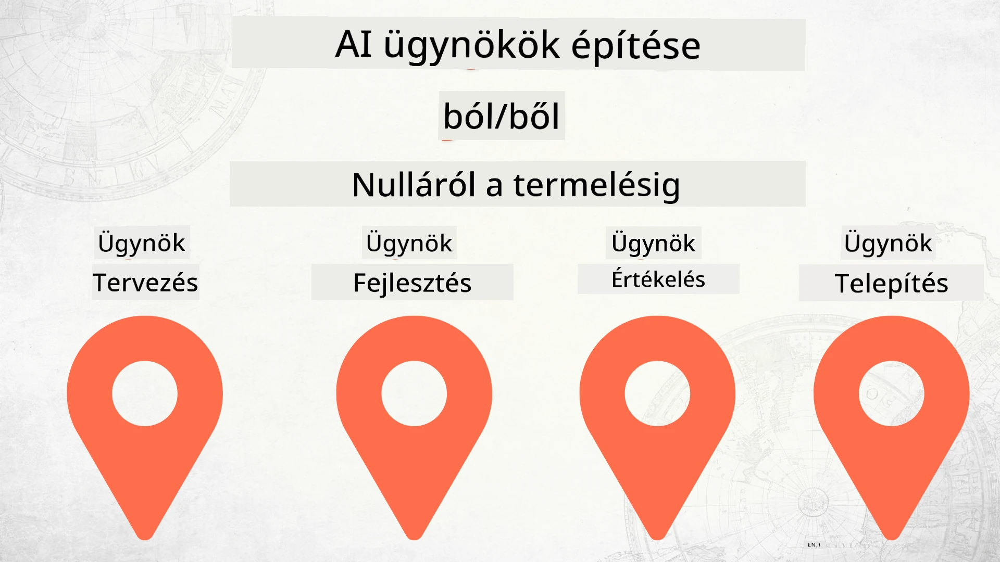

# MI ügynökök építése a nulláról a gyártásig



### 🌐 Többnyelvű támogatás

#### GitHub Action révén támogatott (Automatizált és Mindig Naprakész)

<!-- CO-OP TRANSLATOR LANGUAGES TABLE START -->
[Arab](../ar/README.md) | [Bengáli](../bn/README.md) | [Bolgár](../bg/README.md) | [Burmai (Mianmar)](../my/README.md) | [Kínai (egyszerűsített)](../zh-CN/README.md) | [Kínai (hagyományos, Hongkong)](../zh-HK/README.md) | [Kínai (hagyományos, Makaó)](../zh-MO/README.md) | [Kínai (hagyományos, Tajvan)](../zh-TW/README.md) | [Horvát](../hr/README.md) | [Cseh](../cs/README.md) | [Dán](../da/README.md) | [Holland](../nl/README.md) | [Észt](../et/README.md) | [Finn](../fi/README.md) | [Francia](../fr/README.md) | [Német](../de/README.md) | [Görög](../el/README.md) | [Héber](../he/README.md) | [Hindi](../hi/README.md) | [Magyar](./README.md) | [Indonéz](../id/README.md) | [Olasz](../it/README.md) | [Japán](../ja/README.md) | [Kannada](../kn/README.md) | [Khmer](../km/README.md) | [Koreai](../ko/README.md) | [Litván](../lt/README.md) | [Maláj](../ms/README.md) | [Malajálam](../ml/README.md) | [Maráthi](../mr/README.md) | [Nepáli](../ne/README.md) | [Nigériai pidgin](../pcm/README.md) | [Norvég](../no/README.md) | [Perzsa (fárszi)](../fa/README.md) | [Lengyel](../pl/README.md) | [Portugál (Brazília)](../pt-BR/README.md) | [Portugál (Portugália)](../pt-PT/README.md) | [Pandzsábi (Gurmukhí)](../pa/README.md) | [Román](../ro/README.md) | [Orosz](../ru/README.md) | [Szerb (Cirill)](../sr/README.md) | [Szlovák](../sk/README.md) | [Szlovén](../sl/README.md) | [Spanyol](../es/README.md) | [Svahili](../sw/README.md) | [Svéd](../sv/README.md) | [Tagalog (Filippínó)](../tl/README.md) | [Tamil](../ta/README.md) | [Telugu](../te/README.md) | [Thai](../th/README.md) | [Török](../tr/README.md) | [Ukrán](../uk/README.md) | [Urdu](../ur/README.md) | [Vietnami](../vi/README.md)

> **Inkább helyileg klónoznád?**
>
> Ez a tárhely 50+ nyelvfordítást tartalmaz, ami jelentősen megnöveli a letöltés méretét. Ha fordítások nélkül szeretnél klónozni, használd a sparse checkout-ot:
>
> **Bash / macOS / Linux:**
> ```bash
> git clone --filter=blob:none --sparse https://github.com/microsoft/Building-AI-Agents-From-Zero-To-Production.git
> cd Building-AI-Agents-From-Zero-To-Production
> git sparse-checkout set --no-cone '/*' '!translations' '!translated_images'
> ```
>
> **CMD (Windows):**
> ```cmd
> git clone --filter=blob:none --sparse https://github.com/microsoft/Building-AI-Agents-From-Zero-To-Production.git
> cd Building-AI-Agents-From-Zero-To-Production
> git sparse-checkout set --no-cone "/*" "!translations" "!translated_images"
> ```
>
> Ez mindent megad, ami a kurzus elvégzéséhez szükséges, sokkal gyorsabb letöltéssel.
<!-- CO-OP TRANSLATOR LANGUAGES TABLE END -->

## Egy kurzus, amely megtanít az MI ügynök fejlesztési életciklusának alapjaira

[](https://github.com/microsoft/Building-AI-Agents-From-Zero-To-Production/blob/master/LICENSE?WT.mc_id=academic-105485-koreyst)
[](https://GitHub.com/microsoft/Building-AI-Agents-From-Zero-To-Production/graphs/contributors/?WT.mc_id=academic-105485-koreyst)
[](https://GitHub.com/microsoft/Building-AI-Agents-From-Zero-To-Production/issues/?WT.mc_id=academic-105485-koreyst)
[](https://GitHub.com/microsoft/Building-AI-Agents-From-Zero-To-Production/pulls/?WT.mc_id=academic-105485-koreyst)
[](http://makeapullrequest.com?WT.mc_id=academic-105485-koreyst)

[](https://discord.gg/Kuaw3ktsu6)

## 🌱 Első lépések

Ez a kurzus az MI ügynökök építésének és telepítésének alapjait tárgyalja.

Minden lecke az előzőre épül, ezért javasoljuk, hogy az elejétől kezdve haladj végig a kurzuson.

Ha többet szeretnél felfedezni az MI ügynökökről szóló témákból, nézd meg az [AI Agents For Beginners Course](https://aka.ms/ai-agents-beginners) kurzust.

### Ismerkedj más tanulókkal, kapj választ kérdéseidre

Ha elakadsz vagy bármilyen kérdésed van az MI ügynökök építésével kapcsolatban, csatlakozz dedikált Discord csatornánkhoz a [Microsoft Foundry Discord](https://discord.gg/Kuaw3ktsu6) szerveren.

### Amire szükséged van

Minden leckéhez tartozik egy saját kódminta, amelyet helyben futtathatsz. [Forkold ezt a repót](https://github.com/microsoft/Building-AI-Agents-From-Zero-To-Production/fork), hogy létrehozd a saját másolatodat.

Ez a kurzus jelenleg az alábbiakat használja:

- [Microsoft Agent Framework (MAF)](https://aka.ms/ai-agents-beginners/agent-framework)
- [Microsoft Foundry](https://azure.microsoft.com/products/ai-foundry)
- [Azure OpenAI Service](https://azure.microsoft.com/products/ai-foundry/models/openai)
- [Azure CLI](https://learn.microsoft.com/cli/azure/authenticate-azure-cli?view=azure-cli-latest)

Kérjük, biztosítsd, hogy hozzáférsz ezekhez a szolgáltatásokhoz, mielőtt elkezdenéd.

További lehetőségek a modell hosztolásra és szolgáltatásokra hamarosan érkeznek.

## 🗃️ Leckék

| **Lecke**                            | **Leírás**                                                                                     |
|------------------------------------|----------------------------------------------------------------------------------------------|
| [Agent Design](./lesson-1-agent-design/README.md)       | Bevezetés a "Fejlesztői Bevezető" ügynökkészítési esettanulmányba és hogyan tervezzünk hatékony ügynököket |
| [Agent Development](./lesson-2-agent-development/README.md)  | A Microsoft Agent Framework (MAF) használatával 3 ügynök létrehozása új fejlesztők bevezetéséhez. |
| [Agent Evaluations](./lesson-3-agent-evals/README.md)  | A Microsoft Foundry segítségével felmérjük MI ügynökeink teljesítményét és javítási lehetőségeit. |
| [Agent Deployment](./lesson-4-agent-deployment/README.md)   | Hosted Agents és OpenAI Chatkit használatával egy MI ügynök éles telepítése.                   |

## 🎒 Egyéb kurzusok

Csapatunk más kurzusokat is készít! Nézd meg:

<!-- CO-OP TRANSLATOR OTHER COURSES START -->
### LangChain
[](https://aka.ms/langchain4j-for-beginners)
[](https://aka.ms/langchainjs-for-beginners?WT.mc_id=m365-94501-dwahlin)
[](https://github.com/microsoft/langchain-for-beginners?WT.mc_id=m365-94501-dwahlin)
---

### Azure / Edge / MCP / Ügynökök
[](https://github.com/microsoft/AZD-for-beginners?WT.mc_id=academic-105485-koreyst)
[](https://github.com/microsoft/edgeai-for-beginners?WT.mc_id=academic-105485-koreyst)
[](https://github.com/microsoft/mcp-for-beginners?WT.mc_id=academic-105485-koreyst)
[](https://github.com/microsoft/ai-agents-for-beginners?WT.mc_id=academic-105485-koreyst)

---
 
### Generatív MI sorozat
[](https://github.com/microsoft/generative-ai-for-beginners?WT.mc_id=academic-105485-koreyst)
[-9333EA?style=for-the-badge&labelColor=E5E7EB&color=9333EA)](https://github.com/microsoft/Generative-AI-for-beginners-dotnet?WT.mc_id=academic-105485-koreyst)
[-C084FC?style=for-the-badge&labelColor=E5E7EB&color=C084FC)](https://github.com/microsoft/generative-ai-for-beginners-java?WT.mc_id=academic-105485-koreyst)
[-E879F9?style=for-the-badge&labelColor=E5E7EB&color=E879F9)](https://github.com/microsoft/generative-ai-with-javascript?WT.mc_id=academic-105485-koreyst)

---
 
### Alap tanulás
[](https://aka.ms/ml-beginners?WT.mc_id=academic-105485-koreyst)
[](https://aka.ms/datascience-beginners?WT.mc_id=academic-105485-koreyst)
[](https://aka.ms/ai-beginners?WT.mc_id=academic-105485-koreyst)
[](https://github.com/microsoft/Security-101?WT.mc_id=academic-96948-sayoung)
[](https://aka.ms/webdev-beginners?WT.mc_id=academic-105485-koreyst)
[](https://aka.ms/iot-beginners?WT.mc_id=academic-105485-koreyst)
[](https://github.com/microsoft/xr-development-for-beginners?WT.mc_id=academic-105485-koreyst)

---
 
### Copilot sorozat
[](https://aka.ms/GitHubCopilotAI?WT.mc_id=academic-105485-koreyst)
[](https://github.com/microsoft/mastering-github-copilot-for-dotnet-csharp-developers?WT.mc_id=academic-105485-koreyst)
[](https://github.com/microsoft/CopilotAdventures?WT.mc_id=academic-105485-koreyst)
<!-- CO-OP TRANSLATOR OTHER COURSES END -->

## Hozzájárulás

Ez a projekt szívesen fogad hozzájárulásokat és javaslatokat. A legtöbb hozzájáruláshoz el kell fogadnia egy
Hozzájárulói Licenc Megállapodást (CLA), amely nyilatkozza, hogy joga van hozzá, és ténylegesen engedélyezi számunkra a
hozzájárulás használatát. Részletekért látogasson el ide: <https://cla.opensource.microsoft.com>.

Amikor egy pull request-et benyújt, egy CLA bot automatikusan megállapítja, hogy szükséges-e CLA-t benyújtania,
és megfelelően jelöli a PR-t (pl. állapotellenőrzés, komment). Egyszerűen kövesse a bot útmutatásait.
Csak egyszer kell ezt megtennie minden CLA-t használó adattárnál.

Ez a projekt átvette a [Microsoft nyílt forráskódú magatartási kódexét](https://opensource.microsoft.com/codeofconduct/).
További tájékoztatásért tekintse meg a [Magatartási kódex GYIK](https://opensource.microsoft.com/codeofconduct/faq/) oldalt vagy
vegye fel a kapcsolatot az [opencode@microsoft.com](mailto:opencode@microsoft.com) címen bármilyen további kérdéssel vagy megjegyzéssel.

## Védjegyek

Ez a projekt védjegyeket vagy logókat tartalmazhat projektekhez, termékekhez vagy szolgáltatásokhoz.
A Microsoft védjegyek vagy logók jogos használata a
[Microsoft védjegy- és márka útmutatói](https://www.microsoft.com/legal/intellectualproperty/trademarks/usage/general) szerint engedélyezett és követendő.
A Microsoft védjegyek vagy logók használata a projekt módosított változataiban nem okozhat félreértést vagy a Microsoft támogatásának látszatát.
Harmadik féltől származó védjegyek vagy logók használata az adott harmadik fél szabályzata szerint történik.

## Segítség kérése

Ha elakad vagy kérdése van az AI alkalmazások fejlesztésével kapcsolatban, csatlakozzon:

[](https://discord.gg/Kuaw3ktsu6)

Ha termék-visszajelzése vagy hibája van fejlesztés közben, látogasson el ide:

[](https://aka.ms/foundry/forum)

---

<!-- CO-OP TRANSLATOR DISCLAIMER START -->
**Jogi nyilatkozat**:
Ezt a dokumentumot az AI fordítási szolgáltatás, a [Co-op Translator](https://github.com/Azure/co-op-translator) használatával fordítottuk. Bár törekszünk a pontosságra, kérjük, vegye figyelembe, hogy az automatikus fordítások tartalmazhatnak hibákat vagy pontatlanságokat. Az eredeti dokumentum az anyanyelvén tekinthető hiteles forrásnak. Kritikus információk esetén professzionális emberi fordítást javaslunk. Nem vállalunk felelősséget az ebből a fordításból eredő félreértések vagy téves értelmezések miatt.
<!-- CO-OP TRANSLATOR DISCLAIMER END -->