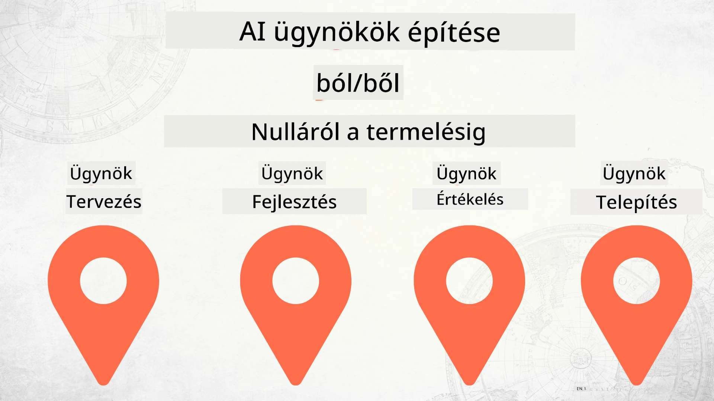

# AI Agentek építése nulláról a gyártásig



### 🌐 Többnyelvű támogatás

#### GitHub Action segítségével támogatott (Automatizált és mindig naprakész)

<!-- CO-OP TRANSLATOR LANGUAGES TABLE START -->
[Arabic](../ar/README.md) | [Bengali](../bn/README.md) | [Bulgarian](../bg/README.md) | [Burmese (Myanmar)](../my/README.md) | [Chinese (Simplified)](../zh-CN/README.md) | [Chinese (Traditional, Hong Kong)](../zh-HK/README.md) | [Chinese (Traditional, Macau)](../zh-MO/README.md) | [Chinese (Traditional, Taiwan)](../zh-TW/README.md) | [Croatian](../hr/README.md) | [Czech](../cs/README.md) | [Danish](../da/README.md) | [Dutch](../nl/README.md) | [Estonian](../et/README.md) | [Finnish](../fi/README.md) | [French](../fr/README.md) | [German](../de/README.md) | [Greek](../el/README.md) | [Hebrew](../he/README.md) | [Hindi](../hi/README.md) | [Hungarian](./README.md) | [Indonesian](../id/README.md) | [Italian](../it/README.md) | [Japanese](../ja/README.md) | [Kannada](../kn/README.md) | [Khmer](../km/README.md) | [Korean](../ko/README.md) | [Lithuanian](../lt/README.md) | [Malay](../ms/README.md) | [Malayalam](../ml/README.md) | [Marathi](../mr/README.md) | [Nepali](../ne/README.md) | [Nigerian Pidgin](../pcm/README.md) | [Norwegian](../no/README.md) | [Persian (Farsi)](../fa/README.md) | [Polish](../pl/README.md) | [Portuguese (Brazil)](../pt-BR/README.md) | [Portuguese (Portugal)](../pt-PT/README.md) | [Punjabi (Gurmukhi)](../pa/README.md) | [Romanian](../ro/README.md) | [Russian](../ru/README.md) | [Serbian (Cyrillic)](../sr/README.md) | [Slovak](../sk/README.md) | [Slovenian](../sl/README.md) | [Spanish](../es/README.md) | [Swahili](../sw/README.md) | [Swedish](../sv/README.md) | [Tagalog (Filipino)](../tl/README.md) | [Tamil](../ta/README.md) | [Telugu](../te/README.md) | [Thai](../th/README.md) | [Turkish](../tr/README.md) | [Ukrainian](../uk/README.md) | [Urdu](../ur/README.md) | [Vietnamese](../vi/README.md)

> **Inkább helyileg klónoznál?**
>
> Ez a tár 50+ nyelvi fordítást tartalmaz, ami jelentősen megnöveli a letöltési méretet. Ha fordítások nélkül szeretnéd klónozni, használj sparse checkout-ot:
>
> **Bash / macOS / Linux:**
> ```bash
> git clone --filter=blob:none --sparse https://github.com/microsoft/Building-AI-Agents-From-Zero-To-Production.git
> cd Building-AI-Agents-From-Zero-To-Production
> git sparse-checkout set --no-cone '/*' '!translations' '!translated_images'
> ```
>
> **CMD (Windows):**
> ```cmd
> git clone --filter=blob:none --sparse https://github.com/microsoft/Building-AI-Agents-From-Zero-To-Production.git
> cd Building-AI-Agents-From-Zero-To-Production
> git sparse-checkout set --no-cone "/*" "!translations" "!translated_images"
> ```
>
> Ez mindent megad, amire szükséged van a kurzus befejezéséhez, sokkal gyorsabb letöltéssel.
<!-- CO-OP TRANSLATOR LANGUAGES TABLE END -->

## Egy kurzus, amely megtanítja az AI Agent fejlesztési életciklusának alapjait

[](https://github.com/microsoft/Building-AI-Agents-From-Zero-To-Production/blob/master/LICENSE?WT.mc_id=academic-105485-koreyst)
[](https://GitHub.com/microsoft/Building-AI-Agents-From-Zero-To-Production/graphs/contributors/?WT.mc_id=academic-105485-koreyst)
[](https://GitHub.com/microsoft/Building-AI-Agents-From-Zero-To-Production/issues/?WT.mc_id=academic-105485-koreyst)
[](https://GitHub.com/microsoft/Building-AI-Agents-From-Zero-To-Production/pulls/?WT.mc_id=academic-105485-koreyst)
[](http://makeapullrequest.com?WT.mc_id=academic-105485-koreyst)

[](https://discord.gg/Kuaw3ktsu6)

## 🌱 Kezdés

Ez a kurzus leckéket tartalmaz az AI Agentek építésének és telepítésének alapjairól.

Minden lecke az előzőre épül, ezért ajánljuk, hogy az elejétől kezdve haladj végig rajtuk.

Ha többet szeretnél megtudni az AI Agentekről, nézd meg az [AI Agents For Beginners Course](https://aka.ms/ai-agents-beginners) kurzust.

### Találkozz más tanulókkal, kapj választ kérdéseidre

Ha elakadsz vagy kérdésed van az AI Agentek építésével kapcsolatban, csatlakozz a dedikált Discord csatornánkhoz a [Microsoft Foundry Discord](https://discord.gg/Kuaw3ktsu6) szerveren.

### Amire szükséged lesz

Minden leckéhez tartozik egy kódminta, amit helyileg futtathatsz. [Forkolhatod ezt a repót](https://github.com/microsoft/Building-AI-Agents-From-Zero-To-Production/fork), hogy saját példányt hozz létre.

Jelenleg a kurzus a következőket használja:

- [Microsoft Agent Framework (MAF)](https://aka.ms/ai-agents-beginners/agent-framework)
- [Microsoft Foundry](https://azure.microsoft.com/products/ai-foundry) — egy projekt telepített **GPT-5 sorozatú** modellel (például `gpt-5.1`). Ne használd a megszűnt GPT-4o / GPT-4.1 modelleket.
- [Azure OpenAI Service](https://azure.microsoft.com/products/ai-foundry/models/openai)
- [Azure CLI](https://learn.microsoft.com/cli/azure/authenticate-azure-cli?view=azure-cli-latest) — jelentkezz be az `az login` segítségével, mielőtt bármilyen példát futtatnál
- **Python 3.12 vagy újabb**

Kérjük, ellenőrizd, hogy hozzáférsz ezekhez a szolgáltatásokhoz a kezdés előtt.

> **💰 Költség és takarítás.** A gyakorlati leckék valódi Azure erőforrásokat hoznak létre — egy Microsoft Foundry
> projektet, egy modell telepítést, egy vektortárat, és (4–6. leckékben) hosztolt agenteket és eszköztárakat.
> Ezek használata költséget vonhat maga után. Amikor befejezel egy leckét – vagy a kurzust – töröld a
> feleslegessé vált erőforrásokat. A legegyszerűbb, ha mindent egy dedikált erőforráscsoportba helyezel,
> majd a végén az egész csoportot törlöd:
>
> ```bash
> az group delete --name <your-resource-group> --yes --no-wait
> ```
>
> Egyéni agenteket, vektortárakat és eszköztárakat is törölhetsz a Foundry portálról.

> **Megjegyzés a modellekről.** Ez a kurzus minden modellt a **Microsoft Foundry** szolgáltatáson keresztül biztosít.
> Nem használja a *GitHub Modelleket*, melyeket **2026. július 30-án** megszüntetnek — a Microsoft Foundry az
> hivatalos migrációs útvonal. Ha régebbi kódod hív GitHub Modelleket, irányítsd át egy Foundry
> modell telepítésre.

Hamarosan további lehetőségek érkeznek a modell hosztolásról és szolgáltatásokról.

## 🗃️ Leckék

| **Lecke**         | **Leírás**                                                                                  |
|--------------------|--------------------------------------------------------------------------------------------------|
| [Agent Design](./lesson-1-agent-design/README.md)       | Bevezetés a "Fejlesztői Bevezetés" Agent Use Case-be és hatékony agentek tervezése  |
| [Agent Development](./lesson-2-agent-development/README.md)  | A Microsoft Agent Framework (MAF) használatával specializált agenteket építhetsz a fejlesztők betanításához.       |
| [Agent Evaluations](./lesson-3-agent-evals/README.md)  | A Microsoft Foundry segítségével vizsgáld meg AI agentjeink teljesítményét, és fejleszd őket. |
| [Agent Deployment](./lesson-4-agentdeployment/README.md)   | Microsoft Foundry hosztolt agentek és OpenAI ChatKit használatával nézd meg, hogyan telepíthetsz egy AI agentet gyártásba.       |
| [Production Hosted Agents](./lesson-5-hosted-agents-production/README.md)   | Visz egy hosztolt agentet vállalati gyártásba: Hosted Agents vs Capability Hosts, saját tároló, memória és irányítás.       |
| [Microsoft Toolbox](./lesson-6-toolbox/README.md)   | Definiáld az eszközöket egyszer, és kormányozd központilag: építs eszköztárat, használd azt agentből egy MCP végponton keresztül, és verziókezelj biztonságosan.       |
| [Multi-Agent & A2A](./lesson-7-multi-agent-a2a/README.md)   | Komponáld az agenteket hálózati szolgáltatásként: tegye elérhetővé az agentet az Agent-to-Agent (A2A) protokollon, és használd távoli agentet társalkalmazásként.       |


## 🎒 Egyéb kurzusok

Csapatunk további kurzusokat is készít! Nézd meg:

<!-- CO-OP TRANSLATOR OTHER COURSES START -->
### LangChain
[](https://aka.ms/langchain4j-for-beginners)
[](https://aka.ms/langchainjs-for-beginners?WT.mc_id=m365-94501-dwahlin)
[](https://github.com/microsoft/langchain-for-beginners?WT.mc_id=m365-94501-dwahlin)
---

### Azure / Edge / MCP / Agentek
[](https://github.com/microsoft/AZD-for-beginners?WT.mc_id=academic-105485-koreyst)
[](https://github.com/microsoft/edgeai-for-beginners?WT.mc_id=academic-105485-koreyst)
[](https://github.com/microsoft/mcp-for-beginners?WT.mc_id=academic-105485-koreyst)
[](https://github.com/microsoft/ai-agents-for-beginners?WT.mc_id=academic-105485-koreyst)

---
 
### Generatív AI sorozat

[](https://github.com/microsoft/generative-ai-for-beginners?WT.mc_id=academic-105485-koreyst)
[-9333EA?style=for-the-badge&labelColor=E5E7EB&color=9333EA)](https://github.com/microsoft/Generative-AI-for-beginners-dotnet?WT.mc_id=academic-105485-koreyst)
[-C084FC?style=for-the-badge&labelColor=E5E7EB&color=C084FC)](https://github.com/microsoft/generative-ai-for-beginners-java?WT.mc_id=academic-105485-koreyst)
[-E879F9?style=for-the-badge&labelColor=E5E7EB&color=E879F9)](https://github.com/microsoft/generative-ai-with-javascript?WT.mc_id=academic-105485-koreyst)

---
 
### Alapvető tanulás
[](https://aka.ms/ml-beginners?WT.mc_id=academic-105485-koreyst)
[](https://aka.ms/datascience-beginners?WT.mc_id=academic-105485-koreyst)
[](https://aka.ms/ai-beginners?WT.mc_id=academic-105485-koreyst)
[](https://github.com/microsoft/Security-101?WT.mc_id=academic-96948-sayoung)
[](https://aka.ms/webdev-beginners?WT.mc_id=academic-105485-koreyst)
[](https://aka.ms/iot-beginners?WT.mc_id=academic-105485-koreyst)
[](https://github.com/microsoft/xr-development-for-beginners?WT.mc_id=academic-105485-koreyst)

---
 
### Copilot sorozat
[](https://aka.ms/GitHubCopilotAI?WT.mc_id=academic-105485-koreyst)
[](https://github.com/microsoft/mastering-github-copilot-for-dotnet-csharp-developers?WT.mc_id=academic-105485-koreyst)
[](https://github.com/microsoft/CopilotAdventures?WT.mc_id=academic-105485-koreyst)
<!-- CO-OP TRANSLATOR OTHER COURSES END -->

## Hozzájárulás

Ez a projekt szívesen fogad hozzájárulásokat és javaslatokat. A legtöbb hozzájáruláshoz szükséges, hogy elfogadd a
Hozzájárulói Licencszerződést (CLA), amely igazolja, hogy jogodban áll, és valójában megadod számunkra
a hozzájárulásod felhasználásának jogait. Részletekért látogass el ide: <https://cla.opensource.microsoft.com>.

Amikor pull requestet nyújtasz be, egy CLA bot automatikusan megállapítja, hogy szükséges-e CLA bemutatása,
és megfelelően jelöli a PR-t (pl. állapot ellenőrzés, megjegyzés). Egyszerűen kövesd a bot által megadott
utasításokat. Ezt csak egyszer kell megtenned minden nálunk használt repóban.

Ez a projekt elfogadta a [Microsoft Nyílt Forráskódú Magatartási Szabályzatát](https://opensource.microsoft.com/codeofconduct/).
További információért lásd a [Magatartási Szabályzat GYIK](https://opensource.microsoft.com/codeofconduct/faq/) oldalt, vagy
írj az [opencode@microsoft.com](mailto:opencode@microsoft.com) címre bármilyen kérdéssel vagy megjegyzéssel.

## Védjegyek

Ez a projekt tartalmazhat védjegyeket vagy logókat projektekhez, termékekhez vagy szolgáltatásokhoz. A Microsoft
védjegyek vagy logók jogosult használata engedélyhez kötött, és követnie kell a
[Microsoft védjegy- és márka irányelveit](https://www.microsoft.com/legal/intellectualproperty/trademarks/usage/general).
A Microsoft védjegyek vagy logók módosított verzióban történő használata nem okozhat félreértést vagy nem sugallhat Microsoft támogatást.
Bármely harmadik fél védjegyének vagy logójának használata a harmadik fél szabályzatai alá esik.

## Segítség kérése

Ha elakadsz vagy bármilyen kérdésed van az MI alkalmazások fejlesztésével kapcsolatban, csatlakozz:

[](https://discord.gg/Kuaw3ktsu6)

Ha termék-visszajelzésed vagy hibák vannak a fejlesztés során, keresd fel:

[](https://aka.ms/foundry/forum)

---

<!-- CO-OP TRANSLATOR DISCLAIMER START -->
**Jogi nyilatkozat**:
Ez a dokumentum az AI fordítási szolgáltatás, a [Co-op Translator](https://github.com/Azure/co-op-translator) segítségével készült. Bár az pontosságra törekszünk, kérjük, vegye figyelembe, hogy az automatikus fordítások hibákat vagy pontatlanságokat tartalmazhatnak. Az eredeti dokumentum az anyanyelvén tekintendő hiteles forrásnak. Fontos információk esetén professzionális emberi fordítást javasolunk. Nem vállalunk felelősséget semmilyen félreértésért vagy téves értelmezésért, amely ebből a fordításból ered.
<!-- CO-OP TRANSLATOR DISCLAIMER END -->