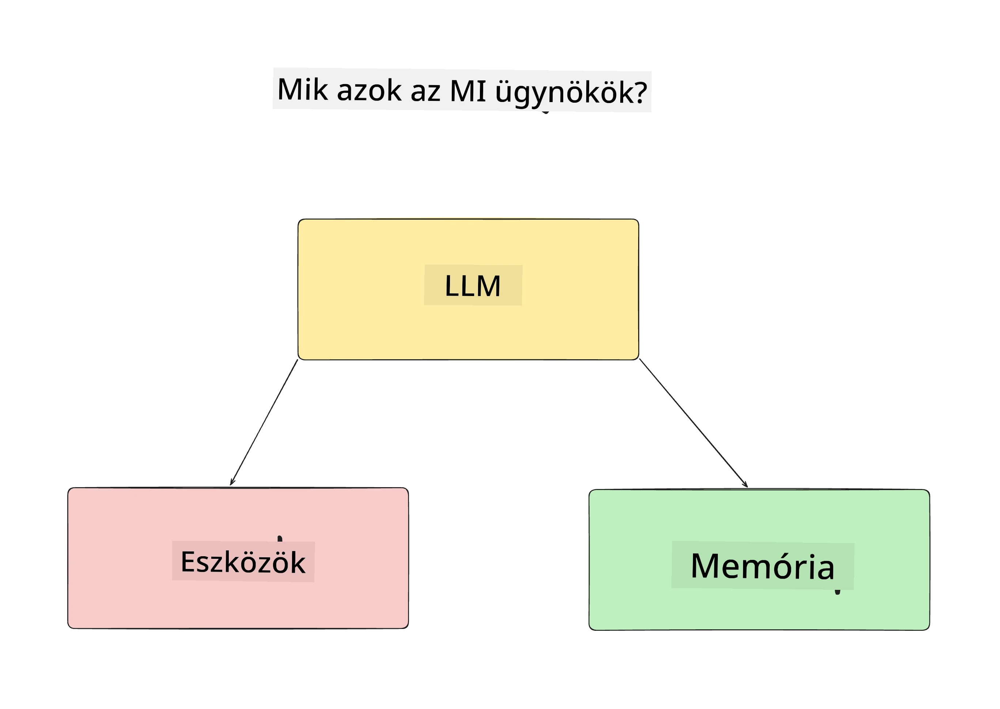
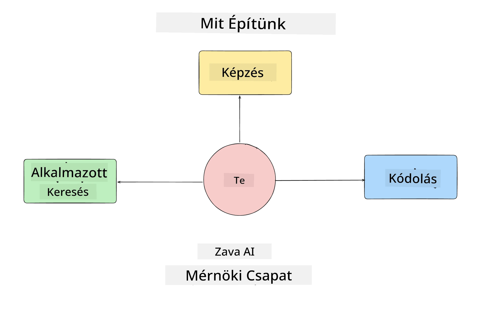
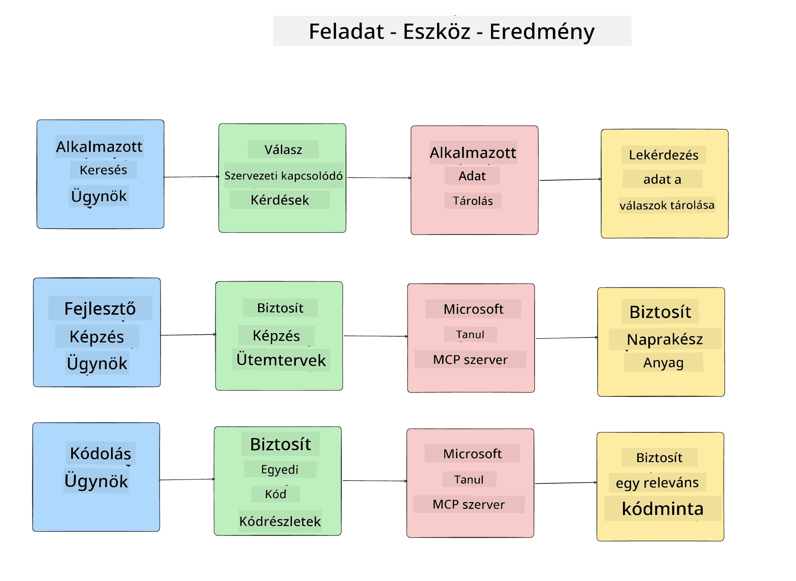
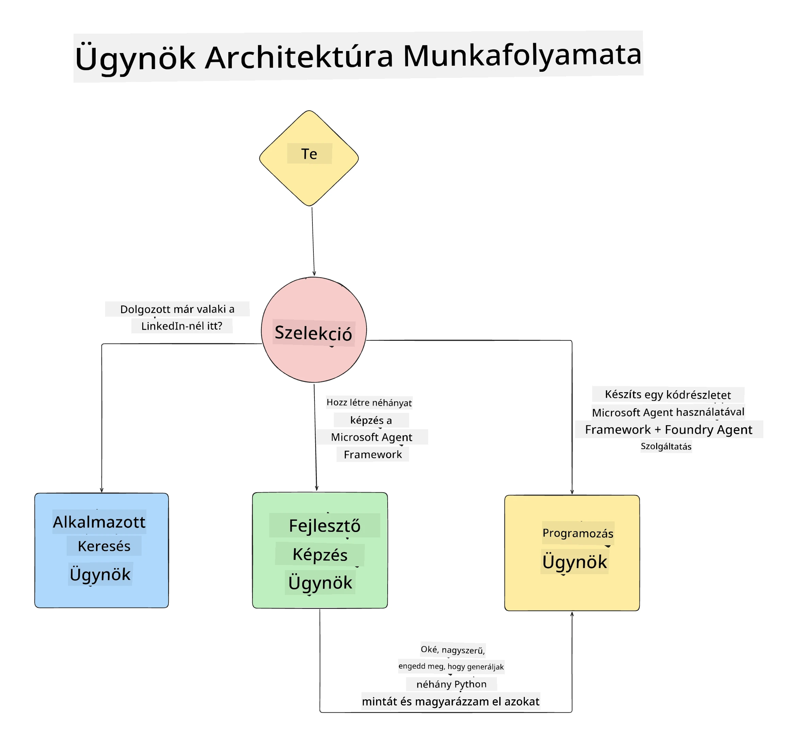

# 1. Lecke: MI ügynök tervezés

Üdvözlünk a "MI ügynök építése nulláról a termelésig" tanfolyam első leckéjében!

Ebben a leckében a következő témákat fogjuk érinteni:

- Az MI ügynökök meghatározása
  
- Az MI ügynök alkalmazás, amit építünk, bemutatása  

- A szükséges eszközök és szolgáltatások azonosítása minden ügynökhöz
  
- Az ügynök alkalmazás megtervezése
  
Kezdjük azzal, hogy definiáljuk, mi is az az ügynök, és miért használjuk őket egy alkalmazáson belül.

> **Mielőtt elkezded a tanfolyamot.** Ez az első lecke fogalmi jellegű — nincs futtatandó kód.
> A [2. leckétől](../lesson-2-agent-development/README.md) kezdve szükséged lesz egy **Azure előfizetésre**, amely hozzáfér Microsoft Foundry-hoz, egy telepített **GPT-5 sorozatú modellhez** (például `gpt-5.1` — kerüld a nyugdíjazott GPT-4o / GPT-4.1-et), **Python 3.12+-ra**, valamint az **Azure CLI-re** (`az login`). A teljes listát és linkeket a tanfolyam README-jében, a [Szükséges eszközök](../README.md#what-you-need) szakaszban találod.

## Mik azok az MI ügynökök?

Ha most találkozol először azzal, hogyan kell MI ügynököt építeni, lehet, hogy kérdéseid vannak arról, mi pontosan az az MI ügynök.

Egyszerű módon megfogalmazva, az MI ügynököt az alkotóelemei alapján határozhatjuk meg:

**Nagy Nyelvi Modell** — Az LLM biztosítja a képességet, hogy a felhasználó természetes nyelvű utasításait feldolgozza, értelmezze az elvégzendő feladatot, valamint értelmezze azokat az eszközleírásokat, amelyeket a feladatok teljesítéséhez használhat.

**Eszközök** — Ezek lehetnek funkciók, API-k, adattárolók és más szolgáltatások, amelyeket az LLM kiválaszthat a felhasználótól kapott feladatok teljesítéséhez.

**Memória** — Így tároljuk az MI ügynök és a felhasználó közötti rövid- és hosszú távú interakciókat. Az információ tárolása és visszakeresése fontos a fejlesztésekhez és a felhasználói preferenciák idővel történő megőrzéséhez.

## A mi MI ügynök alkalmazásunk esete

Ehhez a tanfolyamhoz egy olyan MI ügynök alkalmazást fogunk építeni, amely segíti az új fejlesztők beilleszkedését az MI ügynök fejlesztő csapatunkba!

Mielőtt fejlesztésbe kezdenénk, az első lépés egy sikeres MI ügynök alkalmazás létrehozásához az, hogy világos forgatókönyveket határozzunk meg, hogyan várjuk el, hogy a felhasználók dolgozzanak az MI ügynökeinkkel.

Ehhez az alkalmazáshoz a következő forgatókönyvekkel dolgozunk:

**Forgatókönyv 1**: Egy új munkatárs csatlakozik a szervezetünkhöz, és többet szeretne tudni az őt körülvevő csapatról és arról, hogyan léphet kapcsolatba velük.

**Forgatókönyv 2:** Egy új munkatárs szeretné megtudni, mi lenne a legjobb első feladat, amin elkezdhet dolgozni.

**Forgatókönyv 3:** Egy új munkatárs tanulási forrásokat és kódmintákat szeretne összegyűjteni, hogy segítsenek neki elindulni a feladat teljesítésében.

## Az eszközök és szolgáltatások azonosítása

Miután ezek a forgatókönyvek elkészültek, a következő lépés, hogy hozzárendeljük őket azokhoz az eszközökhöz és szolgáltatásokhoz, amelyeket az MI ügynököknek használniuk kell a feladatok teljesítéséhez.

Ez a folyamat a Kontextus Mérnökség (Context Engineering) kategóriájába tartozik, mert arra fókuszálunk, hogy az MI ügynökeink a megfelelő kontextussal rendelkezzenek a megfelelő időben a feladatok végrehajtásához.

Menjünk forgatókönyvenként végig, és végezzünk jó ügynöki tervezést az egyes ügynökök feladatai, eszközei és elvárt eredményei felsorolásával.

### Forgatókönyv 1 - Munkatárs Kereső Ügynök

**Feladat** — Válaszoljon kérdésekre a szervezet munkatársaival kapcsolatban, például csatlakozási dátum, aktuális csapat, helyszín és utolsó pozíció.

**Eszközök** — Aktuális munkatársak listájának és szervezeti ábrának adattára

**Eredmények** — Képes legyen információkat lekérni az adattárból, hogy általános szervezeti és specifikus munkatársi kérdésekre válaszoljon.

### Forgatókönyv 2 - Feladat Ajánló Ügynök

**Feladat** — Az új munkatárs fejlesztői tapasztalata alapján találjon ki 1-3 olyan feladatot, amin dolgozhat.

**Eszközök** — GitHub MCP szerver az nyitott problémák lekéréséhez és fejlesztői profil építéséhez

**Eredmények** — Képes legyen elolvasni egy GitHub profil utolsó 5 commitját és a nyitott problémákat egy GitHub projektben, majd javaslatokat tenni egyezés alapján

### Forgatókönyv 3 - Kód Asszisztens Ügynök

**Feladat** — Az "Feladat Ajánló" Ügynök által javasolt nyitott problémák alapján kutasson forrásokat és generáljon kódmintákat a munkatárs segítésére.

**Eszközök** — Microsoft Learn MCP forráskereséshez és Kódértelmező egyedi kódminták generálásához.

**Eredmények** — Ha a felhasználó további segítséget kér, a munkafolyamat használja a Learn MCP szervert, hogy linkeket és forrásokat biztosítson, majd adja át a Kódértelmező ügynöknek, hogy generáljon kis kódrészleteket magyarázatokkal.

## Ügynök alkalmazásunk architektúrája

Most, hogy meghatároztuk az egyes ügynököket, hozzunk létre egy architektúrális diagramot, amely segít megérteni, hogyan dolgozik együtt és külön az egyes ügynök a feladattól függően:

## Következő lépések

Most, hogy megterveztük az egyes ügynököket és az ügynöki rendszert, lépjünk tovább a következő leckére, ahol ezeket az ügynököket fejlesztjük majd!

---

<!-- CO-OP TRANSLATOR DISCLAIMER START -->
**Jogi nyilatkozat**:
Ez a dokumentum az AI fordítási szolgáltatás, a [Co-op Translator](https://github.com/Azure/co-op-translator) segítségével készült. Bár az pontosságra törekszünk, kérjük, vegye figyelembe, hogy az automatikus fordítások hibákat vagy pontatlanságokat tartalmazhatnak. Az eredeti dokumentum az anyanyelvén tekintendő hiteles forrásnak. Fontos információk esetén professzionális emberi fordítást javasolunk. Nem vállalunk felelősséget semmilyen félreértésért vagy téves értelmezésért, amely ebből a fordításból ered.
<!-- CO-OP TRANSLATOR DISCLAIMER END -->