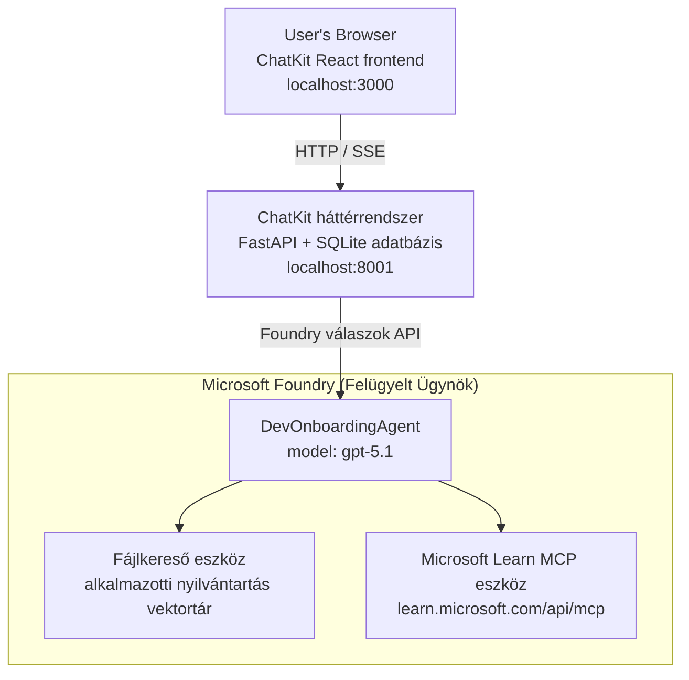

# 4. Lecke: Ügynök telepítése Microsoft Foundry tárhelyes ügynökökkel + ChatKit

Ez a lecke bemutatja, hogyan lehet egy eszközhasználó ügynököt telepíteni a Microsoft Foundry-ra tárhelyes ügynökként, és létrehozni egy ChatKit-alapú frontend felületet a vele való interakcióhoz.

## Architektúra

A tárhelyes ügynök egy **egyedi `DevOnboardingAgent`** (a `gpt-5.1` modellen fut), amely fejlesztői beilleszkedési kérdésekre válaszol két tárhelyes eszköz segítségével: egy **File Search** eszközzel az alkalmazott-könyvtár vektor tárolón, és a **Microsoft Learn MCP** eszközzel. Egy ChatKit React frontend a FastAPI backenddel kommunikál, amely az ügynököt a Foundry **Responses API**-n keresztül hívja meg.



## Előfeltételek

1. **Microsoft Foundry projekt** a North Central US régióban
2. **Azure CLI** bejelentkezve (`az login`)
3. **Azure Developer CLI** (`azd`) telepítve
4. **Python 3.12+** és **Node.js 18+**
5. **Vektor tároló** létrehozva alkalmazotti adatokkal

## Gyors kezdés

### 1. Állítsd be a környezeti változókat

```bash
cd lesson-4-agentdeployment
cp .env.example .env
# Szerkeszd a .env fájlt a Microsoft Foundry projekt részleteivel
```

### 2. Telepítsd a tárhelyes ügynököt

**A lehetőség A: Azure Developer CLI használata (ajánlott)**

```bash
cd hosted-agent
azd auth login
azd agent deploy
```

**B lehetőség: Docker + Azure Container Registry használata**

```bash
cd hosted-agent

# A konténer építése
docker build -t developer-onboarding-agent:latest .

# Címke az ACR-hez
docker tag developer-onboarding-agent:latest <your-acr>.azurecr.io/developer-onboarding-agent:latest

# Feltöltés az ACR-be
az acr login --name <your-acr>
docker push <your-acr>.azurecr.io/developer-onboarding-agent:latest

# Telepítés a Microsoft Foundry portál vagy SDK segítségével
```

### 3. Indítsd el a ChatKit backend-et

```bash
cd chatkit-server
python -m venv .venv
source .venv/bin/activate  # Windows rendszeren: .venv\Scripts\activate
pip install -r requirements.txt
python app.py
```

A szerver elindul a `http://localhost:8001` címen

### 4. Indítsd el a ChatKit frontend-et

```bash
cd chatkit-server/frontend
npm install
npm run dev
```

A frontend elindul a `http://localhost:3000` címen

### 5. Teszteld az alkalmazást

Nyisd meg a `http://localhost:3000` webcímet a böngésződben, és próbáld ki ezeket a lekérdezéseket:

**Alkalmazotti keresés:**
- "Új vagyok itt! Dolgozott már valaki a Microsoftnál?"
- "Kinek van tapasztalata Azure Functions-ben?"

**Tanulási források:**
- "Hozz létre egy tanulási útvonalat Kuberneteshez"
- "Milyen tanúsítványokat érdemes szerezni felhőarchitektúrához?"

**Kódolási segítség:**
- "Segíts Python kódot írni CosmosDB-hez való kapcsolódáshoz"
- "Mutasd meg, hogyan készítsünk Azure Function-t"

**Több ügynök lekérdezések:**
- "Cloud mérnökként kezdek. Kivel kellene kapcsolatot teremtenem és mit tanuljak?"

## Projekt struktúra

```
lesson-4-agentdeployment/
├── .env.example                 # Environment variables template
├── implementation-plan.md       # Detailed implementation guide
├── README.md                    # This file
├── hosted-agent/               # Microsoft Foundry hosted agent
│   ├── main.py                 # Multi-agent workflow implementation
│   ├── requirements.txt        # Python dependencies
│   ├── Dockerfile              # Container definition
│   └── agent.yaml              # Agent deployment configuration
└── chatkit-server/             # ChatKit server application
    ├── app.py                  # FastAPI backend
    ├── store.py                # SQLite persistence layer
    ├── requirements.txt        # Python dependencies
    └── frontend/               # React frontend
        ├── package.json
        ├── vite.config.ts
        ├── tsconfig.json
        ├── index.html
        └── src/
            ├── main.tsx
            ├── App.tsx
            ├── App.css
            └── index.css
```

## Az ügynök és eszközei

A tárhelyes ügynök egy **egyedi ügynök** (`DevOnboardingAgent`, amely a `hosted-agent/main.py` fájlban van definiálva), amely három beilleszkedési területet kezel. Ahelyett, hogy külön alsóügynököket szervezne össze, minden képességét eszközként teszi elérhetővé (vagy közvetlenül a modellre támaszkodik):

| Képesség | Kezelés módja | Eszköz |
|-----------|------------------|------|
| **Alkalmazotti keresés és kapcsolatok** | Foundry tárhelyes File Search az alkalmazott-könyvtár vektor tárolón | `client.get_file_search_tool(vector_store_ids=[...])` |
| **Tanulás és képzés** | Microsoft Learn MCP szerver (tárhelyes MCP eszköz) | `client.get_mcp_tool(url="https://learn.microsoft.com/api/mcp")` |
| **Kódolási segítség** | Közvetlenül a `gpt-5.1` modell kezeli — nincs külső eszköz | — |

Az ügynököt a `client.as_agent(name="DevOnboardingAgent", instructions=..., tools=[file_search_tool, learn_mcp_tool])` hívással hozzuk létre, és a `from_agent_framework(agent).run()` indítja el.

> **Tervezési megjegyzés.** A lecke korábbi változatai `HandoffBuilder` többügynökös munkafolyamatot használtak (Triage → szakértők). A jelenlegi ügynök egyetlen eszközt használó ügynök, amely egyszerűbben telepíthető és érthető a beilleszkedési kérdések-válaszokhoz. Többügynökös szervezés és átadások példájáért lásd a 2. és 3. leckét.

## Füsttesztelés a tárhelyes ügynökkel (CI kapu)

Egy tárhelyes ügynök "sikeres" telepítése csak azt bizonyítja, hogy a vezérlő sík elfogadta
a definíciót — **nem** bizonyítja, hogy az ügynök valóban válaszol. Egy hiányzó függőség,
hibás modellútvonal, vagy lejárt kapcsolat zöld, de néma ügynököt eredményezhet.

Ez a lecke egy könnyű **füsttesztet** tartalmaz, ami gyors, olcsó poszt-deploy kapuként működik.
A [AI Smoke Test](https://github.com/marketplace/actions/ai-smoke-test)
GitHub Action-t használja, amely POST kéréseket küld az ügynök Foundry **Responses** végpontjára
(`POST {project_endpoint}/agents/{agent_name}/endpoint/protocols/openai/responses`)
és az adott szöveget ellenőrzi. Ez másodpercek alatt felismeri a hibás telepítéseket, hitelesítési regressziókat,
rendszerbeli prompt elcsúszásokat, és szálkezelési hibákat.

> A füsttesztek **nem** helyettesítik a teljes értékeléseket a
> [3. Lecke](../lesson-3-agent-evals/README.md) alapján — kiegészítik azt. A füsttesztek
> arra válaszolnak: *"elérhető-e, válaszol-e és követi-e az alap prompt elvárásokat az ügynök?"*;
> az értékelések arra, hogy *"mennyire jó a válasz?"*. Futtasd az olcsó kaput minden telepítéskor.

### Mit tesztelünk

A katalógus a [`hosted-agent/tests/smoke-tests.json`](../../../lesson-4-agentdeployment/hosted-agent/tests/smoke-tests.json) fájlban található,
és teszteli az ügynök három területét, valamint a prompt követését és a többfordulós szálkezelést:

| Teszt | Amit ellenőriz |
|------|------------------|
| `reachability` | Az ügynök válaszol nem üres, a hatókörbe tartozó szöveggel |
| `employee-search` | A file-search terület érvényes `200` választ ad (a válasz adatfüggő) |
| `learning-path` | A tanulási terület visszaadja a témát és útvonal-szerű választ generál |
| `coding-assistance` | A kódolási terület Python kódformátumú választ ad |
| `prompt-adherence-offtopic` | Az off-topic kérés átirányításra kerül, nem kap részletes választ |
| `threading-turn-1/2` | A beszélgetés állapota megmarad a fordulók között a `previous_response_id` segítségével |

### Futtasd CI-ben

A munkafolyamat a [`.github/workflows/smoke-test-hosted-agent.yml`](../../../.github/workflows/smoke-test-hosted-agent.yml)
két munkafolyamatból áll:

- **`static`** — egy gyors, Azure nélküli kapu, amely minden pull request és push esetén lefut:
  összeállítja az összes Python forrást (`py_compile`) és ellenőrzi a Markdown linkeket. Nem igényel titkokat,
  így fork PR-eknél is működik.
- **`smoke`** — az Azure-hoz kapcsolt füstteszt az alábbiak szerint. Igény szerint
  futtatható (Actions → **Agent CI (static + smoke)** → Run workflow), és összekapcsolható a
  telepítési munkafolyamattal.

Állítsd be az adatbázis **változókat** és **titkokat** a füstesethez:

| Típus | Név | Érték |
|------|------|-------|

| Változó | `FOUNDRY_PROJECT_ENDPOINT` | `https://<account>.services.ai.azure.com/api/projects/<project>` |
| Változó | `HOSTED_AGENT_NAME` | Telepített ügynök neve (pl. `dev-onboarding` — meg kell egyeznie a telepítéseddel) |
| Titok | `AZURE_CLIENT_ID` / `AZURE_TENANT_ID` / `AZURE_SUBSCRIPTION_ID` | OIDC szövetséges hitelesítés az `azure/login` számára |

A futtató identitásának szüksége van az **`Azure AI User`** szerepre a **Foundry projekt hatókörben**, hogy
elérhesse a Válaszok (és beszélgetések) adat-sík végpontjait. Adja meg neki ezt:

```bash
az role assignment create \
  --assignee <object-id-or-appId-of-runner-identity> \
  --role "Azure AI User" \
  --scope "/subscriptions/<sub>/resourceGroups/<rg>/providers/Microsoft.CognitiveServices/accounts/<account>/projects/<project>"
```

### Futtasd helyileg

Ugyanezt a katalógust lefuttathatod helyileg is, mielőtt pusholnád. Szerezz egy
adat-sík token-t a `https://ai.azure.com/` hatókörrel, és irányítsd a futtatót a telepítésedre:

```bash
# Az Audience-nek a https://ai.azure.com/ kell lennie (a cognitiveservices.azure.com tokenek elutasításra kerülnek)
export FOUNDRY_TOKEN=$(az account get-access-token --resource https://ai.azure.com/ --query accessToken -o tsv)

git clone https://github.com/JFolberth/ai-smoketest && cd ai-smoketest
python runner.py \
  --project-endpoint "https://<account>.services.ai.azure.com/api/projects/<project>" \
  --agent-name dev-onboarding \
  --tests-file ../lesson-4-agentdeployment/hosted-agent/tests/smoke-tests.json
```

Kilépési kódok: `0` minden sikeres, `1` állítás sikertelen, `2` futtató hiba (hibás katalógus / token).

## Hibakeresés

### Ügynök nem válaszol
- Ellenőrizd, hogy a hosztolt ügynök telepítve és fut a Microsoft Foundry-ban
- Ellenőrizd, hogy a `HOSTED_AGENT_NAME` és `HOSTED_AGENT_VERSION` egyeznek a telepítéseddel

### Vektor tároló hibák
- Győződj meg róla, hogy a `VECTOR_STORE_ID` helyesen van beállítva
- Ellenőrizd, hogy a vektor tároló tartalmazza a munkavállalói adatokat

### Hitelesítési hibák
- Futtasd az `az login` parancsot a hitelesítő adatok frissítéséhez
- Győződj meg róla, hogy hozzáférsz a Microsoft Foundry projekthez

## Erőforrások

- [Microsoft Foundry Hosztolt Ügynökök Dokumentációja](https://learn.microsoft.com/en-us/azure/ai-foundry/agents/concepts/hosted-agents)
- [Microsoft Agent Framework](https://github.com/microsoft/agent-framework)
- [ChatKit Integrációs Minta](https://github.com/microsoft/agent-framework/tree/main/python/samples/demos/chatkit-integration)
- [Azure Developer CLI](https://learn.microsoft.com/en-us/azure/developer/azure-developer-cli/overview)
- [AI Smoke Test GitHub Action](https://github.com/marketplace/actions/ai-smoke-test)
- [Microsoft Foundry Ügynökök Smoke Test GitHub Actions-szel (blog)](https://techcommunity.microsoft.com/blog/azuredevcommunityblog/smoke-test-microsoft-foundry-agents-with-github-actions/4531912)

---

## Következő lépések

Az ügynököd Microsoft által kezelt infrastruktúrán fut. Ahhoz, hogy vállalati szintű
termelésre vidd —
irányítva, hogy hol tárolódjanak az adatai (adat szuverenitás, privát hálózat, saját Azure Cosmos DB / Storage / AI Search használata) és az eszközei felett felügyeletet gyakorolva —
folytasd a **[5. lecke: Termelési Hosztolt Ügynökök](../lesson-5-hosted-agents-production/README.md)** tanulást, ami
elmagyarázza a döntő különbséget a **Hosztolt Ügynökök** és a **Képesség Szolgáltatók** között.

---

<!-- CO-OP TRANSLATOR DISCLAIMER START -->
**Jogi nyilatkozat**:
Ez a dokumentum az AI fordítási szolgáltatás, a [Co-op Translator](https://github.com/Azure/co-op-translator) segítségével készült. Bár az pontosságra törekszünk, kérjük, vegye figyelembe, hogy az automatikus fordítások hibákat vagy pontatlanságokat tartalmazhatnak. Az eredeti dokumentum az anyanyelvén tekintendő hiteles forrásnak. Fontos információk esetén professzionális emberi fordítást javasolunk. Nem vállalunk felelősséget semmilyen félreértésért vagy téves értelmezésért, amely ebből a fordításból ered.
<!-- CO-OP TRANSLATOR DISCLAIMER END -->