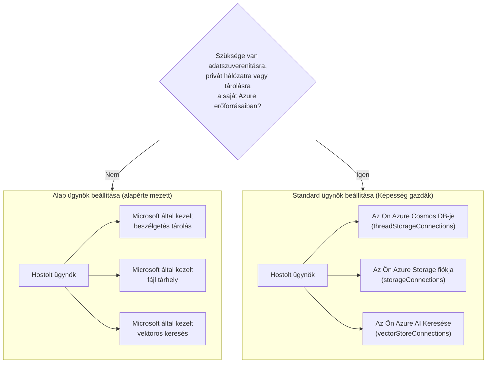

# 5. Lecke: Éles Üzemeltetésű Hosting Ügynökök — Tárolás, Memória és Irányítás

A [4. Lecke](../lesson-4-agentdeployment/README.md) során telepítetted a Developer Onboarding
Ügynököt mint **Microsoft Foundry Hosztolt Ügynököt**, és elé helyeztél egy ChatKit frontend-et. Az a
lecke arra a kérdésre válaszolt, hogy *„hogyan szállítok egy ügynököt?”*. Ez a lecke azokra a
kérdésekre válaszol, amelyek ezt követik egy vállalati környezetben: **Hol tárolódik az ügynök adata? Ki
kezeli ezt? Hogyan teljesítem a megfelelőségi, hálózati és irányítási követelményeket?**

Ennek a leckének a legfontosabb gondolata a különbség a **Hosztolt Ügynök** és a **Képesség Hoszt** között —
két fogalom, amelyeket könnyű összekeverni, de teljesen különböző problémákat oldanak meg.


  **nem**.
- Elmagyarázni, mi az a **Képesség Hoszt**, és pontosan mikor van szükséged rá.
- Választani **alap ügynök beállítás** (Microsoft által kezelt tárolás) és **standard ügynök beállítás**
  (hozd a saját Azure erőforrásaidat) között.
- Megérteni, hogy a **beszélgetési előzmények, fájlfeltöltések és vektor tárolók** hogyan
  tárolódnak, és hogyan irányíthatók át a saját Azure Cosmos DB, Azure Storage és Azure AI Search
  erőforrásaidra.


1. Teljesített [4. Lecke](../lesson-4-agentdeployment/README.md) — van egy hosztolt ügynököd telepítve.
2. Egy **Microsoft Foundry** projekt, és egy Azure fiók, amelynek engedélye van erőforrások létrehozására
   (Cosmos DB, Storage, Azure AI Search) és szerepkörök hozzárendelésére az előfizetésben/erőforráscsoportban.
3. **Azure CLI** hitelesítve: `az login` (és `az account set --subscription <id>`, ha több előfizetésed van).
4. Telepített **Azure Developer CLI** (`azd`) — a standard beállítású provisionálási folyamat használatához.
5. Telepített **Python 3.12+** a kurzus függőségeivel (`pip install -r ../requirements.txt`).
6. Egy aktuális, nem nyugdíjazott modell telepítés (például `gpt-5.1`). Kerüld a nyugdíjazott GPT-4o / GPT-4.1 modelljeit.

> Ez a lecke főként koncepcionális és vezérlő síkra fókuszál. Végigolvasd nyugodtan az egészet,
> anélkül, hogy bármit provisionálnál, aztán használd a gyakorlati feladatokat, amikor készen állsz a
> standard beállítás konfigurálására.

---

## 1. Hosztolt Ügynökök: amit a Foundry kezel helyetted

Egy **Hosztolt Ügynök** olyan ügynök, amelynek *végrehajtási környezete* teljes mértékben a Microsoft
Foundry Agent Service által van menedzselve. Amikor telepítesz egy hosztolt ügynököt (ahogy a 4. leckében is tetted),


- **Számítást (Compute)** — a futtatókörnyezetet, amely végrehajtja az ügynök kódját és eszközeit.
- **Skálázást** — replikák skálázódnak felfelé vagy lefelé a terhelés szerint (ld. `agent.yaml` `scale` a 4. leckében).
- **Azonosítást** — kezelt identitás az ügynök számára, hogy Azure-ba titkok nélkül hitelesíthessen.
- **Megfigyelhetőséget** — nyomkövetés és telemetria (ld. a 3. lecke megfigyelhetőségi szekcióját).


> **Fő pont:** Nem kell Capability Host-ot konfigurálni egyszerűen ahhoz, hogy **egy Hosztolt


A **Hosztolt Ügynökök** biztosítják a Microsoft által kezelt végrehajtási környezetet, beleértve a számítást,
skálázást, identitást, megfigyelhetőséget és munkamenet-kezelést. Nincs szükség Képesség Hosztra csak azért,


A **Képesség Hosztok** csak akkor szükségesek, ha azt szeretnéd, hogy az Agent Service **ügyfél tulajdonú
erőforrásokat** használjon a Microsoft által kezelt tárolás helyett. Ha elégedett vagy az alapértelmezett
Microsoft-központú tárolással, vektor kereséssel és beszélgetési tartósítással, **nem szükséges Képesség Hoszt


Ha a szervezeted megköveteli az **adat szuverenitást, privát hálózatot, megfelelőségi szabályokat vagy a tárolást a saját Azure Cosmos DB,
Azure Storage és Azure AI Search erőforrásaidban**, akkor konfigurálhatod a Képesség Hosztokat, hogy az Agent Service


> Egy **Hosztolt Ügynök** arról szól, *hol fut az ügynököd*. Egy **Képesség Hoszt** arról szól,


| Téma | Hosztolt Ügynök | Képesség Hoszt |
|---------|--------------|-----------------|
| Számítás / skálázás / azonosítás | ✅ Biztosított | — |
| Megfigyelhetőség / nyomkövetés | ✅ Biztosított | — |
| Beszélgetés & munkamenet-kezelés | ✅ Biztosított | Átirányítja *ahol tárolódik* |
| Hol tárolódik a beszélgetési előzmény | Alapértelmezetten Microsoft által kezelt | A saját Azure Cosmos DB-d |
| Hol tárolódnak a feltöltött fájlok | Alapértelmezetten Microsoft által kezelt | A saját Azure Storage Accountod |
| Hol tárolódnak a vektoros beágyazások | Alapértelmezetten Microsoft által kezelt | A saját Azure AI Search-ed |
| Szükséges az ügynök futtatásához? | ✅ Igen (ő maga a hoszt) | ❌ Nem — opcionális |





- Fejlesztés, prototípus-készítés és tesztelés.
- Belső eszközök, ahol a Microsoft által kezelt tárolás megfelel az adatkezelési szabályzatodnak.


- **Adat szuverenitás** — az összes ügynök adatnak a saját Azure előfizetésedben / régiódában kell maradnia.
- **Biztonsági ellenőrzés** — saját tároló fiókokat, adatbázisokat és kereső szolgáltatásokat kell használnod.
- **Megfelelőség** — szabályozási vagy szervezeti előírásaid vannak az adatok tárolási helyére vonatkozóan.


> **Microsoft ajánlása:** használj *külön* Foundry fiókokat/projekteket a standard és az alap beállításokra.


Egy **Képesség Hoszt** egy alkierőforrás, amelyet **két szinten** konfigurálsz: a Foundry **fiók**
és a Foundry **projekt** szintjén. Ez mondja meg az Agent Service-nek, hogy hol tárolja és dolgozza fel az ügynök adatait:


1. **Előbb fiók, aztán projekt.** Nem hozhatsz létre projekt szintű Képesség Hosztot, mielőtt fiókszintű nem létezik.

2. **Nincs konfiguráció öröklődése.** A **projekt** képességházigazda az, amit az Ügynök Szolgáltatás
   valójában olvas, hogy eldöntse, melyik tároló/beszélgetés/vektor erőforrásokat használja. A fiókszintű
   kapcsolatok *nem* kerülnek automatikusan felhasználásra egy projekt által – a projekt képességházigazdának
   explicit módon kell hivatkoznia rájuk.

### Kapcsolatok, amelyekre egy szabványos telepítésnek szüksége van

A képességházigazdák hivatkoznak **kapcsolatokra** (amelyeket a Foundry fiókodban/projektedben hoztál létre), amelyek a
Azure erőforrásaidra mutatnak:

| Képességházigazda tulajdonság | Tárolók | Azure erőforrásod |
|--------------------------|--------|---------------------|
| `threadStorageConnections` | Ügynök definíciók + beszélgetési előzmények | Azure Cosmos DB |
| `storageConnections` | Fájl feltöltések / blob tárolás | Azure Storage fiók |
| `vectorStoreConnections` | Vektor beágyazások kereséshez/lekérdezéshez | Azure AI Search |
| `aiServicesConnections` *(opcionális)* | Saját modellik telepítései | Azure OpenAI |

Minden kapcsolatnak tartalmaznia kell `authType`, `category`, `target` (a szolgáltatás **végpont URL-jét**, nem
az erőforrás azonosítóját), valamint `metadata.ResourceId` (az Azure erőforrás teljes azonosítója) mezőt, különben az Ügynök Szolgáltatás
nem tudja futásidőben feloldani az erőforrást.

### A képességházigazdák konfigurálása (vezérlési sík)

A képességházigazdák jelenleg az **Azure Resource Manager REST API** által kezelhetők (jelenleg nincs
SDK a képességházigazda kezeléséhez). Először hozd létre a **fiók** képességházigazdát:

```http
PUT https://management.azure.com/subscriptions/{subscriptionId}/resourceGroups/{rg}/providers/Microsoft.CognitiveServices/accounts/{account}/capabilityHosts/{name}?api-version=2025-06-01

{
  "properties": { "capabilityHostKind": "Agents" }
}
```

Ezután hozd létre a **projekt** képességházigazdát, amely hivatkozik a kapcsolataidra:

```http
PUT https://management.azure.com/subscriptions/{subscriptionId}/resourceGroups/{rg}/providers/Microsoft.CognitiveServices/accounts/{account}/projects/{project}/capabilityHosts/{name}?api-version=2025-06-01

{
  "properties": {
    "capabilityHostKind": "Agents",
    "threadStorageConnections": ["my-cosmosdb-connection"],
    "vectorStoreConnections":  ["my-ai-search-connection"],
    "storageConnections":      ["my-storage-connection"]
  }
}
```

> **Megjegyzendő korlátok:**
> - **Egy képességházigazda egy hatókörönként.** Ugyanazon a hatókörön egy második létrehozása `409 Conflict` hibát eredményez.
> - **Nincs frissítés.** A konfiguráció módosításához a képességházigazdát törölni és újra létre kell hozni.
> - **A törlés visszafordíthatatlan.** A képességházigazda törlése megszünteti az ügynökök hozzáférését a hivatkozott fájlokhoz,
>   beszélgetésekhez és vektortárolókhoz.

### Ellenőrizd, hogy működik

A konfiguráció után futtass egy teszt beszélgetést, és erősítsd meg, hogy:

- A beszélgetések megjelennek a **saját Azure Cosmos DB-dben**.
- A feltöltött fájlok megjelennek a **saját Azure Storage fiókodban**.
- A vektoradatok megjelennek a **saját Azure AI Search indexedben**.

---

## 5. Memória és kontextus kezelés

A „munkamenet-kezelés” (egy Hosted Agent funkció) és „hova tárolódnak a beszélgetések” (egy képességházigazda
feladat) kombinációja biztosítja az ügynököd **memóriáját**:

- Egy **szál** (beszélgetés) tartalmazza a csevegés rendezett fordulóit. A Responses API `previous_response_id` segítségével
  fűzi össze a hívásokat (ezt a 4. lecke gyors tesztjeiben láttad).
- **Alapértelmezett telepítés** esetén a szál/beszélgetési állapot Microsoft kezelt tárolóban él.
- **Szabványos telepítés** esetén ugyanaz az állapot a **saját Azure Cosmos DB-dben** marad meg
  `threadStorageConnections` segítségével — tartós, lekérdezhető, önálló beszélgetési előzményt biztosítva.

Ez a különbség egy olyan ügynök között, amely „munkameneten belül emlékszik”, illetve egy vállalati
rendszer között, ahol minden beszélgetés megőrződik a saját megfelelőségi körzeteden belül.

---

## 6. Irányítás és biztonsági ellenőrzőlista

Használd ezt az ellenőrzőlistát, amikor egy hosztolt ügynök prototípusból termékbe kerül:

- [ ] **Döntsd el az alapértelmezett vagy szabványos telepítést** a §3-ban található kérdések alapján — dokumentáld a döntést.
- [ ] **Adatszuverenitás:** ha szükséges, konfiguráld a képességházigazdákat úgy, hogy a beszélgetési előzmények
      (Cosmos DB), a fájlok (Storage) és a vektorok (AI Search) a saját előfizetésedben/régiódban maradjanak.

- [ ] **Privát hálózat:** az alapértelmezett beállítás esetén korlátozza a forgalmat a Bring Your Own Virtual
      Network segítségével, hogy az adatok ne hagyhassák el a hálózatát (segít megakadályozni az adatszivárgást).
- [ ] **RBAC:** adjon meg minimális jogosultságot. A képességhostok létrehozásához **Contributor** jogosultság szükséges a
      Foundry-fiókban; az Azure-erőforrásokhoz való hozzáférés szétosztásához **User Access Administrator**
      vagy **Owner** jogosultság szükséges.
- [ ] **MCP eszközök felügyelete:** vizsgálja felül minden MCP szervert, amelyet az ügynök hívhat, és állítson be
      egy **jóváhagyási módot** (lásd 7. fejezet). Soha ne tegye ki egy nem felülvizsgált külső eszközt egy éles ügynöknek.
- [ ] **Megfigyelhetőség:** győződjön meg róla, hogy a nyomkövetés/telemetria be van kapcsolva (3. leckében), hogy auditálni tudja az eszközhívásokat.
- [ ] **Költség:** a BYO erőforrásokat (Cosmos DB, AI Search, Storage) *az ön* előfizetésére számlázzák —
      méretezze és figyelje azokat. Az alapértelmezett beállítás a tárolást a kezelt szolgáltatásba vonja össze.

---

## 7. Hosztolt MCP eszközök és jóváhagyási munkafolyamatok

A 4. leckében a Developer Onboarding Agent már használ egy **hosztolt MCP eszközt** — a
[Microsoft Learn MCP szervert](https://learn.microsoft.com/api/mcp) — amely így adható hozzá:

```python
client.get_mcp_tool(
    name="Microsoft Learn MCP",
    url="https://learn.microsoft.com/api/mcp",
    approval_mode="never_require",
)
```

A **Model Context Protocol (MCP)** egy nyílt szabvány, amely lehetővé teszi, hogy egy ügynök felfedezzen és hívjon
külső eszközöket egységes felületen keresztül. A **hosztolt MCP eszközök** a Foundrynak engedik, hogy MCP szervert hívjon az
ügynök nevében. Az éles környezetben két felügyeleti eszköz fontos:

- **`approval_mode`** — szabályozza, hogy szükséges-e emberi/hívó jóváhagyása minden eszközmeghíváshoz.
  - A `never_require` kényelmes egy megbízható, csak olvasható szerver, például a Microsoft Learn esetén.
  - Olyan szerverekhez, amelyek írhatnak vagy érzékeny rendszerekhez férhetnek hozzá, szükséges a jóváhagyás ahhoz, hogy a hívás
    futtatása előtt felülvizsgálatra kerüljön. Ez a **jóváhagyási munkafolyamat**.
- **Szerver engedélyező lista** — csak azokat az MCP szervereket kapcsolja be, amelyeket felülvizsgált és megbízik bennük.
  Egy MCP URL-t kezeljen úgy, mint bármely más éles környezetbeli függőséget.

> **Próbálja ki:** módosítsa a 4. lecke ügynökének `approval_mode` beállítását jóváhagyásra, telepítse újra, és
> figyelje meg, hogyan várnak most a hívások megerősítésre, mielőtt végrehajtódnának.

---

## Gyakorlati feladatok

1. **Osztályozzon egy forgatókönyvet.** Döntse el, hogy *alap* vagy *alapértelmezett* beállítás szükséges az alábbiak közül,
   és indokolja meg: (a) egy hackathon demó, (b) egy egészségügyi bevezető asszisztens, amely PII-t kezel, (c) egy belső
   FAQ bot, (d) egy banki ügynök, amelynek minden adatot régión belül kell tartania.
2. **Térképezze fel a tárolást.** A 4. lecke ügynökénél sorolja fel, hogy mely képességhost tulajdonság tárolja
   a (a) csevegési előzményeket, (b) feltöltött alkalmazotti fájlokat, (c) vektoros beágyazásokat.
3. **Tervezzen jóváhagyási munkafolyamatot.** Adjon egy feltételezett "Jira jegy létrehozása" MCP eszközt az ügynökhöz.
   Milyen `approval_mode`-ot használna és miért?
4. **Költségkeresztmetszet.** Írjon két vagy három mondatot arról, milyen költséghatásai vannak az alap-
   és az alapértelmezett beállítás közötti váltásnak egy nagy forgalmú ügynöknél.

---

## Források

- [Képességhostok — Microsoft Foundry](https://learn.microsoft.com/azure/foundry/agents/concepts/capability-hosts)
- [Alapértelmezett ügynökbeállítás (beépített vállalati készség)](https://learn.microsoft.com/azure/foundry/agents/concepts/standard-agent-setup)

- [Használja a saját erőforrásait](https://learn.microsoft.com/azure/foundry/agents/how-to/use-your-own-resources)

- [Állítsa be az ügynök környezetét (alapvető vs szabványos)](https://learn.microsoft.com/azure/foundry/agents/environment-setup)
- [Állítson be privát hálózatot a Foundry Agent Service számára](https://learn.microsoft.com/azure/foundry/agents/how-to/virtual-networks)
- [Adj hozzá egy kapcsolatot a projektedhez](https://learn.microsoft.com/azure/foundry/how-to/connections-add)
- [Microsoft Learn MCP szerver](https://learn.microsoft.com/training/support/mcp)
- [Model Context Protocol](https://modelcontextprotocol.io/)

---

**Előző:** [4. lecke — Ügynök telepítése](../lesson-4-agentdeployment/README.md) &nbsp;·&nbsp; **Következő:** [6. lecke — Microsoft eszköztár](../lesson-6-toolbox/README.md)

---

<!-- CO-OP TRANSLATOR DISCLAIMER START -->
**Jogi nyilatkozat**:
Ez a dokumentum az AI fordítási szolgáltatás, a [Co-op Translator](https://github.com/Azure/co-op-translator) segítségével készült. Bár az pontosságra törekszünk, kérjük, vegye figyelembe, hogy az automatikus fordítások hibákat vagy pontatlanságokat tartalmazhatnak. Az eredeti dokumentum az anyanyelvén tekintendő hiteles forrásnak. Fontos információk esetén professzionális emberi fordítást javasolunk. Nem vállalunk felelősséget semmilyen félreértésért vagy téves értelmezésért, amely ebből a fordításból ered.
<!-- CO-OP TRANSLATOR DISCLAIMER END -->