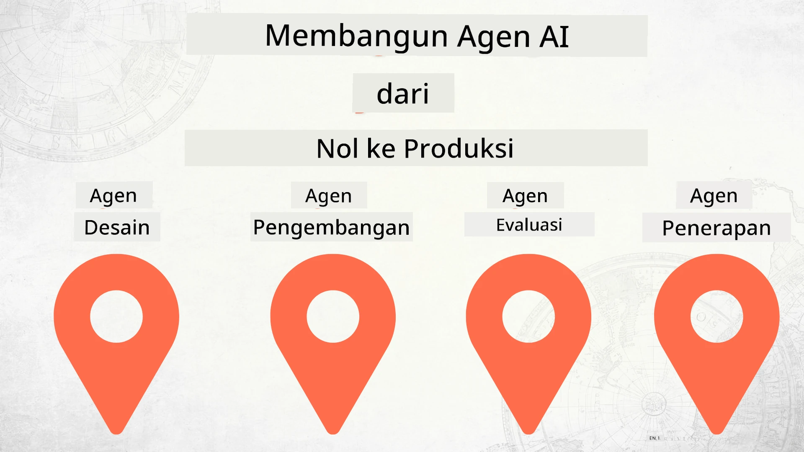

# Membangun Agen AI dari Nol hingga Produksi



### 🌐 Dukungan Multi-Bahasa

#### Didukung melalui GitHub Action (Otomatis & Selalu Terbaru)

<!-- CO-OP TRANSLATOR LANGUAGES TABLE START -->
[Arabic](../ar/README.md) | [Bengali](../bn/README.md) | [Bulgarian](../bg/README.md) | [Burmese (Myanmar)](../my/README.md) | [Chinese (Simplified)](../zh-CN/README.md) | [Chinese (Traditional, Hong Kong)](../zh-HK/README.md) | [Chinese (Traditional, Macau)](../zh-MO/README.md) | [Chinese (Traditional, Taiwan)](../zh-TW/README.md) | [Croatian](../hr/README.md) | [Czech](../cs/README.md) | [Danish](../da/README.md) | [Dutch](../nl/README.md) | [Estonian](../et/README.md) | [Finnish](../fi/README.md) | [French](../fr/README.md) | [German](../de/README.md) | [Greek](../el/README.md) | [Hebrew](../he/README.md) | [Hindi](../hi/README.md) | [Hungarian](../hu/README.md) | [Indonesian](./README.md) | [Italian](../it/README.md) | [Japanese](../ja/README.md) | [Kannada](../kn/README.md) | [Korean](../ko/README.md) | [Lithuanian](../lt/README.md) | [Malay](../ms/README.md) | [Malayalam](../ml/README.md) | [Marathi](../mr/README.md) | [Nepali](../ne/README.md) | [Nigerian Pidgin](../pcm/README.md) | [Norwegian](../no/README.md) | [Persian (Farsi)](../fa/README.md) | [Polish](../pl/README.md) | [Portuguese (Brazil)](../pt-BR/README.md) | [Portuguese (Portugal)](../pt-PT/README.md) | [Punjabi (Gurmukhi)](../pa/README.md) | [Romanian](../ro/README.md) | [Russian](../ru/README.md) | [Serbian (Cyrillic)](../sr/README.md) | [Slovak](../sk/README.md) | [Slovenian](../sl/README.md) | [Spanish](../es/README.md) | [Swahili](../sw/README.md) | [Swedish](../sv/README.md) | [Tagalog (Filipino)](../tl/README.md) | [Tamil](../ta/README.md) | [Telugu](../te/README.md) | [Thai](../th/README.md) | [Turkish](../tr/README.md) | [Ukrainian](../uk/README.md) | [Urdu](../ur/README.md) | [Vietnamese](../vi/README.md)

> **Lebih Suka Mengkloning Secara Lokal?**
>
> Repositori ini mencakup lebih dari 50 terjemahan bahasa yang secara signifikan meningkatkan ukuran unduhan. Untuk mengkloning tanpa terjemahan, gunakan sparse checkout:
>
> **Bash / macOS / Linux:**
> ```bash
> git clone --filter=blob:none --sparse https://github.com/microsoft/Building-AI-Agents-From-Zero-To-Production.git
> cd Building-AI-Agents-From-Zero-To-Production
> git sparse-checkout set --no-cone '/*' '!translations' '!translated_images'
> ```
>
> **CMD (Windows):**
> ```cmd
> git clone --filter=blob:none --sparse https://github.com/microsoft/Building-AI-Agents-From-Zero-To-Production.git
> cd Building-AI-Agents-From-Zero-To-Production
> git sparse-checkout set --no-cone "/*" "!translations" "!translated_images"
> ```
>
> Ini memberi Anda semua yang Anda butuhkan untuk menyelesaikan kursus dengan waktu unduhan yang lebih cepat.
<!-- CO-OP TRANSLATOR LANGUAGES TABLE END -->

## Sebuah kursus yang mengajarkan dasar-dasar Siklus Hidup Pengembangan Agen AI

[](https://github.com/microsoft/Building-AI-Agents-From-Zero-To-Production/blob/master/LICENSE?WT.mc_id=academic-105485-koreyst)
[](https://GitHub.com/microsoft/Building-AI-Agents-From-Zero-To-Production/graphs/contributors/?WT.mc_id=academic-105485-koreyst)
[](https://GitHub.com/microsoft/Building-AI-Agents-From-Zero-To-Production/issues/?WT.mc_id=academic-105485-koreyst)
[](https://GitHub.com/microsoft/Building-AI-Agents-From-Zero-To-Production/pulls/?WT.mc_id=academic-105485-koreyst)
[](http://makeapullrequest.com?WT.mc_id=academic-105485-koreyst)

[](https://discord.gg/Kuaw3ktsu6)

## 🌱 Memulai

Kursus ini memiliki pelajaran yang mencakup dasar-dasar membangun dan menerapkan Agen AI.

Setiap pelajaran dibangun berdasarkan pelajaran sebelumnya, jadi kami menyarankan memulai dari awal dan mengerjakan hingga selesai.

Jika Anda ingin mengeksplorasi lebih lanjut tentang topik Agen AI, Anda bisa memeriksa [Kursus AI Agents Untuk Pemula](https://aka.ms/ai-agents-beginners).

### Bertemu Dengan Pembelajar Lain, Dapatkan Jawaban atas Pertanyaan Anda

Jika Anda mengalami kesulitan atau memiliki pertanyaan tentang membangun Agen AI, bergabunglah di Saluran Discord khusus kami di [Microsoft Foundry Discord](https://discord.gg/Kuaw3ktsu6).

### Apa Yang Anda Butuhkan

Setiap Pelajaran memiliki contoh kode tersendiri yang dapat Anda jalankan secara lokal. Anda dapat [fork repo ini](https://github.com/microsoft/Building-AI-Agents-From-Zero-To-Production/fork) untuk membuat salinan Anda sendiri.

Kursus ini saat ini menggunakan:

- [Microsoft Agent Framework (MAF)](https://aka.ms/ai-agents-beginners/agent-framework)
- [Microsoft Foundry](https://azure.microsoft.com/products/ai-foundry)
- [Azure OpenAI Service](https://azure.microsoft.com/products/ai-foundry/models/openai)
- [Azure CLI](https://learn.microsoft.com/cli/azure/authenticate-azure-cli?view=azure-cli-latest)

Harap pastikan Anda memiliki akses ke layanan-layanan ini sebelum memulai.

Opsi lebih lanjut terkait hosting model dan layanan akan hadir segera.

## 🗃️ Pelajaran

| **Pelajaran**          | **Deskripsi**                                                                                              |
|-----------------------|------------------------------------------------------------------------------------------------------------|
| [Desain Agen](./lesson-1-agent-design/README.md)          | Pendahuluan ke Kasus Penggunaan Agen "Developer Onboarding" kami dan bagaimana merancang agen yang efektif  |
| [Pengembangan Agen](./lesson-2-agent-development/README.md) | Menggunakan Microsoft Agent Framework (MAF), buat 3 agen untuk membantu pengembang baru onboarding.       |
| [Evaluasi Agen](./lesson-3-agent-evals/README.md)        | Menggunakan Microsoft Foundry, cari tahu seberapa baik performa Agen AI kami dan bagaimana meningkatkannya. |
| [Penerapan Agen](./lesson-4-agent-deployment/README.md)     | Menggunakan Hosted Agents dan OpenAI Chatkit, lihat bagaimana menerapkan Agen AI ke produksi.             |


## 🎒 Kursus Lainnya

Tim kami juga menghasilkan kursus lain! Lihatlah:

<!-- CO-OP TRANSLATOR OTHER COURSES START -->
### LangChain
[](https://aka.ms/langchain4j-for-beginners)
[](https://aka.ms/langchainjs-for-beginners?WT.mc_id=m365-94501-dwahlin)
[](https://github.com/microsoft/langchain-for-beginners?WT.mc_id=m365-94501-dwahlin)
---

### Azure / Edge / MCP / Agen
[](https://github.com/microsoft/AZD-for-beginners?WT.mc_id=academic-105485-koreyst)
[](https://github.com/microsoft/edgeai-for-beginners?WT.mc_id=academic-105485-koreyst)
[](https://github.com/microsoft/mcp-for-beginners?WT.mc_id=academic-105485-koreyst)
[](https://github.com/microsoft/ai-agents-for-beginners?WT.mc_id=academic-105485-koreyst)

---

### Seri AI Generatif
[](https://github.com/microsoft/generative-ai-for-beginners?WT.mc_id=academic-105485-koreyst)
[-9333EA?style=for-the-badge&labelColor=E5E7EB&color=9333EA)](https://github.com/microsoft/Generative-AI-for-beginners-dotnet?WT.mc_id=academic-105485-koreyst)
[-C084FC?style=for-the-badge&labelColor=E5E7EB&color=C084FC)](https://github.com/microsoft/generative-ai-for-beginners-java?WT.mc_id=academic-105485-koreyst)
[-E879F9?style=for-the-badge&labelColor=E5E7EB&color=E879F9)](https://github.com/microsoft/generative-ai-with-javascript?WT.mc_id=academic-105485-koreyst)

---

### Pembelajaran Inti
[](https://aka.ms/ml-beginners?WT.mc_id=academic-105485-koreyst)
[](https://aka.ms/datascience-beginners?WT.mc_id=academic-105485-koreyst)
[](https://aka.ms/ai-beginners?WT.mc_id=academic-105485-koreyst)
[](https://github.com/microsoft/Security-101?WT.mc_id=academic-96948-sayoung)
[](https://aka.ms/webdev-beginners?WT.mc_id=academic-105485-koreyst)
[](https://aka.ms/iot-beginners?WT.mc_id=academic-105485-koreyst)
[](https://github.com/microsoft/xr-development-for-beginners?WT.mc_id=academic-105485-koreyst)

---
 
### Seri Copilot
[](https://aka.ms/GitHubCopilotAI?WT.mc_id=academic-105485-koreyst)
[](https://github.com/microsoft/mastering-github-copilot-for-dotnet-csharp-developers?WT.mc_id=academic-105485-koreyst)
[](https://github.com/microsoft/CopilotAdventures?WT.mc_id=academic-105485-koreyst)
<!-- CO-OP TRANSLATOR OTHER COURSES END -->

## Berkontribusi

Proyek ini menerima kontribusi dan saran. Sebagian besar kontribusi mengharuskan Anda menyetujui
Perjanjian Lisensi Kontributor (CLA) yang menyatakan bahwa Anda memiliki hak untuk, dan benar-benar memberikan 
kami hak untuk menggunakan kontribusi Anda. Untuk detail, kunjungi <https://cla.opensource.microsoft.com>.

Saat Anda mengirimkan pull request, bot CLA akan secara otomatis menentukan apakah Anda perlu menyediakan
CLA dan menandai PR secara tepat (misalnya, pemeriksaan status, komentar). Cukup ikuti petunjuk
yang diberikan oleh bot. Anda hanya perlu melakukan ini sekali di semua repositori yang menggunakan CLA kami.

Proyek ini telah mengadopsi [Kode Etik Open Source Microsoft](https://opensource.microsoft.com/codeofconduct/).
Untuk informasi lebih lanjut lihat [FAQ Kode Etik](https://opensource.microsoft.com/codeofconduct/faq/) atau
hubungi [opencode@microsoft.com](mailto:opencode@microsoft.com) jika ada pertanyaan atau komentar tambahan.

## Merek Dagang

Proyek ini mungkin berisi merek dagang atau logo untuk proyek, produk, atau layanan. Penggunaan merek dagang atau logo Microsoft yang sah
dikenakan syarat dan harus mengikuti
[Pedoman Merek & Brand Microsoft](https://www.microsoft.com/legal/intellectualproperty/trademarks/usage/general).
Penggunaan merek dagang atau logo Microsoft dalam versi modifikasi dari proyek ini tidak boleh menimbulkan kebingungan atau mengesankan adanya sponsor dari Microsoft.
Setiap penggunaan merek dagang atau logo pihak ketiga tunduk pada kebijakan pihak ketiga tersebut.

## Mendapatkan Bantuan

Jika Anda mengalami masalah atau memiliki pertanyaan tentang membangun aplikasi AI, bergabunglah dengan:

[](https://discord.gg/Kuaw3ktsu6)

Jika Anda memiliki umpan balik produk atau menemukan kesalahan saat membangun, kunjungi:

[](https://aka.ms/foundry/forum)

---

<!-- CO-OP TRANSLATOR DISCLAIMER START -->
**Penafian**:  
Dokumen ini telah diterjemahkan menggunakan layanan terjemahan AI [Co-op Translator](https://github.com/Azure/co-op-translator). Meskipun kami berusaha untuk memberikan terjemahan yang akurat, harap diingat bahwa terjemahan otomatis mungkin mengandung kesalahan atau ketidakakuratan. Dokumen asli dalam bahasa aslinya harus dianggap sebagai sumber yang sahih. Untuk informasi penting, disarankan menggunakan jasa terjemahan profesional oleh manusia. Kami tidak bertanggung jawab atas kesalahpahaman atau penafsiran yang keliru yang timbul dari penggunaan terjemahan ini.
<!-- CO-OP TRANSLATOR DISCLAIMER END -->