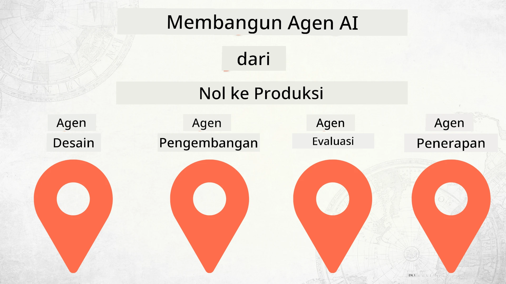

# Membangun Agen AI dari Nol hingga Produksi



### 🌐 Dukungan Multi-Bahasa

#### Didukung melalui GitHub Action (Otomatis & Selalu Terbaru)

<!-- CO-OP TRANSLATOR LANGUAGES TABLE START -->
[Arab](../ar/README.md) | [Bengali](../bn/README.md) | [Bulgaria](../bg/README.md) | [Burma (Myanmar)](../my/README.md) | [Cina (Sederhana)](../zh-CN/README.md) | [Cina (Tradisional, Hong Kong)](../zh-HK/README.md) | [Cina (Tradisional, Macau)](../zh-MO/README.md) | [Cina (Tradisional, Taiwan)](../zh-TW/README.md) | [Kroasia](../hr/README.md) | [Ceko](../cs/README.md) | [Denmark](../da/README.md) | [Belanda](../nl/README.md) | [Estonia](../et/README.md) | [Finlandia](../fi/README.md) | [Prancis](../fr/README.md) | [Jerman](../de/README.md) | [Yunani](../el/README.md) | [Ibrani](../he/README.md) | [Hindi](../hi/README.md) | [Hungaria](../hu/README.md) | [Indonesia](./README.md) | [Italia](../it/README.md) | [Jepang](../ja/README.md) | [Kannada](../kn/README.md) | [Kamboja](../km/README.md) | [Korea](../ko/README.md) | [Lituania](../lt/README.md) | [Melayu](../ms/README.md) | [Malayalam](../ml/README.md) | [Marathi](../mr/README.md) | [Nepali](../ne/README.md) | [Pidgin Nigeria](../pcm/README.md) | [Norwegia](../no/README.md) | [Persia (Farsi)](../fa/README.md) | [Polandia](../pl/README.md) | [Portugis (Brasil)](../pt-BR/README.md) | [Portugis (Portugal)](../pt-PT/README.md) | [Punjabi (Gurmukhi)](../pa/README.md) | [Rumania](../ro/README.md) | [Rusia](../ru/README.md) | [Serbia (Sirilik)](../sr/README.md) | [Slovakia](../sk/README.md) | [Slovenia](../sl/README.md) | [Spanyol](../es/README.md) | [Swahili](../sw/README.md) | [Swedia](../sv/README.md) | [Tagalog (Filipina)](../tl/README.md) | [Tamil](../ta/README.md) | [Telugu](../te/README.md) | [Thailand](../th/README.md) | [Turki](../tr/README.md) | [Ukraina](../uk/README.md) | [Urdu](../ur/README.md) | [Vietnam](../vi/README.md)

> **Lebih Suka Clone Secara Lokal?**
>
> Repositori ini mencakup lebih dari 50 terjemahan bahasa yang secara signifikan meningkatkan ukuran unduhan. Untuk clone tanpa terjemahan, gunakan sparse checkout:
>
> **Bash / macOS / Linux:**
> ```bash
> git clone --filter=blob:none --sparse https://github.com/microsoft/Building-AI-Agents-From-Zero-To-Production.git
> cd Building-AI-Agents-From-Zero-To-Production
> git sparse-checkout set --no-cone '/*' '!translations' '!translated_images'
> ```
>
> **CMD (Windows):**
> ```cmd
> git clone --filter=blob:none --sparse https://github.com/microsoft/Building-AI-Agents-From-Zero-To-Production.git
> cd Building-AI-Agents-From-Zero-To-Production
> git sparse-checkout set --no-cone "/*" "!translations" "!translated_images"
> ```
>
> Ini memberi Anda semua yang Anda butuhkan untuk menyelesaikan kursus dengan unduhan yang jauh lebih cepat.
<!-- CO-OP TRANSLATOR LANGUAGES TABLE END -->

## Sebuah kursus yang mengajarkan dasar-dasar Siklus Hidup Pengembangan Agen AI

[](https://github.com/microsoft/Building-AI-Agents-From-Zero-To-Production/blob/master/LICENSE?WT.mc_id=academic-105485-koreyst)
[](https://GitHub.com/microsoft/Building-AI-Agents-From-Zero-To-Production/graphs/contributors/?WT.mc_id=academic-105485-koreyst)
[](https://GitHub.com/microsoft/Building-AI-Agents-From-Zero-To-Production/issues/?WT.mc_id=academic-105485-koreyst)
[](https://GitHub.com/microsoft/Building-AI-Agents-From-Zero-To-Production/pulls/?WT.mc_id=academic-105485-koreyst)
[](http://makeapullrequest.com?WT.mc_id=academic-105485-koreyst)

[](https://discord.gg/Kuaw3ktsu6)

## 🌱 Memulai

Kursus ini memiliki pelajaran yang mencakup dasar-dasar membangun dan menerapkan Agen AI.

Setiap pelajaran dibangun berdasarkan pelajaran sebelumnya, jadi kami sarankan memulai dari awal dan melanjutkannya hingga selesai.

Jika Anda ingin mengeksplorasi lebih banyak topik tentang Agen AI, Anda dapat melihat [Kursus AI Agents Untuk Pemula](https://aka.ms/ai-agents-beginners).

### Bertemu Pembelajar Lain, Dapatkan Jawaban untuk Pertanyaan Anda

Jika Anda mengalami kesulitan atau memiliki pertanyaan tentang membangun Agen AI, bergabunglah dengan Saluran Discord khusus kami di [Microsoft Foundry Discord](https://discord.gg/Kuaw3ktsu6).

### Apa yang Anda Butuhkan


Setiap Pelajaran memiliki contoh kode sendiri yang dapat Anda jalankan secara lokal. Anda dapat [fork repo ini](https://github.com/microsoft/Building-AI-Agents-From-Zero-To-Production/fork) untuk membuat salinan Anda sendiri.

Kursus ini saat ini menggunakan hal-hal berikut:

- [Microsoft Agent Framework (MAF)](https://aka.ms/ai-agents-beginners/agent-framework)
- [Microsoft Foundry](https://azure.microsoft.com/products/ai-foundry) — sebuah proyek dengan model **GPT-5 series** yang sudah diterapkan (misalnya `gpt-5.1`). Jangan gunakan model GPT-4o / GPT-4.1 yang sudah tidak digunakan lagi.
- [Azure OpenAI Service](https://azure.microsoft.com/products/ai-foundry/models/openai)
- [Azure CLI](https://learn.microsoft.com/cli/azure/authenticate-azure-cli?view=azure-cli-latest) — masuk dengan `az login` sebelum menjalankan contoh apa pun
- **Python 3.12 atau lebih baru**

Pastikan Anda memiliki akses ke layanan ini sebelum memulai.

> **💰 Biaya & pembersihan.** Pelajaran praktek ini membuat sumber daya Azure nyata — sebuah proyek Microsoft Foundry,
> sebuah penerapan model, sebuah toko vektor, dan (dalam Pelajaran 4–6) agen dan kotak alat yang dihosting.
> Ini dapat menimbulkan biaya selama masih ada. Saat Anda selesai dengan pelajaran — atau kursus — hapuslah
> sumber daya yang sudah tidak Anda butuhkan. Pendekatan paling sederhana adalah meletakkan semuanya dalam grup sumber daya khusus
> dan hapus seluruh grup saat Anda selesai:
>
> ```bash
> az group delete --name <your-resource-group> --yes --no-wait
> ```
>
> Anda juga dapat menghapus agen individu, toko vektor, dan kotak alat dari portal Foundry.

> **Catatan mengenai model.** Kursus ini menyediakan semua model melalui **Microsoft Foundry**. Kursus ini **tidak**
> menggunakan *GitHub Models*, yang akan dihentikan pada **30 Juli 2026** — Microsoft Foundry adalah
> jalur migrasi resmi. Jika Anda memiliki kode lama yang memanggil GitHub Models, arahkan ke penerapan
> model Foundry sebagai gantinya.

Pilihan lebih lanjut terkait hosting model dan layanan akan segera hadir.

## 🗃️ Pelajaran

| **Pelajaran**         | **Deskripsi**                                                                                  |
|--------------------|--------------------------------------------------------------------------------------------------|
| [Desain Agen](./lesson-1-agent-design/README.md)       | Pengenalan Kasus Penggunaan Agen "Developer Onboarding" dan cara merancang agen yang efektif  |
| [Pengembangan Agen](./lesson-2-agent-development/README.md)  | Menggunakan Microsoft Agent Framework (MAF), membangun serangkaian agen khusus untuk membantu developer baru onboarding.       |
| [Evaluasi Agen](./lesson-3-agent-evals/README.md)  | Menggunakan Microsoft Foundry, mengetahui seberapa baik kinerja AI Agents kami dan cara meningkatkannya. |
| [Penerapan Agen](./lesson-4-agentdeployment/README.md)   | Menggunakan agen yang dihosting Microsoft Foundry dan OpenAI ChatKit, lihat cara menerapkan AI Agent ke produksi.       |
| [Agen Hosted Produksi](./lesson-5-hosted-agents-production/README.md)   | Membawa agen yang dihosting ke produksi perusahaan: Agen Hosted vs Capability Hosts, bawa penyimpanan, memori, dan tata kelola sendiri.       |
| [Kotak Alat Microsoft](./lesson-6-toolbox/README.md)   | Definisikan alat sekali dan kelola secara terpusat: bangun kotak alat, gunakan dari agen melalui satu endpoint MCP, dan versi alat dengan aman.       |
| [Multi-Agen & A2A](./lesson-7-multi-agent-a2a/README.md)   | Menyusun agen sebagai layanan jaringan: buka agen melalui protokol Agent-to-Agent (A2A) terbuka dan gunakan agen jarak jauh sebagai rekan.       |


## 🎒 Kursus Lainnya

Tim kami juga membuat kursus lainnya! Lihat:

<!-- CO-OP TRANSLATOR OTHER COURSES START -->
### LangChain
[](https://aka.ms/langchain4j-for-beginners)
[](https://aka.ms/langchainjs-for-beginners?WT.mc_id=m365-94501-dwahlin)
[](https://github.com/microsoft/langchain-for-beginners?WT.mc_id=m365-94501-dwahlin)
---

### Azure / Edge / MCP / Agen
[](https://github.com/microsoft/AZD-for-beginners?WT.mc_id=academic-105485-koreyst)
[](https://github.com/microsoft/edgeai-for-beginners?WT.mc_id=academic-105485-koreyst)
[](https://github.com/microsoft/mcp-for-beginners?WT.mc_id=academic-105485-koreyst)
[](https://github.com/microsoft/ai-agents-for-beginners?WT.mc_id=academic-105485-koreyst)

---
 
### Seri AI Generatif

[](https://github.com/microsoft/generative-ai-for-beginners?WT.mc_id=academic-105485-koreyst)
[-9333EA?style=for-the-badge&labelColor=E5E7EB&color=9333EA)](https://github.com/microsoft/Generative-AI-for-beginners-dotnet?WT.mc_id=academic-105485-koreyst)
[-C084FC?style=for-the-badge&labelColor=E5E7EB&color=C084FC)](https://github.com/microsoft/generative-ai-for-beginners-java?WT.mc_id=academic-105485-koreyst)
[-E879F9?style=for-the-badge&labelColor=E5E7EB&color=E879F9)](https://github.com/microsoft/generative-ai-with-javascript?WT.mc_id=academic-105485-koreyst)

---
 
### Pembelajaran Inti
[](https://aka.ms/ml-beginners?WT.mc_id=academic-105485-koreyst)
[](https://aka.ms/datascience-beginners?WT.mc_id=academic-105485-koreyst)
[](https://aka.ms/ai-beginners?WT.mc_id=academic-105485-koreyst)
[](https://github.com/microsoft/Security-101?WT.mc_id=academic-96948-sayoung)
[](https://aka.ms/webdev-beginners?WT.mc_id=academic-105485-koreyst)
[](https://aka.ms/iot-beginners?WT.mc_id=academic-105485-koreyst)
[](https://github.com/microsoft/xr-development-for-beginners?WT.mc_id=academic-105485-koreyst)

---
 
### Seri Copilot
[](https://aka.ms/GitHubCopilotAI?WT.mc_id=academic-105485-koreyst)
[](https://github.com/microsoft/mastering-github-copilot-for-dotnet-csharp-developers?WT.mc_id=academic-105485-koreyst)
[](https://github.com/microsoft/CopilotAdventures?WT.mc_id=academic-105485-koreyst)
<!-- CO-OP TRANSLATOR OTHER COURSES END -->

## Berkontribusi

Proyek ini menyambut kontribusi dan saran. Sebagian besar kontribusi mengharuskan Anda untuk menyetujui
Perjanjian Lisensi Kontributor (CLA) yang menyatakan bahwa Anda memiliki hak, dan memang benar memberi kami
hak untuk menggunakan kontribusi Anda. Untuk detail, kunjungi <https://cla.opensource.microsoft.com>.

Ketika Anda mengajukan pull request, bot CLA akan secara otomatis menentukan apakah Anda perlu memberikan
CLA dan menghias PR dengan tepat (misalnya, pemeriksaan status, komentar). Cukup ikuti instruksi
yang diberikan oleh bot. Anda hanya perlu melakukan ini sekali di semua repositori yang menggunakan CLA kami.

Proyek ini telah mengadopsi [Microsoft Open Source Code of Conduct](https://opensource.microsoft.com/codeofconduct/).
Untuk informasi lebih lanjut lihat [FAQ Code of Conduct](https://opensource.microsoft.com/codeofconduct/faq/) atau
hubungi [opencode@microsoft.com](mailto:opencode@microsoft.com) untuk pertanyaan atau komentar tambahan.

## Merek Dagang

Proyek ini mungkin berisi merek dagang atau logo untuk proyek, produk, atau layanan. Penggunaan resmi merek dagang atau logo Microsoft
tunduk pada dan harus mengikuti
[Microsoft's Trademark & Brand Guidelines](https://www.microsoft.com/legal/intellectualproperty/trademarks/usage/general).
Penggunaan merek dagang atau logo Microsoft dalam versi modifikasi dari proyek ini tidak boleh menyebabkan kebingungan atau menyiratkan dukungan Microsoft.
Penggunaan merek dagang atau logo pihak ketiga tunduk pada kebijakan pihak ketiga tersebut.

## Mendapatkan Bantuan

Jika Anda mengalami kesulitan atau memiliki pertanyaan tentang membangun aplikasi AI, bergabunglah dengan:

[](https://discord.gg/Kuaw3ktsu6)

Jika Anda memiliki masukan produk atau kesalahan saat membangun kunjungi:

[](https://aka.ms/foundry/forum)

---

<!-- CO-OP TRANSLATOR DISCLAIMER START -->
**Penafian**:
Dokumen ini telah diterjemahkan menggunakan layanan terjemahan AI [Co-op Translator](https://github.com/Azure/co-op-translator). Meskipun kami berupaya untuk mencapai akurasi, harap diketahui bahwa terjemahan otomatis mungkin mengandung kesalahan atau ketidakakuratan. Dokumen asli dalam bahasa aslinya harus dianggap sebagai sumber yang sah. Untuk informasi penting, disarankan menggunakan terjemahan profesional oleh manusia. Kami tidak bertanggung jawab atas kesalahpahaman atau penafsiran yang keliru yang timbul dari penggunaan terjemahan ini.
<!-- CO-OP TRANSLATOR DISCLAIMER END -->