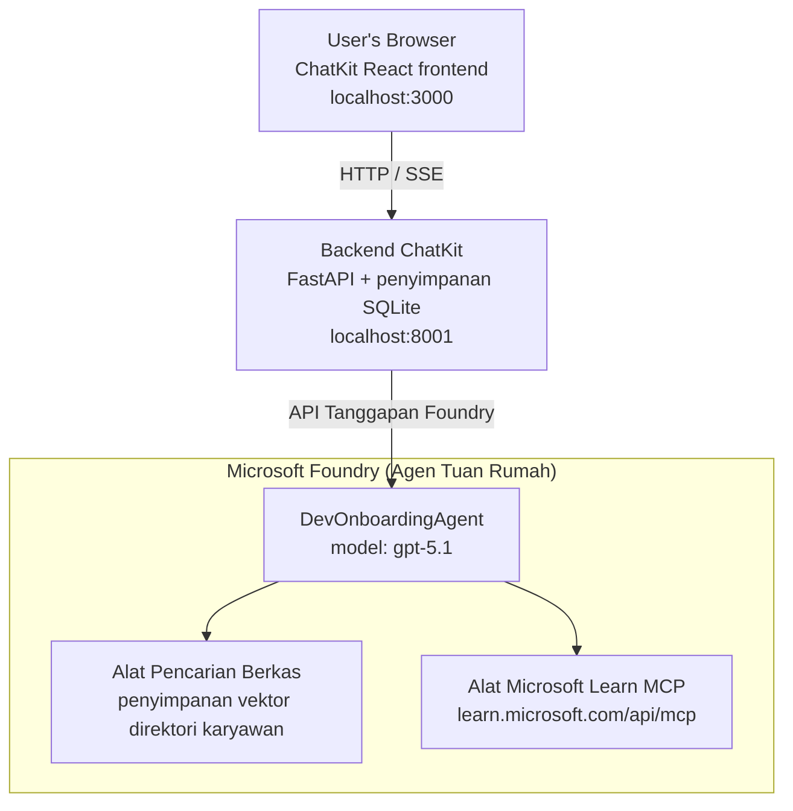

# Pelajaran 4: Penyebaran Agen dengan Agen Microsoft Foundry yang Di-host + ChatKit

Pelajaran ini menunjukkan cara menyebarkan agen yang menggunakan alat ke Microsoft Foundry sebagai agen yang di-host dan membuat frontend berbasis ChatKit untuk berinteraksi dengannya.

## Arsitektur

Agen yang di-host adalah **satu `DevOnboardingAgent`** (berjalan pada `gpt-5.1`) yang menjawab pertanyaan onboarding pengembang menggunakan dua alat yang di-host: alat **Pencarian Berkas** di atas toko vektor direktori karyawan, dan alat **Microsoft Learn MCP**. Frontend React ChatKit berbicara dengan backend FastAPI, yang memanggil agen melalui **Responses API** Foundry.



## Prasyarat

1. **Proyek Microsoft Foundry** di wilayah North Central US
2. **Azure CLI** sudah terautentikasi (`az login`)
3. **Azure Developer CLI** (`azd`) terpasang
4. **Python 3.12+** dan **Node.js 18+**
5. **Vector Store** dibuat dengan data karyawan

## Mulai Cepat

### 1. Atur Variabel Lingkungan

```bash
cd lesson-4-agentdeployment
cp .env.example .env
# Edit .env dengan detail proyek Microsoft Foundry Anda
```

### 2. Sebarkan Agen yang Di-host

**Opsi A: Menggunakan Azure Developer CLI (Direkomendasikan)**

```bash
cd hosted-agent
azd auth login
azd agent deploy
```

**Opsi B: Menggunakan Docker + Azure Container Registry**

```bash
cd hosted-agent

# Bangun kontainer
docker build -t developer-onboarding-agent:latest .

# Tag untuk ACR
docker tag developer-onboarding-agent:latest <your-acr>.azurecr.io/developer-onboarding-agent:latest

# Dorong ke ACR
az acr login --name <your-acr>
docker push <your-acr>.azurecr.io/developer-onboarding-agent:latest

# Deploy melalui portal Microsoft Foundry atau SDK
```

### 3. Mulai Backend ChatKit

```bash
cd chatkit-server
python -m venv .venv
source .venv/bin/activate  # Di Windows: .venv\Scripts\activate
pip install -r requirements.txt
python app.py
```

Server akan mulai di `http://localhost:8001`

### 4. Mulai Frontend ChatKit

```bash
cd chatkit-server/frontend
npm install
npm run dev
```

Frontend akan mulai di `http://localhost:3000`

### 5. Uji Aplikasi

Buka `http://localhost:3000` di browser Anda dan coba kueri berikut:

**Pencarian Karyawan:**
- "Saya baru di sini! Apakah ada yang pernah bekerja di Microsoft?"
- "Siapa yang memiliki pengalaman dengan Azure Functions?"

**Sumber Pembelajaran:**
- "Buat jalur pembelajaran untuk Kubernetes"
- "Sertifikasi apa yang harus saya kejar untuk arsitektur cloud?"

**Bantuan Pengkodean:**
- "Bantu saya menulis kode Python untuk menghubungkan ke CosmosDB"
- "Tunjukkan cara membuat Azure Function"

**Kueri Multi-Agen:**
- "Saya mulai sebagai insinyur cloud. Dengan siapa saya harus terhubung dan apa yang harus saya pelajari?"

## Struktur Proyek

```
lesson-4-agentdeployment/
├── .env.example                 # Environment variables template
├── implementation-plan.md       # Detailed implementation guide
├── README.md                    # This file
├── hosted-agent/               # Microsoft Foundry hosted agent
│   ├── main.py                 # Multi-agent workflow implementation
│   ├── requirements.txt        # Python dependencies
│   ├── Dockerfile              # Container definition
│   └── agent.yaml              # Agent deployment configuration
└── chatkit-server/             # ChatKit server application
    ├── app.py                  # FastAPI backend
    ├── store.py                # SQLite persistence layer
    ├── requirements.txt        # Python dependencies
    └── frontend/               # React frontend
        ├── package.json
        ├── vite.config.ts
        ├── tsconfig.json
        ├── index.html
        └── src/
            ├── main.tsx
            ├── App.tsx
            ├── App.css
            └── index.css
```

## Agen dan Alatnya

Agen yang di-host adalah **satu agen** (`DevOnboardingAgent`, didefinisikan di `hosted-agent/main.py`) yang menangani tiga domain onboarding. Alih-alih mengatur sub-agen terpisah, ia mengekspos setiap kapabilitas sebagai alat (atau mengandalkan model langsung):

| Kapabilitas | Cara ditangani | Alat |
|-----------|------------------|------|
| **Pencarian & koneksi karyawan** | Pencarian Berkas yang di-host di Foundry atas toko vektor direktori karyawan | `client.get_file_search_tool(vector_store_ids=[...])` |
| **Pembelajaran & pelatihan** | Server Microsoft Learn MCP (alat MCP yang di-host) | `client.get_mcp_tool(url="https://learn.microsoft.com/api/mcp")` |
| **Bantuan pengkodean** | Ditangani langsung oleh model `gpt-5.1` — tanpa alat eksternal | — |

Agen dibuat dengan `client.as_agent(name="DevOnboardingAgent", instructions=..., tools=[file_search_tool, learn_mcp_tool])` dan dijalankan dengan `from_agent_framework(agent).run()`.

> **Catatan desain.** Draft awal pelajaran ini menggunakan workflow multi-agen `HandoffBuilder` (Triage → spesialis). Agen yang dikirim adalah agen tunggal yang menggunakan alat, yang lebih sederhana untuk disebarkan dan dipahami untuk Q&A gaya onboarding. Untuk contoh orkestrasi multi-agen dan penyerahan tugas, lihat Pelajaran 2 dan Pelajaran 3.

## Uji Cepat Agen yang Di-host (Gerbang CI)

Menyebarkan agen yang di-host dengan "berhasil" hanya membuktikan bahwa kontrol plane menerima
definisi — itu **tidak** membuktikan agen benar-benar menjawab. Ketergantungan yang hilang,
rute model yang buruk, atau koneksi yang kedaluwarsa dapat menyebabkan agen hijau tapi diam.

Pelajaran ini menyediakan **uji cepat** ringan yang bertindak sebagai gerbang pasca-sebar yang cepat dan murah.
Ini menggunakan [AI Smoke Test](https://github.com/marketplace/actions/ai-smoke-test)
GitHub Action untuk POST prompt ke endpoint **Responses** agen
Foundry (`POST {project_endpoint}/agents/{agent_name}/endpoint/protocols/openai/responses`)
dan melakukan asersi pada teks yang dikembalikan. Ini mendeteksi penyebaran yang rusak, regresi autentikasi,
pergeseran prompt sistem, dan kerusakan threading dalam hitungan detik.

> Uji cepat **bukan** pengganti evaluasi lengkap di
> [Pelajaran 3](../lesson-3-agent-evals/README.md) — mereka pelengkap. Uji cepat
> menjawab *"apakah agen dapat dijangkau, merespons, dan mengikuti ekspektasi prompt dasar?"*;
> evaluasi menjawab *"seberapa baik responsnya?"*. Jalankan gerbang murah ini setiap kali penyebaran.

### Apa yang diuji

Daftar uji berada di [`hosted-agent/tests/smoke-tests.json`](../../../lesson-4-agentdeployment/hosted-agent/tests/smoke-tests.json)
dan menguji tiga domain agen plus kepatuhan prompt dan threading multi-turn:

| Uji | Apa yang diverifikasi |
|------|------------------|
| `reachability` | Agen merespons dengan teks yang tidak kosong dan sesuai ruang lingkup |
| `employee-search` | Domain pencarian berkas mengembalikan `200` sehat (balasan tergantung data) |
| `learning-path` | Domain pembelajaran mengulang topik dan menghasilkan jawaban gaya jalur |
| `coding-assistance` | Domain pengkodean mengembalikan jawaban Python berbentuk kode |
| `prompt-adherence-offtopic` | Permintaan di luar topik dialihkan, tidak dijawab secara detail |
| `threading-turn-1/2` | Status percakapan dipertahankan antar giliran melalui `previous_response_id` |

### Jalankan di CI

Workflow di [`.github/workflows/smoke-test-hosted-agent.yml`](../../../.github/workflows/smoke-test-hosted-agent.yml)
memiliki dua pekerjaan:

- **`static`** — gerbang cepat tanpa Azure yang berjalan pada setiap pull request dan push:
  ini mengompilasi semua sumber Python (`py_compile`) dan memeriksa tautan Markdown. Tidak butuh rahasia,
  jadi bisa berjalan pada fork PR.
- **`smoke`** — uji cepat terkoneksi Azure seperti di bawah. Dijalankan sesuai permintaan
  (Actions → **Agent CI (static + smoke)** → Run workflow) dan dapat disusul setelah
  workflow penyebaran Anda.

Atur **variabel** dan **rahasia** repositori berikut untuk pekerjaan smoke:

| Jenis | Nama | Nilai |
|------|------|-------|
| Variabel | `FOUNDRY_PROJECT_ENDPOINT` | `https://<account>.services.ai.azure.com/api/projects/<project>` |
| Variabel | `HOSTED_AGENT_NAME` | Nama agen yang disebarkan (mis. `dev-onboarding` — harus sesuai deployment Anda) |
| Rahasia | `AZURE_CLIENT_ID` / `AZURE_TENANT_ID` / `AZURE_SUBSCRIPTION_ID` | Identitas federasi OIDC untuk `azure/login` |

Identitas runner memerlukan peran **`Azure AI User`** pada ruang lingkup proyek Foundry agar dapat
memanggil endpoint data-plane Responses (dan percakapan). Berikan dengan:

```bash
az role assignment create \
  --assignee <object-id-or-appId-of-runner-identity> \
  --role "Azure AI User" \
  --scope "/subscriptions/<sub>/resourceGroups/<rg>/providers/Microsoft.CognitiveServices/accounts/<account>/projects/<project>"
```

### Jalankan secara lokal

Anda dapat menjalankan katalog yang sama sebelum mendorong kode. Peroleh token data-plane yang memiliki cakupan
`https://ai.azure.com/` dan arahkan runner ke penyebaran Anda:

```bash
# Audiens HARUS https://ai.azure.com/ (token cognitiveservices.azure.com ditolak)
export FOUNDRY_TOKEN=$(az account get-access-token --resource https://ai.azure.com/ --query accessToken -o tsv)

git clone https://github.com/JFolberth/ai-smoketest && cd ai-smoketest
python runner.py \
  --project-endpoint "https://<account>.services.ai.azure.com/api/projects/<project>" \
  --agent-name dev-onboarding \
  --tests-file ../lesson-4-agentdeployment/hosted-agent/tests/smoke-tests.json
```

Kode keluar: `0` semua berhasil, `1` assert gagal, `2` kesalahan runner (katalog/token buruk).

## Pemecahan Masalah

### Agen tidak merespons
- Pastikan agen yang di-host sudah disebarkan dan berjalan di Microsoft Foundry
- Periksa `HOSTED_AGENT_NAME` dan `HOSTED_AGENT_VERSION` sesuai dengan penyebaran Anda

### Kesalahan vector store
- Pastikan `VECTOR_STORE_ID` disetel dengan benar
- Verifikasi vector store berisi data karyawan

### Kesalahan autentikasi
- Jalankan `az login` untuk menyegarkan kredensial
- Pastikan Anda memiliki akses ke proyek Microsoft Foundry

## Sumber Daya

- [Dokumentasi Microsoft Foundry Hosted Agents](https://learn.microsoft.com/en-us/azure/ai-foundry/agents/concepts/hosted-agents)
- [Microsoft Agent Framework](https://github.com/microsoft/agent-framework)
- [Contoh Integrasi ChatKit](https://github.com/microsoft/agent-framework/tree/main/python/samples/demos/chatkit-integration)
- [Azure Developer CLI](https://learn.microsoft.com/en-us/azure/developer/azure-developer-cli/overview)
- [Action GitHub AI Smoke Test](https://github.com/marketplace/actions/ai-smoke-test)
- [Uji Cepat Agen Microsoft Foundry dengan GitHub Actions (blog)](https://techcommunity.microsoft.com/blog/azuredevcommunityblog/smoke-test-microsoft-foundry-agents-with-github-actions/4531912)

---

## Langkah Selanjutnya

Agen Anda berjalan di infrastruktur yang dikelola Microsoft. Untuk membawa ke produksi perusahaan —
mengontrol di mana data tinggal (kedaulatan data, jaringan privat, menggunakan sendiri Azure
Cosmos DB / Storage / AI Search) dan mengatur alatnya — lanjutkan ke
**[Pelajaran 5: Agen Hosted Produksi](../lesson-5-hosted-agents-production/README.md)**, yang
menjelaskan perbedaan penting antara **Hosted Agents** dan **Capability Hosts**.

---

<!-- CO-OP TRANSLATOR DISCLAIMER START -->
**Penafian**:
Dokumen ini telah diterjemahkan menggunakan layanan terjemahan AI [Co-op Translator](https://github.com/Azure/co-op-translator). Meskipun kami berupaya untuk mencapai akurasi, harap diketahui bahwa terjemahan otomatis mungkin mengandung kesalahan atau ketidakakuratan. Dokumen asli dalam bahasa aslinya harus dianggap sebagai sumber yang sah. Untuk informasi penting, disarankan menggunakan terjemahan profesional oleh manusia. Kami tidak bertanggung jawab atas kesalahpahaman atau penafsiran yang keliru yang timbul dari penggunaan terjemahan ini.
<!-- CO-OP TRANSLATOR DISCLAIMER END -->