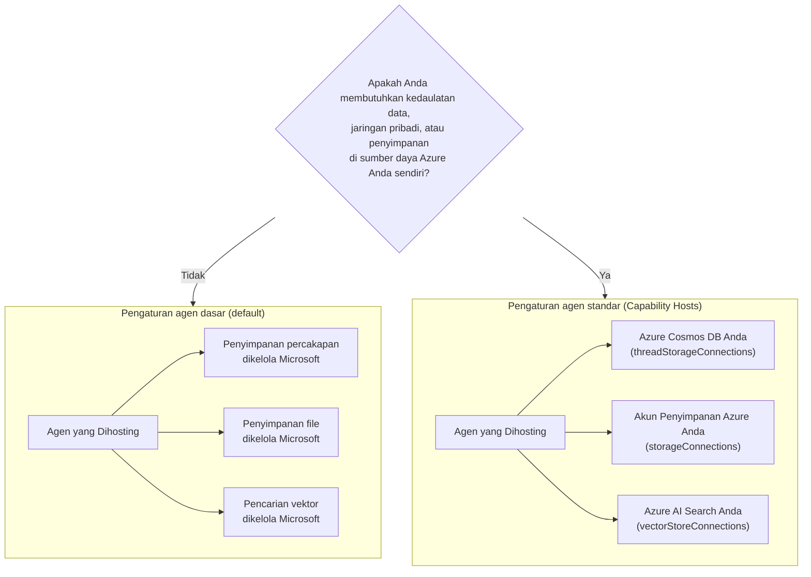

# Pelajaran 5: Agen Hosted Produksi — Penyimpanan, Memori & Tata Kelola

Dalam [Pelajaran 4](../lesson-4-agentdeployment/README.md) Anda menerapkan Agen Onboarding Pengembang
sebagai **Agen Hosted Microsoft Foundry** dan meletakkan frontend ChatKit di depannya. Pelajaran itu
menjawab *"bagaimana saya mengirim agen?"*. Pelajaran ini menjawab pertanyaan yang muncul berikutnya
di sebuah perusahaan: **Di mana data agen saya disimpan? Siapa yang mengendalikannya? Bagaimana saya memenuhi kepatuhan,
jaringan, dan persyaratan tata kelola?**

Ide paling penting dalam pelajaran ini adalah perbedaan antara **Hosted Agent** dan
**Capability Host** — dua konsep yang mudah membuat bingung tetapi menyelesaikan masalah yang
benar-benar berbeda.

## Tujuan Pembelajaran

Pada akhir pelajaran ini Anda akan dapat:

- Menjelaskan apa yang diberikan oleh **Hosted Agent** (eksekusi yang dikelola Microsoft) dan apa yang **tidak**.
- Menjelaskan apa itu **Capability Host** dan kapan Anda membutuhkannya secara tepat.
- Memilih antara **pengaturan agen dasar** (penyimpanan yang dikelola Microsoft) dan **pengaturan agen standar**
  (menggunakan sumber daya Azure milik sendiri).
- Memahami bagaimana **riwayat percakapan, unggahan file, dan penyimpanan vektor** dipertahankan, dan bagaimana
  mengarahkannya ke Azure Cosmos DB, Azure Storage, dan Azure AI Search Anda sendiri.
- Menerapkan kontrol tata kelola: kedaulatan data, jaringan pribadi, dan **persetujuan alat Hosted MCP**.

---

## Prasyarat

1. Telah menyelesaikan [Pelajaran 4](../lesson-4-agentdeployment/README.md) — Anda memiliki agen yang dihosting.
2. Sebuah proyek **Microsoft Foundry**, dan akun Azure dengan izin untuk membuat sumber daya
   (Cosmos DB, Storage, Azure AI Search) dan menetapkan peran dalam langganan/grup sumber daya.
3. **Azure CLI** sudah terautentikasi: `az login` (dan `az account set --subscription <id>` jika Anda memiliki
   lebih dari satu langganan).
4. **Azure Developer CLI** (`azd`) terpasang — digunakan untuk alur penyediaan pengaturan standar.
5. **Python 3.12+** dengan dependensi kursus terpasang (`pip install -r ../requirements.txt`).
6. Penyebaran model terkini yang tidak dihentikan (misalnya `gpt-5.1`). Hindari GPT-4o / GPT-4.1 yang telah dihentikan.

> Pelajaran ini sebagian besar bersifat konseptual dan berfokus pada kontrol bidang. Anda dapat membacanya dari awal sampai akhir tanpa
> harus menyediakan apa pun, lalu menggunakan latihan praktek saat Anda siap mengonfigurasi
> pengaturan standar.

---

## 1. Agen Hosted: apa yang dikelola Foundry untuk Anda

**Hosted Agent** adalah agen yang *lingkungan eksekusinya* sepenuhnya dikelola oleh Microsoft
Foundry Agent Service. Ketika Anda menerapkan agen yang dihosting (seperti yang Anda lakukan di Pelajaran 4), Foundry menyediakan:

- **Compute** — runtime yang menjalankan kode dan alat agen Anda.
- **Skalabilitas** — replika naik dan turun mengikuti beban (lihat `agent.yaml` `scale` di Pelajaran 4).
- **Identitas** — identitas yang dikelola untuk agen, sehingga autentikasi ke Azure tanpa rahasia.
- **Observabilitas** — pelacakan dan telemetri (lihat bagian observabilitas Pelajaran 3).
- **Manajemen sesi** — utas/percakapan, sehingga obrolan multi-putaran "mengingat" putaran sebelumnya.

> **Poin kunci:** Anda **tidak** perlu mengonfigurasi Capability Host hanya untuk *menjalankan* Agen Hosted.
> Agen yang dihosting bekerja langsung pada infrastruktur yang dikelola Microsoft.

---

## 2. Agen Hosted vs Capability Hosts

**Hosted Agents dan Capability Hosts menyelesaikan masalah yang berbeda.**

**Hosted Agents** menyediakan lingkungan eksekusi yang dikelola Microsoft, termasuk compute, skalabilitas,
identitas, observabilitas dan manajemen sesi. Anda **tidak** perlu Capability Hosts hanya untuk menjalankan
Agen Hosted.

**Capability Hosts** hanya diperlukan ketika Anda ingin Agent Service menggunakan **sumber daya milik pelanggan**
alih-alih penyimpanan yang dikelola Microsoft. Jika Anda puas dengan penyimpanan,
pencarian vektor, dan pemeliharaan percakapan yang dikelola Microsoft secara default, **tidak diperlukan
konfigurasi Capability Host.**

Jika organisasi Anda membutuhkan **kedaulatan data, jaringan pribadi, kontrol kepatuhan atau
penyimpanan dalam Azure Cosmos DB, Azure Storage Account dan sumber daya Azure AI Search milik Anda sendiri**, maka
Anda mengonfigurasi Capability Hosts untuk menghubungkan Agent Service ke sumber daya tersebut.

Dalam satu kalimat:

> **Hosted Agent** adalah tentang *di mana agen Anda dijalankan*. **Capability Host** adalah tentang *di mana
> data agen Anda disimpan*.

| Perhatian | Hosted Agent | Capability Host |
|---------|--------------|-----------------|
| Compute / skalabilitas / identitas | ✅ Disediakan | — |
| Observabilitas / pelacakan | ✅ Disediakan | — |
| Manajemen percakapan & sesi utas | ✅ Disediakan | Mengarahkan *tempat data disimpan* |
| Tempat riwayat percakapan disimpan | Dikelola Microsoft secara default | Azure Cosmos DB Anda |
| Tempat file yang diunggah disimpan | Dikelola Microsoft secara default | Azure Storage Account Anda |
| Tempat embeddings vektor disimpan | Dikelola Microsoft secara default | Azure AI Search Anda |
| Diperlukan untuk menjalankan agen? | ✅ Ya (ia *adalah* host agen) | ❌ Tidak — opsional |
| Diperlukan untuk kedaulatan data / BYO penyimpanan? | ❌ Tidak cukup sendiri | ✅ Ya |

---

## 3. Pengaturan agen Dasar vs Standar

Foundry menggambarkan dua konfigurasi data tersebut sebagai pengaturan agen **dasar** dan **standar**.



### Kapan tetap menggunakan pengaturan dasar (tanpa Capability Host)

- Pengembangan, prototipe, dan pengujian.
- Alat internal di mana penyimpanan yang dikelola Microsoft memenuhi kebijakan penanganan data Anda.
- Anda ingin jalur tercepat ke agen yang berfungsi dengan infrastruktur paling sedikit.

### Kapan Anda memerlukan pengaturan standar (Capability Hosts)

- **Kedaulatan data** — semua data agen harus tetap berada dalam langganan/wilayah Azure Anda.
- **Kontrol keamanan** — Anda harus menggunakan akun penyimpanan, basis data, dan layanan pencarian milik Anda.
- **Kepatuhan** — Anda memiliki persyaratan regulasi atau organisasi tentang tempat data disimpan.
- **Jaringan pribadi** — lalu lintas harus tetap di dalam jaringan virtual Anda (BYO jaringan virtual).

> **Rekomendasi dari Microsoft:** gunakan akun/proyek Foundry *terpisah* untuk pengaturan standar vs
> pengaturan dasar. Hindari mencampur jenis pengaturan dalam akun Foundry yang sama.

---

## 4. Cara kerja Capability Hosts

**Capability Host** adalah sub-sumber daya yang Anda konfigurasikan pada **dua cakupan**: akun
Foundry dan proyek Foundry. Ini memberi tahu Agent Service di mana menyimpan dan memproses data agen:
riwayat percakapan, unggahan file, dan penyimpanan vektor.

Dua aturan yang paling penting:

1. **Akun sebelum proyek.** Anda tidak dapat membuat capability host di tingkat proyek kecuali capability host di tingkat
   akun sudah ada.

2. **Tidak ada pewarisan konfigurasi.** Host kapabilitas **proyek** adalah apa yang sebenarnya dibaca oleh Layanan Agen untuk memutuskan sumber daya penyimpanan/percakapan/vektor mana yang akan digunakan. Koneksi tingkat akun *tidak* secara otomatis digunakan oleh sebuah proyek — host kapabilitas proyek harus secara eksplisit mereferensikannya.
   sebenarnya dibaca untuk memutuskan sumber daya penyimpanan/percakapan/vektor mana yang akan digunakan. Koneksi tingkat akun
   *tidak* secara otomatis digunakan oleh sebuah proyek — host kapabilitas proyek harus
   secara eksplisit mereferensikannya.

### Koneksi yang dibutuhkan oleh pengaturan standar

Host kapabilitas mereferensikan **koneksi** (dibuat dalam akun/proyek Foundry Anda) yang mengarah ke
sumber daya Azure Anda:

| Properti host kapabilitas | Menyimpan | Sumber daya Azure Anda |
|--------------------------|--------|---------------------|
| `threadStorageConnections` | Definisi Agen + riwayat percakapan | Azure Cosmos DB |
| `storageConnections` | Unggahan file / penyimpanan blob | Azure Storage Account |
| `vectorStoreConnections` | Vektor embedding untuk pengambilan/pencarian | Azure AI Search |
| `aiServicesConnections` *(opsional)* | Penyebaran model Anda sendiri | Azure OpenAI |

Setiap koneksi harus memiliki `authType`, `category`, `target` (URL **endpoint layanan**, bukan
ID sumber daya), dan `metadata.ResourceId` (ID sumber daya Azure lengkap) terisi, atau Layanan Agen
tidak dapat menyelesaikan sumber daya saat runtime.

### Mengonfigurasi host kapabilitas (plane kontrol)

Host kapabilitas saat ini dikelola melalui **Azure Resource Manager REST API** (belum ada
SDK untuk manajemen host kapabilitas). Pertama buat host kapabilitas **akun**:

```http
PUT https://management.azure.com/subscriptions/{subscriptionId}/resourceGroups/{rg}/providers/Microsoft.CognitiveServices/accounts/{account}/capabilityHosts/{name}?api-version=2025-06-01

{
  "properties": { "capabilityHostKind": "Agents" }
}
```

Kemudian buat host kapabilitas **proyek** yang mereferensikan koneksi Anda:

```http
PUT https://management.azure.com/subscriptions/{subscriptionId}/resourceGroups/{rg}/providers/Microsoft.CognitiveServices/accounts/{account}/projects/{project}/capabilityHosts/{name}?api-version=2025-06-01

{
  "properties": {
    "capabilityHostKind": "Agents",
    "threadStorageConnections": ["my-cosmosdb-connection"],
    "vectorStoreConnections":  ["my-ai-search-connection"],
    "storageConnections":      ["my-storage-connection"]
  }
}
```

> **Kendala yang harus diingat:**
> - **Satu host kapabilitas per cakupan.** Host kedua pada cakupan yang sama akan mengembalikan `409 Conflict`.
> - **Tidak ada pembaruan.** Untuk mengubah konfigurasi Anda harus **menghapus dan membuat ulang** host kapabilitas.
> - **Penghapusan bersifat destruktif.** Menghapus host kapabilitas menghilangkan akses agen ke file,
>   percakapan, dan toko vektor yang dirujuknya.

### Verifikasi bahwa itu berfungsi

Setelah konfigurasi, jalankan percakapan uji dan pastikan bahwa:

- Percakapan muncul di **Azure Cosmos DB Anda**.
- File yang diunggah muncul di **akun Penyimpanan Azure Anda**.
- Data vektor muncul di **indeks Azure AI Search Anda**.

---

## 5. Manajemen memori & konteks

"Manajemen sesi" (fitur Hosted Agent) dan "tempat penyimpanan thread" (perhatian Host Kapabilitas)
digabungkan untuk memberikan **memori** kepada agen Anda:

- Sebuah **thread** (percakapan) memegang urutan giliran sebuah obrolan. API Responses menghubungkan panggilan
  bersama melalui `previous_response_id` (Anda melihat ini di pengujian asap Pelajaran 4).
- Pada **pengaturan dasar**, status thread/percakapan disimpan dalam penyimpanan yang dikelola Microsoft.
- Pada **pengaturan standar**, status yang sama disimpan dalam **Azure Cosmos DB Anda** melalui
  `threadStorageConnections` — memberikan Anda riwayat percakapan yang tahan lama, dapat diquery, dan berdaulat.

Ini adalah perbedaan antara agen yang "mengingat dalam sebuah sesi" dan sistem perusahaan di mana setiap percakapan disimpan dalam batas kepatuhan Anda sendiri.


---

## 6. Daftar periksa tata kelola & keamanan

Gunakan daftar periksa ini saat mempromosikan agen yang dihosting dari prototipe ke produksi:

- [ ] **Tentukan pengaturan dasar vs standar** menggunakan pertanyaan di §3 — dokumentasikan keputusannya.
- [ ] **Kedaulatan data:** jika diperlukan, konfigurasikan Host Kapabilitas sehingga riwayat percakapan
      (Cosmos DB), file (Penyimpanan), dan vektor (AI Search) tetap di langganan/wilayah Anda.

- [ ] **Jaringan pribadi:** untuk pengaturan standar, batasi lalu lintas dengan Bring Your Own Virtual
      Network sehingga data tidak dapat keluar dari jaringan Anda (membantu mencegah eksfiltrasi data).
- [ ] **RBAC:** berikan hak akses paling sedikit. Membuat capability host memerlukan **Contributor** pada
      akun Foundry; memberikan akses ke sumber daya Azure Anda memerlukan **User Access Administrator**
      atau **Owner**.
- [ ] **Tata kelola alat MCP yang dihosting:** tinjau setiap server MCP yang dapat dipanggil agen Anda dan atur
      **mode persetujuan** (lihat §7). Jangan pernah mengekspos alat eksternal yang belum ditinjau ke agen produksi.
- [ ] **Observabilitas:** pastikan pelacakan/telemetri aktif (Pelajaran 3) sehingga Anda dapat mengaudit panggilan alat.
- [ ] **Biaya:** sumber daya BYO (Cosmos DB, AI Search, Storage) ditagihkan ke *langganan* Anda —
      ukur dan pantau mereka. Pengaturan dasar menggabungkan penyimpanan ke layanan terkelola.

---

## 7. Alat MCP yang dihosting & alur kerja persetujuan

Agent Onboarding Pengembang di Pelajaran 4 sudah menggunakan **alat MCP yang dihosting** — 
[server MCP Microsoft Learn](https://learn.microsoft.com/api/mcp) — ditambahkan dengan:

```python
client.get_mcp_tool(
    name="Microsoft Learn MCP",
    url="https://learn.microsoft.com/api/mcp",
    approval_mode="never_require",
)
```

**Model Context Protocol (MCP)** adalah standar terbuka yang memungkinkan agen menemukan dan memanggil
alat eksternal melalui antarmuka yang seragam. **Alat MCP yang dihosting** memungkinkan Foundry memanggil server MCP atas
nama agen. Dua tuas tata kelola yang penting dalam produksi:

- **`approval_mode`** — mengontrol apakah manusia/pemanggil harus menyetujui setiap pemanggilan alat.
  - `never_require` nyaman untuk server yang dipercaya dan hanya baca seperti Microsoft Learn.
  - Untuk server yang dapat **menulis** atau mengakses sistem sensitif, minta persetujuan agar panggilan
    ditinjau sebelum dijalankan. Ini adalah **alur kerja persetujuan** Anda.
- **Daftar izinkan server** — hanya hubungkan server MCP yang telah Anda tinjau dan percayai. Perlakukan URL MCP
  seperti ketergantungan produksi lainnya.

> **Coba:** ubah `approval_mode` agen Pelajaran 4 menjadi memerlukan persetujuan, terapkan ulang, dan
> amati bagaimana panggilan alat sekarang berhenti untuk konfirmasi sebelum dijalankan.

---

## Latihan langsung

1. **Klasifikasikan sebuah skenario.** Untuk masing-masing, tentukan pengaturan *dasar* atau *standar* dan beri alasan:
   (a) demo hackathon, (b) asisten onboarding perawatan kesehatan yang menangani PII, (c) bot FAQ internal,
   (d) agen bank yang harus menyimpan semua data di wilayah yang sama.
2. **Peta penyimpanan.** Untuk agen Pelajaran 4, daftarkan properti capability-host yang menyimpan
   (a) riwayat obrolan, (b) file pegawai yang diunggah, (c) embedding vektor.
3. **Rancang alur kerja persetujuan.** Tambahkan alat MCP hipotetis "buat tiket Jira" ke agen.
   Mode persetujuan `approval_mode` apa yang akan Anda gunakan dan mengapa?
4. **Perimbangan biaya.** Tulis dua atau tiga kalimat tentang implikasi biaya saat pindah dari pengaturan dasar
   ke standar untuk agen dengan trafik tinggi.

---

## Sumber daya

- [Capability hosts — Microsoft Foundry](https://learn.microsoft.com/azure/foundry/agents/concepts/capability-hosts)
- [Pengaturan agen standar (kesiapan perusahaan bawaan)](https://learn.microsoft.com/azure/foundry/agents/concepts/standard-agent-setup)

- [Gunakan sumber daya Anda sendiri](https://learn.microsoft.com/azure/foundry/agents/how-to/use-your-own-resources)

- [Siapkan lingkungan agen Anda (dasar vs standar)](https://learn.microsoft.com/azure/foundry/agents/environment-setup)
- [Siapkan jaringan privat untuk Foundry Agent Service](https://learn.microsoft.com/azure/foundry/agents/how-to/virtual-networks)
- [Tambahkan koneksi ke proyek Anda](https://learn.microsoft.com/azure/foundry/how-to/connections-add)
- [Server Microsoft Learn MCP](https://learn.microsoft.com/training/support/mcp)
- [Model Context Protocol](https://modelcontextprotocol.io/)

---

**Sebelumnya:** [Pelajaran 4 — Penyebaran Agen](../lesson-4-agentdeployment/README.md) &nbsp;·&nbsp; **Berikutnya:** [Pelajaran 6 — Kotak Peralatan Microsoft](../lesson-6-toolbox/README.md)

---

<!-- CO-OP TRANSLATOR DISCLAIMER START -->
**Penafian**:
Dokumen ini telah diterjemahkan menggunakan layanan terjemahan AI [Co-op Translator](https://github.com/Azure/co-op-translator). Meskipun kami berupaya untuk mencapai akurasi, harap diketahui bahwa terjemahan otomatis mungkin mengandung kesalahan atau ketidakakuratan. Dokumen asli dalam bahasa aslinya harus dianggap sebagai sumber yang sah. Untuk informasi penting, disarankan menggunakan terjemahan profesional oleh manusia. Kami tidak bertanggung jawab atas kesalahpahaman atau penafsiran yang keliru yang timbul dari penggunaan terjemahan ini.
<!-- CO-OP TRANSLATOR DISCLAIMER END -->