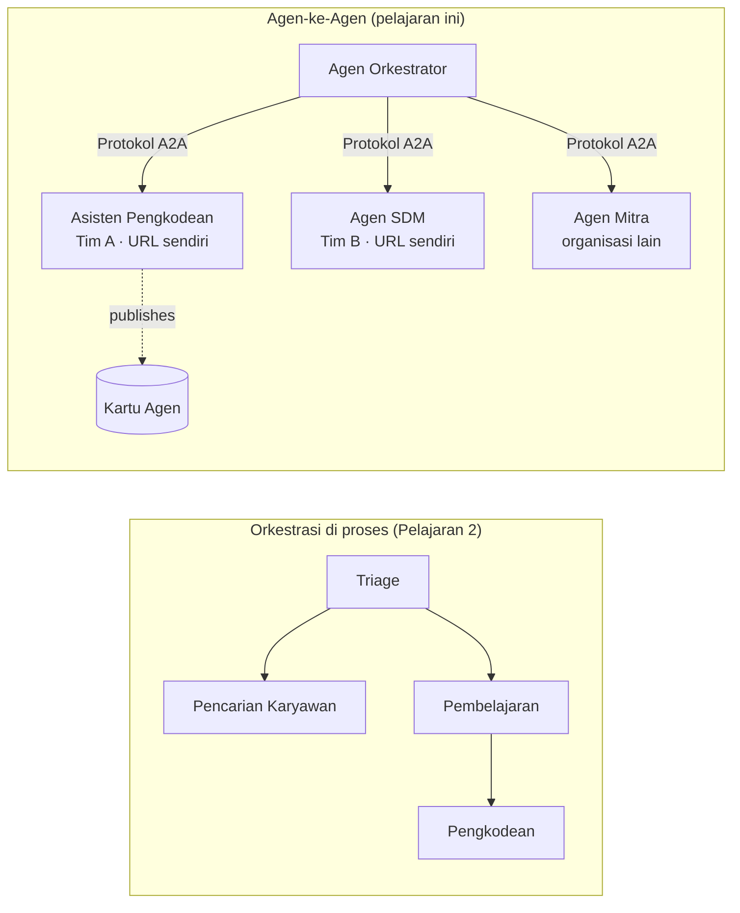

# Pelajaran 7: Orkestrasi Multi-Agen & Agen-ke-Agen (A2A)

Pada [Pelajaran 6](../lesson-6-toolbox/README.md) Anda dapat membangun alat yang diatur dan agen yang dihosting.
Namun sistem nyata jarang menggunakan **satu** agen. Saat Anda berkembang, Anda menyusun **banyak** agen — beberapa Anda
miliki, beberapa dimiliki oleh tim lain, beberapa berjalan di organisasi lain sepenuhnya. Pelajaran ini tentang
bagaimana agen bekerja **bersama**.

Anda sudah bertemu satu bentuk desain multi-agen dalam
[`agent-orchestration.py` Pelajaran 2](../lesson-2-agent-development/README.md): pola **handoff**
di mana agen triase mengarahkan ke spesialis **dalam satu proses**. Pelajaran ini naik satu tingkat — ke
**Agent-to-Agent (A2A)**, protokol terbuka untuk agen yang berjalan sebagai
**layanan jaringan independen** dan saling memanggil melintasi batas proses, tim, dan organisasi.

## Tujuan Pembelajaran

Pada akhir pelajaran ini Anda akan dapat:

- Menjelaskan perbedaan antara **orkestrasi di dalam proses** (handoff/alur kerja) dan
  komunikasi **Agent-to-Agent (A2A)**, dan memilih yang tepat.
- Menjelaskan blok bangunan A2A: **Agent Card**, **keterampilan**, **tugas**, dan **penemuan**.
- **Mengekspos** agen Microsoft Agent Framework sebagai layanan A2A dengan `A2AExecutor`.
- **Mengonsumsi** agen jarak jauh sebagai rekan jaringan dengan `A2AAgent`.
- Menerapkan perhatian perusahaan pada A2A: **keamanan, identitas, tata kelola, keteramatan, dan biaya**.

---

## Prasyarat

1. Menyelesaikan [Pelajaran 2](../lesson-2-agent-development/README.md) (pengembangan & orkestrasi agen).
2. Proyek **Microsoft Foundry** dengan penyebaran model terkini (misalnya `gpt-5.1`, dan
   `gpt-5-codex` untuk sampel pemrograman). Hindari GPT-4o / GPT-4.1 yang sudah pensiun.
3. **Azure CLI** terautentikasi: `az login`.
4. **Python 3.12+** dengan dependensi kursus terpasang (`pip install -r ../requirements.txt`).
   Pelajaran 7 menambah paket pratinjau `agent-framework-a2a`, `a2a-sdk`, dan `uvicorn`.
5. `FOUNDRY_PROJECT_ENDPOINT` dan `FOUNDRY_MODEL` disetel dalam `.env` Anda (lihat README kursus).

---

## 1. Dua cara agen bekerja bersama

Tidak ada satu pola "multi-agen" tunggal. Pilih yang sesuai dengan **batasan** Anda:

| Pola | Tempat agen berjalan | Cara mereka terhubung | Gunakan ketika |
|---------|------------------|------------------|----------|
| **Handoff / Workflow** (Pelajaran 2) | Satu proses, satu basis kode | Grafik dalam memori (`HandoffBuilder`, `WorkflowBuilder`) | Anda memiliki semua agen dan menyebarkannya bersama. |
| **Agent-to-Agent (A2A)** (pelajaran ini) | Layanan terpisah, siklus hidup terpisah | Protokol **A2A** terbuka melalui HTTP, ditemukan lewat **Agent Cards** | Agen dimiliki oleh tim/organisasi berbeda, berskala secara independen, atau ditulis dalam kerangka kerja berbeda. |

Handoff adalah tentang **pengalihan di dalam aplikasi**. A2A adalah tentang **menyusun agen sebagai
layanan independen** — setara agen dari perpindahan panggilan fungsi ke layanan mikro.



> **Mereka menyusun.** Sebuah orkestrator yang Anda buat dengan `HandoffBuilder` bisa memiliki **agen A2A remote**
> sebagai peserta — pengalihan dalam proses ke layanan yang berjalan di mana saja.

---

## 2. Blok bangunan A2A

A2A adalah **protokol terbuka** (bukan khusus Microsoft), jadi agen A2A bisa dikonsumsi oleh Microsoft
Agent Framework, LangGraph, kode kustom, atau tumpukan perusahaan lain. Empat konsep penting:

- **Agent Card** — dokumen JSON kecil, dipublikasikan di
  `/.well-known/agent-card.json`, yang mengiklankan **nama, deskripsi, URL, versi,
  keterampilan, dan kemampuan** agen. Ini cara klien **menemukan** apa yang bisa dilakukan agen jarak jauh.
- **Keterampilan** — hal-hal yang dinyatakan dapat dilakukan agen (`id`, `nama`, `deskripsi`, `tag`,
  `contoh`). Klien (dan model) menggunakan ini untuk memutuskan apakah akan memanggilnya.
- **Tugas** — panggilan ke agen A2A adalah **tugas** dengan siklus hidup (dikirim → bekerja →
  selesai/gagal). Server melacak tugas dalam **penyimpanan tugas**; pembaruan streaming didukung.
- **Penemuan** — klien yang hanya diberikan URL mengambil Agent Card dan tahu cara memanggil agen.

---

## 3. Mengekspos agen sebagai layanan A2A — `a2a_server.py`

Sisi **Build/serve** membungkus agen Microsoft Agent Framework apapun dengan `A2AExecutor` dan memasangnya
pada aplikasi HTTP A2A. Lihat [`a2a_server.py`](../../../lesson-7-multi-agent-a2a/a2a_server.py). Sambungan utama:

```python
from agent_framework.a2a import A2AExecutor
from a2a.server.apps import A2AStarletteApplication
from a2a.server.request_handlers import DefaultRequestHandler
from a2a.server.tasks import InMemoryTaskStore
from a2a.types import AgentCapabilities, AgentCard, AgentSkill

agent = client.as_agent(name="coding-assistant", instructions="...")

agent_card = AgentCard(
    name="Coding Assistant",
    description="Generates runnable code samples...",
    url="http://localhost:9000/",
    version="1.0.0",
    capabilities=AgentCapabilities(streaming=True),
    default_input_modes=["text"],
    default_output_modes=["text"],
    skills=[AgentSkill(id="generate-code", name="Generate code",
                       description="Write a runnable code snippet.", tags=["code"])],
)

request_handler = DefaultRequestHandler(
    agent_executor=A2AExecutor(agent),
    task_store=InMemoryTaskStore(),
)
app = A2AStarletteApplication(agent_card=agent_card, http_handler=request_handler).build()
# disajikan dengan uvicorn di port 9000
```

Perhatikan kode agen **tidak diubah** — `A2AExecutor` menyesuaikan agen Anda yang sudah ada ke protokol.
Agent Card adalah apa yang membuatnya **dapat ditemukan** untuk klien A2A manapun.

---

## 4. Mengonsumsi agen jarak jauh — `a2a_client.py`

Sisi **Consume** menghubungkan ke agen jarak jauh **dengan URL**, mengambil Agent Card-nya, dan memanggilnya
persis seperti agen lokal. Lihat [`a2a_client.py`](../../../lesson-7-multi-agent-a2a/a2a_client.py):

```python
from agent_framework.a2a import A2AAgent

remote_agent = A2AAgent(name="remote-coding-assistant", url="http://localhost:9000")
result = await remote_agent.run("Write a Python function that reverses a string.")
print(result.text)
```

Itulah inti dari A2A: dari sisi pemanggil agen jarak jauh berperilaku seperti agen `agent_framework`
lainnya, jadi Anda bisa memasukkannya ke dalam alur kerja atau menyerahkannya — meskipun berjalan
dalam proses berbeda, di mesin berbeda, dimiliki oleh tim berbeda.

### Jalankan secara end to end

```bash
# Terminal 1 — mulai layanan A2A
python a2a_server.py

# Terminal 2 — panggil itu
python a2a_client.py "Write a Python function that reverses a string."
```

Anda akan melihat respons asisten pemrograman tiba melalui protokol A2A. Buka
`http://localhost:9000/.well-known/agent-card.json` di browser untuk melihat Agent Card yang dipublikasikan.

---

## 5. Perhatian perusahaan

Mengubah agen menjadi layanan jaringan menghadirkan perhatian yang sama seperti sistem terdistribusi apapun —
ditambah beberapa perhatian khusus AI:

- **Identitas & autentikasi.** Jangan pernah mengekspos agen A2A tanpa autentikasi. Agent Card membawa
  `security` / `security_schemes`, dan `A2AAgent` menerima `auth_interceptor` sehingga pemanggil memasang
  kredensial (token pembawa OAuth, kunci API). Gunakan Entra ID / identitas terkelola untuk
  autentikasi layanan-ke-layanan di produksi; letakkan layanan di balik gateway.
- **Tata kelola.** Gabungkan A2A dengan [Toolbox Pelajaran 6](../lesson-6-toolbox/README.md): agen jarak jauh
  dapat dipublikasikan sebagai **alat A2A** di dalam toolbox yang diatur sehingga RBAC, injeksi kredensial,
  dan kebijakan pengaman diterapkan secara sentral.
- **Keteramatan.** Permintaan sekarang melintasi batas proses, jadi propagasikan penelusuran antar panggilan.
  Aktifkan [Foundry Observability / OpenTelemetry](../lesson-3-agent-evals/README.md) pada **keduanya**,
  orkestrator dan setiap agen jarak jauh agar Anda mendapat penelusuran ujung-ke-ujung.
- **Versi.** Agent Card memiliki `version`. Perlakukan itu seperti API: perubahan tambahan aman;
  memutus kontrak keterampilan membutuhkan versi baru dan jendela migrasi bagi konsumen.
- **Keandalan.** Agen jarak jauh gagal secara independen. Tetapkan batas waktu (`A2AAgent(timeout=...)`), tangani
  kegagalan parsial, dan jangan biarkan satu rekan lambat memblokir seluruh orkestrasi.
- **Biaya.** Setiap panggilan agen jarak jauh adalah pemanggilan model sendiri. Penyebaran memperbanyak pengeluaran token —
  anggarkan untuk itu, dan utamakan pengalihan ke **satu** agen terbaik daripada penyiaran ke banyak.

---

## Latihan langsung

1. **Tambahkan layanan kedua.** Salin `a2a_server.py` untuk mengekspos agen **employee-search** di port
   9001 dengan Agent Card dan keterampilan sendiri. Jalankan keduanya, dan biarkan klien memanggil masing-masing.
2. **Orkestrasikan rekan jarak jauh.** Bangun `HandoffBuilder` kecil (atau router biasa) yang pesertanya
   meliputi dua `A2AAgent` yang menunjuk pada dua layanan Anda. Arahkan kueri ke yang tepat.
3. **Amankan.** Tambahkan `auth_interceptor` ke klien dan persyaratkan token pembawa di server.
   Apa yang rusak jika token hilang? Di mana Anda menyimpan token di produksi?
4. **Handoff vs A2A.** Tulis dua paragraf pendek: kapan Anda menyimpan handoff di dalam proses Pelajaran 2,
   dan kapan kompleksitas tambahan A2A dibenarkan? Berikan contoh konkret masing-masing.

---

## Sumber daya

- [Agent-to-Agent (A2A) — Microsoft Agent Framework](https://learn.microsoft.com/agent-framework/user-guide/agent-orchestration/a2a)
- [Orkestrasi multi-agen — Microsoft Agent Framework](https://learn.microsoft.com/agent-framework/user-guide/agent-orchestration/)
- [Spesifikasi protokol A2A](https://a2a-protocol.org/)
- [A2A Python SDK (`a2a-sdk`)](https://github.com/a2aproject/a2a-python)
- [Foundry Agent Service — pola multi-agen](https://learn.microsoft.com/azure/ai-foundry/agents/concepts/connected-agents)

---

**Sebelumnya:** [Pelajaran 6 — Kotak Perkakas Microsoft](../lesson-6-toolbox/README.md)

---

<!-- CO-OP TRANSLATOR DISCLAIMER START -->
**Penafian**:
Dokumen ini telah diterjemahkan menggunakan layanan terjemahan AI [Co-op Translator](https://github.com/Azure/co-op-translator). Meskipun kami berupaya untuk mencapai akurasi, harap diketahui bahwa terjemahan otomatis mungkin mengandung kesalahan atau ketidakakuratan. Dokumen asli dalam bahasa aslinya harus dianggap sebagai sumber yang sah. Untuk informasi penting, disarankan menggunakan terjemahan profesional oleh manusia. Kami tidak bertanggung jawab atas kesalahpahaman atau penafsiran yang keliru yang timbul dari penggunaan terjemahan ini.
<!-- CO-OP TRANSLATOR DISCLAIMER END -->