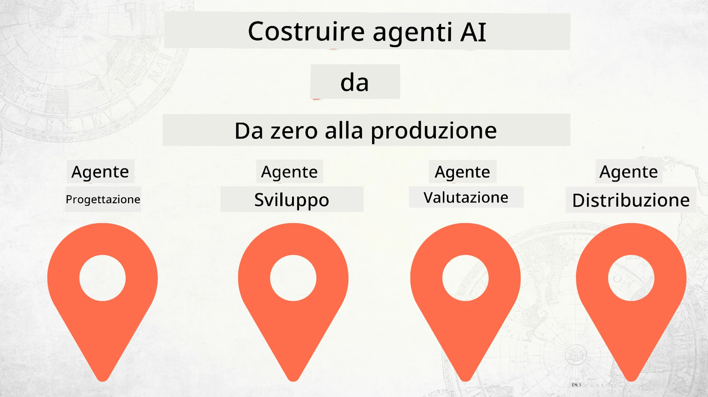

# Costruire agenti AI da zero alla produzione



### 🌐 Supporto multilingue

#### Supportato tramite GitHub Action (automatizzato e sempre aggiornato)

<!-- CO-OP TRANSLATOR LANGUAGES TABLE START -->
[Arabic](../ar/README.md) | [Bengali](../bn/README.md) | [Bulgarian](../bg/README.md) | [Burmese (Myanmar)](../my/README.md) | [Chinese (Simplified)](../zh-CN/README.md) | [Chinese (Traditional, Hong Kong)](../zh-HK/README.md) | [Chinese (Traditional, Macau)](../zh-MO/README.md) | [Chinese (Traditional, Taiwan)](../zh-TW/README.md) | [Croatian](../hr/README.md) | [Czech](../cs/README.md) | [Danish](../da/README.md) | [Dutch](../nl/README.md) | [Estonian](../et/README.md) | [Finnish](../fi/README.md) | [French](../fr/README.md) | [German](../de/README.md) | [Greek](../el/README.md) | [Hebrew](../he/README.md) | [Hindi](../hi/README.md) | [Hungarian](../hu/README.md) | [Indonesian](../id/README.md) | [Italian](./README.md) | [Japanese](../ja/README.md) | [Kannada](../kn/README.md) | [Korean](../ko/README.md) | [Lithuanian](../lt/README.md) | [Malay](../ms/README.md) | [Malayalam](../ml/README.md) | [Marathi](../mr/README.md) | [Nepali](../ne/README.md) | [Nigerian Pidgin](../pcm/README.md) | [Norwegian](../no/README.md) | [Persian (Farsi)](../fa/README.md) | [Polish](../pl/README.md) | [Portuguese (Brazil)](../pt-BR/README.md) | [Portuguese (Portugal)](../pt-PT/README.md) | [Punjabi (Gurmukhi)](../pa/README.md) | [Romanian](../ro/README.md) | [Russian](../ru/README.md) | [Serbian (Cyrillic)](../sr/README.md) | [Slovak](../sk/README.md) | [Slovenian](../sl/README.md) | [Spanish](../es/README.md) | [Swahili](../sw/README.md) | [Swedish](../sv/README.md) | [Tagalog (Filipino)](../tl/README.md) | [Tamil](../ta/README.md) | [Telugu](../te/README.md) | [Thai](../th/README.md) | [Turkish](../tr/README.md) | [Ukrainian](../uk/README.md) | [Urdu](../ur/README.md) | [Vietnamese](../vi/README.md)

> **Preferisci clonare localmente?**

> Questo repository include più di 50 traduzioni linguistiche che aumentano significativamente la dimensione del download. Per clonare senza traduzioni, utilizza sparse checkout:
> ```bash
> git clone --filter=blob:none --sparse https://github.com/microsoft/Building-AI-Agents-From-Zero-To-Production.git
> cd Building-AI-Agents-From-Zero-To-Production
> git sparse-checkout set --no-cone '/*' '!translations' '!translated_images'
> ```
> Questo ti fornisce tutto il necessario per completare il corso con un download molto più veloce.
<!-- CO-OP TRANSLATOR LANGUAGES TABLE END -->

## Un corso che ti insegna le basi del ciclo di vita dello sviluppo di agenti AI

[](https://github.com/microsoft/Building-AI-Agents-From-Zero-To-Production/blob/master/LICENSE?WT.mc_id=academic-105485-koreyst)
[](https://GitHub.com/microsoft/Building-AI-Agents-From-Zero-To-Production/graphs/contributors/?WT.mc_id=academic-105485-koreyst)
[](https://GitHub.com/microsoft/Building-AI-Agents-From-Zero-To-Production/issues/?WT.mc_id=academic-105485-koreyst)
[](https://GitHub.com/microsoft/Building-AI-Agents-From-Zero-To-Production/pulls/?WT.mc_id=academic-105485-koreyst)
[](http://makeapullrequest.com?WT.mc_id=academic-105485-koreyst)

[](https://discord.gg/Kuaw3ktsu6)

## 🌱 Per iniziare

Questo corso include lezioni che coprono le basi della costruzione e del deployment di agenti AI.

Ogni lezione si basa sulla precedente, quindi consigliamo di iniziare dall’inizio e procedere fino alla fine.

Se vuoi approfondire altri argomenti sugli agenti AI, puoi consultare il [Corso per principianti sugli agenti AI](https://aka.ms/ai-agents-beginners).

### Incontra altri studenti, ricevi risposte alle tue domande

Se rimani bloccato o hai domande sulla costruzione di agenti AI, unisciti al nostro canale Discord dedicato nel [Microsoft Foundry Discord](https://discord.gg/Kuaw3ktsu6).

### Cosa ti serve

Ogni lezione ha un proprio esempio di codice che puoi eseguire localmente. Puoi [forkare questo repository](https://github.com/microsoft/Building-AI-Agents-From-Zero-To-Production/fork) per creare la tua copia.

Attualmente questo corso utilizza:

- [Microsoft Agent Framework (MAF)](https://aka.ms/ai-agents-beginners/agent-framework)
- [Microsoft Foundry](https://azure.microsoft.com/products/ai-foundry)
- [Azure OpenAI Service](https://azure.microsoft.com/products/ai-foundry/models/openai)
- [Azure CLI](https://learn.microsoft.com/cli/azure/authenticate-azure-cli?view=azure-cli-latest)

Assicurati di avere accesso a questi servizi prima di iniziare.

Altre opzioni su hosting di modelli e servizi in arrivo a breve.

## 🗃️ Lezioni

| **Lezione**         | **Descrizione**                                                                                    |
|--------------------|--------------------------------------------------------------------------------------------------|
| [Progettazione agente](./lesson-1-agent-design/README.md)       | Introduzione al caso d'uso "Onboarding sviluppatori" e a come progettare agenti efficaci   |
| [Sviluppo agente](./lesson-2-agent-development/README.md)  | Utilizzando il Microsoft Agent Framework (MAF), crea 3 agenti per aiutare i nuovi sviluppatori durante l’onboarding.       |
| [Valutazione agente](./lesson-3-agent-evals/README.md)  | Usando Microsoft Foundry, scopri come si comportano i nostri agenti AI e come migliorarli. |
| [Distribuzione agente](./lesson-4-agent-deployment/README.md)   | Utilizzando gli agenti ospitati e OpenAI Chatkit, scopri come distribuire un agente AI in produzione.       |


## 🎒 Altri corsi

Il nostro team produce altri corsi! Dai un’occhiata a:

<!-- CO-OP TRANSLATOR OTHER COURSES START -->
### LangChain
[](https://aka.ms/langchain4j-for-beginners)
[](https://aka.ms/langchainjs-for-beginners?WT.mc_id=m365-94501-dwahlin)
[](https://github.com/microsoft/langchain-for-beginners?WT.mc_id=m365-94501-dwahlin)
---

### Azure / Edge / MCP / Agenti
[](https://github.com/microsoft/AZD-for-beginners?WT.mc_id=academic-105485-koreyst)
[](https://github.com/microsoft/edgeai-for-beginners?WT.mc_id=academic-105485-koreyst)
[](https://github.com/microsoft/mcp-for-beginners?WT.mc_id=academic-105485-koreyst)
[](https://github.com/microsoft/ai-agents-for-beginners?WT.mc_id=academic-105485-koreyst)

---
 
### Serie AI Generativa
[](https://github.com/microsoft/generative-ai-for-beginners?WT.mc_id=academic-105485-koreyst)
[-9333EA?style=for-the-badge&labelColor=E5E7EB&color=9333EA)](https://github.com/microsoft/Generative-AI-for-beginners-dotnet?WT.mc_id=academic-105485-koreyst)
[-C084FC?style=for-the-badge&labelColor=E5E7EB&color=C084FC)](https://github.com/microsoft/generative-ai-for-beginners-java?WT.mc_id=academic-105485-koreyst)
[-E879F9?style=for-the-badge&labelColor=E5E7EB&color=E879F9)](https://github.com/microsoft/generative-ai-with-javascript?WT.mc_id=academic-105485-koreyst)

---
 
### Apprendimento fondamentale
[](https://aka.ms/ml-beginners?WT.mc_id=academic-105485-koreyst)
[](https://aka.ms/datascience-beginners?WT.mc_id=academic-105485-koreyst)
[](https://aka.ms/ai-beginners?WT.mc_id=academic-105485-koreyst)
[](https://github.com/microsoft/Security-101?WT.mc_id=academic-96948-sayoung)
[](https://aka.ms/webdev-beginners?WT.mc_id=academic-105485-koreyst)
[](https://aka.ms/iot-beginners?WT.mc_id=academic-105485-koreyst)
[](https://github.com/microsoft/xr-development-for-beginners?WT.mc_id=academic-105485-koreyst)

---
 
### Serie Copilot
[](https://aka.ms/GitHubCopilotAI?WT.mc_id=academic-105485-koreyst)
[](https://github.com/microsoft/mastering-github-copilot-for-dotnet-csharp-developers?WT.mc_id=academic-105485-koreyst)
[](https://github.com/microsoft/CopilotAdventures?WT.mc_id=academic-105485-koreyst)
<!-- CO-OP TRANSLATOR OTHER COURSES END -->

## Contribuire

Questo progetto accoglie contributi e suggerimenti. La maggior parte dei contributi richiede che tu accetti un
Accordo di Licenza per i Contributori (CLA) dichiarando di avere il diritto e di concederci effettivamente
i diritti per utilizzare il tuo contributo. Per dettagli, visita <https://cla.opensource.microsoft.com>.

Quando invii una pull request, un bot CLA determinerà automaticamente se devi fornire
un CLA e decorerà adeguatamente la PR (ad es., controllo di stato, commento). Segui semplicemente le istruzioni 
fornite dal bot. Dovrai farlo solo una volta per tutti i repository che utilizzano il nostro CLA.

Questo progetto ha adottato il [Codice di Condotta per il Codice Aperto di Microsoft](https://opensource.microsoft.com/codeofconduct/).
Per maggiori informazioni consulta le [FAQ sul Codice di Condotta](https://opensource.microsoft.com/codeofconduct/faq/) o
contatta [opencode@microsoft.com](mailto:opencode@microsoft.com) per ulteriori domande o commenti.

## Marchi

Questo progetto può contenere marchi o loghi per progetti, prodotti o servizi. L'uso autorizzato dei
marchi o loghi Microsoft è soggetto e deve seguire
[Le Linee Guida sui Marchi e il Brand Microsoft](https://www.microsoft.com/legal/intellectualproperty/trademarks/usage/general).
L'uso di marchi o loghi Microsoft in versioni modificate di questo progetto non deve causare confusione o implicare sponsorizzazione da parte di Microsoft.
Qualsiasi uso di marchi o loghi di terzi è soggetto alle politiche di tali terze parti.

## Ottenere Aiuto

Se rimani bloccato o hai domande sulla creazione di app AI, unisciti a:

[](https://discord.gg/Kuaw3ktsu6)

Se hai feedback sul prodotto o errori durante la creazione visita:

[](https://aka.ms/foundry/forum)

---

<!-- CO-OP TRANSLATOR DISCLAIMER START -->
**Disclaimer**:
Questo documento è stato tradotto utilizzando il servizio di traduzione AI [Co-op Translator](https://github.com/Azure/co-op-translator). Pur impegnandoci per garantire la massima accuratezza, si prega di considerare che le traduzioni automatiche possono contenere errori o inesattezze. Il documento originale nella sua lingua nativa deve essere considerato la fonte autorevole. Per informazioni critiche, si raccomanda una traduzione professionale effettuata da un essere umano. Non ci assumiamo alcuna responsabilità per malintesi o interpretazioni errate derivanti dall’uso di questa traduzione.
<!-- CO-OP TRANSLATOR DISCLAIMER END -->