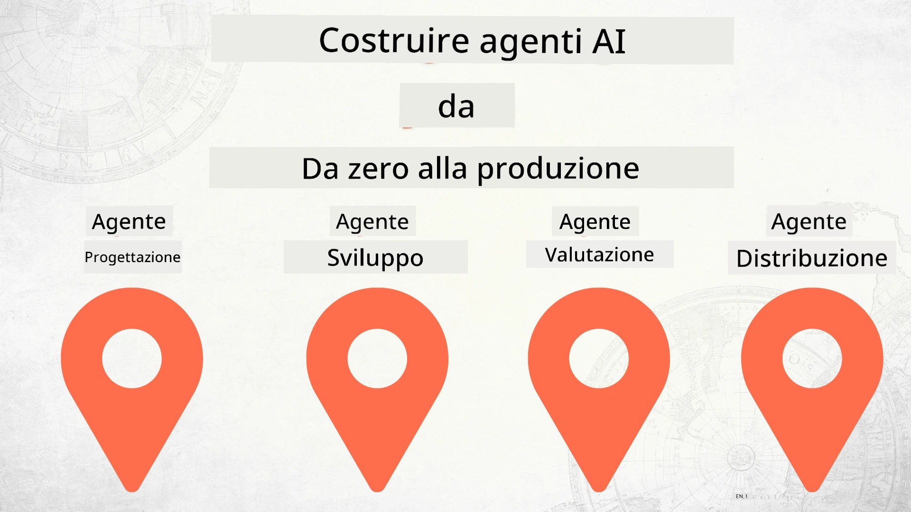

# Costruire Agenti AI da Zero alla Produzione



### 🌐 Supporto Multilingue

#### Supportato tramite GitHub Action (Automatizzato e Sempre Aggiornato)

<!-- CO-OP TRANSLATOR LANGUAGES TABLE START -->
[Arabo](../ar/README.md) | [Bengalese](../bn/README.md) | [Bulgaro](../bg/README.md) | [Birmano (Myanmar)](../my/README.md) | [Cinese (Semplificato)](../zh-CN/README.md) | [Cinese (Tradizionale, Hong Kong)](../zh-HK/README.md) | [Cinese (Tradizionale, Macao)](../zh-MO/README.md) | [Cinese (Tradizionale, Taiwan)](../zh-TW/README.md) | [Croato](../hr/README.md) | [Ceco](../cs/README.md) | [Danese](../da/README.md) | [Olandese](../nl/README.md) | [Estone](../et/README.md) | [Finlandese](../fi/README.md) | [Francese](../fr/README.md) | [Tedesco](../de/README.md) | [Greco](../el/README.md) | [Ebraico](../he/README.md) | [Hindi](../hi/README.md) | [Ungherese](../hu/README.md) | [Indonesiano](../id/README.md) | [Italiano](./README.md) | [Giapponese](../ja/README.md) | [Kannada](../kn/README.md) | [Khmer](../km/README.md) | [Coreano](../ko/README.md) | [Lituano](../lt/README.md) | [Malaese](../ms/README.md) | [Malayalam](../ml/README.md) | [Marathi](../mr/README.md) | [Nepalese](../ne/README.md) | [Pidgin Nigeriano](../pcm/README.md) | [Norvegese](../no/README.md) | [Persiano (Farsi)](../fa/README.md) | [Polacco](../pl/README.md) | [Portoghese (Brasile)](../pt-BR/README.md) | [Portoghese (Portogallo)](../pt-PT/README.md) | [Punjabi (Gurmukhi)](../pa/README.md) | [Rumeno](../ro/README.md) | [Russo](../ru/README.md) | [Serbo (Cirillico)](../sr/README.md) | [Slovacco](../sk/README.md) | [Sloveno](../sl/README.md) | [Spagnolo](../es/README.md) | [Swahili](../sw/README.md) | [Svedese](../sv/README.md) | [Tagalog (Filippino)](../tl/README.md) | [Tamil](../ta/README.md) | [Telugu](../te/README.md) | [Thailandese](../th/README.md) | [Turco](../tr/README.md) | [Ucraino](../uk/README.md) | [Urdu](../ur/README.md) | [Vietnamita](../vi/README.md)

> **Preferisci Clonare Localmente?**
>
> Questo repository include traduzioni in più di 50 lingue che aumentano significativamente la dimensione del download. Per clonare senza traduzioni, usa il checkout sparso:
>
> **Bash / macOS / Linux:**
> ```bash
> git clone --filter=blob:none --sparse https://github.com/microsoft/Building-AI-Agents-From-Zero-To-Production.git
> cd Building-AI-Agents-From-Zero-To-Production
> git sparse-checkout set --no-cone '/*' '!translations' '!translated_images'
> ```
>
> **CMD (Windows):**
> ```cmd
> git clone --filter=blob:none --sparse https://github.com/microsoft/Building-AI-Agents-From-Zero-To-Production.git
> cd Building-AI-Agents-From-Zero-To-Production
> git sparse-checkout set --no-cone "/*" "!translations" "!translated_images"
> ```
>
> Questo ti fornisce tutto il necessario per completare il corso con un download molto più veloce.
<!-- CO-OP TRANSLATOR LANGUAGES TABLE END -->

## Un corso che ti insegna le basi del ciclo di vita dello sviluppo di Agenti AI

[](https://github.com/microsoft/Building-AI-Agents-From-Zero-To-Production/blob/master/LICENSE?WT.mc_id=academic-105485-koreyst)
[](https://GitHub.com/microsoft/Building-AI-Agents-From-Zero-To-Production/graphs/contributors/?WT.mc_id=academic-105485-koreyst)
[](https://GitHub.com/microsoft/Building-AI-Agents-From-Zero-To-Production/issues/?WT.mc_id=academic-105485-koreyst)
[](https://GitHub.com/microsoft/Building-AI-Agents-From-Zero-To-Production/pulls/?WT.mc_id=academic-105485-koreyst)
[](http://makeapullrequest.com?WT.mc_id=academic-105485-koreyst)

[](https://discord.gg/Kuaw3ktsu6)

## 🌱 Iniziare

Questo corso ha lezioni che coprono le basi della costruzione e del deployment di Agenti AI.

Ogni lezione si basa su quella precedente, quindi consigliamo di iniziare dall'inizio e procedere fino alla fine.

Se vuoi esplorare di più sugli argomenti degli Agenti AI, puoi dare un'occhiata al [Corso per Principianti sugli Agenti AI](https://aka.ms/ai-agents-beginners).

### Incontra Altri Studenti, Fatti Rispondere alle Tue Domande

Se rimani bloccato o hai domande sulla costruzione di Agenti AI, unisciti al nostro canale Discord dedicato nel [Microsoft Foundry Discord](https://discord.gg/Kuaw3ktsu6).

### Cosa Ti Serve


Ogni Lezione ha un proprio esempio di codice che puoi eseguire localmente. Puoi [forkare questo repo](https://github.com/microsoft/Building-AI-Agents-From-Zero-To-Production/fork) per creare la tua copia.

Questo corso attualmente utilizza i seguenti:

- [Microsoft Agent Framework (MAF)](https://aka.ms/ai-agents-beginners/agent-framework)
- [Microsoft Foundry](https://azure.microsoft.com/products/ai-foundry) — un progetto con un modello della serie **GPT-5** distribuito (per esempio `gpt-5.1`). Non utilizzare i modelli GPT-4o / GPT-4.1 ritirati.
- [Azure OpenAI Service](https://azure.microsoft.com/products/ai-foundry/models/openai)
- [Azure CLI](https://learn.microsoft.com/cli/azure/authenticate-azure-cli?view=azure-cli-latest) — accedi con `az login` prima di eseguire qualsiasi esempio
- **Python 3.12 o successivo**

Assicurati di avere accesso a questi servizi prima di iniziare.

> **💰 Costi e pulizia.** Le lezioni pratiche creano risorse Azure reali — un progetto Microsoft Foundry,
> una distribuzione del modello, un archivio vettoriale e (nelle Lezioni 4–6) agenti e toolbox ospitati.
> Questi possono generare costi finché esistono. Quando finisci una lezione — o il corso — elimina le
> risorse che non ti servono più. L'approccio più semplice è mettere tutto in un gruppo di risorse dedicato
> ed eliminare l’intero gruppo quando hai finito:
>
> ```bash
> az group delete --name <your-resource-group> --yes --no-wait
> ```
>
> Puoi anche eliminare singoli agenti, archivi vettoriali e toolbox dal portale Foundry.

> **Nota sui modelli.** Questo corso serve tutti i modelli tramite **Microsoft Foundry**. Non utilizza
> *GitHub Models*, che sarà ritirato il **30 luglio 2026** — Microsoft Foundry è il
> percorso ufficiale di migrazione. Se hai codice più vecchio che chiama GitHub Models, puntalo invece
> su una distribuzione di modello Foundry.

Presto saranno disponibili altre opzioni per l’hosting di modelli e servizi.

## 🗃️ Lezioni

| **Lezione**         | **Descrizione**                                                                                  |
|--------------------|--------------------------------------------------------------------------------------------------|
| [Agent Design](./lesson-1-agent-design/README.md)       | Un’introduzione al caso d’uso "Developer Onboarding" per agenti e come progettare agenti efficaci  |
| [Agent Development](./lesson-2-agent-development/README.md)  | Usando Microsoft Agent Framework (MAF), costruisci una serie di agenti specializzati per aiutare i nuovi sviluppatori nell’onboarding.       |
| [Agent Evaluations](./lesson-3-agent-evals/README.md)  | Usando Microsoft Foundry, scopri come stanno andando i nostri Agenti AI e come migliorarli. |
| [Agent Deployment](./lesson-4-agentdeployment/README.md)   | Usando agenti ospitati Microsoft Foundry e OpenAI ChatKit, scopri come distribuire un Agente AI in produzione.       |
| [Production Hosted Agents](./lesson-5-hosted-agents-production/README.md)   | Porta un agente ospitato in produzione aziendale: Agenti Ospitati contro Host di Capacità, storage, memoria e governance portati dall’utente.       |
| [Microsoft Toolbox](./lesson-6-toolbox/README.md)   | Definisci strumenti una volta e governali centralmente: costruisci una toolbox, usala da un agente tramite un singolo endpoint MCP, e gestisci in sicurezza le versioni degli strumenti.       |
| [Multi-Agent & A2A](./lesson-7-multi-agent-a2a/README.md)   | Componi agenti come servizi in rete: esponi un agente tramite il protocollo aperto Agent-to-Agent (A2A) e consuma un agente remoto come pari.       |


## 🎒 Altri Corsi

Il nostro team produce altri corsi! Dai un’occhiata a:

<!-- CO-OP TRANSLATOR OTHER COURSES START -->
### LangChain
[](https://aka.ms/langchain4j-for-beginners)
[](https://aka.ms/langchainjs-for-beginners?WT.mc_id=m365-94501-dwahlin)
[](https://github.com/microsoft/langchain-for-beginners?WT.mc_id=m365-94501-dwahlin)
---

### Azure / Edge / MCP / Agenti
[](https://github.com/microsoft/AZD-for-beginners?WT.mc_id=academic-105485-koreyst)
[](https://github.com/microsoft/edgeai-for-beginners?WT.mc_id=academic-105485-koreyst)
[](https://github.com/microsoft/mcp-for-beginners?WT.mc_id=academic-105485-koreyst)
[](https://github.com/microsoft/ai-agents-for-beginners?WT.mc_id=academic-105485-koreyst)

---
 
### Serie Generative AI

[](https://github.com/microsoft/generative-ai-for-beginners?WT.mc_id=academic-105485-koreyst)
[-9333EA?style=for-the-badge&labelColor=E5E7EB&color=9333EA)](https://github.com/microsoft/Generative-AI-for-beginners-dotnet?WT.mc_id=academic-105485-koreyst)
[-C084FC?style=for-the-badge&labelColor=E5E7EB&color=C084FC)](https://github.com/microsoft/generative-ai-for-beginners-java?WT.mc_id=academic-105485-koreyst)
[-E879F9?style=for-the-badge&labelColor=E5E7EB&color=E879F9)](https://github.com/microsoft/generative-ai-with-javascript?WT.mc_id=academic-105485-koreyst)

---
 
### Apprendimento Core
[](https://aka.ms/ml-beginners?WT.mc_id=academic-105485-koreyst)
[](https://aka.ms/datascience-beginners?WT.mc_id=academic-105485-koreyst)
[](https://aka.ms/ai-beginners?WT.mc_id=academic-105485-koreyst)
[](https://github.com/microsoft/Security-101?WT.mc_id=academic-96948-sayoung)
[](https://aka.ms/webdev-beginners?WT.mc_id=academic-105485-koreyst)
[](https://aka.ms/iot-beginners?WT.mc_id=academic-105485-koreyst)
[](https://github.com/microsoft/xr-development-for-beginners?WT.mc_id=academic-105485-koreyst)

---
 
### Serie Copilot
[](https://aka.ms/GitHubCopilotAI?WT.mc_id=academic-105485-koreyst)
[](https://github.com/microsoft/mastering-github-copilot-for-dotnet-csharp-developers?WT.mc_id=academic-105485-koreyst)
[](https://github.com/microsoft/CopilotAdventures?WT.mc_id=academic-105485-koreyst)
<!-- CO-OP TRANSLATOR OTHER COURSES END -->

## Contribuire

Questo progetto accoglie contributi e suggerimenti. La maggior parte dei contributi richiede che tu accetti un
Accordo di Licenza per i Contributori (CLA) dichiarando di avere il diritto e effettivamente concederci
i diritti di utilizzare il tuo contributo. Per dettagli, visita <https://cla.opensource.microsoft.com>.

Quando invii una pull request, un bot CLA determinerà automaticamente se devi fornire
un CLA e decorerà la PR in modo appropriato (ad esempio, controllo stato, commento). Basta seguire le istruzioni
fornite dal bot. Dovrai farlo solo una volta per tutti i repository che usano il nostro CLA.

Questo progetto ha adottato il [Microsoft Open Source Code of Conduct](https://opensource.microsoft.com/codeofconduct/).
Per maggiori informazioni, consulta la [FAQ sul Codice di Condotta](https://opensource.microsoft.com/codeofconduct/faq/) o
contatta [opencode@microsoft.com](mailto:opencode@microsoft.com) per ulteriori domande o commenti.

## Marchi

Questo progetto può contenere marchi o loghi di progetti, prodotti o servizi. L'uso autorizzato dei marchi o loghi Microsoft
è soggetto e deve seguire
[Microsoft's Trademark & Brand Guidelines](https://www.microsoft.com/legal/intellectualproperty/trademarks/usage/general).
L'uso dei marchi o loghi Microsoft in versioni modificate di questo progetto non deve causare confusione o implicare sponsorizzazione da parte di Microsoft.
Qualsiasi uso di marchi o loghi di terzi è soggetto alle politiche di quei terzi.

## Ottenere aiuto

Se rimani bloccato o hai domande sulla creazione di app AI, unisciti a:

[](https://discord.gg/Kuaw3ktsu6)

Se hai feedback sul prodotto o errori durante la creazione visita:

[](https://aka.ms/foundry/forum)

---

<!-- CO-OP TRANSLATOR DISCLAIMER START -->
**Disclaimer**:
Questo documento è stato tradotto utilizzando il servizio di traduzione AI [Co-op Translator](https://github.com/Azure/co-op-translator). Sebbene ci impegniamo per garantire la precisione, si prega di notare che le traduzioni automatizzate possono contenere errori o imprecisioni. Il documento originale nella sua lingua nativa deve essere considerato la fonte autorevole. Per informazioni critiche, si raccomanda una traduzione professionale effettuata da un essere umano. Non siamo responsabili per eventuali malintesi o interpretazioni errate derivanti dall’uso di questa traduzione.
<!-- CO-OP TRANSLATOR DISCLAIMER END -->