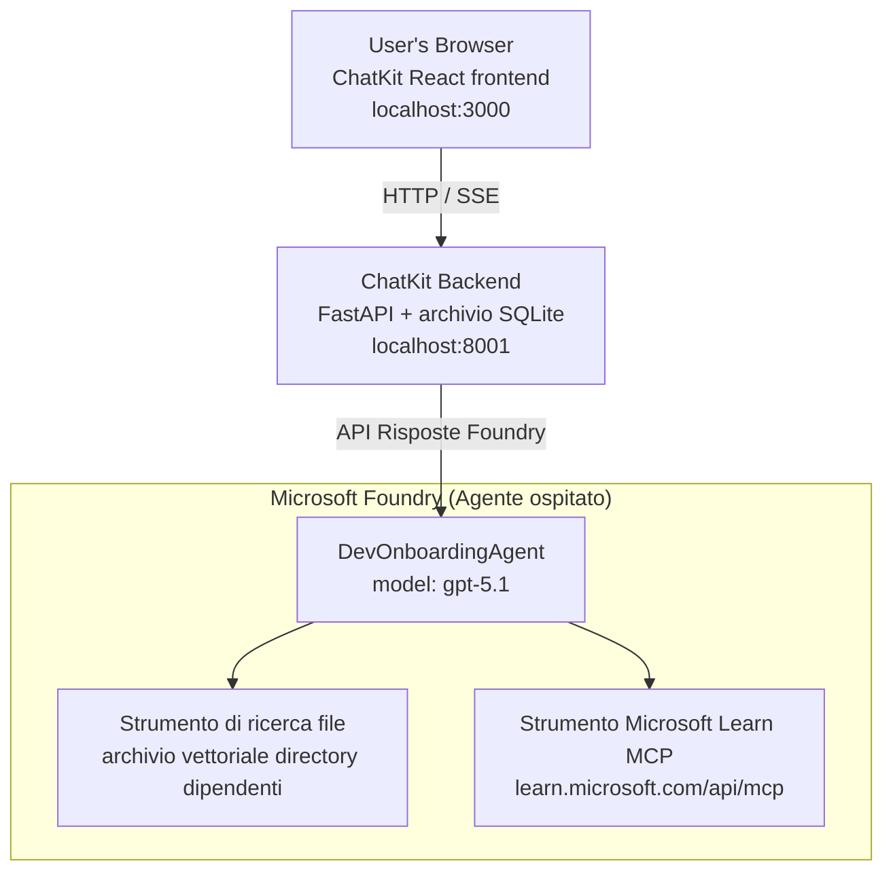

# Lezione 4: Distribuzione di agenti con Microsoft Foundry Hosted Agents + ChatKit

Questa lezione mostra come distribuire un agente che utilizza strumenti su Microsoft Foundry come agente ospitato e creare un frontend basato su ChatKit per interagire con esso.

## Architettura

L'agente ospitato è un **singolo `DevOnboardingAgent`** (in esecuzione su `gpt-5.1`) che risponde a domande di onboarding per sviluppatori utilizzando due strumenti ospitati: uno strumento **File Search** sul database vettoriale employee-directory e lo strumento **Microsoft Learn MCP**. Un frontend React ChatKit comunica con un backend FastAPI, che chiama l'agente tramite la **Responses API** di Foundry.



## Prerequisiti

1. **Progetto Microsoft Foundry** nella regione North Central US
2. **Azure CLI** autenticato (`az login`)
3. **Azure Developer CLI** (`azd`) installato
4. **Python 3.12+** e **Node.js 18+**
5. **Vector Store** creato con i dati dei dipendenti

## Avvio Rapido

### 1. Configura le Variabili d'Ambiente

```bash
cd lesson-4-agentdeployment
cp .env.example .env
# Modifica .env con i dettagli del tuo progetto Microsoft Foundry
```

### 2. Distribuisci l'Agente Ospitato

**Opzione A: Usare Azure Developer CLI (Consigliato)**

```bash
cd hosted-agent
azd auth login
azd agent deploy
```

**Opzione B: Usare Docker + Azure Container Registry**

```bash
cd hosted-agent

# Costruisci il contenitore
docker build -t developer-onboarding-agent:latest .

# Tag per ACR
docker tag developer-onboarding-agent:latest <your-acr>.azurecr.io/developer-onboarding-agent:latest

# Pubblica su ACR
az acr login --name <your-acr>
docker push <your-acr>.azurecr.io/developer-onboarding-agent:latest

# Distribuisci tramite il portale Microsoft Foundry o SDK
```

### 3. Avvia il Backend ChatKit

```bash
cd chatkit-server
python -m venv .venv
source .venv/bin/activate  # Su Windows: .venv\Scripts\activate
pip install -r requirements.txt
python app.py
```

Il server partirà su `http://localhost:8001`

### 4. Avvia il Frontend ChatKit

```bash
cd chatkit-server/frontend
npm install
npm run dev
```

Il frontend partirà su `http://localhost:3000`

### 5. Testa l'Applicazione

Apri `http://localhost:3000` nel tuo browser e prova queste query:

**Ricerca Dipendenti:**
- "Sono nuovo qui! Qualcuno ha lavorato in Microsoft?"
- "Chi ha esperienza con Azure Functions?"

**Risorse di Apprendimento:**
- "Crea un percorso di apprendimento per Kubernetes"
- "Quali certificazioni dovrei perseguire per l'architettura cloud?"

**Aiuto nella Programmazione:**
- "Aiutami a scrivere codice Python per connettermi a CosmosDB"
- "Mostrami come creare una Azure Function"

**Query Multi-Agente:**
- "Sto iniziando come ingegnere cloud. Con chi dovrei connettermi e cosa dovrei imparare?"

## Struttura del Progetto

```
lesson-4-agentdeployment/
├── .env.example                 # Environment variables template
├── implementation-plan.md       # Detailed implementation guide
├── README.md                    # This file
├── hosted-agent/               # Microsoft Foundry hosted agent
│   ├── main.py                 # Multi-agent workflow implementation
│   ├── requirements.txt        # Python dependencies
│   ├── Dockerfile              # Container definition
│   └── agent.yaml              # Agent deployment configuration
└── chatkit-server/             # ChatKit server application
    ├── app.py                  # FastAPI backend
    ├── store.py                # SQLite persistence layer
    ├── requirements.txt        # Python dependencies
    └── frontend/               # React frontend
        ├── package.json
        ├── vite.config.ts
        ├── tsconfig.json
        ├── index.html
        └── src/
            ├── main.tsx
            ├── App.tsx
            ├── App.css
            └── index.css
```

## L'Agente e i Suoi Strumenti

L'agente ospitato è un **agente singolo** (`DevOnboardingAgent`, definito in `hosted-agent/main.py`) che gestisce tre domini di onboarding. Invece di orchestrare sotto-agenti separati, espone ogni capacità come uno strumento (o si affida direttamente al modello):

| Capacità | Come viene gestita | Strumento |
|-----------|------------------|------|
| **Ricerca e connessioni dipendenti** | Ricerca File ospitata Foundry sul database vettoriale employee-directory | `client.get_file_search_tool(vector_store_ids=[...])` |
| **Apprendimento e formazione** | Server Microsoft Learn MCP (strumento MCP ospitato) | `client.get_mcp_tool(url="https://learn.microsoft.com/api/mcp")` |
| **Assistenza nella programmazione** | Gestito direttamente dal modello `gpt-5.1` — nessuno strumento esterno | — |

L'agente è creato con `client.as_agent(name="DevOnboardingAgent", instructions=..., tools=[file_search_tool, learn_mcp_tool])` ed erogato con `from_agent_framework(agent).run()`.

> **Nota di progettazione.** Le versioni precedenti di questa lezione utilizzavano un workflow multi-agente `HandoffBuilder` (Triage → specialisti). L'agente distribuito è un singolo agente che usa strumenti, più semplice da distribuire e comprendere per Q&A di tipo onboarding. Per un esempio di orchestrazione multi-agente e passaggi, vedere Lezione 2 e Lezione 3.

## Test Rapido dell'Agente Ospitato (Gate CI)

Distribuire con successo un agente ospitato dimostra solo che il piano di controllo ha accettato la
definizione — **non** dimostra che l'agente risponda effettivamente. Una dipendenza mancante,
un routing modello errato o una connessione scaduta possono lasciare un agente verde ma silenzioso.

Questa lezione include un leggero **smoke test** che funge da rapido e economico controllo post-distribuzione.
Usa la GitHub Action [AI Smoke Test](https://github.com/marketplace/actions/ai-smoke-test)
per POSTare prompt al punto finale **Responses** di Foundry dell'agente
(`POST {project_endpoint}/agents/{agent_name}/endpoint/protocols/openai/responses`)
e verificare il testo restituito. Rileva distribuzioni guaste, regressioni di autenticazione,
deriva del prompt di sistema e rotture nel threading in pochi secondi.

> Gli smoke test **non** sostituiscono le valutazioni complete in
> [Lezione 3](../lesson-3-agent-evals/README.md) — ne sono un complemento. Gli smoke test
> rispondono a *"l'agente è raggiungibile, risponde e segue aspettative basilari del prompt?"*;
> le valutazioni rispondono a *"quanto è buona la risposta?"*. Esegui il gate economico ad ogni distribuzione.

### Cosa viene testato

Il catalogo si trova in [`hosted-agent/tests/smoke-tests.json`](../../../lesson-4-agentdeployment/hosted-agent/tests/smoke-tests.json)
e esercita i tre domini dell'agente oltre all'aderenza al prompt e al threading multi-turno:

| Test | Cosa verifica |
|------|------------------|
| `reachability` | L'agente risponde con testo non vuoto e pertinenti |
| `employee-search` | Il dominio ricerca file risponde con un sano `200` (la risposta dipende dai dati) |
| `learning-path` | Il dominio apprendimento ripete l'argomento e produce una risposta tipo percorso |
| `coding-assistance` | Il dominio programmazione restituisce una risposta Python formattata come codice |
| `prompt-adherence-offtopic` | La richiesta off-topic viene reindirizzata, non dettagliatamente risposta |
| `threading-turn-1/2` | Lo stato della conversazione è mantenuto tra turni tramite `previous_response_id` |

### Esegui in CI

Il workflow in [`.github/workflows/smoke-test-hosted-agent.yml`](../../../.github/workflows/smoke-test-hosted-agent.yml)
ha due job:

- **`static`** — un gate veloce e senza Azure che gira su ogni pull request e push:
  compila tutte le sorgenti Python (`py_compile`) e verifica i link Markdown. Nessun segreto
  richiesto, quindi funziona anche sulle PR forkate.
- **`smoke`** — il test smoke connesso ad Azure descritto sotto. Viene eseguito su richiesta
  (Actions → **Agent CI (static + smoke)** → Run workflow) e può essere concatenato al workflow di
  distribuzione.

Configura queste **variabili** e **segreti** del repository per il job smoke:

| Tipo | Nome | Valore |
|------|------|-------|

| Variabile | `FOUNDRY_PROJECT_ENDPOINT` | `https://<account>.services.ai.azure.com/api/projects/<project>` |
| Variabile | `HOSTED_AGENT_NAME` | Nome dell'agente distribuito (es. `dev-onboarding` — deve corrispondere alla tua distribuzione) |
| Segreto | `AZURE_CLIENT_ID` / `AZURE_TENANT_ID` / `AZURE_SUBSCRIPTION_ID` | Identità federata OIDC per `azure/login` |

L'identità del runner ha bisogno del ruolo **`Azure AI User`** a livello di **ambito progetto Foundry** affinché possa
chiamare gli endpoint del data-plane di Risposte (e conversazioni). Concedilo con:

```bash
az role assignment create \
  --assignee <object-id-or-appId-of-runner-identity> \
  --role "Azure AI User" \
  --scope "/subscriptions/<sub>/resourceGroups/<rg>/providers/Microsoft.CognitiveServices/accounts/<account>/projects/<project>"
```

### Eseguilo localmente

Puoi eseguire lo stesso catalogo prima di fare il push. Ottieni un token data-plane con ambito
`https://ai.azure.com/` e punta il runner alla tua distribuzione:

```bash
# L'audience DEVE essere https://ai.azure.com/ (i token di cognitiveservices.azure.com sono respinti)
export FOUNDRY_TOKEN=$(az account get-access-token --resource https://ai.azure.com/ --query accessToken -o tsv)

git clone https://github.com/JFolberth/ai-smoketest && cd ai-smoketest
python runner.py \
  --project-endpoint "https://<account>.services.ai.azure.com/api/projects/<project>" \
  --agent-name dev-onboarding \
  --tests-file ../lesson-4-agentdeployment/hosted-agent/tests/smoke-tests.json
```

Codici di uscita: `0` tutti superati, `1` un'asserzione fallita, `2` errore del runner (catalogo/token errato).

## Risoluzione dei problemi

### Agente non risponde
- Verifica che l'agente ospitato sia distribuito e in esecuzione in Microsoft Foundry
- Controlla che `HOSTED_AGENT_NAME` e `HOSTED_AGENT_VERSION` corrispondano alla tua distribuzione

### Errori di archivio vettoriale
- Assicurati che `VECTOR_STORE_ID` sia impostato correttamente
- Verifica che l'archivio vettoriale contenga i dati dei dipendenti

### Errori di autenticazione
- Esegui `az login` per aggiornare le credenziali
- Assicurati di avere accesso al progetto Microsoft Foundry

## Risorse

- [Documentazione Agenti Ospitati Microsoft Foundry](https://learn.microsoft.com/en-us/azure/ai-foundry/agents/concepts/hosted-agents)
- [Microsoft Agent Framework](https://github.com/microsoft/agent-framework)
- [Esempio integrazione ChatKit](https://github.com/microsoft/agent-framework/tree/main/python/samples/demos/chatkit-integration)
- [Azure Developer CLI](https://learn.microsoft.com/en-us/azure/developer/azure-developer-cli/overview)
- [AI Smoke Test GitHub Action](https://github.com/marketplace/actions/ai-smoke-test)
- [Smoke Test Microsoft Foundry Agents con GitHub Actions (blog)](https://techcommunity.microsoft.com/blog/azuredevcommunityblog/smoke-test-microsoft-foundry-agents-with-github-actions/4531912)

---

## Passi successivi

Il tuo agente funziona su infrastruttura gestita da Microsoft. Per portarlo in produzione aziendale —
controllando dove risiedono i suoi dati (sovranità dei dati, rete privata, porta il tuo Azure
Cosmos DB / Storage / AI Search) e governando i suoi strumenti — continua con
**[Lezione 5: Agenti ospitati in produzione](../lesson-5-hosted-agents-production/README.md)**, che
spiega la differenza cruciale tra **Agenti ospitati** e **Host di capacità**.

---

<!-- CO-OP TRANSLATOR DISCLAIMER START -->
**Disclaimer**:
Questo documento è stato tradotto utilizzando il servizio di traduzione AI [Co-op Translator](https://github.com/Azure/co-op-translator). Sebbene ci impegniamo per garantire la precisione, si prega di notare che le traduzioni automatizzate possono contenere errori o imprecisioni. Il documento originale nella sua lingua nativa deve essere considerato la fonte autorevole. Per informazioni critiche, si raccomanda una traduzione professionale effettuata da un essere umano. Non siamo responsabili per eventuali malintesi o interpretazioni errate derivanti dall’uso di questa traduzione.
<!-- CO-OP TRANSLATOR DISCLAIMER END -->