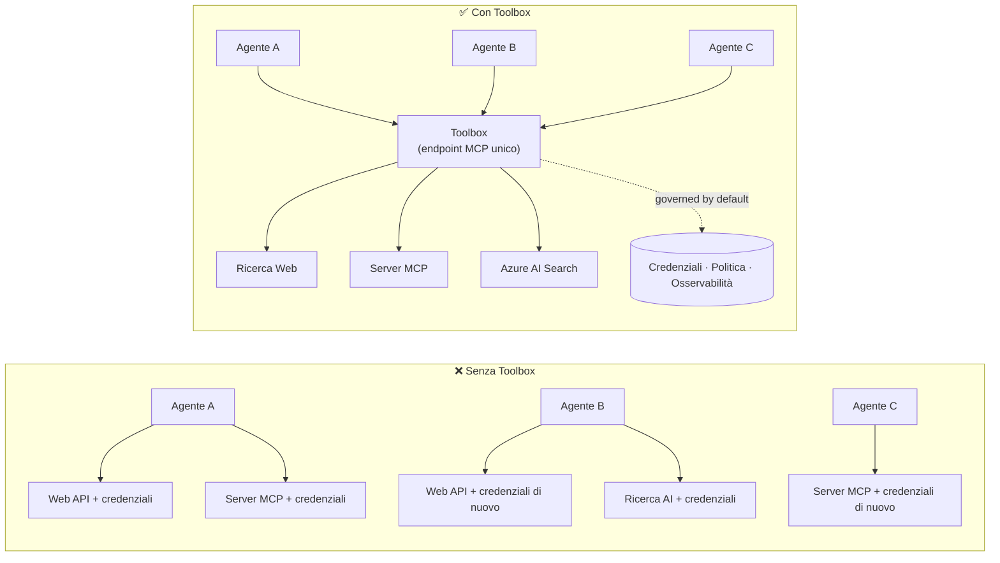

# Lezione 6: Microsoft Toolbox — Strumenti Governati per Agenti

Con la [Lezione 5](../lesson-5-hosted-agents-production/README.md) il tuo agente ospitato è operativo
in produzione con lo storage e la postura di governance di cui la tua organizzazione ha bisogno. Ma guarda indietro all’agente della
Lezione 4: ogni strumento era **codificato rigidamente** in `main.py` — l’URL MCP di Microsoft Learn,
il file-search vector store, e così via. Questo funziona per un solo agente. Non si scala ad una
organizzazione con decine di agenti e team.

Questa lezione presenta **Microsoft Toolbox**: il modo in cui Foundry ti consente di definire un set curato di
strumenti **una volta**, gestirli **centralmente** e esporli a qualsiasi agente tramite un **singolo,
endpoint governato**.

## Obiettivi di Apprendimento

Al termine di questa lezione sarai in grado di:

- Spiegare il problema della proliferazione degli strumenti che Toolbox risolve.
- Descrivere i pilastri di **Build** e **Consume** e i tipi di strumenti che una toolbox può contenere.
- **Costruire** una versione di toolbox con il Foundry SDK.
- **Consumare** una toolbox da un agente ospitato con Microsoft Agent Framework tramite un singolo endpoint MCP.
- Usare il **versioning** per distribuire modifiche agli strumenti senza cambiare il codice dell’agente o fare redeploy.
- Applicare la **governance**: RBAC, iniezione di credenziali e politiche guardrail (RAI).

---

## Prerequisiti

1. Aver completato la [Lezione 4](../lesson-4-agentdeployment/README.md) e idealmente
   la [Lezione 5](../lesson-5-hosted-agents-production/README.md).
2. Un progetto **Microsoft Foundry** con permessi per creare e gestire risorse toolbox.
3. **Azure CLI** autenticato: `az login`. Le API toolbox di Foundry richiedono
   lo scope token `https://ai.azure.com/.default` (mostrato nel codice sottostante).
4. **Python 3.12+** con le dipendenze del corso installate (`pip install -r ../requirements.txt`).
5. Un deployment di modello attuale e non ritirato (ad esempio `gpt-5.1`). Evitare GPT-4o / GPT-4.1 ritirati.

---

## 1. Il problema: proliferazione degli strumenti

Un singolo agente può dipendere da molti strumenti — API REST, server MCP, connettori e flussi — ciascuno
con il proprio modello di autenticazione e team di proprietà. Con la scala in un’organizzazione:

- I team **reinventano gli stessi strumenti** indipendentemente.
- Le **credenziali vengono duplicate** tra agenti e repository.
- La **governance diventa incoerente** — ogni agente applica (o dimentica) le policy da solo.
- C’è **poca visibilità** sugli strumenti disponibili o su chi li sta usando.

Gli sviluppatori si bloccano — non perché i modelli non siano capaci, ma perché **l’integrazione degli strumenti diventa
il collo di bottiglia**.



Le aziende hanno già l’infrastruttura — gateway, vault per le credenziali, policy, osservabilità.
Quello che mancava era un’esperienza sviluppatore che lo confezionasse in qualcosa di **riutilizzabile,
scopribile e governato di default**. Questo è Toolbox.

---

## 2. Cos’è una Toolbox

Una **Toolbox** è una **risorsa gestita di Foundry**. Definisci un set curato di strumenti una volta, li gestisci
centralmente in Foundry e li esponi tramite **un singolo endpoint compatibile MCP** che qualsiasi agente
può consumare. A runtime la piattaforma gestisce **iniezione di credenziali, refresh token e
applicazione delle policy enterprise**.

Poiché una toolbox è una risorsa gestita, puoi aggiungere, rimuovere o riconfigurare gli strumenti **senza
cambiare codice nel tuo agente** — l’agente si connette sempre allo stesso endpoint.

Toolbox copre il ciclo di vita dello strumento tramite quattro pilastri; **Build** e **Consume** sono disponibili
oggi:

| Pilastro | Stato | Cosa abilita |
|--------|--------|-----------------|
| **Build** | Disponibile oggi | Selezionare gli strumenti, configurare l’autenticazione centralmente, pubblicare una toolbox riutilizzabile che qualsiasi team può consumare. |
| **Consume** | Disponibile oggi | Collegare qualsiasi agente a un endpoint compatibile MCP per scoprire e invocare dinamicamente tutti gli strumenti nella toolbox. |

La superficie di consumo è **aperta**: qualsiasi runtime o client compatibile MCP può usare una toolbox —
Microsoft Agent Framework, LangGraph, GitHub Copilot, Claude Code, Microsoft Copilot Studio o
codice personalizzato.

### Tipi di strumenti che una toolbox può contenere

Web Search · MCP · Azure AI Search · Code Interpreter · File Search · OpenAPI · **Agent-to-Agent
(A2A)** · Fabric IQ · Tool Search · Work IQ · Browser Automation · riferimenti a Skill, più una
**politica guardrail (RAI)** applicata a livello di toolbox.

> **Consiglio:** Aggiungi una `description` a **ogni** strumento così il modello può scegliere quello giusto. Una toolbox
> permette al massimo **uno strumento senza nome per tipo** — dai a ogni istanza aggiuntiva dello stesso tipo un
> `name` univoco, altrimenti ottieni un errore `invalid_payload`.

---

## 3. Costruire una toolbox

Le toolbox si gestiscono con gli SDK Foundry (Python/.NET/JavaScript), la REST API, `azd`, e la
**Microsoft Foundry Toolkit per VS Code**. Ecco il pattern Python (`azure-ai-projects`):

```python
from azure.identity import DefaultAzureCredential
from azure.ai.projects import AIProjectClient
from azure.ai.projects.models import MCPTool, ToolboxSearchPreviewTool, WebSearchTool

endpoint = "https://<your-foundry-account>.services.ai.azure.com/api/projects/<your-project>"
project = AIProjectClient(endpoint=endpoint, credential=DefaultAzureCredential())

toolbox_version = project.toolboxes.create_toolbox_version(
    name="agent-tools",
    description="Web search + an MCP server + tool search",
    tools=[
        WebSearchTool(),
        MCPTool(
            server_label="myserver",
            server_url="https://your-mcp-server.example.com",
            require_approval="never",
            project_connection_id="my-key-auth-connection",  # le credenziali sono salvate in Foundry
        ),
        ToolboxSearchPreviewTool(),
    ],
)
print(f"Created toolbox: {toolbox_version.name}, version: {toolbox_version.version}")
```

Nota cosa **non** fai: nessun segreto nell’agente. Le credenziali sono tenute da una
**connessione** Foundry (`project_connection_id`) e iniettate dalla piattaforma al momento della chiamata.

> **Nota anteprima.** La **gestione** di Toolbox (creare/aggiornare versioni) è una funzionalità in anteprima.
> Le operazioni `project.toolboxes.*` mostrate sopra sono disponibili in build SDK di anteprima, nella REST API, `azd`,
> e nel **Foundry Toolkit per VS Code** — non sono presenti nel `azure-ai-projects` fissato usato
> altrove in questo corso. Considera questo snippet la forma del passo Build; per un percorso guidato,
> crea la toolbox nel **portale Foundry** o nel **Foundry Toolkit**. Il passo
> **Consume** sottostante funziona con l’SDK fissato del corso oggi.

---

## 4. Consumare una toolbox dal tuo agente

Una toolbox espone un **endpoint MCP**. Ci sono due pattern:

| Ruolo | Endpoint | Quando usarlo |
|------|----------|-------------|
| **Consumer della toolbox** | `{project_endpoint}/toolboxes/{name}/mcp?api-version=v1` | Collegare agenti. Serve sempre la **versione di default**. |
| **Sviluppatore della toolbox** | `{project_endpoint}/toolboxes/{name}/versions/{version}/mcp?api-version=v1` | Testare una versione specifica prima di promuoverla. |

> **Collega gli agenti all’endpoint *consumer*.** Poiché serve sempre la versione di default, tu

> può promuovere nuove versioni **senza cambiare il codice dell'agente o ridistribuire**.

### Integrazione con un agente ospitato da Microsoft Agent Framework

Ricorda che l'agente della Lezione 4 ha aggiunto un singolo strumento MCP codificato con `client.get_mcp_tool(...)`. Con
Toolbox invece punti **uno** `MCPStreamableHTTPTool` all'endpoint della toolbox — e l'agente
riceve **ogni** strumento nella toolbox, gestito centralmente:

```python
import httpx
from azure.identity import DefaultAzureCredential, get_bearer_token_provider
from agent_framework import MCPStreamableHTTPTool

# Autenticazione: Foundry toolbox richiede lo scope https://ai.azure.com/.default
credential = DefaultAzureCredential()
token_provider = get_bearer_token_provider(credential, "https://ai.azure.com/.default")
http_client = httpx.AsyncClient(auth=_ToolboxAuth(token_provider), timeout=120.0)

TOOLBOX_ENDPOINT = os.environ["TOOLBOX_ENDPOINT"]  # iniettato dalla piattaforma al runtime

mcp_tool = MCPStreamableHTTPTool(
    name="toolbox",
    url=TOOLBOX_ENDPOINT,
    http_client=http_client,
    load_prompts=False,
)

agent = chat_client.as_agent(
    name="my-toolbox-agent",
    instructions="You are a helpful assistant with access to Foundry toolbox tools.",
    tools=[mcp_tool],
)
```

`.env` corrispondente (nota: usa un modello **attuale** come `gpt-5.1`, **non** il ritirato
`gpt-4o`):

```env
FOUNDRY_PROJECT_ENDPOINT=https://<account>.services.ai.azure.com/api/projects/<project>
TOOLBOX_ENDPOINT=https://<account>.services.ai.azure.com/api/projects/<project>/toolboxes/agent-tools/mcp?api-version=v1
AZURE_AI_MODEL_DEPLOYMENT_NAME=gpt-5.1
```

> **Verifica prima.** Prima di collegare l'agente completo, connetti un SDK client MCP (`pip install mcp`) all'
> endpoint **specifico della versione** e elenca gli strumenti per confermare che si caricano come previsto.

### Esegui l'esempio di consumo

Questa lezione fornisce un esempio eseguibile di lato consumer, [`toolbox_agent.py`](../../../lesson-6-toolbox/toolbox_agent.py). Usa
lo stesso schema `FoundryChatClient.get_mcp_tool(...)` che hai imparato nella Lezione 2, ma punta l'unico
strumento MCP al tuo endpoint **toolbox** — così l'agente riceve ogni strumento gestito nella toolbox:

```bash
# Nel tuo .env, imposta TOOLBOX_ENDPOINT sull'endpoint consumer della tua cassetta degli attrezzi, poi:
python lesson-6-toolbox/toolbox_agent.py
```

Apri l'URL stampato `http://localhost:8096` e poni una domanda che sfrutti uno degli
strumenti della tua toolbox. Aggiungi o aggiorna uno strumento nella toolbox e chiedi di nuovo — **senza modificare questo
codice** — per vedere in azione la gestione e il versionamento centralizzati.

---

## 5. Versionamento: rilasciare modifiche agli strumenti in sicurezza

Il versionamento della toolbox ti dà un controllo esplicito su quando le modifiche entrano in vigore:

1. **Crea** una nuova versione della toolbox con il set aggiornato di strumenti.
2. **Testala** contro l'endpoint (sviluppatore) specifico per la versione.
3. **Promuovila** a `default_version` quando sei pronto.

Ogni agente puntato all'endpoint **consumatore** riceve automaticamente la versione promossa — **nessuna
modifica al codice, nessuna ridistribuzione**. (La prima versione che crei viene promossa automaticamente a quella predefinita.)

Questo è l'equivalente per la gestione degli strumenti di un deploy blue/green: convalidi la modifica in isolamento,
poi cambi la predefinita per tutti i consumatori simultaneamente.

---

## 6. Governance: come Toolbox migliora il controllo

Toolbox è **governato di default**. Le leve di governance che dovresti conoscere:

- **RBAC.** Concedi il ruolo **Foundry User** sul progetto a ogni identità: il **sviluppatore** che
  gestisce le versioni della toolbox, l'**identità gestita dell'agente** (per agenti ospitati che chiamano strumenti in
  runtime), e, per i flussi OAuth, l'**utente finale** la cui identità è proxyata.
- **Credenziali centralizzate.** Le credenziali degli strumenti vivono nelle **connessioni** di Foundry, non nel codice
  dell'agente o nei file `.env`. La piattaforma le inietta e aggiorna i token in runtime.
- **Guardrails (politica RAI).** Associa una politica AI responsabile nominata a una versione della toolbox tramite
  `policies.rai_config.rai_policy_name`. Viene eseguita al **livello toolbox**, indipendentemente da qualsiasi
  filtro di contenuti a livello di modello, controllando input e output degli strumenti.
- **Approvazione MCP.** Il `require_approval` per strumento controlla se una chiamata a uno strumento MCP necessita approvazione —
  lo stesso concetto di workflow di approvazione visto in [Lezione 5 §7](../lesson-5-hosted-agents-production/README.md#7-hosted-mcp-tools--approval-workflows).
- **Reti private.** Toolbox supporta configurazioni di rete virtuale per aziende che
  mantengono il traffico all'interno della loro rete.
- **Visibilità.** Poiché gli strumenti sono catalogati centralmente, si ottiene finalmente un inventario di cosa
  esiste e chi lo usa.

---

## Esercizi pratici

1. **Rifattorizza la Lezione 4.** L'agente della Lezione 4 codifica lo strumento Microsoft Learn MCP. Descrivi come
   sposteresti quello strumento in una toolbox `agent-tools` e ripunteresti `main.py` all'endpoint consumatore della toolbox.
   Cosa cambia in `main.py`? Cosa non vi risiede più?
2. **Progetta un incremento di versione.** Devi aggiungere uno strumento Web Search a una toolbox in uso da cinque
   agenti attivi. Descrivi la sequenza crea → testa → promuovi e spiega perché nessuno dei cinque agenti
   necessita di ridistribuzione.
3. **Scegli le identità di autenticazione.** Per un agente ospitato che chiama uno strumento MCP basato su OAuth tramite una
   toolbox, elenca quali identità necessitano del ruolo **Foundry User** e perché.
4. **Posizionamento dei guardrail.** Spiega la differenza tra un filtro di contenuto a livello di modello e un
   guardrail della toolbox, e fornisci uno scenario in cui hai bisogno specificamente del guardrail della toolbox.

---

## Risorse

- [Crea, testa e distribuisci una toolbox in Foundry](https://learn.microsoft.com/azure/foundry/agents/how-to/tools/toolbox)
- [Catalogo degli strumenti — Foundry Agent Service](https://learn.microsoft.com/azure/foundry/agents/concepts/tool-catalog)
- [Microsoft Agent Framework — provider Microsoft Foundry (strumenti)](https://learn.microsoft.com/agent-framework/agents/providers/microsoft-foundry)
- [Panoramica sui Guardrails](https://learn.microsoft.com/azure/foundry/guardrails/guardrails-overview)
- [Inizia con Foundry in VS Code (Foundry Toolkit)](https://learn.microsoft.com/azure/ai-foundry/how-to/develop/get-started-projects-vs-code)
- [Model Context Protocol](https://modelcontextprotocol.io/)

---

**Precedente:** [Lezione 5 — Agenti ospitati in produzione](../lesson-5-hosted-agents-production/README.md)
&nbsp;·&nbsp; **Successiva:** [Lezione 7 — Multi-Agente & A2A](../lesson-7-multi-agent-a2a/README.md)

---

<!-- CO-OP TRANSLATOR DISCLAIMER START -->
**Disclaimer**:
Questo documento è stato tradotto utilizzando il servizio di traduzione AI [Co-op Translator](https://github.com/Azure/co-op-translator). Sebbene ci impegniamo per garantire la precisione, si prega di notare che le traduzioni automatizzate possono contenere errori o imprecisioni. Il documento originale nella sua lingua nativa deve essere considerato la fonte autorevole. Per informazioni critiche, si raccomanda una traduzione professionale effettuata da un essere umano. Non siamo responsabili per eventuali malintesi o interpretazioni errate derivanti dall’uso di questa traduzione.
<!-- CO-OP TRANSLATOR DISCLAIMER END -->